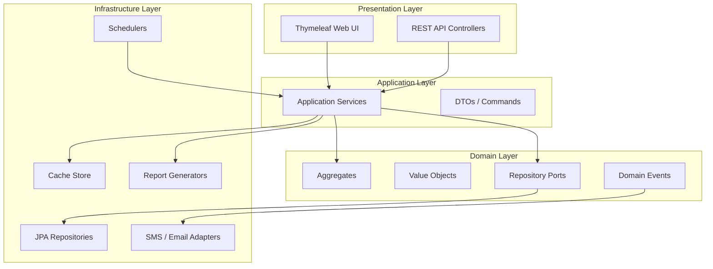

# TLBank Digital Lending Platform

TLBank is a fictional enterprise backend project built to simulate a real-world digital lending system.

It focuses on:

- **Clean Architecture**
- **Domain-Driven Design**
- **Spring Boot**
- **Enterprise backend patterns**

> TLBank is not affiliated with any real financial institution. It is intended for demonstration and learning purposes only.

## Tech Stack

| Layer | Technology |
|-------|------------|
| Language | Java 17 |
| Framework | Spring Boot 3.4 |
| Security | Spring Security (session-based) |
| Persistence | Spring Data JPA, Flyway |
| Database (dev) | H2 in-memory |
| Database (staging/prod) | Microsoft SQL Server 2022 |
| UI | Thymeleaf + Bootstrap 5 |
| API Docs | SpringDoc OpenAPI 3 |
| Reports | Apache POI, iText7 |
| Build | Maven |
| Container | Docker, Docker Compose |

## Architecture

The project follows **Clean Architecture** with **Domain-Driven Design (DDD)** principles:

- **Domain** — entities, value objects, domain events, repository ports
- **Application** — use cases, application services, DTOs
- **Infrastructure** — JPA adapters, cache, notification, schedulers, report generators
- **Presentation** — REST API controllers, Thymeleaf web controllers

Cross-cutting concerns (audit logging, security, caching) are implemented via AOP and decorators without polluting business logic.



```
┌─────────────┐     ┌──────────────────┐     ┌─────────────┐
│  Web / API  │────▶│ Application Svc  │────▶│   Domain    │
└─────────────┘     └────────┬─────────┘     └──────┬──────┘
                             │                      │
                             ▼                      ▼
                    ┌────────────────────────────────────┐
                    │         Infrastructure (JPA,       │
                    │    Cache, Notification, Reports)   │
                    └────────────────────────────────────┘
```

## Domain Mapping (TLBank ↔ Payment System)

> This project simulates a **credit card application platform**, but its domain patterns map directly to concepts used in **payment / transaction backends**. Use this section when explaining the portfolio in interviews or when extending the system toward payment-domain equivalents.

| TLBank Concept | Payment System Equivalent | Purpose |
|----------------|---------------------------|---------|
| **Application Aggregate** | **Transaction Aggregate** | Root entity with lifecycle, invariants, and status-driven behavior |
| **Workflow Engine** | **Payment State Machine** (`PENDING → AUTHORIZED → CAPTURED → SETTLED → REFUNDED`) | Enforces valid state transitions only; invalid moves raise domain exceptions |
| **OTP Verification** | **3D Secure / Step-up Authentication** | Out-of-band customer verification before proceeding to the next state |
| **ReviewCase** (人工審核) | **Fraud Review Queue** | Human-in-the-loop decision after automated checks |
| **Audit Log** | **Transaction Ledger / Reconciliation Log** | Immutable operational record for compliance and end-of-day matching |

### Workflow ↔ Payment State Machine

Both systems model a long-running business process as a **finite state machine**:

```text
Payment:   PENDING → AUTHORIZED → CAPTURED → SETTLED → REFUNDED

TLBank:    INIT → OTP_VERIFIED → DOCUMENT_UPLOADED → SUBMITTED → UNDER_REVIEW → APPROVED | REJECTED
```

| TLBank Application State | Payment Transaction State | Meaning |
|--------------------------|---------------------------|---------|
| `INIT` | `PENDING` | Record created, awaiting customer action |
| `OTP_VERIFIED` | `AUTHORIZED` | Customer identity confirmed (step-up auth passed) |
| `DOCUMENT_UPLOADED` | `CAPTURED` | Supporting evidence collected |
| `SUBMITTED` | `SETTLED` | Submitted for downstream processing |
| `UNDER_REVIEW` | *(Fraud hold / manual review)* | Queued for analyst decision |
| `APPROVED` / `REJECTED` | `COMPLETED` / `REFUNDED` | Terminal outcome |

**Design parallel:** just as a payment gateway rejects `CAPTURED → PENDING`, TLBank's workflow engine rejects invalid application transitions (e.g. `INIT → SUBMITTED` without OTP). Both patterns protect business invariants at the domain layer.

## Design Decisions

### Why Clean Architecture / DDD?

Business rules live in the domain layer (aggregates, value objects, workflow transitions) independent of Spring or JPA. This keeps credit review, OTP, and application lifecycle logic testable without a database and makes the codebase easier to extend.

### Why Session over JWT?

This is an internal bank staff + applicant portal used via browser forms. Server-side sessions with Spring Security provide simpler logout, session invalidation, and concurrent-login control (`maximumSessions=1`) without client-side token management.

### Why Domain Events for Notifications?

`ApplicationSubmittedEvent`, `ApplicationApprovedEvent`, and `ApplicationRejectedEvent` decouple core workflow from SMS/email delivery. Notification failures are caught in event handlers and never roll back business transactions.

### Future Enhancements

- **Redis** — distributed cache and session store for horizontal scaling
- **Real SMS/Email** — replace mock adapters with Twilio/SendGrid integrations
- **Kafka** — async event bus for notifications, audit, and analytics pipelines

## Quick Start (Docker)

```bash
cp .env.example .env
# Edit .env if needed, then start the stack
docker-compose up -d
```

Access the application at: **http://localhost:8080**

Verify deployment:

```bash
chmod +x scripts/verify.sh
./scripts/verify.sh
```

## Default Accounts

| Username | Password | Role | Profile |
|----------|----------|------|---------|
| admin | Password123! | ADMIN | dev (H2 seed) |
| reviewer1 | Password123! | REVIEWER | dev (H2 seed) |
| applicant1 | Password123! | USER | dev (H2 seed) |
| 136628 | 123 | USER | dev (H2 seed) |
| admin | Password@123 | ADMIN | Docker / staging |
| reviewer | Password@123 | REVIEWER | Docker / staging |
| user01 | Password@123 | USER | Docker / staging |

## API Documentation

Swagger UI (enabled in dev/staging): **http://localhost:8080/swagger-ui.html**

OpenAPI JSON: **http://localhost:8080/v3/api-docs**

> Swagger is completely disabled in the `prod` profile.

## Modules

| # | Module | Description |
|---|--------|-------------|
| 1 | User & Security | Session login, role-based access control, password encryption |
| 2 | Card Products | Product catalog with features and caching |
| 3 | Applications | Credit card application lifecycle (create → submit → cancel) |
| 4 | OTP Verification | Mobile OTP send/verify with expiry and retry limits |
| 5 | Document Upload | Identity and income document storage |
| 6 | Credit Review | Reviewer workflow — approve, reject, remarks |
| 7 | System Parameters | Grouped runtime configuration with cache |
| 8 | Audit Log | AOP-based operation audit trail |
| 9 | Cache | In-memory cache with TTL and admin refresh |
| 10 | Notification | SMS/email notifications via domain events |
| 11 | Report | Daily statistics export (Excel/PDF) |
| 12 | Scheduler | Background OTP cleanup, cache refresh, daily stats |

## Development

Requires **JDK 17**.

```bash
mvn spring-boot:run -Dspring-boot.run.profiles=dev
```

- H2 console: http://localhost:8080/h2-console
- Uses H2-compatible Flyway migrations (`db/migration/`) plus dev seed data

## Testing

Requires **JDK 17**. All tests use `@ActiveProfiles("dev")` with the H2 in-memory database.

```bash
mvn clean verify
```

This runs the full unit and integration test suite and generates a JaCoCo coverage report.

### Coverage Report

After `mvn verify`, open the HTML report:

```
target/site/jacoco/index.html
```

JaCoCo excludes configuration, DTOs, JPA entities, and the Spring Boot main class from coverage metrics.

### Test Categories

| Category | Examples |
|----------|----------|
| Domain unit tests | `ApplicationTest`, `OtpRecordTest`, `ReviewCaseTest`, `WorkflowDomainServiceTest` |
| Application service tests | `ApplicationAppServiceTest`, `OtpAppServiceTest`, `ReviewAppServiceTest` |
| Integration tests | `ApplicationFlowIntegrationTest`, `ReviewFlowIntegrationTest`, `SecurityIntegrationTest` |
| Infrastructure tests | `ExcelReportGeneratorTest`, `NotificationServiceImplTest` |

100+ tests covering domain logic, application services, security, and end-to-end workflows.

## Deployment Profiles

| Profile | Database | Flyway Location | Swagger |
|---------|----------|-----------------|---------|
| `dev` | H2 in-memory | `db/migration/` + `db/dev-seed/` | Enabled |
| `staging` | SQL Server | `db/migration-sqlserver/` | Enabled |
| `prod` | SQL Server | `db/migration-sqlserver/` | Disabled |

## Project Structure

```
src/main/java/com/tlbank/lending/
├── domain/           # Domain model & ports
├── application/      # Use cases & services
├── infrastructure/   # JPA, cache, notification, scheduler, report
├── presentation/     # REST API & web controllers
├── security/         # Spring Security config
└── common/           # Shared utilities, audit, config

docker/
├── app/Dockerfile    # Multi-stage build (non-root user)
└── sqlserver/init/   # Idempotent DB init scripts
```

## License

This is a fictional portfolio project for educational purposes.
