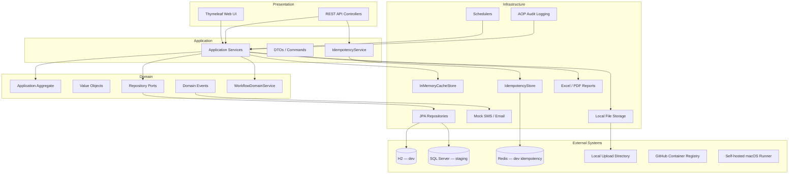
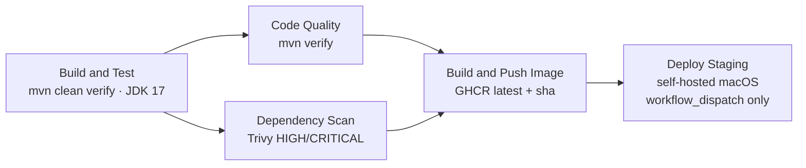

# TLBank Digital Lending Platform


**TLBank** is a fictional digital lending backend built as a long-term engineering portfolio. Instead of isolated tutorials, backend practices—architecture, testing, security, CI/CD, containers, Redis idempotency, and local Infrastructure as Code—are integrated into one evolving system so trade-offs can be explored together.

**Status:** Portfolio / learning project — not production software. Staging runs on a **local self-hosted Mac** via manual deployment; there is **no cloud production environment** in this repository.

**Jump to:** [Quick Start](#quick-start) · [Architecture](#architecture) · [Design Decisions](#design-decisions)

> **Disclaimer:** TLBank is not affiliated with any real financial institution. All data, accounts, and institutions are fictional and intended for demonstration and interview discussion only.

## Highlights

Verified capabilities in the current codebase:

- Explicit **application state machine** (`ApplicationStatus` + `WorkflowDomainService`)
- **Clean / Hexagonal Architecture** — domain ports with infrastructure adapters
- **Session-based Spring Security** (form login, RBAC, single concurrent session)
- **Redis-backed idempotency** for application creation (`dev` profile; in-memory in tests)
- **GitHub Actions CI** — Maven verify, Trivy scan, GHCR image publish
- **Manual CD** — `workflow_dispatch` deploy to a self-hosted macOS runner
- **Docker Compose** — SQL Server + Spring Boot app (local/staging stack)
- **Local Terraform** — `hashicorp/local` provider for IaC practice (no cloud resources)
- **Automated tests** — 36 test classes, 133 test methods (`mvn clean verify`)

## Project Overview

TLBank simulates a credit card application backend: applicants submit applications, verify OTP, upload documents, and reviewers approve or reject cases. The system demonstrates how lending-style workflows map to familiar backend engineering problems—state machines, idempotency, audit trails, and side-effect isolation—without claiming enterprise production maturity.

| Audience | What to look at |
| --- | --- |
| Recruiters / managers | Highlights, [CI/CD](#cicd-pipeline), [Testing](#testing-strategy) |
| Senior engineers | [Architecture](#architecture), [Design Decisions](#design-decisions), [docs/](docs/design/00-sdd-overview.md) |
| Interviewers | [Business workflow](#core-business-workflow), [Interview topics](#interview-discussion-topics) |

## Key Engineering Highlights

- **Domain-centric workflow** — transitions enforced in `Application` and `ApplicationStatus`; invalid moves throw `WorkflowException`.
- **Ports and adapters** — JPA repositories, file storage, cache, notifications, and idempotency implement interfaces consumed by application services.
- **Side effects via domain events** — `ApplicationSubmittedEvent`, `ApplicationApprovedEvent`, and `ApplicationRejectedEvent` trigger mock SMS/email without rolling back transactions.
- **Operational hooks** — Flyway migrations, Actuator health, scheduled OTP cleanup / cache refresh / daily stats, Excel & PDF reports.
- **Security defaults** — BCrypt (strength 12), CSRF on web forms, API CSRF relaxed, role-based URL and method security.

## Architecture

Dependency rule: **outer layers depend inward; the domain layer does not depend on Spring, JPA, or infrastructure implementations.**



Package layout:

```
src/main/java/com/tlbank/lending/
├── domain/           # Entities, value objects, events, repository ports
├── application/      # Use cases, services, DTOs
├── infrastructure/   # JPA, cache, idempotency, notification, storage, reports
├── presentation/     # REST API & Thymeleaf controllers
├── security/         # Spring Security configuration
└── common/           # Audit, exceptions, shared config
```

Deeper design notes: [docs/02-architecture-design.md](docs/design/02-architecture-design.md)

## Core Business Workflow

Application lifecycle (from `ApplicationStatus` and `Application`):

```text
INIT → OTP_VERIFIED → DOCUMENT_UPLOADED → SUBMITTED → UNDER_REVIEW → APPROVED | REJECTED
         ↓                    ↓
      CANCELLED            CANCELLED
```

| Step | Where it happens | Behavior |
| --- | --- | --- |
| Transition rules | `ApplicationStatus.canTransitionTo()` | Defines allowed edges |
| Enforcement | `Application.transitionTo()` / `WorkflowDomainService.validateTransition()` | Invalid transitions throw `WorkflowException` |
| OTP verify | `Application.verifyOtp()` | `INIT → OTP_VERIFIED` |
| Document upload | `Application.uploadDocuments()` | Requires `OTP_VERIFIED`; may stay in `DOCUMENT_UPLOADED` to add files |
| Submit | `Application.submit()` | Requires identity + income documents |
| Review | `ReviewAppService` | `SUBMITTED → UNDER_REVIEW → APPROVED/REJECTED` |
| Idempotency | `IdempotencyService` + `ApplicationApiController` | Optional `Idempotency-Key` on `POST /api/v1/applications`; same key + body returns cached response; conflicting body → 409 |
| Audit | `@Auditable` + `AuditAspect` | Async persistence of operator, action, IP, success/failure |
| Notifications | `NotificationEventHandler` | Listens for domain events; failures logged, not propagated |

Workflow detail: [docs/08-workflow-design.md](docs/design/08-workflow-design.md)

## Implemented Features

| Area | Implementation |
| --- | --- |
| Authentication & RBAC | Session login, `ADMIN` / `REVIEWER` / `USER` roles, `maximumSessions(1)` |
| Card products | Catalog with features; `CachedCardProductRepository` + in-memory TTL cache |
| Applications | Full lifecycle API and Thymeleaf UI |
| OTP | Send/verify with expiry and retry limits; scheduled cleanup |
| Documents | Local filesystem storage (`LocalDocumentStorageService`) |
| Credit review | Reviewer approve/reject/remark workflow |
| System parameters | Grouped runtime config with cache |
| Audit log | AOP-based operation trail |
| Reports | Daily statistics export (Apache POI, iText7) |
| Schedulers | OTP cleanup, cache refresh, daily stats |
| API docs | SpringDoc OpenAPI (`dev` / `staging` only) |
| Idempotency | Redis (`dev`) or in-memory (`test`); see [limitations](#current-limitations) |
| Notifications | Mock SMS and email (`tlbank.notification.mode=mock`) |

## Tech Stack

| Layer | Technology |
| --- | --- |
| Language | Java 17 |
| Framework | Spring Boot 3.4.2 |
| Security | Spring Security (server-side sessions) |
| Persistence | Spring Data JPA, Flyway |
| Database (dev) | H2 in-memory (`MODE=MSSQLServer`) |
| Database (staging) | Microsoft SQL Server 2022 (Docker) |
| Cache | In-process `InMemoryCacheStore` |
| Idempotency store | Redis (`dev`) or in-memory (`test`) via `tlbank.idempotency.store` |
| UI | Thymeleaf + Bootstrap 5 |
| API docs | SpringDoc OpenAPI 3 |
| Reports | Apache POI, iText7 |
| Build | Maven, JaCoCo |
| Containers | Docker, Docker Compose |
| IaC | Terraform (`hashicorp/local` provider) |
| CI/CD | GitHub Actions, GHCR, Trivy |

## CI/CD Pipeline

Workflow definitions (monorepo root):

- [`.github/workflows/ci.yml`](../.github/workflows/ci.yml) — build, test, scan, image publish, manual deploy
- [`.github/workflows/terraform.yml`](../.github/workflows/terraform.yml) — Terraform fmt / validate / plan



### CI (automated)

| Job | Runner | Trigger | Command / tool |
| --- | --- | --- | --- |
| Build and Test | `ubuntu-latest` | Push/PR to `main` or `develop` when `sp2-springboot/**` changes | `mvn clean verify` (JDK 17 Temurin) |
| Code Quality | `ubuntu-latest` | After build-test passes | `mvn verify` |
| Dependency Scan | `ubuntu-latest` | After build-test passes | Trivy filesystem scan; **report-only** (`exit-code: 0`) |
| Build and Push Image | `ubuntu-latest` | `main` push or `workflow_dispatch` (after CI jobs pass) | Docker build → `ghcr.io/<owner>/tlbank-backend:latest` and `:sha` |

### CD (manual)

| Job | Runner | Trigger | What it does |
| --- | --- | --- | --- |
| Deploy to Staging | `self-hosted, macos` | **`workflow_dispatch` only** | Writes `~/tlbank/docker-compose.yml`, pulls GHCR image, restarts SQL Server + app on **local Mac** |

Deploy is **not automatic on push**. Everyday pushes run CI and may publish images from `main`; staging is updated only when you manually run the workflow.

### Why manual deploy on a self-hosted runner?

Staging runs on a local Mac (Docker Desktop + SQL Server). A self-hosted runner polls GitHub outbound, avoiding inbound SSH from the public internet. `workflow_dispatch` keeps deploys intentional.

## Infrastructure as Code

Terraform under [`infra/local/`](../infra/local/) is a **local learning environment only**:

- Uses the `hashicorp/local` provider to generate `generated-staging-env.md`
- Practices `terraform init`, `fmt`, `validate`, `plan`, and state handling
- **Does not** provision AWS, Azure, GCP, or any billable cloud resources
- Validated in CI via [`.github/workflows/terraform.yml`](../.github/workflows/terraform.yml)

This demonstrates IaC workflow and reproducibility — not production cloud operations.

## Design Decisions

### Clean Architecture / DDD

**Problem:** Business rules (workflow, OTP, review) must stay testable and independent of frameworks.

**Choice:** Domain aggregates and ports in `domain/`; Spring/JPA adapters in `infrastructure/`.

**Reason:** Credit review and application lifecycle can be unit-tested without a database; new adapters can be swapped behind ports.

**Trade-off:** Some domain-adjacent code still references Spring types (e.g. `WorkflowDomainService` uses `@Service`; `ReviewCaseRepository` uses `Pageable`).

**Current scope:** Educational portfolio — patterns are real, not a strict hexagonal boundary audit.

### Session authentication instead of JWT

**Problem:** Browser-based staff and applicant portal needs authentication with logout and session control.

**Choice:** Spring Security form login with server-side HTTP sessions (`SessionCreationPolicy.IF_REQUIRED`).

**Reason:** Simpler logout, session invalidation, and `maximumSessions(1)` without client token storage.

**Trade-off:** Sessions are not externalized (no Redis session store); horizontal scaling would need additional work.

**Current scope:** Suitable for single-instance demo and staging; not multi-node production.

### Domain events for notifications

**Problem:** SMS/email must not roll back core workflow transactions on delivery failure.

**Choice:** Publish `ApplicationSubmittedEvent`, `ApplicationApprovedEvent`, `ApplicationRejectedEvent`; `NotificationEventHandler` sends mock notifications in a try/catch.

**Reason:** Decouples workflow commits from notification side effects.

**Trade-off:** In-process Spring events only — no guaranteed delivery, retry, or outbox.

**Current scope:** Mock senders (`tlbank.notification.mode=mock`).

### Redis for idempotency (not cache or sessions)

**Problem:** Duplicate `POST /api/v1/applications` requests need safe replay semantics.

**Choice:** `IdempotencyService` with pluggable `IdempotencyStore` — `RedisIdempotencyStore` when `tlbank.idempotency.store=redis`, `InMemoryIdempotencyStore` when `=memory`.

**Reason:** Redis TTL and `SETNX` locks suit idempotency keys; mirrors how a distributed store would behave.

**Trade-off:** Application-level cache remains in-process (`InMemoryCacheStore`); sessions are not in Redis. `dev` expects Redis at `localhost:6379`; Docker Compose in this repo does **not** include a Redis service.

**Current scope:** Implemented for `dev` and tests; staging compose does not configure Redis or idempotency store (see limitations).

### Manual staging deployment

**Problem:** Deploy to a home/office Mac without exposing SSH to the internet.

**Choice:** Self-hosted macOS runner + `workflow_dispatch` deploy job.

**Reason:** Runner initiates outbound connections; operator controls when staging updates.

**Trade-off:** No blue/green, canary, or automated promotion pipeline.

**Current scope:** Local staging on one machine.

### H2 for development, SQL Server for staging

**Problem:** Fast local iteration vs. production-like SQL dialect and migrations.

**Choice:** H2 (`db/migration/` + `db/dev-seed/`) for `dev`; SQL Server (`db/migration-sqlserver/`) for `staging` / `prod` profiles.

**Reason:** H2 enables fast tests and IDE runs; SQL Server matches staging container deployment.

**Trade-off:** Two migration trees must stay aligned manually.

**Current scope:** Both trees exist with parallel versions; `prod` profile is configured but not deployed.

### Local Terraform configuration

**Problem:** Practice IaC workflows without cloud cost.

**Choice:** `local_file` resource documenting staging components.

**Reason:** Validates fmt/validate/plan in CI; teaches state and reproducibility.

**Trade-off:** No real infrastructure provisioning.

**Current scope:** Learning exercise only.

## Testing Strategy

Requires **JDK 17**. Tests run with `@ActiveProfiles("dev")` and H2; idempotency uses in-memory store via `src/test/resources/application-dev.yml`.

```bash
mvn clean verify
```

**Counts (verified in repository):** 36 test classes, 133 test methods.

### Coverage report

After `mvn verify`:

```text
target/site/jacoco/index.html
```

JaCoCo excludes configuration, DTOs, JPA entities, and the Spring Boot main class.

### Test categories

| Category | Examples |
| --- | --- |
| Domain unit tests | `ApplicationTest`, `OtpRecordTest`, `ReviewCaseTest`, `WorkflowDomainServiceTest` |
| Application service tests | `ApplicationAppServiceTest`, `OtpAppServiceTest`, `ReviewAppServiceTest` |
| Integration tests | `ApplicationFlowIntegrationTest`, `ReviewFlowIntegrationTest`, `SecurityIntegrationTest`, `ApplicationIdempotencyIntegrationTest` |
| Infrastructure tests | `ExcelReportGeneratorTest`, `InMemoryCacheStoreTest`, `LocalDocumentStorageServiceTest` |
| Security tests | `SecurityIntegrationTest` |
| Presentation tests | `AdminControllerTest`, `ReviewApiControllerTest` |

Detail: [docs/16-testing-strategy.md](docs/design/16-testing-strategy.md)

## Quick Start

### Option A — Docker Compose (SQL Server + app)

```bash
cp .env.example .env
# Edit .env if needed
docker-compose up -d
```

- Application: <http://localhost:8080>
- Health: `curl http://localhost:8080/actuator/health`
- Verify: `chmod +x scripts/verify.sh && ./scripts/verify.sh`

Uses `staging` profile and SQL Server migrations. See [demo accounts](#demo-accounts-local-development-only) for staging seed users.

### Option B — Local Maven (H2)

```bash
# Optional: scripts/start-dev.sh compiles and runs dev profile
mvn spring-boot:run -Dspring-boot.run.profiles=dev
```

- H2 console: <http://localhost:8080/h2-console>
- **Note:** `dev` profile sets `tlbank.idempotency.store=redis` — run Redis on `localhost:6379` for idempotent application creation, or expect connection errors on that code path.

## Environment Profiles

| Profile | Database | Flyway locations | Swagger | Notes |
| --- | --- | --- | --- | --- |
| `dev` | H2 in-memory | `db/migration/`, `db/dev-seed/` | Enabled | H2 console; debug logging |
| `staging` | SQL Server | `db/migration-sqlserver/` | Enabled | Docker Compose / CI deploy |
| `prod` | SQL Server (env vars) | `db/migration-sqlserver/` | **Disabled** | Config only — no prod deployment in repo |

## Project Structure

```text
sp2-springboot/
├── src/main/java/com/tlbank/lending/   # Application source
├── src/main/resources/
│   ├── application*.yml
│   ├── db/migration/                   # H2 migrations
│   └── db/migration-sqlserver/         # SQL Server migrations
├── src/test/                           # Automated tests
├── docker/
│   ├── app/Dockerfile                  # Multi-stage build (non-root user)
│   └── sqlserver/init/                 # DB init scripts
├── docker-compose.yml
├── scripts/                            # verify.sh, start-dev.sh, prepare-dev.sh
└── docs/                               # System design documents

infra/local/                            # Local Terraform (repo root)
.github/workflows/                      # CI/CD workflows (repo root)
```

## Current Limitations

This is intentional honesty for portfolio reviewers:

- **Not production-ready** — mock notifications, no secrets management, no observability stack, no load testing.
- **Single-instance assumptions** — in-memory cache and server-side sessions; no Kubernetes or horizontal scaling.
- **Redis scope** — idempotency only; cache and sessions are not Redis-backed. Docker Compose does not run Redis; `staging` profile does not set `tlbank.idempotency.store`.
- **No cloud deployment** — Terraform manages a local generated file only; staging is a local Mac with Docker.
- **Manual CD** — deploy requires `workflow_dispatch`; pushes to `develop` do not publish images.
- **Trivy is report-only** — HIGH/CRITICAL findings do not fail the pipeline.
- **Dual migration maintenance** — H2 and SQL Server Flyway scripts must be kept in sync manually.
- **`prod` profile** — configuration exists (Swagger off, WARN logging) but no automated prod environment.

## Roadmap

### Implemented

- Application workflow state machine with domain-level validation
- Session security, RBAC, audit logging
- Redis / in-memory idempotency for application creation
- Flyway migrations (H2 + SQL Server)
- Docker image build and GHCR publish
- Manual self-hosted staging deploy
- Local Terraform CI checks
- Mock SMS/email via domain events
- Excel/PDF reporting and scheduled jobs

### In progress

- Aligning staging Docker stack with Redis idempotency configuration
- Keeping H2 and SQL Server migration sets equivalent

### Planned

- `RedisCacheStore` for distributed caching when scaling beyond one instance
- Spring Session + Redis for externalized sessions
- Real SMS/email providers (Twilio, SendGrid, etc.)
- Outbox pattern / Kafka for reliable async events
- Cloud deployment design (not implemented)
- Observability (metrics, tracing, centralized logging)
- Secrets management and hardened production deployment
- Load testing and Kubernetes manifests

## Interview Discussion Topics

| Topic | Where to look |
| --- | --- |
| Why one evolving repository? | This README overview; [docs/00-sdd-overview.md](docs/design/00-sdd-overview.md) |
| Why framework-independent domain? | `domain/application/Application.java`, `ApplicationStatus.java` |
| Why sessions over JWT? | [security/config/SecurityConfig.java](src/main/java/com/tlbank/lending/security/config/SecurityConfig.java) |
| How idempotency prevents duplicates | `IdempotencyService`, `ApplicationApiController`, `ApplicationIdempotencyIntegrationTest` |
| Why manual deployment? | [`.github/workflows/ci.yml`](../.github/workflows/ci.yml) `deploy-staging` job |
| What Terraform does / does not do | [`infra/local/main.tf`](../infra/local/main.tf) |
| H2 vs SQL Server trade-offs | `application-dev.yml` vs `application-staging.yml`, dual Flyway folders |
| How domain events isolate side effects | `NotificationEventHandler`, `ApplicationAppService` event publication |
| Invalid workflow transitions | `ApplicationStatus.canTransitionTo()`, `WorkflowDomainService` |
| Lending ↔ payment analogies | State machines, OTP as step-up auth, review queue as fraud hold — see [docs/08-workflow-design.md](docs/design/08-workflow-design.md) |

## Demo Accounts (local development only)

These passwords exist only in **seed data** for local demos. **Do not reuse them anywhere else.**

<!-- markdownlint-disable MD033 -->
<details>
<summary>Dev profile (H2 seed — password <code>Password123!</code> for all)</summary>

| Username | Role |
| --- | --- |
| `admin` | ADMIN |
| `reviewer1` | REVIEWER |
| `applicant1` | USER (APPLICANT) |
| `136628` | USER (password `123` in seed `V101`) |

</details>

<details>
<summary>Staging / Docker seed — password <code>Password@123</code> for all</summary>

| Username | Role |
| --- | --- |
| `admin` | ADMIN |
| `reviewer` | REVIEWER |
| `user01` | USER |

</details>
<!-- markdownlint-enable MD033 -->

## API Documentation

When Swagger is enabled (`dev` / `staging`):

- Swagger UI: <http://localhost:8080/swagger-ui.html>
- OpenAPI JSON: <http://localhost:8080/v3/api-docs>

Disabled entirely in the `prod` profile (`application-prod.yml`).

## License / Educational Disclaimer

TLBank is a **fictional portfolio project** for educational and interview purposes. It is not financial advice, not a real bank, and not intended for production use with real customer data.
