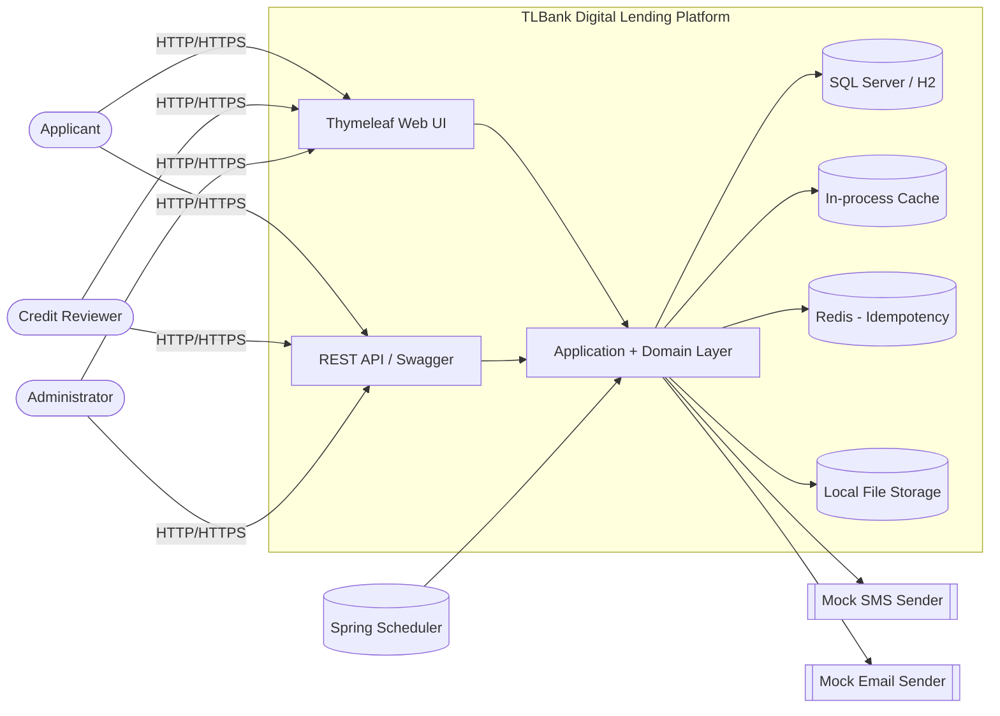
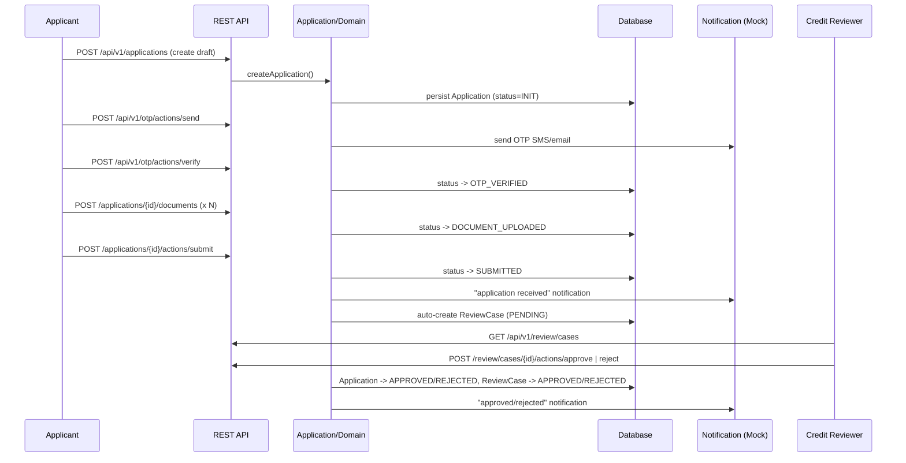

# 01 – System Context

## 1. Purpose

This document defines the boundary of the TLBank Digital Lending Platform: who interacts with it, what
external systems it touches (all mocked/fictional in this project), and how data flows at a high level.

## 2. Actors

| Actor | Type | Description | Primary Roles in System |
| --- | --- | --- | --- |
| Applicant | External / unauthenticated → lightly authenticated | A member of the public applying for a credit card. Identified only by application ID + mobile OTP, not by a login account. | Create application, verify OTP, upload documents, submit application, check status |
| Credit Reviewer | Internal authenticated user | Bank staff who reviews submitted applications. | List/search review cases, view case detail, add remarks, approve/reject |
| Administrator | Internal authenticated user | Back-office operator/administrator. | Manage internal users, system parameters, cache, audit logs, notification logs, reports, manual scheduler triggers |
| Scheduler (system actor) | Internal/automated | Spring `@Scheduled` jobs running inside the application process. | OTP cleanup, cache refresh, daily statistics generation |
| AI Coding Agent (Cursor) | Tooling actor | Reads `/docs` and source to generate/extend code. | Implements sprints per `19-cursor-implementation-roadmap.md` |

> Note: Applicants do **not** hold a `users` account. Only internal staff (`ADMIN`, `REVIEWER`) and any
> seeded internal "applicant-like" test accounts are modeled as `User` aggregates with Spring Security roles
> (`ROLE_ADMIN`, `ROLE_REVIEWER`, `ROLE_USER`). Public application submission is intentionally anonymous and
> identity is established only through OTP verification of a mobile number.

## 3. External Systems (Mocked)

All "external" integrations in this project are intentionally mocked to keep the project self-contained,
free of real credentials, and safe to publish:

| External System | Real-world equivalent | Current Implementation |
| --- | --- | --- |
| SMS Gateway | A telecom SMS aggregator | `MockSmsSender` – logs the message instead of sending real SMS |
| Email Gateway | An SMTP relay / transactional email provider | `MockEmailSender` – logs the message instead of sending real email |
| Document storage | Object storage (S3/MinIO) or network file share | `LocalDocumentStorageService` – stores files on local disk under `tlbank.upload.base-path` |
| Identity / credit bureau | A real credit bureau or KYC provider | **Not implemented** – out of scope; review decisions are manual, by a human Credit Reviewer |
| Relational database | A production RDBMS cluster | SQL Server container (staging/prod profile) or H2 in-memory (dev/test profile) |
| Distributed cache/lock store | Redis cluster | Real Redis dependency, currently used for the **idempotency store**; application-level caching uses an in-process `CacheStore` |

The `tlbank.notification.mode=mock` configuration flag is the single switch that, in a real system, would be
replaced with a flag selecting a genuine SMS/email provider implementation behind the same `SmsSender` /
`EmailSender` ports.

## 4. System Context Diagram

## 5. High-Level Data Flow (Application Lifecycle)

## 6. Deployment Context (Logical)

| Environment | Spring Profile | Database | Notes |
| --- | --- | --- | --- |
| Local development | `dev` | H2 in-memory (`MODE=MSSQLServer`) | Swagger UI and H2 console enabled; OTP cleanup runs every minute for fast feedback |
| Automated tests | `dev` (test slice) | H2 in-memory | Used by unit/integration tests via Spring Boot Test |
| Staging | `staging` | SQL Server (container) | Swagger UI enabled for QA; same migration set as production |
| Production | `prod` | SQL Server (external/managed) | Swagger UI disabled; log level reduced to WARN |

See `17-deployment-design.md` for full environment variable and container details.
