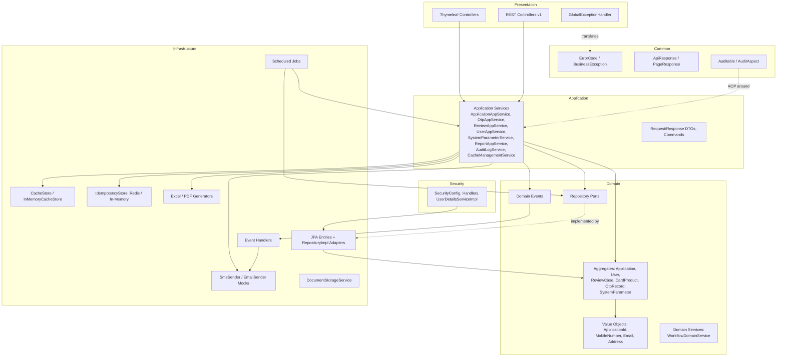

# 02 – Architecture Design

## 1. Architectural Style

TLBank Digital Lending Platform follows **Clean Architecture / Hexagonal Architecture**, layered as:

```
presentation  →  application  →  domain  ←  infrastructure
                                    ↑
                                 security (cross-cutting)
                                 common (cross-cutting)

```

This is documented directly in the codebase's root `package-info.java`:

> Hexagonal architecture layers: `presentation` – web and REST adapters · `application` – use cases and DTOs
> · `domain` – aggregates, value objects, repository ports · `infrastructure` – JPA, cache, notification
> adapters · `security` – authentication and authorization · `common` – shared utilities, exceptions,
> configuration.

### 1.1 Dependency Rule

The single rule that governs every package decision: **dependencies always point inward, toward `domain`.**

| Layer | May depend on | Must NOT depend on |
| --- | --- | --- |
| `domain` | Nothing but the JDK (+ Lombok at compile time for boilerplate) | Spring, JPA, Servlet API, web/HTTP types |
| `application` | `domain` | `infrastructure`, `presentation` internals (only ports) |
| `infrastructure` | `domain` (implements its repository ports), Spring/JPA/Redis/POI/iText | `presentation` |
| `presentation` | `application`, `common` (DTOs/response envelope) | `infrastructure` implementation classes directly (it talks to `application` services) |
| `security` | `domain` (e.g. `Role`), `infrastructure.persistence.user` (to load credentials) | `presentation` web internals beyond what handlers need |
| `common` | Nothing (utility/cross-cutting only) | Any other layer |

This is why, for example, `Application` (domain aggregate) is a plain Lombok `@Builder` class with **no**
`@Entity` annotation, while `ApplicationEntity` (infrastructure) is the JPA-mapped class that the
`ApplicationRepositoryImpl` adapter converts to/from the domain aggregate.

## 2. Layer Responsibilities

### 2.1 Presentation Layer (`presentation`)

- `presentation.api.v1.*` – versioned REST controllers (`@RestController`), one per bounded capability
  (Applications, Products, OTP, Review, Admin Users, Admin System Parameters, Admin Cache, Reports,
  Schedulers, Audit Logs, Notifications).

- `presentation.web.*` – Thymeleaf server-rendered controllers (`@Controller`) for the browser UI
  (`AuthController`, `ApplicationWebController`, `ReviewController`, `AdminController`).

- `presentation.api.advice.GlobalExceptionHandler` – translates domain/application exceptions into the
  standard `ApiResponse` envelope and HTTP status.

Controllers are intentionally thin: they validate input shape (`@Valid`), delegate to exactly one application
service method, and map the result into a response DTO or `ApiResponse`. No business rule is implemented in a
controller.

### 2.2 Application Layer (`application`)

- One **application service** per use-case cluster: `ApplicationAppService`, `OtpAppService`,
  `ReviewAppService`, `UserAppService`, `SystemParameterService`, `ReportAppService`, `ReportDataService`,
  `AuditLogService`, `CacheManagementService`, `NotificationServiceImpl`, `IdempotencyService`.

- Application services **orchestrate**: load aggregates via domain repository ports, call domain behavior
  (e.g. `application.submit(operator)`), persist via the same port, publish domain events, and map results to
  `application.dto.response` / per-feature `*Response` records.

- Application-layer DTOs are split into:
  - `application.dto.request` – inbound request bodies validated with Jakarta Validation
  - `application.dto.response` – generic outbound payloads (e.g. `LoginResponse`, `DocumentUploadResponse`)
  - per-feature `service` packages also define feature-specific `*Command` and `*Response` records
    (e.g. `SendOtpCommand`, `ApproveCaseCommand`, `ReviewCaseDetailResponse`)

### 2.3 Domain Layer (`domain`)

- **Aggregates** (rich behavior, framework-free): `Application`, `User`, `ReviewCase`, `CardProduct`,
  `OtpRecord`, `SystemParameter`.

- **Value objects** (records, self-validating): `ApplicationId`, `CardProductId`, `Email`, `MobileNumber`,
  `Address`, `Applicant`, `DocumentInfo`, `UserId`, `ReviewCaseId`.

- **Domain services**: `WorkflowDomainService` — encapsulates the application status transition rule so it
  can be reused/tested independently of the aggregate.

- **Repository ports** (`domain.*.repository`): interfaces only, implemented by adapters in `infrastructure`.
- **Domain events** (`domain.event`): `ApplicationSubmittedEvent`, `ApplicationApprovedEvent`,
  `ApplicationRejectedEvent`, `ApplicationCancelledEvent`, `OtpGeneratedEvent`.

### 2.4 Infrastructure Layer (`infrastructure`)

- `infrastructure.persistence.*` – JPA `*Entity` classes, Spring Data `*JpaRepository` interfaces, and
  `*RepositoryImpl` adapters that implement the domain repository ports and map entity ↔ aggregate.

- `infrastructure.cache` – `CacheStore` port + `InMemoryCacheStore` adapter, `CacheKeys`, `CacheTtlProvider`,
  and the `CachedCardProductRepository` caching decorator.

- `infrastructure.idempotency` – `IdempotencyStore` port with `InMemoryIdempotencyStore` (test/dev,
  property-gated) and `RedisIdempotencyStore` (dev/prod, property-gated) implementations.

- `infrastructure.notification` – `SmsSender` / `EmailSender` ports with mock adapters and shared
  `NotificationTemplate` message templates.

- `infrastructure.report` – `ExcelReportGenerator` (Apache POI), `PdfReportGenerator` (iText 7).
- `infrastructure.scheduler` – `@Scheduled` jobs: `OtpCleanupScheduler`, `CacheRefreshScheduler`,
  `DailyStatisticsScheduler`.

- `infrastructure.storage` – `DocumentStorageService` port + `LocalDocumentStorageService` adapter.
- `infrastructure.event` – Spring `@EventListener` handlers (`ReviewEventHandler`,
  `NotificationEventHandler`) that react to domain events published by application services.

### 2.5 Security (`security`)

Spring Security configuration, authentication handlers, `UserDetailsServiceImpl`, and the `AuthenticatedUser`
principal. Documented fully in `07-security-design.md`.

### 2.6 Common (`common`)

Shared, framework-light or framework-thin utilities used by every layer: `common.exception` (error
hierarchy), `common.response` (API envelope), `common.audit` (AOP audit logging), `common.entity.BaseEntity`
(JPA auditing superclass), `common.util` (`MaskingUtil`, `DateUtil`), `common.config` (Spring `@Configuration`
beans: `JpaConfig`, `AsyncConfig`, `SchedulingConfig`/`SchedulerConfig`, `SwaggerConfig`,
`StandardApiResponses`, `CommonConfig`).

## 3. Architecture Diagram



## 4. Why This Architecture Was Chosen

1. **Testability** – domain aggregates can be unit-tested with zero Spring context (`ApplicationTest`,
   `ReviewCaseTest`, `OtpRecordTest`, `ApplicationStatusTest` all run as plain JUnit tests).

2. **Replaceability of infrastructure** – swapping H2 for SQL Server, in-memory cache for Redis, or mock
   SMS/email for a real provider requires zero change to `domain` or `application` code — only a new adapter
   implementing the existing port (this is demonstrated today by the dual `InMemoryIdempotencyStore` /
   `RedisIdempotencyStore` implementation selected via `tlbank.idempotency.store`).

3. **Auditability and compliance fit** – financial-style systems need a clear seam where audit logging,
   exception translation, and field masking can be applied uniformly; the cross-cutting `common` packages
   provide exactly that seam via AOP and a global exception handler.

4. **DDD alignment with the business** – "Application", "ReviewCase", "OtpRecord", "CardProduct" map 1:1 to
   how a real bank discusses this domain, which keeps code, tests, and this document set in the same
   language.

## 5. Module Boundaries

Although deployed as a single Spring Boot application (a *modular monolith*, not a set of microservices),
each functional module is isolated by package and communicates with other modules either through:

- A domain repository port (synchronous, in-process), or
- A Spring `ApplicationEvent` (asynchronous-feeling, decoupled in-process), e.g. `ApplicationSubmittedEvent`
  is consumed independently by `ReviewEventHandler` (creates a `ReviewCase`) and `NotificationEventHandler`
  (sends a notification) — neither handler knows about the other.

This event-driven seam is the most natural place to introduce a real message broker later (see
`20-maintenance-and-future-enhancement.md`).
