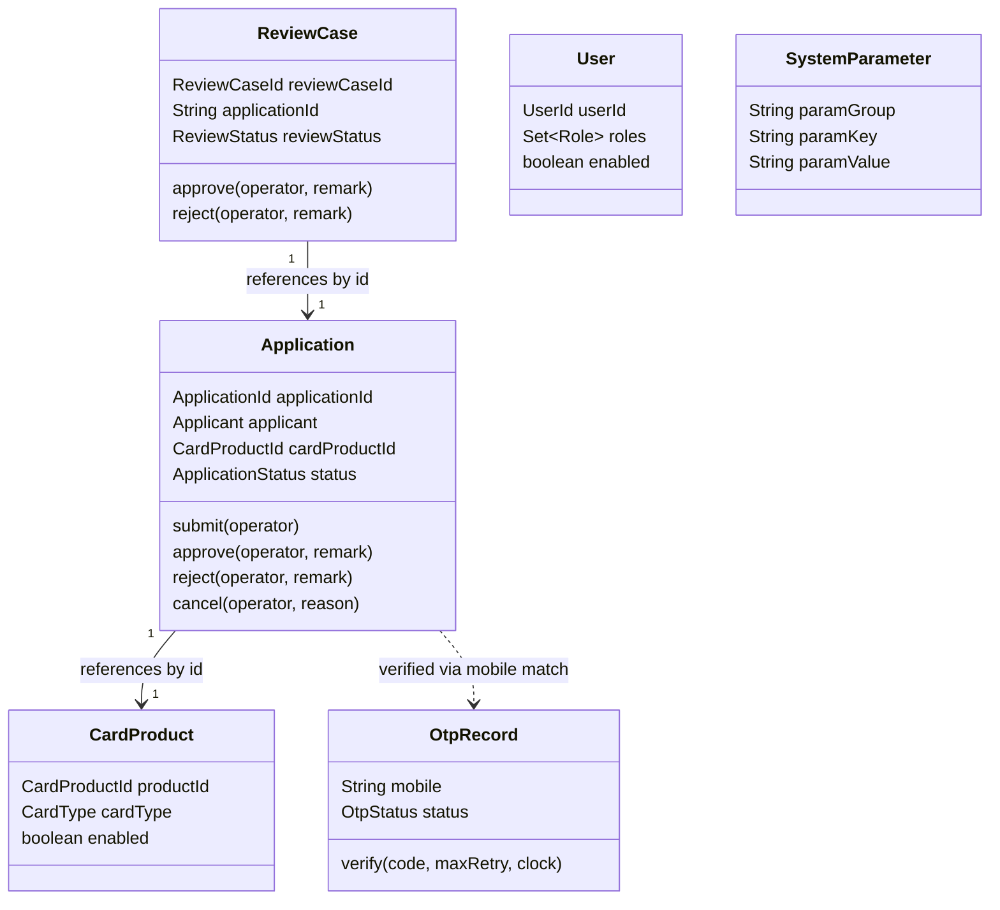

# 04 – Domain Model

## 1. Bounded Context

The entire project is modeled as a single bounded context: **Digital Lending (Credit Card Application &
Review)**. Within it, six aggregates collaborate, each with its own repository port and lifecycle.

## 2. Aggregate Overview

| Aggregate       | Aggregate Root    | Identity                                              | Key Collaborators                                                           |
| --------------- | ----------------- | ----------------------------------------------------- | --------------------------------------------------------------------------- |
| Application     | `Application`     | `ApplicationId` (`APP-yyyyMMddHHmmss-NNNN`)           | `CardProduct` (by reference id), `ReviewCase` (created on submit via event) |
| User            | `User`            | `UserId` (`USR-XXXXXXXX`)                             | Spring Security (`UserDetailsServiceImpl`)                                  |
| ReviewCase      | `ReviewCase`      | `ReviewCaseId` (`RC-yyyyMMdd-NNNN`)                   | `Application` (by reference id)                                             |
| CardProduct     | `CardProduct`     | `CardProductId`                                       | Referenced by `Application`                                                 |
| OtpRecord       | `OtpRecord`       | internal `otpId`, keyed by mobile number              | Referenced indirectly during `Application` OTP verification                 |
| SystemParameter | `SystemParameter` | internal `paramId`, keyed by `(paramGroup, paramKey)` | Read by OTP, Cache TTL, Upload validation                                   |

Aggregates reference each other **by identifier only** (e.g. `Application.cardProductId`,
`ReviewCase.applicationId` is a plain `String`), never by direct object reference — a standard DDD practice
that keeps aggregate boundaries (and therefore transactions) small.

## 3. Application Aggregate

### 3.1 Structure

```
Application (aggregate root)
├── applicationId : ApplicationId
├── applicant : Applicant (value object)
│   ├── fullName : String
│   ├── nationalId : String
│   ├── mobile : MobileNumber (value object)
│   ├── email : Email (value object)
│   ├── dateOfBirth : LocalDate
│   └── address : Address (value object)
├── cardProductId : CardProductId
├── status : ApplicationStatus (enum, state machine)
├── workflowHistories : List<WorkflowHistory> (value objects)
├── documentInfos : List<DocumentInfo> (value objects)
├── submittedAt : LocalDateTime
├── createdAt / updatedAt : LocalDateTime

```

### 3.2 Behavior (Aggregate Methods)

| Method                            | Effect                                                                         | Guarded by                                                                                       |
| --------------------------------- | ------------------------------------------------------------------------------ | ------------------------------------------------------------------------------------------------ |
| `verifyOtp(operator)`             | `INIT → OTP_VERIFIED`                                                          | `ApplicationStatus.canTransitionTo`                                                              |
| `uploadDocuments(docs, operator)` | `OTP_VERIFIED → DOCUMENT_UPLOADED` (or appends if already `DOCUMENT_UPLOADED`) | Status check inside the method, throws `WorkflowException` otherwise                             |
| `submit(operator)`                | `DOCUMENT_UPLOADED → SUBMITTED`, stamps `submittedAt`                          | `ApplicationStatus.canTransitionTo` **and** all `DocumentType` values present in `documentInfos` |
| `startReview(operator)`           | `SUBMITTED → UNDER_REVIEW`                                                     | `ApplicationStatus.canTransitionTo`                                                              |
| `approve(operator, remark)`       | `UNDER_REVIEW → APPROVED`                                                      | `ApplicationStatus.canTransitionTo`                                                              |
| `reject(operator, remark)`        | `UNDER_REVIEW → REJECTED`                                                      | `ApplicationStatus.canTransitionTo`                                                              |
| `cancel(operator, reason)`        | `{INIT, OTP_VERIFIED, DOCUMENT_UPLOADED} → CANCELLED`                          | Explicit `CANCELLABLE_STATUSES` `EnumSet`                                                        |

Every transition appends a `WorkflowHistory` entry (`fromStatus`, `toStatus`, `operator`, `remark`,
`operatedAt`) **inside the same aggregate method**, so workflow history and status are always consistent —
there is no code path that changes `status` without recording history.

### 3.3 Invariants

- `Applicant.fullName` must not be blank (enforced in the `Applicant` record's compact constructor).
- `MobileNumber` must match Taiwan mobile format `^09\d{8}$`.
- `Email` must contain `@`.
- `Address` requires non-blank `city`, `district`, `street`, `zipCode`.
- `ApplicationId` must match `^APP-\d{14}-\d{4}$`.
- A status transition not present in `ApplicationStatus.ALLOWED_TRANSITIONS` throws `WorkflowException`
  (HTTP 409) — this is the single enforcement point for the entire application lifecycle.

## 4. ReviewCase Aggregate

```
ReviewCase (aggregate root)
├── reviewCaseId : ReviewCaseId
├── applicationId : String        # reference, not object — DDD aggregate boundary
├── assignedTo : String
├── reviewStatus : ReviewStatus (enum, state machine)
├── remarks : List<ReviewRemark> (value objects)
├── reviewedAt / createdAt / updatedAt : LocalDateTime

```

- `ReviewCase.createFor(applicationId)` is the factory used by `ReviewEventHandler` when an
  `ApplicationSubmittedEvent` is observed — i.e. **a review case is always created as a side effect of
  submission**, never directly by a reviewer.

- `startReview` → `PENDING → UNDER_REVIEW`
- `approve` / `reject` → `UNDER_REVIEW → APPROVED` / `UNDER_REVIEW → REJECTED`, both stamp `reviewedAt` and
  append a `ReviewRemark`

- `addRemark` may be called in any status to append free-text reviewer commentary

## 5. User Aggregate

```
User (aggregate root)
├── userId : UserId
├── username : String
├── passwordHash : String   # BCrypt, never the raw password
├── fullName : String
├── email : String
├── roles : Set<Role>        # ROLE_ADMIN | ROLE_REVIEWER | ROLE_USER
├── enabled : boolean
├── lastLoginAt : LocalDateTime
├── createdAt : LocalDateTime

```

Behavior: `enable()`, `disable()`, `assignRole(role)`, `removeRole(role)`, `hasRole(role)`. Password hashing
happens in the application layer (`UserAppService`, via injected `PasswordEncoder`), keeping the domain class
itself free of a Spring Security dependency.

## 6. CardProduct Aggregate

```
CardProduct (aggregate root)
├── productId : CardProductId
├── productCode : String
├── productName : String
├── cardType : CardType (VISA | MASTERCARD | JCB | UNIONPAY)
├── features : List<ProductFeature>   # value object: (featureKey, featureValue)
├── enabled : boolean
├── createdAt : LocalDateTime

```

Read-mostly aggregate; product catalog browsing is the platform's only unauthenticated, public read API
besides the application creation flow.

## 7. OtpRecord Aggregate

```
OtpRecord (aggregate root)
├── otpId : Long
├── mobile : String
├── otpCode : String        # 6-digit numeric, masked everywhere outside the domain
├── purpose : OtpPurpose (APPLICATION_VERIFICATION)
├── status : OtpStatus (PENDING | VERIFIED | EXPIRED | CANCELLED)
├── retryCount : int
├── expiredAt / verifiedAt / createdAt : LocalDateTime

```

`verify(inputCode, maxRetry, clock)` is the single method that enforces all three OTP business rules:
expiry, retry-limit, and code match — see `09-module-design.md` §4 for the exact precedence of these checks.

## 8. SystemParameter Aggregate

```
SystemParameter (aggregate root)
├── paramId : Long
├── paramGroup : String     # e.g. OTP, CACHE, UPLOAD
├── paramKey : String       # e.g. expire_minutes, max_retry, ttl_seconds, max.size.mb
├── paramValue : String
├── description : String
├── enabled : boolean
├── createdAt / updatedAt : LocalDateTime

```

`updateValue(newValue)` rejects blank values. This aggregate is the platform's configuration-as-data
mechanism — no business constant in this codebase that an administrator should be able to tune is hardcoded;
it is read through `SystemParameterService` with a sane fallback default in code.

## 9. Value Objects Summary

| Value Object      | Validation Rule           | Notable Behavior                                                            |
| ----------------- | ------------------------- | --------------------------------------------------------------------------- |
| `ApplicationId`   | `^APP-\d{14}-\d{4}$`      | `generate()` factory using timestamp + random suffix                        |
| `ReviewCaseId`    | `^RC-\d{8}-\d{4}$`        | `generate()` factory using date + random suffix                             |
| `UserId`          | non-blank                 | `generate()` factory using `USR-` + UUID fragment                           |
| `CardProductId`   | non-blank                 | —                                                                           |
| `MobileNumber`    | `^09\d{8}$`               | `masked()` → `0912****78`                                                   |
| `Email`           | must contain `@`          | —                                                                           |
| `Address`         | all four fields non-blank | —                                                                           |
| `Applicant`       | `fullName` non-blank      | Composes `MobileNumber`, `Email`, `Address`                                 |
| `DocumentInfo`    | —                         | Carries `documentType`, `fileName`, `storagePath`, `fileSize`, `uploadedAt` |
| `WorkflowHistory` | —                         | Immutable audit trail entry on `Application`                                |
| `ReviewRemark`    | —                         | Immutable audit trail entry on `ReviewCase`                                 |
| `ProductFeature`  | —                         | `(featureKey, featureValue)` pair                                           |

## 10. Domain Services

| Domain Service          | Responsibility                                                                                                                                                                                                                                                                                           |
| ----------------------- | -------------------------------------------------------------------------------------------------------------------------------------------------------------------------------------------------------------------------------------------------------------------------------------------------------- |
| `WorkflowDomainService` | Validates an `ApplicationStatus` transition, throwing `WorkflowException` if disallowed. Exists separately from `Application.transitionTo` so the same rule can be reused/tested outside the aggregate (e.g. by future orchestration code that needs to pre-validate before loading the full aggregate). |

## 11. Domain Events

| Event                       | Published By                              | Consumed By                                                                                                                                     |
| --------------------------- | ----------------------------------------- | ----------------------------------------------------------------------------------------------------------------------------------------------- |
| `ApplicationSubmittedEvent` | `ApplicationAppService.submitApplication` | `ReviewEventHandler` (creates `ReviewCase`), `NotificationEventHandler` (sends "received" notification)                                         |
| `ApplicationApprovedEvent`  | `ReviewAppService.approveCase`            | `NotificationEventHandler` (sends "approved" notification)                                                                                      |
| `ApplicationRejectedEvent`  | `ReviewAppService.rejectCase`             | `NotificationEventHandler` (sends "rejected" notification)                                                                                      |
| `ApplicationCancelledEvent` | Reserved for `cancelApplication` flow     | *(currently defined, not yet wired to a publisher — see `20-maintenance-and-future-enhancement.md`)*                                            |
| `OtpGeneratedEvent`         | Reserved                                  | *(currently defined, not yet wired — OTP notifications are sent synchronously today by `OtpAppService` calling `NotificationService` directly)* |

## 12. Aggregate Relationship Diagram


