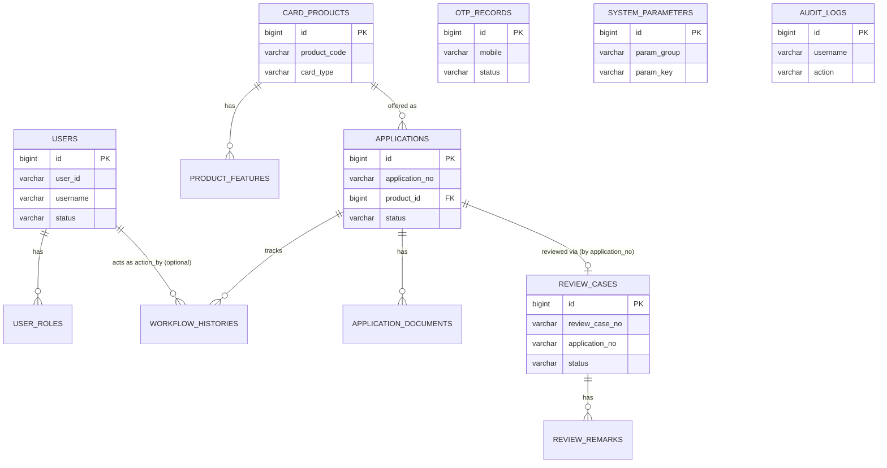

# 05 – Database Design

## 1. Overview

| Item | Value |
|---|---|
| Production / staging RDBMS | Microsoft SQL Server 2022 |
| Dev / test RDBMS | H2 in-memory, `MODE=MSSQLServer` compatibility |
| Migration tool | Flyway, with **two parallel migration sets**: `classpath:db/migration` (H2 syntax) and `classpath:db/migration-sqlserver` (T-SQL syntax) — selected per Spring profile |
| Migration versions | `V1` – `V14` (schema), plus `V100`/`V101` seed-only migrations under `db/dev-seed` (dev) and `V100` under `db/migration-sqlserver` (staging seed) |
| Auditing columns | `created_at` / `updated_at` are populated automatically via `BaseEntity` + Spring Data JPA Auditing (`@EnableJpaAuditing`) on every entity that extends it |

> All table and column names below are invented for this fictional project and intentionally **do not**
> reflect any real bank's internal schema.

## 2. Migration History

| Version | Purpose |
|---|---|
| V1 | Create `users`, `user_roles` |
| V2 | Create `card_products`, `product_features` |
| V3 | Create `applications`, `workflow_histories`, `application_documents` |
| V4 | Create `otp_records` |
| V5 | Create `review_cases`, `review_remarks` |
| V6 | Create `audit_logs` (v1 shape) |
| V7 | Create `system_parameters` |
| V8 | Add `users.last_login_at` |
| V9 | Add `users.user_id` business identifier (`USR-…`), backfilled, then made `UNIQUE NOT NULL` |
| V10 | Extend `system_parameters` with `param_group`, `enabled`, `created_at`; re-key uniqueness from `(param_key)` to `(param_group, param_key)`; rename OTP keys |
| V11 | Extend `applications` with applicant snapshot columns (full name, national ID, mobile, email, DOB, address) and relax `user_id`; extend `card_products` with `card_type`, `enabled`; extend `workflow_histories` with `operator`; extend `application_documents` with `file_size` |
| V12 | Extend `otp_records` for mobile-based verification: relax `user_id`, add `mobile`, `status`, `verified_at`; drop the old boolean `verified` column |
| V13 | Extend `review_cases`/`review_remarks` for the dedicated review module: add `review_case_no`, `application_no`, `assigned_to`, `reviewed_at`; relax FKs; add `operator`, `content` to remarks |
| V14 | **Drop and recreate** `audit_logs` with the final shape used by the audit module (`username`, `action`, `ip_address`, `result`, `detail`, `created_at`) |

This progression intentionally mirrors how the platform's modules were built incrementally — see
`19-cursor-implementation-roadmap.md`, where Sprints 5, 6, 8, and 9 correspond to V11, V12, V13, and V14
respectively.

## 3. Final Schema (Current State)

### 3.1 `users`

| Column | Type | Constraints |
|---|---|---|
| `id` | `BIGINT IDENTITY` | PK (surrogate, internal only) |
| `user_id` | `VARCHAR(50)` | `UNIQUE NOT NULL` — business identifier `USR-XXXXXXXX`, used as the JPA `@Id` |
| `username` | `VARCHAR(50)` | `UNIQUE NOT NULL` |
| `password` | `VARCHAR(255)` | `NOT NULL` — BCrypt hash |
| `email` | `VARCHAR(100)` | `UNIQUE NOT NULL` |
| `full_name` | `VARCHAR(100)` | `NOT NULL` |
| `mobile` | `VARCHAR(20)` | `NOT NULL` |
| `national_id` | `VARCHAR(20)` | `NOT NULL` |
| `status` | `VARCHAR(20)` | `NOT NULL DEFAULT 'ACTIVE'` |
| `last_login_at` | `TIMESTAMP` | nullable |
| `created_at` / `updated_at` | `TIMESTAMP` | `NOT NULL DEFAULT CURRENT_TIMESTAMP` |

Index: `idx_users_status (status)`

### 3.2 `user_roles`

| Column | Type | Constraints |
|---|---|---|
| `id` | `BIGINT IDENTITY` | PK |
| `user_id` | `BIGINT` | FK → `users.id`, part of `UNIQUE (user_id, role)` |
| `role` | `VARCHAR(30)` | `NOT NULL` (`ADMIN`, `REVIEWER`, `APPLICANT` — mapped to `ROLE_*` Spring authorities) |
| `created_at` | `TIMESTAMP` | `NOT NULL DEFAULT CURRENT_TIMESTAMP` |

### 3.3 `card_products`

| Column | Type | Constraints |
|---|---|---|
| `id` | `BIGINT IDENTITY` | PK |
| `product_code` | `VARCHAR(30)` | `UNIQUE NOT NULL` |
| `product_name` | `VARCHAR(100)` | `NOT NULL` |
| `description` | `VARCHAR(500)` | nullable |
| `annual_fee` | `DECIMAL(12,2)` | `NOT NULL DEFAULT 0` |
| `credit_limit_min` / `credit_limit_max` | `DECIMAL(12,2)` | `NOT NULL` |
| `card_type` | `VARCHAR(20)` | `NOT NULL DEFAULT 'VISA'` (`VISA`/`MASTERCARD`/`JCB`/`UNIONPAY`) |
| `status` | `VARCHAR(20)` | `NOT NULL DEFAULT 'ACTIVE'` |
| `enabled` | `BOOLEAN` | `NOT NULL DEFAULT TRUE` |
| `created_at` / `updated_at` | `TIMESTAMP` | `NOT NULL DEFAULT CURRENT_TIMESTAMP` |

Index: `idx_card_products_status (status)`

### 3.4 `product_features`

| Column | Type | Constraints |
|---|---|---|
| `id` | `BIGINT IDENTITY` | PK |
| `product_id` | `BIGINT` | FK → `card_products.id` |
| `feature_name` | `VARCHAR(100)` | `NOT NULL` |
| `feature_description` | `VARCHAR(500)` | nullable |
| `created_at` | `TIMESTAMP` | `NOT NULL DEFAULT CURRENT_TIMESTAMP` |

### 3.5 `applications`

| Column | Type | Constraints |
|---|---|---|
| `id` | `BIGINT IDENTITY` | PK (surrogate, internal only) |
| `application_no` | `VARCHAR(30)` | `UNIQUE NOT NULL` — business identifier `APP-yyyyMMddHHmmss-NNNN` |
| `user_id` | `BIGINT` | FK → `users.id`, **nullable** (applicants are anonymous) |
| `product_id` | `BIGINT` | FK → `card_products.id`, `NOT NULL` |
| `status` | `VARCHAR(30)` | `NOT NULL DEFAULT 'INIT'` (state machine, see `08-workflow-design.md`) |
| `requested_limit` | `DECIMAL(12,2)` | nullable (reserved, not currently set by the use case) |
| `submitted_at` | `TIMESTAMP` | nullable |
| `applicant_full_name` | `VARCHAR(100)` | snapshot of applicant at submission time |
| `applicant_national_id` | `VARCHAR(20)` | snapshot |
| `applicant_mobile` | `VARCHAR(20)` | snapshot |
| `applicant_email` | `VARCHAR(100)` | snapshot |
| `applicant_date_of_birth` | `DATE` | snapshot |
| `address_city` / `address_district` / `address_street` / `address_zip_code` | `VARCHAR` | snapshot |
| `created_at` / `updated_at` | `TIMESTAMP` | `NOT NULL DEFAULT CURRENT_TIMESTAMP` |

Indexes: `idx_applications_user_id (user_id)`, `idx_applications_status (status)`

> **Design note – applicant snapshot vs. `users` table.** The applicant's personal data is stored directly
> on the `applications` row (`applicant_*`, `address_*` columns) rather than via a foreign key to `users`,
> because applicants do not have accounts. This is intentional denormalization: an application is a
> self-contained record of "who applied, with what data, at what time," independent of whether that person
> ever becomes an internal `User`.

### 3.6 `workflow_histories`

| Column | Type | Constraints |
|---|---|---|
| `id` | `BIGINT IDENTITY` | PK |
| `application_id` | `BIGINT` | FK → `applications.id` |
| `from_status` / `to_status` | `VARCHAR(30)` | `to_status NOT NULL` |
| `action_by` | `BIGINT` | FK → `users.id`, nullable |
| `operator` | `VARCHAR(100)` | free-text operator label (`APPLICANT`, reviewer username, etc.) |
| `comment` | `VARCHAR(500)` | nullable |
| `action_at` | `TIMESTAMP` | `NOT NULL DEFAULT CURRENT_TIMESTAMP` |

### 3.7 `application_documents`

| Column | Type | Constraints |
|---|---|---|
| `id` | `BIGINT IDENTITY` | PK |
| `application_id` | `BIGINT` | FK → `applications.id` |
| `document_type` | `VARCHAR(50)` | `NOT NULL` (`NATIONAL_ID`/`INCOME_PROOF`/`RESIDENCE_PROOF`) |
| `file_name` | `VARCHAR(255)` | `NOT NULL` (original filename) |
| `file_path` | `VARCHAR(500)` | `NOT NULL` (relative storage path) |
| `file_size` | `BIGINT` | `NOT NULL DEFAULT 0` |
| `uploaded_at` | `TIMESTAMP` | `NOT NULL DEFAULT CURRENT_TIMESTAMP` |

### 3.8 `otp_records`

| Column | Type | Constraints |
|---|---|---|
| `id` | `BIGINT IDENTITY` | PK |
| `user_id` | `BIGINT` | FK → `users.id`, nullable (legacy column, unused by the current mobile-based flow) |
| `mobile` | `VARCHAR(20)` | the verification target |
| `otp_code` | `VARCHAR(10)` | `NOT NULL` — always masked outside the domain layer |
| `purpose` | `VARCHAR(30)` | `NOT NULL` (`APPLICATION_VERIFICATION`) |
| `status` | `VARCHAR(20)` | `NOT NULL DEFAULT 'PENDING'` (`PENDING`/`VERIFIED`/`EXPIRED`/`CANCELLED`) |
| `retry_count` | `INT` | `NOT NULL DEFAULT 0` |
| `expired_at` | `TIMESTAMP` | `NOT NULL` |
| `verified_at` | `TIMESTAMP` | nullable |
| `created_at` | `TIMESTAMP` | `NOT NULL DEFAULT CURRENT_TIMESTAMP` |

Index: `idx_otp_records_mobile_status (mobile, status)`

### 3.9 `review_cases`

| Column | Type | Constraints |
|---|---|---|
| `id` | `BIGINT IDENTITY` | PK |
| `review_case_no` | `VARCHAR(30)` | `UNIQUE` — business identifier `RC-yyyyMMdd-NNNN` |
| `application_id` | `BIGINT` | FK → `applications.id`, nullable (legacy; the domain repository resolves by `application_no` string today) |
| `application_no` | `VARCHAR(30)` | business reference to `applications.application_no` |
| `reviewer_id` | `BIGINT` | FK → `users.id`, nullable (legacy column) |
| `assigned_to` | `VARCHAR(50)` | reviewer username |
| `status` | `VARCHAR(30)` | `NOT NULL DEFAULT 'PENDING'` (`PENDING`/`UNDER_REVIEW`/`APPROVED`/`REJECTED`) |
| `assigned_at` / `completed_at` / `reviewed_at` | `TIMESTAMP` | nullable |
| `created_at` / `updated_at` | `TIMESTAMP` | `NOT NULL DEFAULT CURRENT_TIMESTAMP` |

Index: `idx_review_cases_status (status)`

### 3.10 `review_remarks`

| Column | Type | Constraints |
|---|---|---|
| `id` | `BIGINT IDENTITY` | PK |
| `review_case_id` | `BIGINT` | FK → `review_cases.id`, `NOT NULL` |
| `remark` | `VARCHAR(1000)` | legacy column |
| `content` | `VARCHAR(1000)` | current remark text column used by the review module |
| `operator` | `VARCHAR(100)` | reviewer username |
| `created_by` | `BIGINT` | FK → `users.id`, nullable (legacy column) |
| `created_at` | `TIMESTAMP` | `NOT NULL DEFAULT CURRENT_TIMESTAMP` |

### 3.11 `system_parameters`

| Column | Type | Constraints |
|---|---|---|
| `id` | `BIGINT IDENTITY` | PK |
| `param_group` | `VARCHAR(50)` | `NOT NULL DEFAULT 'DEFAULT'` — part of `UNIQUE (param_group, param_key)` |
| `param_key` | `VARCHAR(100)` | `NOT NULL` |
| `param_value` | `VARCHAR(500)` | `NOT NULL` |
| `description` | `VARCHAR(500)` | nullable |
| `enabled` | `BOOLEAN` | `NOT NULL DEFAULT TRUE` |
| `created_at` / `updated_at` | `TIMESTAMP` | `NOT NULL DEFAULT CURRENT_TIMESTAMP` |

Known seeded groups/keys: `OTP.expire_minutes`, `OTP.max_retry`, `CACHE.ttl_seconds`, `UPLOAD.max.size.mb`.

### 3.12 `audit_logs` (final shape, post-V14)

| Column | Type | Constraints |
|---|---|---|
| `id` | `BIGINT IDENTITY` | PK |
| `username` | `VARCHAR(100)` | nullable (`ANONYMOUS` for unauthenticated actions) |
| `action` | `VARCHAR(50)` | `NOT NULL` — `AuditAction` enum name |
| `ip_address` | `VARCHAR(45)` | nullable (IPv4/IPv6) |
| `result` | `VARCHAR(20)` | `NOT NULL` (`SUCCESS`/`FAILURE`) |
| `detail` | `VARCHAR(500)` | nullable, sanitized free text |
| `created_at` | `TIMESTAMP` | `NOT NULL DEFAULT CURRENT_TIMESTAMP` |

Indexes: `idx_audit_logs_username`, `idx_audit_logs_action`, `idx_audit_logs_created_at`

## 4. Entity-Relationship Diagram

## 5. Business ID vs. Surrogate Key Pattern

A recurring, deliberate pattern across this schema:

| Aggregate | Surrogate key (`id`, internal) | Business key (exposed externally) |
|---|---|---|
| User | `users.id` (`BIGINT IDENTITY`) | `users.user_id` (`USR-XXXXXXXX`) — **this is the JPA `@Id`** |
| Application | `applications.id` | `applications.application_no` (`APP-yyyyMMddHHmmss-NNNN`) |
| ReviewCase | `review_cases.id` | `review_cases.review_case_no` (`RC-yyyyMMdd-NNNN`) |

For `User`, the business key doubles as the JPA identifier (`@Id` on `user_id`), with the numeric `id` kept
read-only (`insertable = false, updatable = false`) purely so legacy FK columns (`user_roles.user_id`,
`workflow_histories.action_by`, etc.) can still reference the numeric surrogate. For `Application` and
`ReviewCase`, the JPA `@Id` remains the numeric surrogate, and the `*RepositoryImpl` adapters translate
between the business identifier (used everywhere in `domain`/`application`/API) and the surrogate key
(used only inside `infrastructure.persistence`). This keeps externally-visible identifiers
non-guessable/non-sequential while preserving simple numeric joins internally.

## 6. Dialect Differences (H2 vs. SQL Server)

| Concern | H2 migration set | SQL Server migration set |
|---|---|---|
| Identity columns | `BIGINT GENERATED BY DEFAULT AS IDENTITY` | `BIGINT IDENTITY` |
| Boolean type | `BOOLEAN` | `BIT` |
| String concatenation in seed data | `||` | `+` |
| Compatibility mode | `MODE=MSSQLServer` JDBC URL flag minimizes drift | Native |

Both migration sets are kept in lock-step version-by-version (`V1`…`V14`) so that the same logical schema
exists in both environments; only syntax differs.
