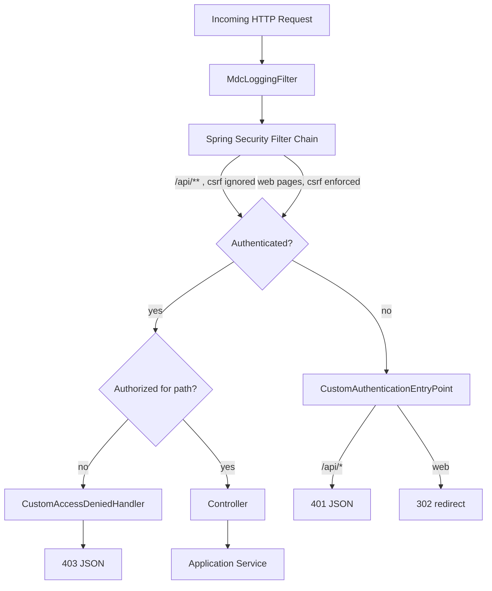

# 07 – Security Design

## 1. Authentication Model

TLBank Digital Lending Platform uses **classic session-based authentication** via Spring Security form login
— not JWT/OAuth2 — which is appropriate for its primary surface (a server-rendered Thymeleaf back office for
reviewers/admins) while still exposing a JSON-friendly login for API clients and tests.

| Aspect | Implementation |
| --- | --- |
| Authentication mechanism | `HttpSecurity.formLogin()`, login page `/login`, processing URL `/api/v1/auth/login` |
| Credential storage | `users.password` column, BCrypt-hashed (`BCryptPasswordEncoder(12)`) |
| Principal loading | `UserDetailsServiceImpl` → `UserJpaRepository.findByUsername` → `AuthenticatedUser` (extends Spring's `User`, adds `fullName`) |
| Authentication manager | `ProviderManager` wrapping a single `DaoAuthenticationProvider` |
| Session store | Servlet container HTTP session (default in-memory; `server.servlet.session.timeout` configurable per profile, default `30m`) |
| Concurrent session control | `maximumSessions(1)` via `SessionRegistry` — a second login invalidates the first session |
| Logout | `/api/v1/auth/logout`, invalidates session + deletes `JSESSIONID` cookie |

## 2. Authorization Model

### 2.1 Roles

| Domain `Role` enum | Spring authority | Internal `user_roles.role` value |
| --- | --- | --- |
| `ROLE_ADMIN` | `ROLE_ADMIN` | `ADMIN` |
| `ROLE_REVIEWER` | `ROLE_REVIEWER` | `REVIEWER` |
| `ROLE_USER` | `ROLE_USER` | `APPLICANT` (mapped in `UserDetailsServiceImpl.toSpringRole`) |

### 2.2 URL Authorization Matrix (`SecurityConfig.securityFilterChain`)

| Path pattern | Rule |
| --- | --- |
| `/`, `/login`, `/products`, `/apply/**`, `/application/**`, `/api/v1/auth/**`, `/api/v1/otp/**` | `permitAll()` — public applicant flow |
| `GET /api/v1/products`, `GET /api/v1/products/**` | `permitAll()` |
| `GET /api/v1/applications/**` | `permitAll()` |
| `POST /api/v1/applications`, `POST /api/v1/applications/**` | `permitAll()` (application creation, document upload, submit, cancel are all anonymous; identity is established by OTP, not login) |
| `/h2-console/**` | `permitAll()` (dev convenience only — see `17-deployment-design.md` for why this must never reach `prod`) |
| `/swagger-ui/**`, `/swagger-ui.html`, `/v3/api-docs/**` | `permitAll()` (disabled entirely at the springdoc level in `prod`) |
| `/api/v1/review/**`, `/review/**` | `hasAnyRole("REVIEWER", "ADMIN")` |
| `/api/v1/admin/**`, `/api/v1/reports/**`, `/admin/**` | `hasRole("ADMIN")` |
| anything else | `authenticated()` |

Method-level security is additionally enabled (`@EnableMethodSecurity`) and used on controllers via
`@PreAuthorize("hasRole('ADMIN')")` / `@PreAuthorize("hasAnyRole('REVIEWER','ADMIN')")` as a defense-in-depth
second check, e.g. on `UserManagementApiController`, `SystemParameterApiController`,
`CacheManagementApiController`, `ReportApiController`, `SchedulerApiController`, `AuditLogApiController`,
`NotificationLogApiController`, `ReviewApiController`, and the corresponding `AdminController` /
`ReviewController` web pages.

### 2.3 CSRF

CSRF protection is **enabled by default** for the Thymeleaf web UI (standard Spring Security CSRF token in
forms) and **disabled for `/api/**`** (`csrf.ignoringRequestMatchers("/api/**")`), which is the conventional
trade-off for a stateless-style JSON API consumed by non-browser clients/tests, while still protecting
session-cookie-based browser form submissions.

## 3. Request/Response Handling for AuthN/AuthZ Failures

The platform deliberately serves **either JSON or a browser redirect** depending on what the caller wants,
determined by `LoginResponseMode.prefersJson(request)` (inspects the `Accept` header; defaults to JSON when
absent or `*/*`, defers to HTML only when `Accept` explicitly contains `text/html`):

| Scenario | Handler | JSON client | Browser client |
| --- | --- | --- | --- |
| Successful login | `LoginSuccessHandler` | `200` + `ApiResponse<LoginResponse>` (`username`, `fullName`, `roles`, `sessionExpiredAt`) | `302` redirect to role-specific landing page (`/admin/users`, `/review/cases`, or `/`) |
| Failed login | `LoginFailureHandler` | `401` + `ApiResponse.error(UNAUTHORIZED, "Invalid username or password")` | `302` redirect to `/login?error` |
| Logout | `LogoutSuccessHandlerImpl` | `200` + success message | `302` redirect to `/login` |
| Unauthenticated access to a protected resource | `CustomAuthenticationEntryPoint` | `401` JSON if URI starts with `/api/` | `302` redirect to `/?loginRequired=true` |
| Authenticated but insufficient role | `CustomAccessDeniedHandler` | `403` + `ApiResponse.error(FORBIDDEN)` | — (always JSON; no browser-specific branch) |
| Session invalidated by concurrent login | `SessionExpiredStrategy` | `401` + `ApiResponse.error(UNAUTHORIZED, "Session expired due to concurrent login")` | — (same JSON response) |

All of the above funnel through `JsonResponseWriter`, a tiny helper that consistently sets
`Content-Type: application/json; charset=UTF-8` and serializes the standard `ApiResponse` envelope — ensuring
authentication errors look exactly like business errors to API consumers.

## 4. Audit Hooks on Authentication Events

Login success, login failure, and logout are **all** written directly to `audit_logs` (via
`AuditLogRepository`, synchronously, inside the respective handler) — not via the `@Auditable` AOP mechanism,
since these events happen before/outside the normal controller-method invocation that `AuditAspect` wraps.
See `11-audit-logging.md` for how this differs from `@Auditable`-driven audit entries.

| Action | Recorded fields |
| --- | --- |
| `USER_LOGIN` | `username`, `ipAddress` (via `AuditIpResolver`), `result=SUCCESS`, `detail="roles=ADMIN,..."` |
| `USER_LOGIN_FAILED` | `username` (from form parameter, or `ANONYMOUS` if blank), `ipAddress`, `result=FAILURE` |
| `USER_LOGOUT` | `username`, `ipAddress`, `result=SUCCESS` |

`LoginSuccessHandler` also stamps `users.last_login_at` inside the same `@Transactional` method that writes
the audit entry, keeping both writes atomic with the authentication event.

## 5. Request Correlation (`MdcLoggingFilter`)

A `OncePerRequestFilter` registered **before** `UsernamePasswordAuthenticationFilter` populates SLF4J's MDC
with:

- `requestId` — random 8-character correlation ID, one per HTTP request
- `username` — resolved from `SecurityContextHolder`, or `ANONYMOUS`

Both are available to the configured Logback pattern (`logback-spring.xml`) for every log line emitted while
handling that request, including lines emitted from deep inside application/domain code — this is the
project's lightweight stand-in for distributed tracing within a single-process monolith.

## 6. Password & PII Handling

- Passwords are **never** logged, never appear in `AuditDetailBuilder` output (explicitly sanitized via regex
  `password=\S+` → `password=****` as a defense-in-depth even though no current code path passes a raw
  password into an `@Auditable` method).

- All personally identifiable applicant fields (national ID, mobile, email, full name) are masked via
  `MaskingUtil` before being placed in any API response, audit log detail, or log line — see
  `11-audit-logging.md` §3 and `04-domain-model.md` §3 for the exact masking rules.

- OTP codes are never returned by any API response and are redacted (`******`) wherever they might otherwise
  appear in logs or audit detail (`MockSmsSender.redactOtpCode`, `AuditDetailBuilder.sanitize`).

## 7. Security Configuration Diagram

## 8. Why Session-Based Auth (Not JWT)?

This is a deliberate design choice worth defending in an interview context:

1. The platform's authenticated surface (`REVIEWER`/`ADMIN`) is primarily a **server-rendered internal back
   office**, where session cookies + CSRF protection are the simplest, most secure default.

2. `maximumSessions(1)` is straightforward to enforce with container sessions and a `SessionRegistry`; it is
   meaningfully harder to replicate correctly with stateless JWTs (would require a server-side revocation
   list anyway, eroding the "stateless" benefit).

3. The public applicant flow needs **no authentication at all** — identity is established per-application via
   OTP, so there is no need for a token-issuing flow on that side.

4. If a future mobile app or third-party integration needs token-based access, the natural extension (see
   `20-maintenance-and-future-enhancement.md`) is to add a **separate** OAuth2/JWT resource-server filter
   chain for a `/api/v2/**` namespace, leaving the existing session-based chain untouched for the web UI.
