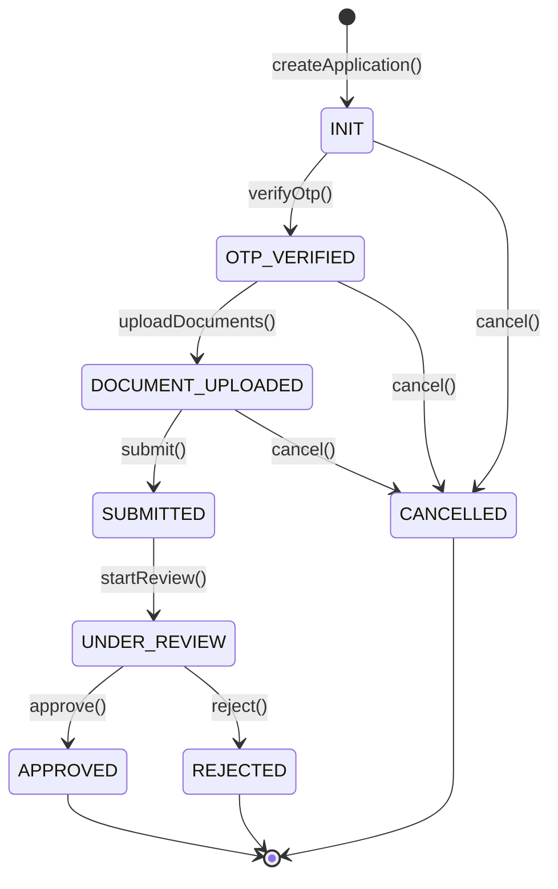
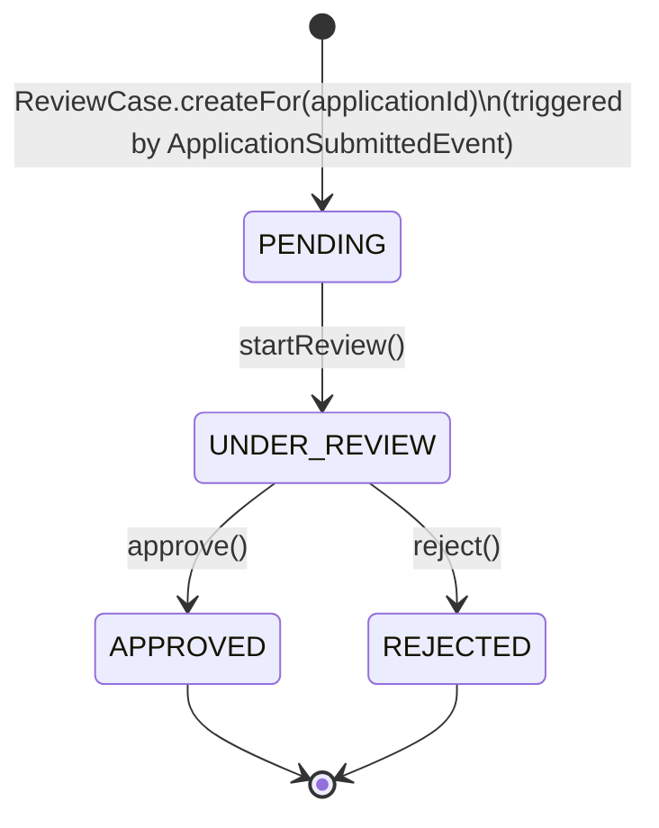
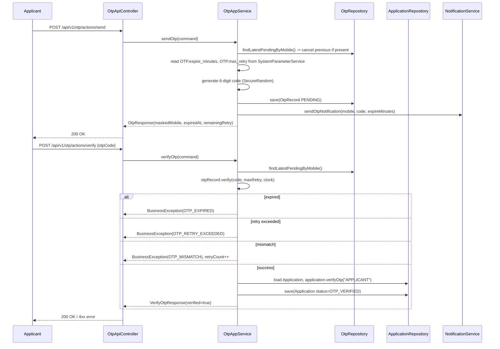
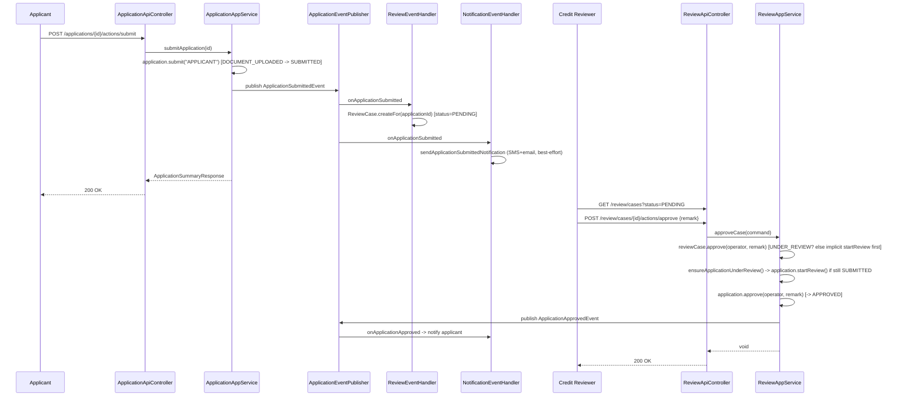

# 08 – Workflow Design

## 1. Application Status State Machine

`ApplicationStatus` enforces a strict, explicit transition table (`ALLOWED_TRANSITIONS` in the enum itself —
see `04-domain-model.md` §3). Any other transition throws `WorkflowException` (HTTP `409`,
`INVALID_WORKFLOW_TRANSITION`).

Notes:

- `DOCUMENT_UPLOADED` is also a **valid self-loop target** in practice: `Application.uploadDocuments()`
  permits being called again while already in `DOCUMENT_UPLOADED` (to add more documents), without that
  being a *status transition* — it only appends to `documentInfos` once already in that status.

- `CANCELLED`, `APPROVED`, and `REJECTED` are terminal; no further transition is defined from them.
- `startReview()` is triggered automatically as part of the **review approve/reject flow**
  (`ReviewAppService.ensureApplicationUnderReview`) — a reviewer does not need to call a separate "start
  review" step on the *application* before approving/rejecting; calling `ReviewApiController`'s approve or
  reject endpoint transparently drives the application from `SUBMITTED` to `UNDER_REVIEW` to
  `APPROVED`/`REJECTED` within the same use case if needed. The explicit `startReview` web/API action exists
  primarily for the **review case's own** `PENDING → UNDER_REVIEW` transition (see §2) and to let a reviewer
  mark a case as "being worked on" before a final decision.

## 2. Review Case Status State Machine

`ReviewCase.reviewStatus` (`ReviewStatus`) is a second, related but independent state machine:

`addRemark()` is allowed in any `ReviewStatus` and does not change status.

## 3. Combined Lifecycle (Application ↔ ReviewCase)

| Application status | Typical ReviewCase status | Trigger |
| --- | --- | --- |
| `INIT` | *(no review case yet)* | `createApplication` |
| `OTP_VERIFIED` | *(no review case yet)* | `verifyOtp` |
| `DOCUMENT_UPLOADED` | *(no review case yet)* | `uploadDocuments` |
| `SUBMITTED` | `PENDING` | `submit` → publishes `ApplicationSubmittedEvent` → `ReviewEventHandler` creates the `ReviewCase` |
| `UNDER_REVIEW` | `UNDER_REVIEW` | reviewer calls `startReview`, or implicitly via approve/reject |
| `APPROVED` | `APPROVED` | reviewer calls `approveCase` |
| `REJECTED` | `REJECTED` | reviewer calls `rejectCase` |
| `CANCELLED` | *(unaffected — review case, if any, is left as-is)* | applicant calls `cancelApplication` |

## 4. End-to-End Sequence: OTP Verification

Precedence inside `OtpRecord.verify()` is significant and intentional: **expiry is checked first** (and
marks the record `EXPIRED` as a side effect even on a verify attempt), **then retry-limit**, **then code
match** (which increments `retryCount` on mismatch). This ordering means a user who waits too long always
gets `OTP_EXPIRED` rather than a stale `OTP_MISMATCH`, and a user who has exhausted retries gets a clear
`OTP_RETRY_EXCEEDED` rather than one more confusing mismatch message.

## 5. End-to-End Sequence: Submit → Auto Review Case → Approve

## 6. Failure Handling Within Workflows

- Every aggregate transition method validates the precondition itself and throws `WorkflowException`
  (mapped to HTTP `409`) on violation — controllers and application services never pre-check status with
  `if` statements; they simply call the method and let the domain enforce the rule. This keeps the rule in
  exactly one place.

- Notification failures (`NotificationEventHandler`) are caught and logged (`log.warn`) rather than
  propagated — a failed SMS/email must never roll back or fail the underlying workflow transition, since the
  transition is the business-critical fact and the notification is a best-effort side effect.

- `ReviewEventHandler.onApplicationSubmitted` runs as a default (synchronous, same-transaction-boundary)
  Spring `@EventListener`. If review-case creation were to fail, it would currently roll back the triggering
  transaction along with the application submission — this coupling is called out as a improvement
  opportunity in `20-maintenance-and-future-enhancement.md` (candidate: `@TransactionalEventListener(phase =
  AFTER_COMMIT)`).
