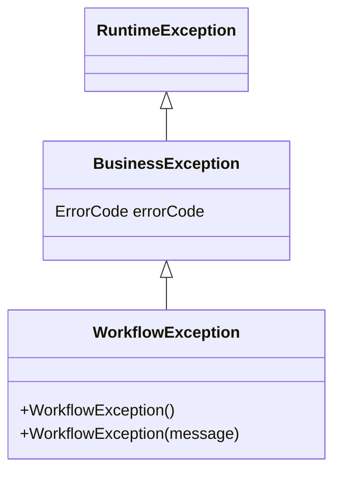

# 10 – Error Handling

## 1. Design Goal

Every error in the system — validation, business rule violation, security, or unexpected system failure —
must surface to the API caller through the **same envelope shape** (`ApiResponse<T>` with `success=false`),
so client code only ever needs one parsing path. This is implemented entirely through a single
`@RestControllerAdvice`: `presentation.api.advice.GlobalExceptionHandler`.

## 2. Exception Hierarchy



- `BusinessException` is the base type for every expected, named business failure. It always carries an
  `ErrorCode` and an optional human-readable message.
- `WorkflowException` is a specialization that always uses `ErrorCode.INVALID_WORKFLOW_TRANSITION` — used
  exclusively by `ApplicationStatus`/`ReviewStatus` transition guards (see `08-workflow-design.md`).
- Anything **not** a `BusinessException` (a `NullPointerException`, a database connectivity failure, etc.) is
  caught by the catch-all `Exception` handler, logged at `ERROR` with full stack trace, and reported to the
  client as a generic `SYSTEM_ERROR` with no internal detail leaked.

## 3. `ErrorCode` Catalogue

| `ErrorCode` | HTTP Status | Typical Trigger |
| --- | --- | --- |
| `VALIDATION_FAILED` | 400 | `@Valid` constraint violation (`MethodArgumentNotValidException`) |
| `INVALID_WORKFLOW_TRANSITION` | 409 | `Application`/`ReviewCase` transition guard |
| `APPLICATION_ALREADY_SUBMITTED` | 400 *(default branch)* | Reserved for explicit double-submit detection |
| `OTP_EXPIRED` | 400 *(default branch)* | `OtpRecord.verify` — code expired |
| `OTP_MISMATCH` | 400 *(default branch)* | `OtpRecord.verify` — wrong code |
| `OTP_RETRY_EXCEEDED` | 400 *(default branch)* | `OtpRecord.verify` — too many attempts |
| `APPLICATION_NOT_FOUND` | 404 | Unknown `applicationId` |
| `REVIEW_CASE_NOT_FOUND` | 404 | Unknown `reviewCaseId` |
| `PRODUCT_NOT_FOUND` | 404 | Unknown/disabled `cardProductId` |
| `PARAMETER_NOT_FOUND` | 404 | Unknown system parameter group/key or ID |
| `NOT_FOUND` | 404 | Generic not-found (e.g. unknown `userId`) |
| `DUPLICATE_USERNAME` | 409 | `UserAppService.createUser` with an existing username |
| `IDEMPOTENCY_KEY_CONFLICT` | 409 | Same `Idempotency-Key` reused with a different request body |
| `IDEMPOTENCY_KEY_IN_PROGRESS` | 409 | Same `Idempotency-Key` already being processed concurrently |
| `DOCUMENT_UPLOAD_FAILED` | 400 *(default branch)* | Empty file, disallowed extension, oversized file, I/O failure |
| `INCOMPLETE_DOCUMENTS` | 400 *(default branch)* | `Application.submit()` called without all required `DocumentType` values uploaded |
| `UNAUTHORIZED` | 401 | No/invalid authentication |
| `FORBIDDEN` | 403 | Authenticated but insufficient role |
| `SYSTEM_ERROR` | 500 | Any unhandled exception |

> **Implementation note:** `GlobalExceptionHandler.handleBusinessException` uses a Java `switch` expression
> with three explicit groups (`CONFLICT` for the three 409-style codes, `NOT_FOUND` for the five
> `*_NOT_FOUND`/`NOT_FOUND` codes, `default → BAD_REQUEST` for everything else).

## 4. Exception → Response Mapping

| Exception | Handler method | HTTP Status | Notes |
| --- | --- | --- | --- |
| `BusinessException` | `handleBusinessException` | switch on `ErrorCode` (see §3) | `ApiResponse.error(code, message, null)` |
| `WorkflowException` | `handleWorkflowException` | 409 | Always `INVALID_WORKFLOW_TRANSITION`, even if a subclass somehow carried a different code |
| `MethodArgumentNotValidException` | `handleValidationException` | 400 | Populates `fieldErrors: [{field, message}]` from `BindingResult` |
| `AccessDeniedException` (Spring Security) | `handleAccessDeniedException` | 403 | `ApiResponse.error(FORBIDDEN)` |
| `AuthenticationException` (Spring Security) | `handleAuthenticationException` | 401 | `ApiResponse.error(UNAUTHORIZED)` |
| `Exception` (catch-all) | `handleException` | 500 | Logged via `log.error("Unhandled exception", ex)`; client sees only `SYSTEM_ERROR` |

## 5. Response Envelope

```java
public record ApiResponse<T>(
        boolean success,
        T data,
        String errorCode,
        String message,
        List<FieldErrorDetail> fieldErrors,
        LocalDateTime timestamp
) {
    public static <T> ApiResponse<T> success(T data) { ... }
    public static <T> ApiResponse<T> success(T data, String message) { ... }
    public static <T> ApiResponse<T> error(ErrorCode code) { ... }
    public static <T> ApiResponse<T> error(ErrorCode code, String message, List<FieldErrorDetail> fieldErrors) { ... }
}
```

`errorCode` is always the enum constant **name** (e.g. `"APPLICATION_NOT_FOUND"`), making it a stable,
machine-checkable contract independent of the human-readable `message`, which may change wording over time.

## 6. Adding a New Error Code (Checklist)

1. Add the constant to `common.exception.ErrorCode`.
2. Throw `new BusinessException(ErrorCode.YOUR_CODE, "human readable detail")` (or a more specific subclass
   if the error represents a recurring structural concept like workflow transitions).
3. If the new code should map to something other than the default `400`, add it to the appropriate `case`
   group in `GlobalExceptionHandler.handleBusinessException` (`CONFLICT` or `NOT_FOUND`).
4. Document the new code in §3 of this file and in the relevant endpoint's section of
   `06-api-specification.md`.
5. Add a unit test asserting both the thrown exception and (for at least one endpoint) the resulting HTTP
   status/body, per `16-testing-strategy.md`.

## 7. Field-Level Validation Errors

`FieldErrorDetail(field, message)` mirrors the structure Bean Validation already provides, kept as a plain
record so the API contract is decoupled from Spring's `FieldError` type. Nested validation (`@Valid` on
`ApplicantRequest.address`) reports the dotted path automatically (e.g. `"applicant.address.zipCode"`).

## 8. What Error Handling Deliberately Does NOT Do

- It does not include a stack trace, exception class name, or any internal detail in the response body for
  unhandled exceptions — only the generic `SYSTEM_ERROR` code, to avoid leaking implementation details to a
  caller.
- It does not retry or auto-correct invalid requests; every error is terminal for that request and the
  caller must resubmit with corrected input (with the exception of the idempotency mechanism, which is a
  request-replay concern, not an error-recovery concern — see `09-module-design.md` §3 for how
  `IdempotencyService` interacts with this layer).
