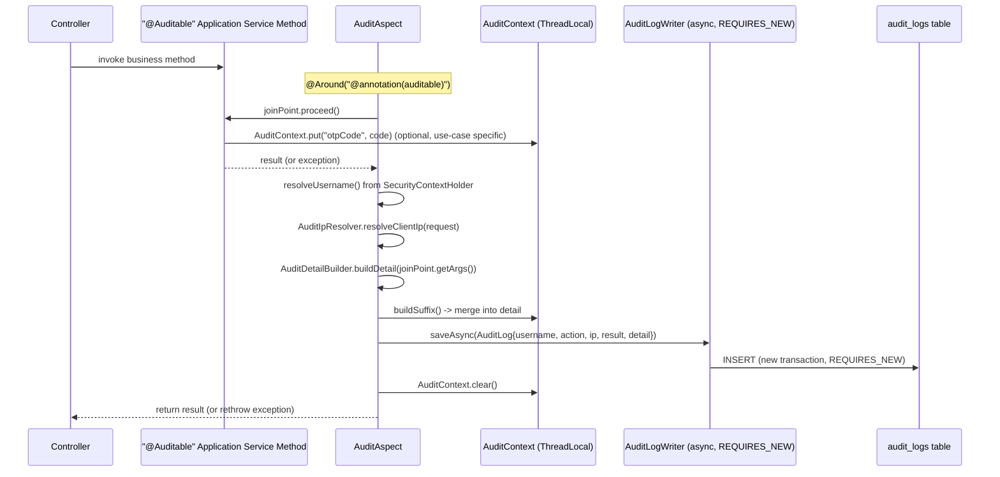

# 11 – Audit Logging

## 1. Two Audit Paths

The platform writes to `audit_logs` through **two distinct mechanisms**, each appropriate to where the
event originates:

| Path                  | Used for                                                                                                      | Mechanism                                                                                                                                 |
| --------------------- | ------------------------------------------------------------------------------------------------------------- | ----------------------------------------------------------------------------------------------------------------------------------------- |
| **Declarative (AOP)** | Application-layer use cases: OTP send/verify, application submit/cancel, review approve/reject, report export | `@Auditable` annotation + `AuditAspect` (Spring AOP `@Around` advice)                                                                     |
| **Direct/manual**     | Authentication lifecycle: login success/failure, logout                                                       | Security handlers (`LoginSuccessHandler`, `LoginFailureHandler`, `LogoutSuccessHandlerImpl`) call `AuditLogRepository.save(...)` directly |

The direct path exists because authentication events happen **outside** any `@Auditable`-annotated
application-service method invocation (they occur inside the Spring Security filter chain, before a
controller method is ever reached), so AOP around-advice has no join point to attach to.

## 2. Declarative Audit Flow

Key properties of this design:

- **Audit logging never blocks or fails the business operation.** `AuditLogWriter.saveAsync` is `@Async` and
  wraps the actual insert in its own `REQUIRES_NEW` transaction via `TransactionTemplate`; any persistence
  failure is caught and only logged at `WARN`, never rethrown.

- **Audit entries are written even on failure.** The `@Around` advice's `catch (Throwable ex)` block still
  writes an audit entry (with `result=FAILURE` and the exception message as `detail`), and remaps the action
  for one special case: a failed `OTP_VERIFY_SUCCESS` attempt is recorded as `OTP_VERIFY_FAILED` instead, so
  the audit trail distinguishes verify *attempts* from verify *successes* without needing two separate
  annotations on the same method.

- **`AuditContext` is a per-request escape hatch.** It lets a use case (currently only `OtpAppService.sendOtp`)
  attach supplemental detail that is not naturally available from the method's *arguments* alone (the
  generated OTP code is created *inside* the method, not passed in) — without leaking that responsibility
  into `AuditAspect` itself. It is unconditionally cleared in the aspect's `finally` block to prevent leaking
  state across requests on a pooled thread.

## 3. Detail Sanitization (`AuditDetailBuilder`)

`AuditDetailBuilder.buildDetail(args)` inspects each method argument and extracts only safe, useful fields:

| Argument shape                             | Extracted detail                                                                           |
| ------------------------------------------ | ------------------------------------------------------------------------------------------ |
| `SendOtpCommand`                           | `applicationId`, `mobile` (masked via `MaskingUtil.maskMobile`), `purpose`                 |
| `VerifyOtpCommand`                         | `applicationId`, `mobile` (masked)                                                         |
| `ApproveCaseCommand` / `RejectCaseCommand` | `reviewCaseId`, `operator`                                                                 |
| `GenerateReportRequest`                    | `reportDate`, `format`                                                                     |
| Plain `String` starting with `APP-`        | `applicationId=<value>`                                                                    |
| Plain `String` starting with `RC-`         | `reviewCaseId=<value>`                                                                     |
| Plain `String` matching `^\d{6}$`          | `otp=******` (never the real value)                                                        |
| Any other value                            | `value=<sanitized>` only if it does not look like a password/OTP/national-ID field by name |

A final regex pass (`sanitize`) defensively redacts `password=...`, `otpCode=...`, `nationalId=...`
substrings even if a future caller accidentally passes a raw object whose `toString()` contains one of
those — defense in depth on top of the type-specific extraction above.

## 4. `AuditAction` Catalogue

| Action                                                               | Triggered by                                     |
| -------------------------------------------------------------------- | ------------------------------------------------ |
| `USER_LOGIN` / `USER_LOGIN_FAILED` / `USER_LOGOUT`                   | Spring Security handlers (direct path)           |
| `APPLICATION_SUBMIT`                                                 | `ApplicationAppService.submitApplication`        |
| `APPLICATION_CANCEL`                                                 | `ApplicationAppService.cancelApplication`        |
| `APPLICATION_APPROVE`                                                | `ReviewAppService.approveCase`                   |
| `APPLICATION_REJECT`                                                 | `ReviewAppService.rejectCase`                    |
| `OTP_SEND`                                                           | `OtpAppService.sendOtp`                          |
| `OTP_VERIFY_SUCCESS` (or remapped to `OTP_VERIFY_FAILED` on failure) | `OtpAppService.verifyOtp`                        |
| `REPORT_EXPORT`                                                      | `ReportAppService.generateDailyStatisticsReport` |
| `DOCUMENT_UPLOAD`                                                    | `ApplicationAppService.uploadDocuments`          |

## 5. Audit Log Query API

`AuditLogService.search(username, action, dateFrom, dateTo, pageable)` backs
`GET /api/v1/admin/audit-logs`. Defaults: when `dateFrom`/`dateTo` are omitted, the search effectively spans
`1970-01-01` to `2099-12-31`, i.e. "all time" — a pragmatic stand-in for an open-ended range query that keeps
the underlying `AuditLogRepository.search` query signature simple (always bounded by two timestamps) without
needing a separate unbounded-query code path.

## 6. Notification Logs Are Derived, Not Separate

There is **no dedicated `notifications` table**. `AuditLogService.searchNotificationAttempts` simply filters
`audit_logs` by a fixed set of notification-adjacent actions (`OTP_SEND`, `APPLICATION_SUBMIT`,
`APPLICATION_APPROVE`, `APPLICATION_REJECT`) and additionally extracts the OTP code (still masked at the
storage layer logic, surfaced from `AuditContext` detail) for `OTP_SEND` rows via a regex
(`OTP_CODE_PATTERN`). This is a deliberate simplification: in this fictional project, "a notification was
sent" and "an auditable business action occurred" are treated as the same fact, since every notification is
triggered by exactly one auditable action. A production system integrating with a real SMS/email provider
would likely want a true `notification_logs` table tracking delivery status per channel — see
`20-maintenance-and-future-enhancement.md`.

## 7. PII & Secret Handling Summary

| Data          | Where masked                                                                                                                                                                                                            |
| ------------- | ----------------------------------------------------------------------------------------------------------------------------------------------------------------------------------------------------------------------- |
| Mobile number | `MaskingUtil.maskMobile` before entering any `AuditDetailBuilder` output                                                                                                                                                |
| National ID   | `MaskingUtil.maskNationalId`; also defensively regex-matched in `sanitize`                                                                                                                                              |
| Password      | Never passed into any `@Auditable` method argument today; regex-redacted defensively anyway                                                                                                                             |
| OTP code      | Never logged in plaintext outside the `AuditContext`-driven admin "Notification Logs" convenience display, which exists only because this project uses mock SMS/email (no real channel exists to view the code through) |
