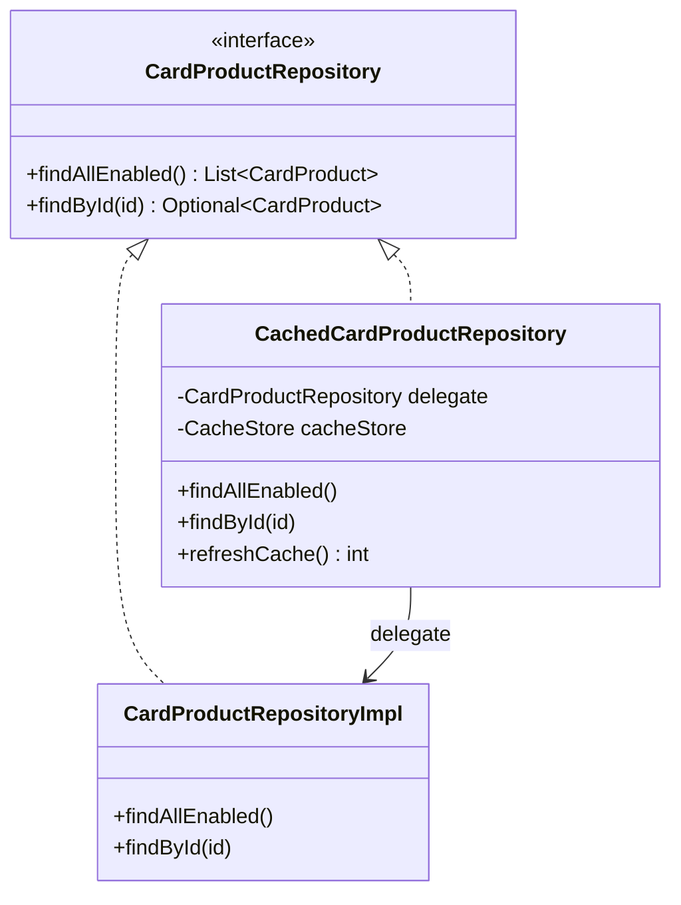

# 12 – Cache Design

## 1. Scope and Intent

The platform caches two categories of read-heavy, low-churn data:

1. **Enabled card products** (`card_products` + `product_features`) — read on every public product listing
   and every application creation.

2. **System parameters** (`system_parameters`) — read on every OTP send/verify, document upload validation,
   and cache TTL resolution itself.

Both are good caching candidates: read-to-write ratio is high, staleness of a few hours is acceptable
business-wise, and an administrator has an explicit manual "refresh now" escape hatch for whenever staleness
is *not* acceptable (e.g. right after editing a parameter).

> **Note on Redis:** the project depends on `spring-boot-starter-data-redis` and ships a working
> `RedisIdempotencyStore`, but the **application-level cache described in this document is currently
> in-process only** (`InMemoryCacheStore`), not Redis-backed. This is intentional for a single-instance
> deployment and is called out explicitly in `20-maintenance-and-future-enhancement.md` as the natural next
> step if the application is ever horizontally scaled (a `RedisCacheStore` implementing the same `CacheStore`
> port would be a drop-in replacement, mirroring exactly how `RedisIdempotencyStore` was added alongside
> `InMemoryIdempotencyStore`).

## 2. Core Abstraction

```java
public interface CacheStore {
    <V> Optional<V> get(String key);
    <V> void put(String key, V value, long ttlSeconds);
    void evict(String key);
    void evictAll();
    Set<String> keys();
}

```

`InMemoryCacheStore` implements this with a `ConcurrentHashMap<String, CacheEntry<?>>`, where `CacheEntry<V>`
is `record CacheEntry<V>(V value, LocalDateTime expiresAt)` with `isExpired(Clock)`. A `@Scheduled(fixedDelay
= 60_000)` method (`cleanupExpiredEntries`) sweeps expired entries every minute so the map does not grow
unbounded with stale data between reads.

## 3. Cache Keys

| Key pattern | Example | Used for |
| --- | --- | --- |
| `sys_param:<group>:<key>` | `sys_param:OTP:expire_minutes` | Individual system parameter values |
| `card_products:all` | — | The full enabled product list |
| `card_product:<productId>` | `card_product:CARD-001` | A single product lookup |

`CacheKeys` centralizes these patterns so no call site builds a cache key by hand.

## 4. TTL Resolution (`CacheTtlProvider`)

```java
getTtlSeconds() // reads system_parameters[CACHE.ttl_seconds], default 21_600 (6 hours)

```

This creates a small, intentional bootstrapping dependency: the cache's own TTL is itself a cached-able
system parameter, read through the **uncached** `SystemParameterRepository` directly (not through
`SystemParameterService.getValue`, which would recursively need a TTL to cache itself with) — avoiding any
circular caching logic.

## 5. Caching Decorator Pattern (`CachedCardProductRepository`)

```java
@Primary
@Component
public class CachedCardProductRepository implements CardProductRepository {
    private final @Qualifier("cardProductRepositoryImpl") CardProductRepository delegate;
    ...
}

```

This is the textbook **Decorator pattern** applied to a hexagonal repository port:

- `CardProductRepositoryImpl` (the real JPA adapter) is registered under the qualifier
  `cardProductRepositoryImpl`.

- `CachedCardProductRepository` wraps it, is marked `@Primary`, and is what every application service
  actually receives when it asks Spring to inject a `CardProductRepository`.

- Application/domain code is **completely unaware** caching exists — it just calls
  `cardProductRepository.findAllEnabled()` / `findById(id)` as if talking to the database directly.

- `refreshCache()` (used by both the admin API and the scheduler) evicts all `card_product*` keys and
  eagerly repopulates them from the delegate in one pass, so the *next* read is always a cache hit rather
  than a cold miss immediately after a refresh.



## 6. System Parameter Caching

`SystemParameterService.getValue(group, key)` checks `CacheStore` first; on a miss, it loads from
`SystemParameterRepository`, populates the cache with the resolved TTL, and returns the value. `refreshCache()`
evicts every `sys_param:*` key and eagerly reloads all **enabled** parameters — used by both the admin "refresh
system parameters" action and `CacheRefreshScheduler`.

## 7. Admin Cache API

| Endpoint | Effect |
| --- | --- |
| `POST /api/v1/admin/cache/refresh` | `refreshSystemParameters() + refreshProducts()`, returns total refreshed count |
| `POST /api/v1/admin/cache/refresh/system-parameters` | Parameters only |
| `POST /api/v1/admin/cache/refresh/products` | Products only |
| `GET /api/v1/admin/cache/stats` | `{ keyCount, estimatedMemoryBytes }` — a rough estimate (`key.length()*2 + value.toString().length()*2` per entry), intended as an operational sanity signal, not a precise memory profiler |

## 8. Cache Invalidation Strategy

| Trigger | Effect |
| --- | --- |
| TTL expiry | Lazy — entry simply returns empty on next `get()`, removed in that call (`InMemoryCacheStore.get`) |
| Background sweep | Active — `@Scheduled` cleanup every 60s removes already-expired entries proactively |
| Scheduled refresh | `CacheRefreshScheduler` runs on `tlbank.scheduler.cache-refresh.cron` (default every 6 hours in `staging`/`prod`-style config) |
| Manual admin action | Immediate, via the Admin Cache API or web UI |
| **Write-through on update?** | **Yes (Sprint 17)** — `SystemParameterService.update()` evicts the corresponding `sys_param:<group>:<key>` cache entry immediately after persisting, so the next `getValue()` read reflects the new value without waiting for TTL expiry or a manual refresh. |
