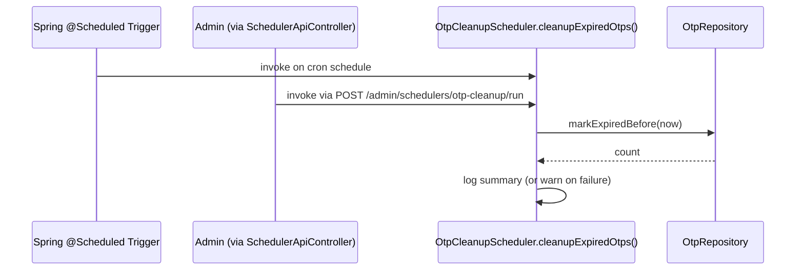

# 13 – Scheduler Design

## 1. Mechanism

All scheduled jobs use Spring's native `@Scheduled` annotation with cron expressions sourced from
configuration (`tlbank.scheduler.*.cron`), enabled via `@EnableScheduling` (declared, somewhat redundantly,
in both `common.config.SchedulingConfig` and `common.config.SchedulerConfig` — see
`20-maintenance-and-future-enhancement.md` for the consolidation note) and a dedicated scheduling thread pool
(`spring.task.scheduling.pool.size: 3`).

No external scheduler (Quartz, a cron-as-a-service product, Kubernetes CronJob) is used — appropriate for a
single-instance modular monolith where in-process `@Scheduled` is simplest and sufficient.

## 2. Jobs

| Job              | Class                      | Cron property                         | Default (base `application.yml`)  | Dev override (`application-dev.yml`)                                 |
| ---------------- | -------------------------- | ------------------------------------- | --------------------------------- | -------------------------------------------------------------------- |
| OTP cleanup      | `OtpCleanupScheduler`      | `tlbank.scheduler.otp-cleanup.cron`   | `0 */5 * * * *` (every 5 minutes) | `0 */1 * * * *` (every 1 minute, for fast feedback while developing) |
| Cache refresh    | `CacheRefreshScheduler`    | `tlbank.scheduler.cache-refresh.cron` | `0 0 */6 * * *` (every 6 hours)   | inherited                                                            |
| Daily statistics | `DailyStatisticsScheduler` | `tlbank.scheduler.daily-stats.cron`   | `0 0 1 * * *` (01:00 daily)       | inherited                                                            |

## 3. Job Detail

### 3.1 `OtpCleanupScheduler`

```
@Scheduled(cron = "${tlbank.scheduler.otp-cleanup.cron}")
@Transactional
public void cleanupExpiredOtps()

```

Calls `OtpRepository.markExpiredBefore(LocalDateTime.now(clock))`, which bulk-updates any `PENDING`
`otp_records` row whose `expired_at` has passed to `status = EXPIRED`. This keeps `OtpAppService.sendOtp`'s
"cancel the latest pending OTP for this mobile" logic working against a clean dataset, and keeps the
`otp_records` table from accumulating an unbounded number of effectively-dead `PENDING` rows that would
otherwise need to be filtered at every read.

### 3.2 `CacheRefreshScheduler`

```
@Scheduled(cron = "${tlbank.scheduler.cache-refresh.cron}")
public void refreshCaches()

```

Calls `SystemParameterService.refreshCache()` then evicts every `card_product*` cache key directly (it does
**not** eagerly repopulate products the way the admin-triggered `CachedCardProductRepository.refreshCache()`
does — the next product read after this job runs will be a cache miss that repopulates lazily). This
asymmetry is intentional: parameters are read far more frequently and on latency-sensitive paths (every OTP
operation), so they are proactively warmed; products are read less often and a single cold miss is
acceptable.

### 3.3 `DailyStatisticsScheduler`

```
@Scheduled(cron = "${tlbank.scheduler.daily-stats.cron}")
public void generateDailyStatistics()   // defaults to "yesterday"

public void generateDailyStatistics(LocalDate date)   // explicit date, reused by the manual trigger API

```

Builds a `DailyStatisticsData` via `ReportDataService` and **logs** the summary
(`total`, `statusCounts`, `productCounts`) at `INFO`. It does **not** generate or store an Excel/PDF file —
file generation is an on-demand, synchronous use case (`ReportAppService`, see `14-report-design.md`)
triggered by an administrator who actually wants to download a report. The scheduled job's purpose is purely
to surface a daily operational signal in the logs/observability pipeline, useful for alerting or dashboards
that tail application logs.

## 4. Manual Trigger API

Every job can also be invoked on demand by an administrator, reusing the exact same method the cron trigger
calls — there is no duplicated logic between "scheduled" and "manual" execution paths:

| Endpoint                                                        | Calls                                                    |
| --------------------------------------------------------------- | -------------------------------------------------------- |
| `POST /api/v1/admin/schedulers/otp-cleanup/run`                 | `OtpCleanupScheduler.cleanupExpiredOtps()`               |
| `POST /api/v1/admin/schedulers/cache-refresh/run`               | `CacheRefreshScheduler.refreshCaches()`                  |
| `POST /api/v1/admin/schedulers/daily-stats/run?date=YYYY-MM-DD` | `DailyStatisticsScheduler.generateDailyStatistics(date)` |

## 5. Error Handling Pattern

Every scheduled method follows the identical defensive shape:

```java
long start = System.currentTimeMillis();
try {
    log.info("[SCHEDULER] <job> started");
    // do work
    log.info("[SCHEDULER] <job> completed in {}ms. <result summary>", elapsed, ...);
} catch (Exception ex) {
    log.warn("[SCHEDULER] <job> failed after {}ms: {}", elapsed, ex.getMessage(), ex);
}

```

A failing scheduled job **never propagates the exception** — Spring's `@Scheduled` infrastructure would
otherwise log it generically and, more importantly, an uncaught exception in one run must never prevent
*future* scheduled executions of the same job. Catching broadly here, logging with full context, and moving
on is the correct pattern for fire-and-forget background jobs (as opposed to user-facing request handling,
where exceptions should propagate to the global exception handler — see `10-error-handling.md`).

## 6. Sequence: Scheduled vs. Manual Execution Share One Code Path


