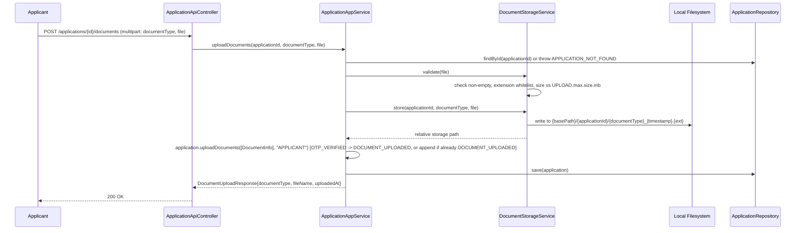

# 15 – File Upload Design

## 1. Purpose

Allow applicants to attach supporting documents (national ID, income proof, residence proof) to a credit
card application, with server-side validation and durable storage of the file plus its metadata.

## 2. Document Types

```java
public enum DocumentType {
    NATIONAL_ID,
    INCOME_PROOF,
    RESIDENCE_PROOF
}

```

The web upload page (`ApplicationWebController#uploadPage`) computes
`allDocumentsUploaded = uploadedTypes.containsAll(Set.of(DocumentType.values()))` to decide when to enable
the "Continue to Submit" action — i.e. **all three document types are required** before an application can
be submitted. The same rule is enforced in the domain layer: `Application.submit()` throws
`BusinessException(INCOMPLETE_DOCUMENTS)` when any `DocumentType` is missing, so the REST API cannot bypass
the UI check (Sprint 17).

## 3. Upload Flow



## 4. Validation Rules (`LocalDocumentStorageService.validate`)

| Rule | Enforcement |
| --- | --- |
| File must not be null/empty | `BusinessException(DOCUMENT_UPLOAD_FAILED, "File must not be empty")` |
| Extension must be one of `jpg`, `jpeg`, `png`, `pdf` | Case-insensitive check against `ALLOWED_EXTENSIONS`; otherwise `DOCUMENT_UPLOAD_FAILED` |
| File size must not exceed the configured maximum | `systemParameterService.getIntValue("UPLOAD", "max.size.mb", 10)` × 1MB, compared to `file.getSize()`; otherwise `DOCUMENT_UPLOAD_FAILED` |
| Filename must contain an extension at all | Defensive check before extension extraction; `DOCUMENT_UPLOAD_FAILED` if absent |

In addition, Spring's own multipart limits act as a first line of defense before this code even runs:
`spring.servlet.multipart.max-file-size: 10MB`, `max-request-size: 15MB` (`application.yml`).

## 5. Storage Layout

```
{tlbank.upload.base-path}/
└── {applicationId}/
    ├── NATIONAL_ID_20260628101501.pdf
    ├── INCOME_PROOF_20260628101522.jpg
    └── RESIDENCE_PROOF_20260628101545.png

```

- Base path resolved per profile: `./uploads` (default), `${user.dir}/uploads/dev` (dev),
  `${APP_UPLOAD_PATH:/app/uploads}` (staging/prod, a Docker named volume — see `17-deployment-design.md`).

- Created eagerly on startup (`@PostConstruct initUploadDirectory`), failing fast with an
  `IllegalStateException` if the directory cannot be created.

- Filenames are server-generated (`{documentType}_{yyyyMMddHHmmss}.{ext}`), **never** the raw client-supplied
  filename — this avoids path traversal and filename-collision concerns entirely, while the *original*
  client filename is still preserved separately in `application_documents.file_name` for display purposes.

- A relative path (`{applicationId}/{generatedFileName}`) is what gets persisted in
  `application_documents.file_path` and returned internally — never an absolute filesystem path — keeping
  storage location fully decoupled from any consumer of that metadata.

## 6. Domain Integration

`DocumentInfo` (value object: `documentType`, `fileName`, `storagePath`, `fileSize`, `uploadedAt`) is appended
to the `Application` aggregate's `documentInfos` list via `Application.uploadDocuments(docs, operator)`,
which also drives the `OTP_VERIFIED → DOCUMENT_UPLOADED` status transition the **first** time it's called,
and simply appends on subsequent calls while already `DOCUMENT_UPLOADED` (see `08-workflow-design.md`).

## 7. Port/Adapter Separation

```java
public interface DocumentStorageService {
    String store(String applicationId, DocumentType documentType, MultipartFile file);
    void validate(MultipartFile file);
}

```

`LocalDocumentStorageService` is the only adapter today. Swapping to S3/MinIO/Azure Blob in the future
requires only a new adapter implementing this same port (see `20-maintenance-and-future-enhancement.md`) —
no change to `ApplicationAppService` or any controller.

## 8. Security Considerations

- Extension whitelist + size limit mitigate the most common upload-abuse vectors (arbitrary executable
  upload, disk exhaustion).

- Server-generated filenames eliminate path traversal via crafted filenames.
- Document upload endpoints are intentionally `permitAll()` (no login required) because applicants have no
  account — the *only* binding context that authorizes an upload is knowledge of the `applicationId`, which
  is itself a long, randomized, timestamp-seeded identifier (`APP-yyyyMMddHHmmss-NNNN`), not a small
  enumerable integer. A production system would likely add a short-lived upload token issued at OTP
  verification time as a stronger binding — noted as a future enhancement.
