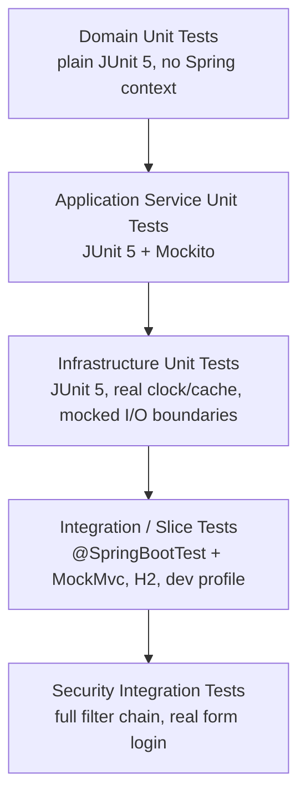

# 16 – Testing Strategy

## 1. Test Pyramid



The project follows this pyramid closely: the largest test count is plain domain unit tests (cheapest, fastest,
zero Spring startup cost), narrowing to a small number of full-stack `@SpringBootTest` integration tests that
exercise real HTTP + security + persistence end-to-end against H2.

## 2. Test Categories and Examples (Actual Test Classes)

| Category | Example test classes | Tooling |
| --- | --- | --- |
| Domain aggregate / value object | `ApplicationTest`, `ApplicationStatusTest`, `ApplicationIdTest`, `AddressTest`, `EmailTest`, `MobileNumberTest`, `OtpRecordTest`, `ReviewCaseTest`, `WorkflowDomainServiceTest` | JUnit 5 only — no `@SpringBootTest`, no mocks needed since aggregates have no collaborators |
| Application service unit | `ApplicationAppServiceTest`, `OtpAppServiceTest`, `ReviewAppServiceTest`, `UserAppServiceTest`, `SystemParameterServiceTest`, `SystemParameterServiceCacheTest`, `ReportAppServiceTest`, `AuditLogServiceTest`, `IdempotencyServiceTest`, `NotificationServiceImplTest` | JUnit 5 + Mockito (`@ExtendWith(MockitoExtension.class)`, `@Mock` repository ports) |
| Common / cross-cutting | `AuditAspectTest` (+ `AuditableTestService` fixture) | JUnit 5 + Mockito, verifies AOP behavior against a minimal annotated test service |
| Infrastructure unit | `InMemoryCacheStoreTest`, `LocalDocumentStorageServiceTest`, `ExcelReportGeneratorTest`, `OtpCleanupSchedulerTest`, `CacheRefreshSchedulerTest`, `NotificationEventHandlerTest` | JUnit 5, real implementations with a fixed `Clock` where time matters |
| Web/API slice | `ReviewApiControllerTest`, `NotificationLogApiControllerTest`, `AdminControllerTest`, `ApplicationWebControllerTest` | `@SpringBootTest` + `@AutoConfigureMockMvc` |
| Full-stack integration | `ApplicationFlowIntegrationTest`, `ReviewFlowIntegrationTest`, `ApplicationIdempotencyIntegrationTest`, `SecurityIntegrationTest` | `@SpringBootTest` + `@AutoConfigureMockMvc` + `@ActiveProfiles("dev")`, real H2 database, real Spring Security filter chain |
| Smoke test | `TlbankLendingApplicationTests` | `@SpringBootTest` — verifies the full context loads |

## 3. Conventions

- **Test database:** every `@SpringBootTest` activates the `dev` profile (`@ActiveProfiles("dev")`), which
  points at H2 in-memory with `MODE=MSSQLServer` and runs the same Flyway migrations as local development —
  there is **no Testcontainers/real-SQL-Server test path today** (see
  `20-maintenance-and-future-enhancement.md` for why that matters and what's recommended).
- **Fixed credentials in tests:** integration tests use a precomputed BCrypt hash constant
  (`BCRYPT_HASH`) rather than hashing at test-runtime, keeping tests fast and deterministic.
- **MockMvc over real HTTP:** all controller/integration tests drive the application through `MockMvc`
  rather than a real running server + HTTP client, which is faster and avoids port management, while still
  exercising the full Spring MVC + Security dispatch path.
- **CSRF handling in tests:** browser-facing endpoints under test use
  `SecurityMockMvcRequestPostProcessors.csrf()` explicitly where CSRF is enforced (non-`/api/**` paths).
- **One behavior per test method**, named `methodUnderTest_condition_expectedOutcome` (e.g.
  `createApplication_withSameIdempotencyKey_shouldReturnSameApplicationId`).
- **Sprint-tagged Javadoc:** several integration test classes carry a one-line class Javadoc naming the
  sprint that introduced the behavior (e.g. *"Integration tests verifying Sprint 2 security and login
  behaviour"*), which doubles as a changelog cross-reference back to
  `19-cursor-implementation-roadmap.md`.

## 4. What Each Layer Is Responsible For Proving

| Layer | Proves |
| --- | --- |
| Domain unit tests | State machine correctness (`ApplicationStatus.canTransitionTo` exhaustively), value object validation (rejects malformed `MobileNumber`/`Email`/`ApplicationId`), aggregate invariants (`OtpRecord.verify` precedence of expiry/retry/mismatch) |
| Application service unit tests | Correct orchestration: right repository calls made, right exception thrown for not-found/duplicate cases, right event published, masking applied before returning a response DTO — all without touching a real database |
| Infrastructure unit tests | Adapter correctness in isolation: cache TTL/expiry math, file validation rules, report byte-output non-emptiness/structure, scheduler error-swallowing behavior |
| Integration tests | That the full request lifecycle — controller → service → domain → repository → database — works together, including security enforcement, idempotency replay, and the cross-module event chain (submit → auto-create review case → notify) |

## 5. Mocking Policy

- **Domain aggregates are never mocked** — they have no collaborators to mock and constructing a real one is
  always cheap (`Application.builder()...build()`), so tests use the real object.
- **Repository ports are mocked** in application-service unit tests (`@Mock ApplicationRepository`, etc.) —
  this is the seam Clean Architecture is designed to make easy to test against.
- **External-facing infrastructure** (`SmsSender`, `EmailSender`) is mocked or its provided mock
  implementation is used directly — there is never a real network call in any test.
- **Time** is injected via the shared `Clock` bean (`CommonConfig.clock()`), allowing tests to construct a
  fixed `Clock.fixed(...)` where expiry/timestamp behavior must be deterministic, rather than sleeping or
  tolerating flaky `LocalDateTime.now()` comparisons.

## 6. Coverage Tooling (JaCoCo)

Configured directly in `pom.xml`:

```xml
<plugin>
    <groupId>org.jacoco</groupId>
    <artifactId>jacoco-maven-plugin</artifactId>
    <configuration>
        <excludes>
            <exclude>**/config/**</exclude>
            <exclude>**/dto/**</exclude>
            <exclude>**/*Application.class</exclude>
            <exclude>**/entity/**</exclude>
            <exclude>**/*Embeddable.class</exclude>
        </excludes>
    </configuration>
    <executions>
        <execution><id>prepare-agent</id><phase>test-compile</phase><goals><goal>prepare-agent</goal></goals></execution>
        <execution><id>report</id><phase>verify</phase><goals><goal>report</goal></goals></execution>
    </executions>
</plugin>
```

Excluded from coverage accounting: `*Config` classes (declarative wiring, not logic), DTOs/records (no
behavior to cover), the `@SpringBootApplication` entry point, JPA `*Entity`/`*Embeddable` classes (data
holders). This focuses the coverage signal on domain logic, application orchestration, and infrastructure
adapters with actual behavior — the places where a regression would matter.

Run locally: `./mvnw clean verify` produces `target/site/jacoco/index.html`.

## 7. Running Tests

```bash
./mvnw test                 # fast unit + integration tests against H2, no external services needed
./mvnw clean verify          # full build incl. JaCoCo report
```

No Docker, no SQL Server, and no Redis are required to run the full test suite — every test path that would
otherwise need Redis uses the `tlbank.idempotency.store=memory`-gated `InMemoryIdempotencyStore` in the
`dev`/test profile (see `application-dev.yml`), keeping CI fast and dependency-free.
