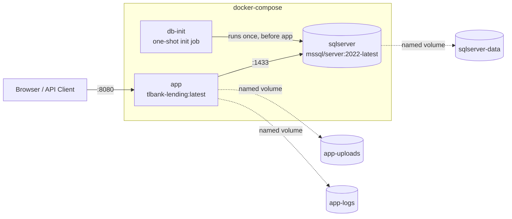

# 17 – Deployment Design

## 1. Deployment Topology



## 2. Build Artifact

| Item | Value |
|---|---|
| Build tool | Maven (`./mvnw clean package -DskipTests -Pstaging`) |
| Packaging | Executable fat JAR (`spring-boot-maven-plugin`), Lombok excluded from the repackaged JAR |
| Image base (build stage) | `eclipse-temurin:17-jdk-alpine` |
| Image base (runtime stage) | `eclipse-temurin:17-jre-alpine` |
| Runtime user | Non-root `tlbank` user/group, created explicitly in the Dockerfile |
| Exposed port | `8080` |
| JVM flags | `-XX:+UseContainerSupport -XX:MaxRAMPercentage=75.0 -Djava.security.egd=file:/dev/./urandom` |
| Volumes declared in image | `/app/uploads`, `/app/logs` |

```dockerfile
# docker/app/Dockerfile (canonical build — see note in §7 about the legacy root Dockerfile)
FROM eclipse-temurin:17-jdk-alpine AS builder
WORKDIR /workspace
COPY pom.xml . ; COPY src ./src ; COPY mvnw . ; COPY .mvn .mvn
RUN chmod +x mvnw && ./mvnw clean package -DskipTests -Pstaging

FROM eclipse-temurin:17-jre-alpine AS runtime
WORKDIR /app
RUN apk add --no-cache wget && addgroup -S tlbank && adduser -S tlbank -G tlbank
USER tlbank
COPY --from=builder /workspace/target/*.jar app.jar
VOLUME /app/uploads
VOLUME /app/logs
EXPOSE 8080
ENTRYPOINT ["java","-XX:+UseContainerSupport","-XX:MaxRAMPercentage=75.0", \
            "-Djava.security.egd=file:/dev/./urandom","-jar","app.jar"]
```

This is a standard two-stage build: the heavy JDK + Maven toolchain never ships in the final runtime image,
only the JRE and the built JAR — keeping the production image small and reducing attack surface.

## 3. `docker-compose.yml` Services

| Service | Image | Purpose | Health check |
|---|---|---|---|
| `sqlserver` | `mcr.microsoft.com/mssql/server:2022-latest` | The relational database | `sqlcmd ... SELECT 1` every 15s, 10 retries, 40s start period |
| `db-init` | Same SQL Server image, used as a one-shot client | Runs `01-init-database.sql` (creates `TLBankLending` DB + `tlbank_app` login) then `02-create-app-user.sql` (grants `db_owner` to `tlbank_app` inside that DB), then exits (`restart: "no"`) | n/a — gated on `sqlserver` being healthy |
| `app` | Built from `docker/app/Dockerfile` | The Spring Boot application | `wget -qO- http://localhost:8080/actuator/health`, 30s interval, 5 retries, 90s start period |

`app` declares `depends_on` with explicit conditions: `sqlserver: condition: service_healthy` and
`db-init: condition: service_completed_successfully` — guaranteeing the database and its application login
exist *before* Flyway runs on application startup.

Named volumes: `sqlserver-data` (DB files), `app-uploads` (uploaded documents — see
`15-file-upload-design.md`), `app-logs` (application logs). All on a dedicated bridge network
(`tlbank-network`).

## 4. Environment Variables

Sourced from a `.env` file (copy `.env.example` → `.env`, **never commit `.env` with real secrets** — see
`.gitignore`):

| Variable | Used by | Purpose |
|---|---|---|
| `DB_NAME` | `docker/sqlserver/init/01-init-database.sql` (conceptually; actual DB name is hardcoded `TLBankLending` in that script today) | Documents the intended DB name |
| `DB_USERNAME` / `DB_PASSWORD` | App + `db-init` | Application's SQL login credentials |
| `DB_SA_PASSWORD` | `sqlserver`, `db-init` | SQL Server `sa` bootstrap password (`MSSQL_SA_PASSWORD`) |
| `SPRING_PROFILES_ACTIVE` | `app` | Defaults to `staging` if unset |
| `SPRING_DATASOURCE_URL` / `_USERNAME` / `_PASSWORD` | `app` | JDBC connection to the `sqlserver` service |
| `APP_SESSION_TIMEOUT` | `app` | Overrides `server.servlet.session.timeout`, default `30m` |
| `APP_OTP_EXPIRE_MINUTES` / `APP_OTP_MAX_RETRY` | *(documented in `.env.example` as intended overrides; current OTP config is sourced from the `system_parameters` table, not these env vars — see note in §7)* |
| `APP_UPLOAD_PATH` | `app` | Overrides `tlbank.upload.base-path`, default `/app/uploads` |

## 5. Configuration Per Profile

| Profile | Datasource | Flyway location | Swagger | Log level | Notable overrides |
|---|---|---|---|---|---|
| `dev` | H2 in-memory (`MODE=MSSQLServer`) | `classpath:db/migration,classpath:db/dev-seed` | Enabled | `com.tlbank.lending=DEBUG`, `org.hibernate.SQL=DEBUG` | H2 console enabled at `/h2-console`; `X-Frame-Options` disabled so the H2 console can render in an iframe; OTP cleanup every 1 minute; idempotency store overridden to Redis (test slice overrides to `memory` — see `16-testing-strategy.md`) |
| `staging` | SQL Server (env-provided) | `classpath:db/migration-sqlserver` | Enabled | `INFO` | Mirrors `prod` infra with more visibility for QA |
| `prod` | SQL Server (env-provided) | `classpath:db/migration-sqlserver` | **Disabled** (`springdoc.api-docs.enabled=false`, `swagger-ui.enabled=false`) | `WARN` | `jpa.show-sql=false` |

`spring.jpa.hibernate.ddl-auto: validate` is set globally (base `application.yml`) — Hibernate **never**
auto-generates or alters schema in any environment; Flyway is the only source of schema truth.

## 6. Default Seed Accounts (Non-Production Only)

| Username | Password | Role | Where seeded |
|---|---|---|---|
| `admin` | `Password123!` | `ADMIN` | `db/dev-seed` (H2, local `dev` profile) |
| `reviewer1` | `Password123!` | `REVIEWER` | `db/dev-seed` |
| `applicant1` | `Password123!` | `USER` | `db/dev-seed` |
| `admin` | `Password@123` | `ADMIN` | `db/migration-sqlserver/V100__seed_staging_data.sql` (Docker/staging) |
| `reviewer` | `Password@123` | `REVIEWER` | same |
| `user01` | `Password@123` | `USER` | same |

> These are fictional, well-known, low-entropy demo passwords intentionally used **only** in `dev`/`staging`
> seed data for a portfolio project. They must never be used as real credentials and a real deployment must
> never ship seeded default accounts of this kind into `prod`.

## 7. Operational Notes / Known Gaps

- **Legacy root `Dockerfile`.** A second, simpler `Dockerfile` exists at the project root (single-stage,
  copies a pre-built `target/*.jar`, contains Chinese-language comments from an earlier iteration). It is
  **not** referenced by `docker-compose.yml` (which explicitly points at `docker/app/Dockerfile`) and should
  be deleted to avoid confusion — tracked in `20-maintenance-and-future-enhancement.md`.
- **`.env.example` documents `APP_OTP_EXPIRE_MINUTES`/`APP_OTP_MAX_RETRY`** as if they were environment-level
  overrides, but the current `OtpAppService` reads these values exclusively from the `system_parameters`
  table via `SystemParameterService`, with no Spring `@Value` binding to those environment variable names.
  Either the env vars should be wired into a seed-data override, or removed from `.env.example` to avoid
  implying a configuration path that doesn't exist.
- **`h2-console`** is reachable on `dev` with frame protection relaxed — this must remain excluded from any
  `staging`/`prod` security configuration (it already is, since the H2 dependency/profile combination is
  dev-only).

## 8. Local Development (Non-Docker)

```bash
./mvnw spring-boot:run -Dspring-boot.run.profiles=dev
```

or via the provided convenience script (frees port 8080, cleans stray `*.class` artifacts from prior IDE
builds, verifies key compiled classes exist, then runs):

```bash
./scripts/start-dev.sh
```

`./scripts/verify.sh` performs a basic smoke test against a running instance: `GET /actuator/health` and
`GET /api/v1/products` should both return `200`.

## 9. Quick Start (Docker)

```bash
cp .env.example .env
# edit .env as needed
docker-compose up -d
./scripts/verify.sh
```

Application: `http://localhost:8080` · Swagger UI: `http://localhost:8080/swagger-ui.html` (staging only).
