# TLBank Architecture Handbook

Interview navigation index for `sp2-springboot`. Every section maps a business feature to its layers, files, flows, and dependencies.

**Entry point:** `com.tlbank.lending.TlbankLendingApplication`

---

## Master Feature Index

| # | Feature | Entry Controller | Service | Domain Aggregate | Repository Port | DB Tables |
| --- | --- | --- | --- | --- | --- | --- |
| 1 | Authentication & Login | `AuthController` + Spring Security | — | — | `UserRepository` (indirect) | `users`, `user_roles`, `audit_logs` |
| 2 | User Management | `UserManagementApiController`, `AdminController` | `UserAppService` | `User` | `UserRepository` | `users`, `user_roles` |
| 3 | Card Product Catalog | `CardProductApiController`, `ApplicationWebController` | `ApplicationAppService` | `CardProduct` | `CardProductRepository` | `card_products`, `product_features` |
| 4 | Application Create | `ApplicationApiController`, `ApplicationWebController` | `ApplicationAppService` + `IdempotencyService` | `Application` | `ApplicationRepository` | `applications`, `workflow_histories` |
| 5 | Application Query | `ApplicationApiController`, `ApplicationWebController` | `ApplicationAppService` | `Application` | `ApplicationRepository` | `applications`, `workflow_histories`, `application_documents` |
| 6 | Document Upload | `ApplicationApiController` | `ApplicationAppService` | `Application`, `DocumentInfo` | `ApplicationRepository` | `applications`, `application_documents` |
| 7 | Application Submit | `ApplicationApiController`, `ApplicationWebController` | `ApplicationAppService` | `Application` | `ApplicationRepository` | `applications`, `workflow_histories` |
| 8 | Application Cancel | `ApplicationApiController` | `ApplicationAppService` | `Application` | `ApplicationRepository` | `applications`, `workflow_histories` |
| 9 | OTP Send | `OtpApiController`, `ApplicationWebController` | `OtpAppService` | `OtpRecord` | `OtpRepository` | `otp_records` |
| 10 | OTP Verify | `OtpApiController` | `OtpAppService` | `OtpRecord`, `Application` | `OtpRepository`, `ApplicationRepository` | `otp_records`, `applications` |
| 11 | Credit Review | `ReviewApiController`, `ReviewController` | `ReviewAppService` | `ReviewCase`, `Application` | `ReviewCaseRepository`, `ApplicationRepository` | `review_cases`, `review_remarks`, `applications` |
| 12 | System Parameters | `SystemParameterApiController`, `AdminController` | `SystemParameterService` | `SystemParameter` | `SystemParameterRepository` | `system_parameters` |
| 13 | Audit Log Query | `AuditLogApiController`, `AdminController` | `AuditLogService` | — | `AuditLogRepository` | `audit_logs` |
| 14 | Cache Management | `CacheManagementApiController` | `CacheManagementService` | — | — | — |
| 15 | Notification Log | `NotificationLogApiController`, `AdminController` | `AuditLogService` | — | `AuditLogRepository` | `audit_logs` |
| 16 | Report Export | `ReportApiController`, `AdminController` | `ReportAppService` | — | JPA direct | `applications`, `card_products` |
| 17 | Scheduler Admin | `SchedulerApiController` | Schedulers (direct) | — | `OtpRepository` | `otp_records` |
| 18 | Idempotency | `ApplicationApiController` (header) | `IdempotencyService` | — | `IdempotencyStore` | — (Redis / memory) |

---

## Repository Folder Map

```text
sp2-springboot/
├── src/main/java/com/tlbank/lending/
│   ├── TlbankLendingApplication.java
│   ├── presentation/
│   │   ├── api/advice/GlobalExceptionHandler.java
│   │   ├── api/v1/                    # REST controllers
│   │   ├── api/v1/review/             # Review request DTOs
│   │   └── web/                       # Thymeleaf controllers
│   ├── application/
│   │   ├── application/service/       # Application lifecycle
│   │   ├── audit/service/
│   │   ├── cache/service/
│   │   ├── dto/request|response/
│   │   ├── idempotency/
│   │   ├── notification/service/
│   │   ├── otp/service/
│   │   ├── parameter/service/
│   │   ├── report/service/
│   │   ├── review/service/
│   │   └── user/service/
│   ├── domain/
│   │   ├── application/               # Application aggregate + VOs
│   │   ├── event/                     # Domain events
│   │   ├── otp/
│   │   ├── parameter/
│   │   ├── product/
│   │   ├── review/
│   │   ├── service/WorkflowDomainService.java
│   │   └── user/
│   ├── infrastructure/
│   │   ├── cache/
│   │   ├── event/                     # Event handlers
│   │   ├── idempotency/
│   │   ├── notification/
│   │   ├── persistence/{module}/
│   │   ├── report/
│   │   ├── scheduler/
│   │   └── storage/
│   ├── security/
│   └── common/{audit,config,exception,response,util}/
├── src/main/resources/
│   ├── application.yml, application-{dev,staging,prod}.yml
│   ├── db/migration/                  # H2
│   ├── db/migration-sqlserver/        # SQL Server
│   ├── db/dev-seed/
│   └── templates/
├── docker/app/Dockerfile
├── docker-compose.yml
└── docs/
```

---

## Global Dependency Graph

```mermaid
flowchart TB
    subgraph presentation [Presentation]
        API[REST Controllers]
        WEB[Web Controllers]
        ADVICE[GlobalExceptionHandler]
    end

    subgraph application [Application]
        APP_SVC[ApplicationAppService]
        OTP_SVC[OtpAppService]
        REV_SVC[ReviewAppService]
        USR_SVC[UserAppService]
        PARAM_SVC[SystemParameterService]
        CACHE_SVC[CacheManagementService]
        AUDIT_SVC[AuditLogService]
        NOTIF_SVC[NotificationServiceImpl]
        RPT_SVC[ReportAppService]
        IDEM_SVC[IdempotencyService]
    end

    subgraph domain [Domain]
        APP_AGG[Application]
        OTP_AGG[OtpRecord]
        REV_AGG[ReviewCase]
        USR_AGG[User]
        PROD_AGG[CardProduct]
        EVT[Domain Events]
    end

    subgraph infrastructure [Infrastructure]
        JPA[JPA Repository Impls]
        CACHE[InMemoryCacheStore]
        REDIS[RedisIdempotencyStore]
        FS[LocalDocumentStorageService]
        MOCK[MockSmsSender / MockEmailSender]
        RPT_GEN[Excel/PdfReportGenerator]
        SCHED[Schedulers]
        EVT_H[Event Handlers]
    end

    subgraph external [External]
        H2[(H2)]
        MSSQL[(SQL Server)]
        REDIS_EXT[(Redis)]
        DISK[Local Disk]
    end

    API --> application
    WEB --> application
    application --> domain
    application --> infrastructure
    EVT --> EVT_H
    EVT_H --> NOTIF_SVC
    JPA --> H2
    JPA --> MSSQL
    REDIS --> REDIS_EXT
    FS --> DISK
    NOTIF_SVC --> MOCK
```

---

# Feature Modules

---

## 1. Authentication & Login

| Field | Value |
| --- | --- |
| **Feature Name** | Authentication & Login |
| **Business Goal** | Authenticate internal users (ADMIN, REVIEWER) via browser form login; establish server-side session |
| **Entry Controller** | `presentation.web.AuthController` (`GET /login`); Spring Security handles `POST /api/v1/auth/login`, `POST /api/v1/auth/logout` |
| **Request DTO** | Form fields `username`, `password` (no JSON DTO on login endpoint) |
| **Validation** | Spring Security `DaoAuthenticationProvider`; `UserDetailsServiceImpl` loads user |
| **Service** | None — security handlers orchestrate |
| **Domain Layer** | None directly |
| **Repository** | `UserJpaRepository` (infrastructure, bypasses domain port on login) |
| **Infrastructure** | `SecurityConfig`, `UserDetailsServiceImpl`, `LoginSuccessHandler`, `LoginFailureHandler`, `LogoutSuccessHandlerImpl`, `MdcLoggingFilter` |
| **External Service** | None |
| **Database Tables** | `users`, `user_roles`, `audit_logs` |
| **Redis** | None |
| **Configuration** | `SecurityConfig`, `application.yml` (`server.servlet.session.timeout: 30m`) |
| **Security** | BCrypt(12), `maximumSessions(1)`, `SessionRegistry`, CSRF enabled (except `/api/**`) |
| **Events** | None |
| **Scheduler** | None |

### Authentication Execution Flow

1. `GET /login` → `AuthController` returns `auth/login.html` (redirect if authenticated).
2. `POST /api/v1/auth/login` → Spring Security `formLogin`.
3. `UserDetailsServiceImpl.loadUserByUsername()` → `UserJpaRepository.findByUsername()`.
4. Map DB roles: `ADMIN`→`ROLE_ADMIN`, `REVIEWER`→`ROLE_REVIEWER`, `APPLICANT`→`ROLE_USER`.
5. Success → `LoginSuccessHandler`: update `last_login_at`, write `USER_LOGIN` audit, JSON or redirect by role.
6. Failure → `LoginFailureHandler`: write `USER_LOGIN_FAILED` audit.
7. `POST /api/v1/auth/logout` → `LogoutSuccessHandlerImpl`: `USER_LOGOUT` audit, invalidate session.

### Authentication Sequence Diagram

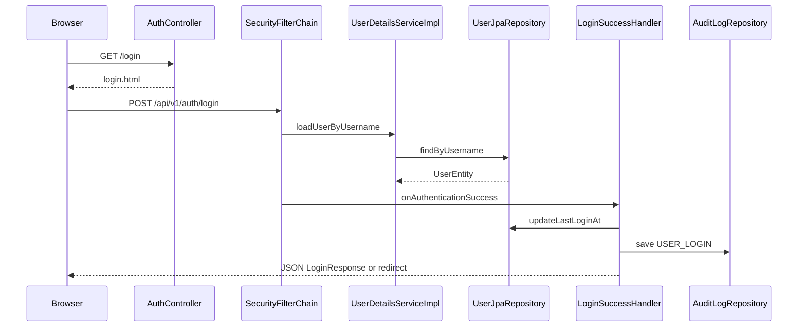

### Authentication Important Classes

- `security.config.SecurityConfig`
- `security.service.UserDetailsServiceImpl`
- `security.handler.LoginSuccessHandler`
- `security.handler.LoginFailureHandler`
- `security.handler.LogoutSuccessHandlerImpl`
- `presentation.web.AuthController`

### Authentication Related Files

```text
src/main/java/com/tlbank/lending/security/config/SecurityConfig.java
src/main/java/com/tlbank/lending/security/service/UserDetailsServiceImpl.java
src/main/java/com/tlbank/lending/security/handler/LoginSuccessHandler.java
src/main/java/com/tlbank/lending/security/handler/LoginFailureHandler.java
src/main/java/com/tlbank/lending/security/handler/LogoutSuccessHandlerImpl.java
src/main/java/com/tlbank/lending/security/filter/MdcLoggingFilter.java
src/main/java/com/tlbank/lending/presentation/web/AuthController.java
src/main/resources/templates/auth/login.html
src/main/resources/db/migration/V1__create_users.sql
src/main/resources/db/migration/V8__add_user_last_login.sql
```

### Authentication Folder Structure

```text
security/
├── config/SecurityConfig.java
├── service/UserDetailsServiceImpl.java
├── handler/{LoginSuccess,LoginFailure,Logout,...}Handler*.java
├── filter/MdcLoggingFilter.java
└── util/JsonResponseWriter.java
presentation/web/AuthController.java
```

### Authentication Dependency Graph

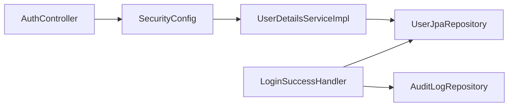

---

## 2. User Management

| Field | Value |
| --- | --- |
| **Feature Name** | User Management |
| **Business Goal** | Admin creates and manages platform users (enable/disable, list, view) |
| **Entry Controller** | `UserManagementApiController`, `AdminController` (`GET /admin/users`) |
| **Request DTO** | `CreateUserRequest`, `UpdateUserStatusCommand` (query param `enabled`) |
| **Validation** | `@NotBlank`, `@Size(min=8)`, `@Email` on `CreateUserRequest` |
| **Service** | `UserAppService` |
| **Domain Layer** | `User`, `UserId`, `Role` |
| **Repository** | Port: `domain.user.repository.UserRepository` → Impl: `UserRepositoryImpl` |
| **Infrastructure** | `UserEntity`, `UserJpaRepository`, `UserRepositoryImpl` |
| **External Service** | None |
| **Database Tables** | `users`, `user_roles` |
| **Redis** | None |
| **Configuration** | `SecurityConfig` (`/api/v1/admin/**` requires ADMIN) |
| **Security** | `@PreAuthorize("hasRole('ADMIN')")` on controller |
| **Events** | None |
| **Scheduler** | None |

### User Management Execution Flow

1. `POST /api/v1/admin/users` with `CreateUserRequest`.
2. `UserAppService.createUser()` → check duplicate username.
3. `PasswordEncoder.encode()` → build `User` aggregate → `UserRepository.save()`.
4. `PUT /api/v1/admin/users/{userId}/status?enabled=` → `user.enable()` or `user.disable()`.
5. `GET` list/detail → map to `UserResponse`.

### User Management Sequence Diagram

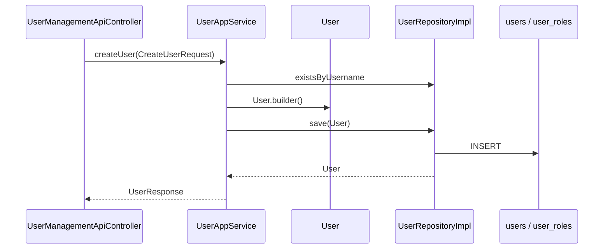

### User Management Important Classes

- `presentation.api.v1.UserManagementApiController`
- `application.user.service.UserAppService`
- `domain.user.User`
- `domain.user.repository.UserRepository`
- `infrastructure.persistence.user.UserRepositoryImpl`

### User Management Related Files

```text
src/main/java/com/tlbank/lending/presentation/api/v1/UserManagementApiController.java
src/main/java/com/tlbank/lending/application/user/service/UserAppService.java
src/main/java/com/tlbank/lending/application/dto/request/CreateUserRequest.java
src/main/java/com/tlbank/lending/domain/user/User.java
src/main/java/com/tlbank/lending/infrastructure/persistence/user/UserRepositoryImpl.java
src/main/resources/templates/admin/users.html
```

### User Management Folder Structure

```text
application/user/service/
domain/user/{User,UserId,Role}.java
domain/user/repository/UserRepository.java
infrastructure/persistence/user/{UserEntity,UserJpaRepository,UserRepositoryImpl}.java
```

### User Management Dependency Graph

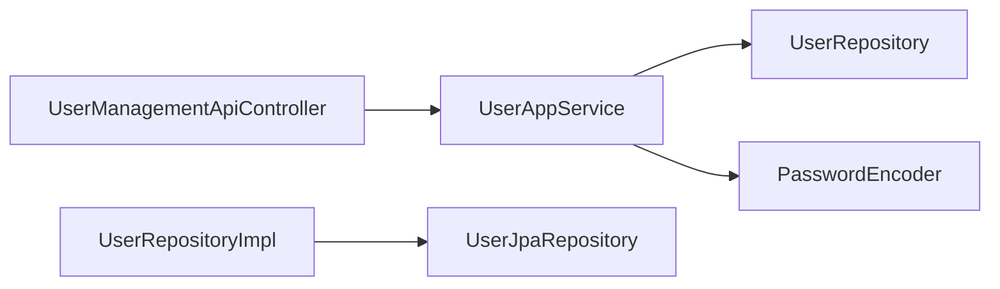

---

## 3. Card Product Catalog

| Field | Value |
| --- | --- |
| **Feature Name** | Card Product Catalog |
| **Business Goal** | Expose enabled credit card products for applicant browsing and application creation |
| **Entry Controller** | `CardProductApiController`, `ApplicationWebController` (`GET /products`) |
| **Request DTO** | None (GET only) |
| **Validation** | None |
| **Service** | `ApplicationAppService.findAllEnabledProducts()` |
| **Domain Layer** | `CardProduct`, `CardProductId`, `ProductFeature`, `CardType` |
| **Repository** | Port: `CardProductRepository` → Impl: `CardProductRepositoryImpl` → Decorator: `CachedCardProductRepository` (@Primary) |
| **Infrastructure** | `CardProductEntity`, `ProductFeatureEntity`, `InMemoryCacheStore`, `CacheTtlProvider` |
| **External Service** | None |
| **Database Tables** | `card_products`, `product_features` |
| **Redis** | None (in-memory cache only) |
| **Configuration** | `CacheKeys`, `CACHE.ttl_seconds` system parameter |
| **Security** | `permitAll` on `GET /api/v1/products`, `GET /products` |
| **Events** | None |
| **Scheduler** | `CacheRefreshScheduler` evicts product cache keys |

### Card Product Catalog Execution Flow

1. `GET /api/v1/products` or `GET /products`.
2. `ApplicationAppService.findAllEnabledProducts()`.
3. `CachedCardProductRepository.findAllEnabled()` → cache HIT or MISS.
4. On MISS: `CardProductRepositoryImpl` → JPA `findAllByEnabledTrue()`.
5. Map to `CardProductResponse` with `ProductFeatureResponse` list.

### Card Product Catalog Sequence Diagram

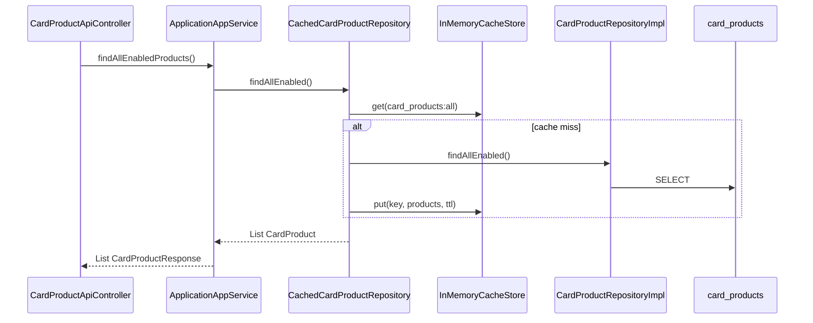

### Card Product Catalog Important Classes

- `presentation.api.v1.CardProductApiController`
- `application.application.service.ApplicationAppService`
- `domain.product.CardProduct`
- `infrastructure.cache.CachedCardProductRepository`
- `infrastructure.persistence.product.CardProductRepositoryImpl`

### Card Product Catalog Related Files

```text
src/main/java/com/tlbank/lending/presentation/api/v1/CardProductApiController.java
src/main/java/com/tlbank/lending/application/application/service/ApplicationAppService.java
src/main/java/com/tlbank/lending/domain/product/CardProduct.java
src/main/java/com/tlbank/lending/infrastructure/cache/CachedCardProductRepository.java
src/main/resources/db/migration/V2__create_card_products.sql
src/main/resources/templates/products/list.html
```

### Card Product Catalog Folder Structure

```text
domain/product/{CardProduct,ProductFeature,CardType}.java
domain/product/repository/CardProductRepository.java
infrastructure/persistence/product/
infrastructure/cache/{CachedCardProductRepository,CacheStore,CacheKeys}.java
```

### Card Product Catalog Dependency Graph

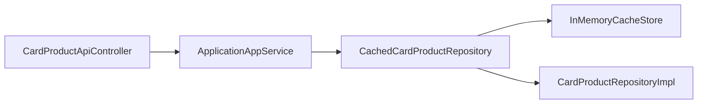

---

## 4. Application Create

| Field | Value |
| --- | --- |
| **Feature Name** | Application Create |
| **Business Goal** | Create a new credit card application draft in `INIT` status |
| **Entry Controller** | `ApplicationApiController`, `ApplicationWebController` (`POST /apply`) |
| **Request DTO** | `CreateApplicationRequest` → `ApplicantRequest`, `AddressRequest` |
| **Validation** | Bean Validation on request; domain VOs `MobileNumber`, `Email`, `Address` on mapping |
| **Service** | `ApplicationAppService.createApplication()`, `IdempotencyService.execute()` (API only) |
| **Domain Layer** | `Application`, `ApplicationId`, `Applicant`, `ApplicationStatus.INIT` |
| **Repository** | `ApplicationRepository` → `ApplicationRepositoryImpl` |
| **Infrastructure** | `ApplicationEntity`, `WorkflowHistoryEntity`, `IdempotencyService`, `RedisIdempotencyStore` / `InMemoryIdempotencyStore` |
| **External Service** | Redis (dev idempotency store) |
| **Database Tables** | `applications`, `workflow_histories` |
| **Redis** | `idempotency:applications:{key}` (when `tlbank.idempotency.store=redis`) |
| **Configuration** | `tlbank.idempotency.*`, `application-dev.yml` |
| **Security** | `permitAll` on `POST /api/v1/applications` |
| **Events** | None on create |
| **Scheduler** | None |

### Application Create Execution Flow

1. `POST /api/v1/applications` with optional `Idempotency-Key` header.
2. `IdempotencyService.execute()` — hash body, check cache/lock, or proceed.
3. Validate `CardProduct` exists and is enabled.
4. Map request → `Applicant` value objects.
5. `Application.builder()` with `ApplicationId.generate()`, status `INIT`.
6. `ApplicationRepository.save()` → return `ApplicationSummaryResponse`.

### Application Create Sequence Diagram

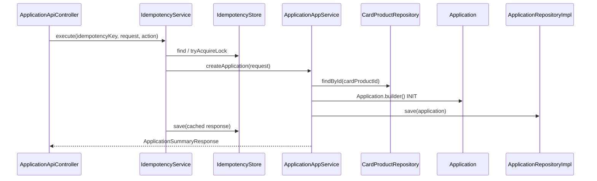

### Application Create Important Classes

- `presentation.api.v1.ApplicationApiController`
- `application.idempotency.IdempotencyService`
- `application.application.service.ApplicationAppService`
- `domain.application.Application`
- `infrastructure.persistence.application.ApplicationRepositoryImpl`

### Application Create Related Files

```text
src/main/java/com/tlbank/lending/presentation/api/v1/ApplicationApiController.java
src/main/java/com/tlbank/lending/application/dto/request/CreateApplicationRequest.java
src/main/java/com/tlbank/lending/application/dto/request/ApplicantRequest.java
src/main/java/com/tlbank/lending/application/idempotency/IdempotencyService.java
src/main/java/com/tlbank/lending/domain/application/Application.java
src/main/resources/db/migration/V3__create_applications.sql
src/main/resources/templates/application/form.html
```

### Application Create Folder Structure

```text
application/idempotency/IdempotencyService.java
application/application/service/ApplicationAppService.java
application/dto/request/CreateApplicationRequest.java
domain/application/{Application,ApplicationId,Applicant,...}.java
infrastructure/idempotency/{IdempotencyStore,RedisIdempotencyStore,InMemoryIdempotencyStore}.java
infrastructure/persistence/application/
```

### Application Create Dependency Graph

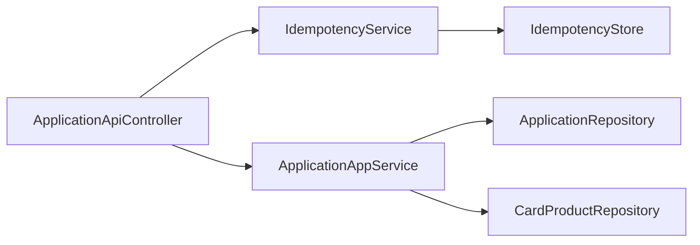

---

## 5. Application Query

| Field | Value |
| --- | --- |
| **Feature Name** | Application Query |
| **Business Goal** | Retrieve application detail with masked PII, workflow history, and documents |
| **Entry Controller** | `ApplicationApiController` (`GET /{id}`), `ApplicationWebController` (status pages) |
| **Request DTO** | Path param `applicationId` |
| **Validation** | None |
| **Service** | `ApplicationAppService.getApplication()` |
| **Domain Layer** | `Application`, `WorkflowHistory`, `DocumentInfo` |
| **Repository** | `ApplicationRepository` |
| **Infrastructure** | `ApplicationRepositoryImpl`, `MaskingUtil` |
| **External Service** | None |
| **Database Tables** | `applications`, `workflow_histories`, `application_documents` |
| **Redis** | None |
| **Configuration** | None |
| **Security** | `permitAll` on `GET /api/v1/applications/**` |
| **Events** | None |
| **Scheduler** | None |

### Application Query Execution Flow

1. `GET /api/v1/applications/{applicationId}`.
2. `ApplicationRepository.findById()` or throw `APPLICATION_NOT_FOUND`.
3. Load `CardProduct` for product name.
4. Map to `ApplicationDetailResponse` with `MaskedApplicantResponse`, `WorkflowHistoryResponse`, `DocumentInfoResponse`.

### Application Query Sequence Diagram

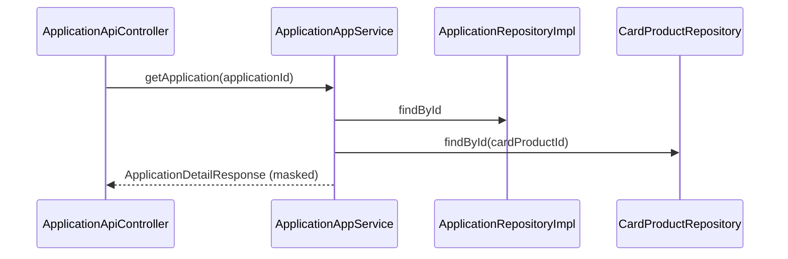

### Application Query Important Classes

- `ApplicationAppService`
- `ApplicationDetailResponse`
- `MaskedApplicantResponse`
- `common.util.MaskingUtil`

### Application Query Related Files

```text
src/main/java/com/tlbank/lending/presentation/api/v1/ApplicationApiController.java
src/main/java/com/tlbank/lending/application/application/service/ApplicationDetailResponse.java
src/main/java/com/tlbank/lending/common/util/MaskingUtil.java
```

### Application Query Folder Structure

```text
application/application/service/ApplicationDetailResponse.java
application/application/service/MaskedApplicantResponse.java
```

### Application Query Dependency Graph

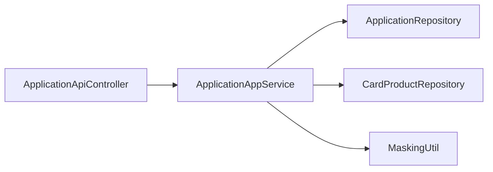

---

## 6. Document Upload

| Field | Value |
| --- | --- |
| **Feature Name** | Document Upload |
| **Business Goal** | Store identity/income/residence documents and advance workflow to `DOCUMENT_UPLOADED` |
| **Entry Controller** | `ApplicationApiController` (`POST /{id}/documents`) |
| **Request DTO** | Multipart: `documentType` (enum), `file` |
| **Validation** | `LocalDocumentStorageService.validate()` — extension jpg/jpeg/png/pdf, size from `UPLOAD.max.size.mb`; domain `Application.uploadDocuments()` status check |
| **Service** | `ApplicationAppService.uploadDocuments()` |
| **Domain Layer** | `Application`, `DocumentInfo`, `DocumentType` |
| **Repository** | `ApplicationRepository` |
| **Infrastructure** | `LocalDocumentStorageService`, `SystemParameterService` |
| **External Service** | Local filesystem (`tlbank.upload.base-path`) |
| **Database Tables** | `applications`, `application_documents` |
| **Redis** | None |
| **Configuration** | `tlbank.upload.base-path`, `spring.servlet.multipart.*` |
| **Security** | `permitAll` |
| **Events** | None |
| **Scheduler** | None |

### Document Upload Execution Flow

1. `POST /api/v1/applications/{applicationId}/documents?documentType=&file=`.
2. Load `Application` aggregate.
3. `documentStorageService.validate(file)` — extension and size.
4. `documentStorageService.store()` → `{basePath}/{applicationId}/{TYPE}_{timestamp}.ext`.
5. Build `DocumentInfo` → `application.uploadDocuments()` (`OTP_VERIFIED` → `DOCUMENT_UPLOADED`).
6. `ApplicationRepository.save()`; `@Auditable(DOCUMENT_UPLOAD)`.

### Document Upload Sequence Diagram

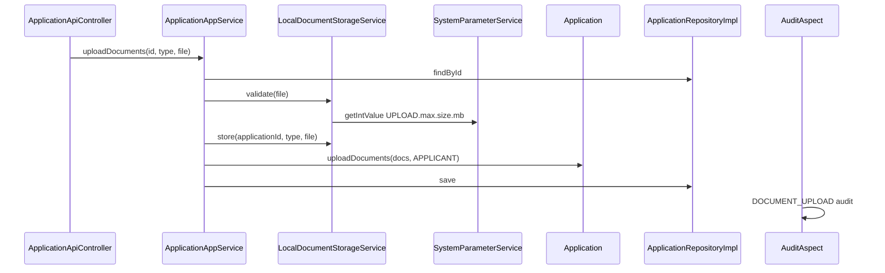

### Document Upload Important Classes

- `ApplicationAppService.uploadDocuments`
- `LocalDocumentStorageService`
- `domain.application.DocumentType`
- `domain.application.DocumentInfo`

### Document Upload Related Files

```text
src/main/java/com/tlbank/lending/infrastructure/storage/LocalDocumentStorageService.java
src/main/java/com/tlbank/lending/application/application/service/ApplicationAppService.java
src/main/resources/templates/application/upload.html
```

### Document Upload Folder Structure

```text
infrastructure/storage/{DocumentStorageService,LocalDocumentStorageService}.java
domain/application/{DocumentInfo,DocumentType}.java
```

### Document Upload Dependency Graph

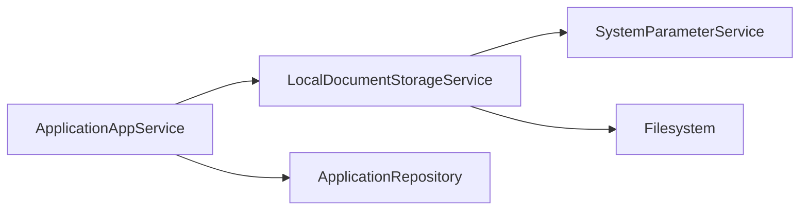

---

## 7. Application Submit

| Field | Value |
| --- | --- |
| **Feature Name** | Application Submit |
| **Business Goal** | Submit completed application for credit review; trigger review case creation and notifications |
| **Entry Controller** | `ApplicationApiController`, `ApplicationWebController` (`POST /apply/submit`) |
| **Request DTO** | Path `applicationId` only |
| **Validation** | Domain `Application.submit()` — all `DocumentType` values required |
| **Service** | `ApplicationAppService.submitApplication()` |
| **Domain Layer** | `Application` — `INIT→...→SUBMITTED` transition |
| **Repository** | `ApplicationRepository` |
| **Infrastructure** | `ReviewEventHandler`, `NotificationEventHandler` |
| **External Service** | Mock SMS/Email (via events) |
| **Database Tables** | `applications`, `workflow_histories`, `review_cases` |
| **Redis** | None |
| **Configuration** | None |
| **Security** | `permitAll` |
| **Events** | Published: `ApplicationSubmittedEvent` |
| **Scheduler** | None |

### Application Submit Execution Flow

1. `POST /api/v1/applications/{id}/actions/submit`.
2. `application.submit("APPLICANT")` — validate documents, `DOCUMENT_UPLOADED` → `SUBMITTED`.
3. `ApplicationRepository.save()`.
4. Publish `ApplicationSubmittedEvent`.
5. `ReviewEventHandler` → `ReviewCase.createFor()` → `ReviewCaseRepository.save()`.
6. `NotificationEventHandler` → mock SMS/email.
7. `@Auditable(APPLICATION_SUBMIT)`.

### Application Submit Sequence Diagram

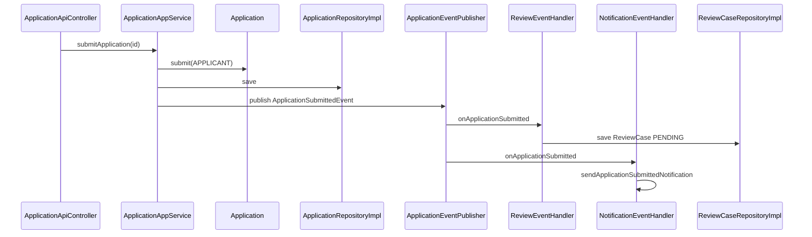

### Application Submit Important Classes

- `ApplicationAppService.submitApplication`
- `domain.event.ApplicationSubmittedEvent`
- `infrastructure.event.ReviewEventHandler`
- `infrastructure.event.NotificationEventHandler`
- `domain.review.ReviewCase`

### Application Submit Related Files

```text
src/main/java/com/tlbank/lending/application/application/service/ApplicationAppService.java
src/main/java/com/tlbank/lending/domain/event/ApplicationSubmittedEvent.java
src/main/java/com/tlbank/lending/infrastructure/event/ReviewEventHandler.java
src/main/java/com/tlbank/lending/infrastructure/event/NotificationEventHandler.java
src/main/resources/templates/application/submit-confirm.html
```

### Application Submit Folder Structure

```text
domain/event/ApplicationSubmittedEvent.java
infrastructure/event/{ReviewEventHandler,NotificationEventHandler}.java
domain/review/ReviewCase.java
```

### Application Submit Dependency Graph

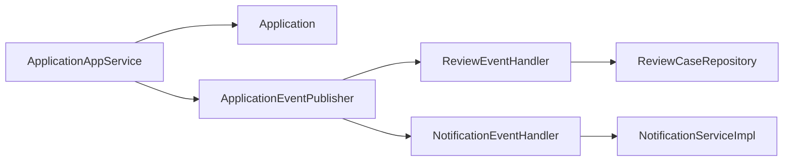

---

## 8. Application Cancel

| Field | Value |
| --- | --- |
| **Feature Name** | Application Cancel |
| **Business Goal** | Cancel in-progress application before submission |
| **Entry Controller** | `ApplicationApiController` |
| **Request DTO** | `CancelApplicationRequest` (`reason`) |
| **Validation** | `@NotBlank reason`; domain `Application.cancel()` — only `INIT`, `OTP_VERIFIED`, `DOCUMENT_UPLOADED` |
| **Service** | `ApplicationAppService.cancelApplication()` |
| **Domain Layer** | `Application`, `ApplicationCancelledEvent` (defined, not published) |
| **Repository** | `ApplicationRepository` |
| **Infrastructure** | — |
| **External Service** | None |
| **Database Tables** | `applications`, `workflow_histories` |
| **Redis** | None |
| **Configuration** | None |
| **Security** | `permitAll` |
| **Events** | None published (`ApplicationCancelledEvent` exists but unused) |
| **Scheduler** | None |

### Application Cancel Execution Flow

1. `POST /api/v1/applications/{id}/actions/cancel` with `{ "reason": "..." }`.
2. `application.cancel(operator, reason)` → `CANCELLED`.
3. Save; `@Auditable(APPLICATION_CANCEL)`.

### Application Cancel Sequence Diagram

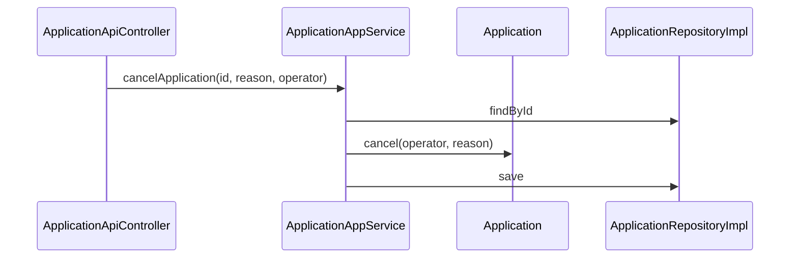

### Application Cancel Important Classes

- `ApplicationAppService.cancelApplication`
- `domain.application.Application.cancel`
- `application.dto.request.CancelApplicationRequest`

### Application Cancel Related Files

```text
src/main/java/com/tlbank/lending/application/dto/request/CancelApplicationRequest.java
src/main/java/com/tlbank/lending/domain/event/ApplicationCancelledEvent.java
```

### Application Cancel Dependency Graph

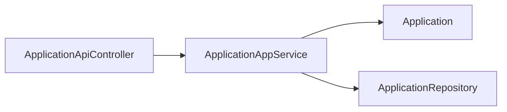

---

## 9. OTP Send

| Field | Value |
| --- | --- |
| **Feature Name** | OTP Send |
| **Business Goal** | Generate and deliver OTP for mobile verification before document upload |
| **Entry Controller** | `OtpApiController`, `ApplicationWebController` (`GET /apply/otp` auto-sends) |
| **Request DTO** | `SendOtpRequest` → `SendOtpCommand` |
| **Validation** | `@NotBlank`, `@Pattern(^09\d{8}$)` on mobile |
| **Service** | `OtpAppService.sendOtp()` |
| **Domain Layer** | `OtpRecord`, `OtpStatus`, `OtpPurpose` |
| **Repository** | `OtpRepository` → `OtpRepositoryImpl` |
| **Infrastructure** | `NotificationServiceImpl`, `SystemParameterService` |
| **External Service** | Mock SMS, Mock Email |
| **Database Tables** | `otp_records` |
| **Redis** | None |
| **Configuration** | `OTP.expire_minutes`, `OTP.max_retry` system parameters |
| **Security** | `permitAll` on `/api/v1/otp/**` |
| **Events** | `OtpGeneratedEvent` defined, not published (direct notification call) |
| **Scheduler** | `OtpCleanupScheduler` marks expired records |

### OTP Send Execution Flow

1. `POST /api/v1/otp/actions/send` with `applicationId`, `mobile`, `purpose`.
2. Cancel existing PENDING OTP for mobile.
3. Read `expire_minutes`, `max_retry` from `SystemParameterService`.
4. Generate 6-digit code; save `OtpRecord` (PENDING).
5. `AuditContext.put("otpCode", ...)` for audit detail.
6. `NotificationService.sendOtpNotification()` — synchronous mock send.
7. Return masked mobile + `expiredAt`.

### OTP Send Sequence Diagram

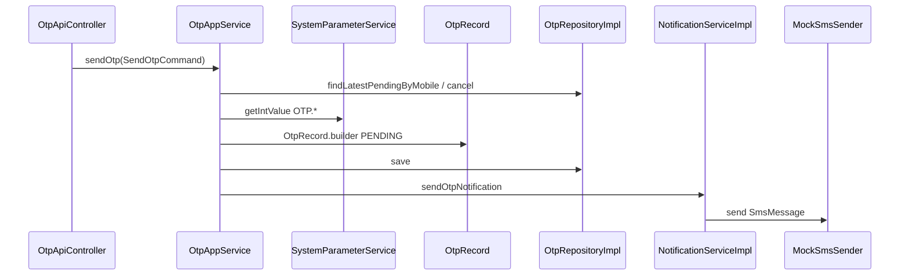

### OTP Send Important Classes

- `OtpAppService`
- `domain.otp.OtpRecord`
- `application.dto.request.SendOtpRequest`
- `NotificationServiceImpl`

### OTP Send Related Files

```text
src/main/java/com/tlbank/lending/presentation/api/v1/OtpApiController.java
src/main/java/com/tlbank/lending/application/otp/service/OtpAppService.java
src/main/java/com/tlbank/lending/domain/otp/OtpRecord.java
src/main/resources/db/migration/V4__create_otp_records.sql
src/main/resources/templates/application/otp.html
```

### OTP Send Folder Structure

```text
application/otp/service/OtpAppService.java
domain/otp/{OtpRecord,OtpStatus,OtpPurpose}.java
infrastructure/persistence/otp/
infrastructure/scheduler/OtpCleanupScheduler.java
```

### OTP Send Dependency Graph

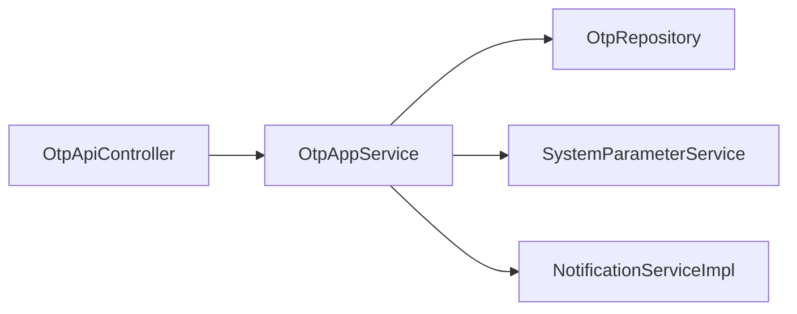

---

## 10. OTP Verify

| Field | Value |
| --- | --- |
| **Feature Name** | OTP Verify |
| **Business Goal** | Verify OTP and advance application `INIT` → `OTP_VERIFIED` |
| **Entry Controller** | `OtpApiController` |
| **Request DTO** | `VerifyOtpRequest` → `VerifyOtpCommand` |
| **Validation** | `@NotBlank`, `@Size(6)` on `otpCode`; domain `OtpRecord.verify()` |
| **Service** | `OtpAppService.verifyOtp()` |
| **Domain Layer** | `OtpRecord`, `Application.verifyOtp()` |
| **Repository** | `OtpRepository`, `ApplicationRepository` |
| **Infrastructure** | — |
| **External Service** | None |
| **Database Tables** | `otp_records`, `applications`, `workflow_histories` |
| **Redis** | None |
| **Configuration** | `OTP.max_retry` |
| **Security** | `permitAll` |
| **Events** | None |
| **Scheduler** | `OtpCleanupScheduler` |

### OTP Verify Execution Flow

1. `POST /api/v1/otp/actions/verify`.
2. Load latest PENDING `OtpRecord` by mobile.
3. `otpRecord.verify(code, maxRetry, clock)` — expiry/retry/match checks.
4. If application status `INIT` → `application.verifyOtp("APPLICANT")`.
5. Save OTP and application; `@Auditable(OTP_VERIFY_SUCCESS)`.

### OTP Verify Sequence Diagram

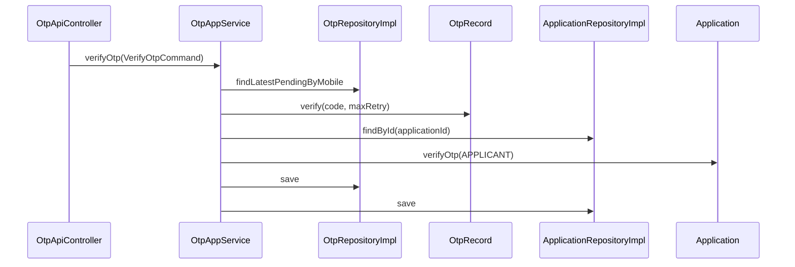

### OTP Verify Important Classes

- `OtpAppService.verifyOtp`
- `OtpRecord.verify`
- `Application.verifyOtp`

### OTP Verify Related Files

```text
src/main/java/com/tlbank/lending/application/dto/request/VerifyOtpRequest.java
src/main/java/com/tlbank/lending/domain/otp/OtpRecord.java
src/main/java/com/tlbank/lending/domain/application/Application.java
```

### OTP Verify Dependency Graph

```mermaid
flowchart LR
    OtpAppService --> OtpRepository
    OtpAppService --> ApplicationRepository
    OtpAppService --> OtpRecord
    OtpAppService --> Application
```

---

## 11. Credit Review

| Field | Value |
| --- | --- |
| **Feature Name** | Credit Review |
| **Business Goal** | Reviewer searches cases, starts review, approves/rejects, adds remarks; syncs application status |
| **Entry Controller** | `ReviewApiController`, `ReviewController` |
| **Request DTO** | `ApproveReviewRequest`, `RejectReviewRequest`, `AddRemarkRequest`; query params for search |
| **Validation** | `@NotBlank` on remark/content; domain `ReviewCase` / `Application` transition rules |
| **Service** | `ReviewAppService` |
| **Domain Layer** | `ReviewCase`, `ReviewRemark`, `ReviewStatus`, `Application` |
| **Repository** | `ReviewCaseRepository`, `ApplicationRepository`, `CardProductRepository` |
| **Infrastructure** | `ReviewCaseRepositoryImpl`, event handlers |
| **External Service** | Mock SMS/Email on approve/reject |
| **Database Tables** | `review_cases`, `review_remarks`, `applications`, `workflow_histories` |
| **Redis** | None |
| **Configuration** | None |
| **Security** | `@PreAuthorize("hasAnyRole('REVIEWER','ADMIN')")`, `/review/**` |
| **Events** | Consumed: `ApplicationSubmittedEvent`; Published: `ApplicationApprovedEvent`, `ApplicationRejectedEvent` |
| **Scheduler** | None |

### Credit Review Execution Flow — Search / Detail

1. `GET /api/v1/review/cases` with filters → `ReviewCaseRepository.search()`.
2. `GET /api/v1/review/cases/{id}` → join application, mask PII.

### Credit Review Execution Flow — Start (Web only)

1. `POST /review/cases/{id}/start`.
2. `ReviewCase.startReview()` PENDING → UNDER_REVIEW.
3. `Application.startReview()` SUBMITTED → UNDER_REVIEW if needed.

### Credit Review Execution Flow — Approve / Reject

1. `POST .../actions/approve` or `reject` with remark.
2. `ReviewCase.approve/reject()` + `Application.approve/reject()`.
3. Publish `ApplicationApprovedEvent` or `ApplicationRejectedEvent`.
4. `NotificationEventHandler` sends mock notification.
5. `@Auditable(APPLICATION_APPROVE|APPLICATION_REJECT)`.

### Credit Review Sequence Diagram — Approve

```mermaid
sequenceDiagram
    participant API as ReviewApiController
    participant SVC as ReviewAppService
    participant REV as ReviewCase
    participant APP as Application
    participant REV_REPO as ReviewCaseRepositoryImpl
    participant APP_REPO as ApplicationRepositoryImpl
    participant BUS as ApplicationEventPublisher
    participant NOTIF as NotificationEventHandler

    API->>SVC: approveCase(command)
    SVC->>REV: approve(operator, remark)
    SVC->>APP: approve(operator, remark)
    SVC->>REV_REPO: save
    SVC->>APP_REPO: save
    SVC->>BUS: publish ApplicationApprovedEvent
    BUS->>NOTIF: onApplicationApproved
```

### Credit Review Important Classes

- `ReviewAppService`
- `domain.review.ReviewCase`
- `presentation.api.v1.ReviewApiController`
- `presentation.web.ReviewController`
- `infrastructure.event.ReviewEventHandler`

### Credit Review Related Files

```text
src/main/java/com/tlbank/lending/application/review/service/ReviewAppService.java
src/main/java/com/tlbank/lending/domain/review/ReviewCase.java
src/main/java/com/tlbank/lending/presentation/api/v1/ReviewApiController.java
src/main/java/com/tlbank/lending/presentation/web/ReviewController.java
src/main/resources/db/migration/V5__create_review_cases.sql
src/main/resources/templates/review/list.html
src/main/resources/templates/review/detail.html
```

### Credit Review Folder Structure

```text
application/review/service/
domain/review/{ReviewCase,ReviewRemark,ReviewStatus}.java
domain/review/repository/ReviewCaseRepository.java
infrastructure/persistence/review/
presentation/api/v1/review/{ApproveReviewRequest,RejectReviewRequest,AddRemarkRequest}.java
```

### Credit Review Dependency Graph

```mermaid
flowchart LR
    ReviewApiController --> ReviewAppService
    ReviewAppService --> ReviewCaseRepository
    ReviewAppService --> ApplicationRepository
    ReviewAppService --> CardProductRepository
    ReviewAppService --> ApplicationEventPublisher
    ReviewEventHandler --> ReviewCaseRepository
```

---

## 12. System Parameters

| Field | Value |
| --- | --- |
| **Feature Name** | System Parameters |
| **Business Goal** | Admin views/updates runtime config; internal consumers read cached values |
| **Entry Controller** | `SystemParameterApiController`, `AdminController` |
| **Request DTO** | `UpdateParameterCommand` |
| **Validation** | `@NotBlank paramValue` |
| **Service** | `SystemParameterService` |
| **Domain Layer** | `SystemParameter` |
| **Repository** | `SystemParameterRepository` → `SystemParameterRepositoryImpl` |
| **Infrastructure** | `InMemoryCacheStore`, `CacheKeys`, `CacheTtlProvider` |
| **External Service** | None |
| **Database Tables** | `system_parameters` |
| **Redis** | None |
| **Configuration** | Seeded: `OTP.*`, `CACHE.ttl_seconds`, `UPLOAD.max.size.mb` |
| **Security** | ADMIN only |
| **Events** | None |
| **Scheduler** | `CacheRefreshScheduler` reloads parameter cache |

### System Parameters Execution Flow — Read (internal)

1. `getValue(group, key)` → cache-aside `sys_param:{group}:{key}`.
2. On MISS: load from DB, put with TTL from `CACHE.ttl_seconds`.

### System Parameters Execution Flow — Admin Update

1. `PUT /api/v1/admin/system-parameters/{paramId}`.
2. Update domain entity → save → evict cache key.

### System Parameters Sequence Diagram

```mermaid
sequenceDiagram
    participant API as SystemParameterApiController
    participant SVC as SystemParameterService
    participant CACHE as InMemoryCacheStore
    participant REPO as SystemParameterRepositoryImpl
    participant DB as system_parameters

    API->>SVC: update(command)
    SVC->>REPO: save
    SVC->>CACHE: evict(sys_param:group:key)
```

### System Parameters Important Classes

- `SystemParameterService`
- `domain.parameter.SystemParameter`
- `infrastructure.cache.CacheKeys`

### System Parameters Related Files

```text
src/main/java/com/tlbank/lending/application/parameter/service/SystemParameterService.java
src/main/resources/db/migration/V7__create_system_parameters.sql
src/main/resources/db/dev-seed/V100__seed_test_data.sql
```

### System Parameters Dependency Graph

```mermaid
flowchart LR
    SystemParameterService --> SystemParameterRepository
    SystemParameterService --> InMemoryCacheStore
    OtpAppService --> SystemParameterService
    LocalDocumentStorageService --> SystemParameterService
```

---

## 13. Audit Log Query

| Field | Value |
| --- | --- |
| **Feature Name** | Audit Log Query |
| **Business Goal** | Admin searches operational audit trail by user, action, date range |
| **Entry Controller** | `AuditLogApiController`, `AdminController` |
| **Request DTO** | Query params: `username`, `action`, `dateFrom`, `dateTo`, `page`, `size` |
| **Validation** | None |
| **Service** | `AuditLogService.search()` |
| **Domain Layer** | None |
| **Repository** | `AuditLogRepository` (Spring Data JPA) |
| **Infrastructure** | `AuditLog` entity, `AuditAspect`, `AuditLogWriter` (writes) |
| **External Service** | None |
| **Database Tables** | `audit_logs` |
| **Redis** | None |
| **Configuration** | `AsyncConfig` for async audit writes |
| **Security** | ADMIN only |
| **Events** | None |
| **Scheduler** | None |

### Audit Log Query Execution Flow — Write (cross-cutting)

1. `@Auditable` method invoked → `AuditAspect` intercepts.
2. On success/failure: build `AuditLog` with username, IP, action, detail.
3. `AuditLogWriter.saveAsync()` in `REQUIRES_NEW` transaction.

### Audit Log Query Execution Flow — Query

1. `GET /api/v1/admin/audit-logs?...`.
2. `AuditLogRepository.search()` → `PageResponse<AuditLogResponse>`.

### Audit Log Query Sequence Diagram

```mermaid
sequenceDiagram
    participant SVC as OtpAppService
    participant ASPECT as AuditAspect
    participant WRITER as AuditLogWriter
    participant REPO as AuditLogRepository

    SVC->>ASPECT: @Auditable OTP_SEND
    ASPECT->>SVC: proceed()
    ASPECT->>WRITER: saveAsync(AuditLog)
    WRITER->>REPO: save
```

### Audit Log Query Important Classes

- `common.audit.AuditAspect`
- `common.audit.AuditLogWriter`
- `application.audit.service.AuditLogService`
- `common.audit.AuditAction`

### Audit Log Query Related Files

```text
src/main/java/com/tlbank/lending/common/audit/AuditAspect.java
src/main/java/com/tlbank/lending/common/audit/AuditLogWriter.java
src/main/java/com/tlbank/lending/application/audit/service/AuditLogService.java
src/main/resources/db/migration/V14__reshape_audit_logs_for_sprint9.sql
```

### Audit Log Query Dependency Graph

```mermaid
flowchart LR
    AuditAspect --> AuditLogWriter
    AuditLogWriter --> AuditLogRepository
    AuditLogApiController --> AuditLogService
    AuditLogService --> AuditLogRepository
```

---

## 14. Cache Management

| Field | Value |
| --- | --- |
| **Feature Name** | Cache Management |
| **Business Goal** | Admin refreshes in-memory cache and inspects cache statistics |
| **Entry Controller** | `CacheManagementApiController` |
| **Request DTO** | None |
| **Validation** | None |
| **Service** | `CacheManagementService` |
| **Domain Layer** | None |
| **Repository** | None |
| **Infrastructure** | `InMemoryCacheStore`, `CachedCardProductRepository`, `SystemParameterService` |
| **External Service** | None |
| **Database Tables** | None (reads via services) |
| **Redis** | None |
| **Configuration** | `tlbank.scheduler.cache-refresh.cron` |
| **Security** | ADMIN only |
| **Events** | None |
| **Scheduler** | `CacheRefreshScheduler`, `InMemoryCacheStore.cleanupExpiredEntries` (60s) |

### Cache Management Execution Flow

1. `POST /api/v1/admin/cache/refresh` → reload system parameters + evict/reload products.
2. `GET /api/v1/admin/cache/stats` → key count + memory estimate.

### Cache Management Sequence Diagram

```mermaid
sequenceDiagram
    participant API as CacheManagementApiController
    participant SVC as CacheManagementService
    participant PARAM as SystemParameterService
    participant PROD as CachedCardProductRepository
    participant STORE as InMemoryCacheStore

    API->>SVC: refreshAll()
    SVC->>PARAM: refreshCache()
    SVC->>PROD: refreshCache()
    PARAM->>STORE: evict/put sys_param keys
    PROD->>STORE: evict/put product keys
```

### Cache Management Important Classes

- `CacheManagementService`
- `InMemoryCacheStore`
- `CacheRefreshScheduler`

### Cache Management Related Files

```text
src/main/java/com/tlbank/lending/presentation/api/v1/CacheManagementApiController.java
src/main/java/com/tlbank/lending/infrastructure/cache/InMemoryCacheStore.java
src/main/java/com/tlbank/lending/infrastructure/scheduler/CacheRefreshScheduler.java
```

### Cache Management Dependency Graph

```mermaid
flowchart LR
    CacheManagementService --> SystemParameterService
    CacheManagementService --> CachedCardProductRepository
    CacheManagementService --> InMemoryCacheStore
```

---

## 15. Notifications

| Field | Value |
| --- | --- |
| **Feature Name** | Notifications |
| **Business Goal** | Deliver templated SMS/email for OTP and lifecycle events; admin views notification audit log |
| **Entry Controller** | `NotificationLogApiController` (query); internal via `NotificationEventHandler` / `OtpAppService` |
| **Request DTO** | None for send; page params for log query |
| **Validation** | None |
| **Service** | `NotificationServiceImpl`, `AuditLogService.searchNotificationAttempts()` |
| **Domain Layer** | Domain events as triggers |
| **Repository** | `AuditLogRepository` (log view) |
| **Infrastructure** | `MockSmsSender`, `MockEmailSender`, `NotificationTemplate`, `NotificationEventHandler` |
| **External Service** | Mock only (`tlbank.notification.mode=mock`) |
| **Database Tables** | `audit_logs` (filtered by action) |
| **Redis** | None |
| **Configuration** | `tlbank.notification.mode=mock` |
| **Security** | ADMIN for log query; send is internal |
| **Events** | `ApplicationSubmittedEvent`, `ApplicationApprovedEvent`, `ApplicationRejectedEvent`; OTP direct call |
| **Scheduler** | None |

### Notifications Execution Flow

1. Event published or `OtpAppService` calls `NotificationService`.
2. `NotificationServiceImpl` formats via `NotificationTemplate`.
3. `MockSmsSender` / `MockEmailSender` log to SLF4J.
4. Failures caught and logged (non-blocking).
5. Admin `GET /api/v1/admin/notifications` filters audit by OTP_SEND, APPLICATION_SUBMIT, APPROVE, REJECT.

### Notifications Sequence Diagram

```mermaid
sequenceDiagram
    participant BUS as ApplicationEventPublisher
    participant HANDLER as NotificationEventHandler
    participant SVC as NotificationServiceImpl
    participant SMS as MockSmsSender
    participant EMAIL as MockEmailSender

    BUS->>HANDLER: ApplicationApprovedEvent
    HANDLER->>SVC: sendApplicationApprovedNotification
    SVC->>SMS: send
    SVC->>EMAIL: send
```

### Notifications Important Classes

- `NotificationServiceImpl`
- `NotificationEventHandler`
- `MockSmsSender`, `MockEmailSender`
- `NotificationTemplate`

### Notifications Related Files

```text
src/main/java/com/tlbank/lending/application/notification/service/NotificationServiceImpl.java
src/main/java/com/tlbank/lending/infrastructure/event/NotificationEventHandler.java
src/main/java/com/tlbank/lending/infrastructure/notification/MockSmsSender.java
src/main/resources/templates/admin/notifications.html
```

### Notifications Dependency Graph

```mermaid
flowchart LR
    NotificationEventHandler --> NotificationServiceImpl
    NotificationServiceImpl --> SmsSender
    NotificationServiceImpl --> EmailSender
    OtpAppService --> NotificationServiceImpl
```

---

## 16. Report Export

| Field | Value |
| --- | --- |
| **Feature Name** | Report Export |
| **Business Goal** | Admin downloads daily application statistics as Excel or PDF |
| **Entry Controller** | `ReportApiController`, `AdminController` (`GET /admin/reports`) |
| **Request DTO** | `GenerateReportRequest` (`reportDate`, `format`) |
| **Validation** | `@NotNull` on date and format |
| **Service** | `ReportAppService`, `ReportDataService` |
| **Domain Layer** | None (reads JPA directly) |
| **Repository** | `ApplicationJpaRepository`, `CardProductJpaRepository` (bypass domain) |
| **Infrastructure** | `ExcelReportGenerator`, `PdfReportGenerator` |
| **External Service** | Apache POI, iText |
| **Database Tables** | `applications`, `card_products` |
| **Redis** | None |
| **Configuration** | None |
| **Security** | ADMIN only |
| **Events** | None |
| **Scheduler** | `DailyStatisticsScheduler` (log-only, same data builder) |

### Report Export Execution Flow

1. `POST /api/v1/reports/daily-statistics` with `{ reportDate, format }`.
2. `ReportDataService.buildDailyStatistics(date)` — aggregate counts.
3. `ExcelReportGenerator` or `PdfReportGenerator` → `byte[]`.
4. Return with `Content-Disposition` filename.
5. `@Auditable(REPORT_EXPORT)`.

### Report Export Sequence Diagram

```mermaid
sequenceDiagram
    participant API as ReportApiController
    participant SVC as ReportAppService
    participant DATA as ReportDataService
    participant JPA as ApplicationJpaRepository
    participant GEN as ExcelReportGenerator

    API->>SVC: generateDailyStatisticsReport(request)
    SVC->>DATA: buildDailyStatistics(date)
    DATA->>JPA: count queries
    SVC->>GEN: generateDailyStatistics(data)
    GEN-->>API: byte[]
```

### Report Export Important Classes

- `ReportAppService`
- `ReportDataService`
- `ExcelReportGenerator`
- `PdfReportGenerator`

### Report Export Related Files

```text
src/main/java/com/tlbank/lending/presentation/api/v1/ReportApiController.java
src/main/java/com/tlbank/lending/application/report/service/ReportAppService.java
src/main/java/com/tlbank/lending/infrastructure/report/ExcelReportGenerator.java
src/main/resources/templates/admin/reports.html
```

### Report Export Dependency Graph

```mermaid
flowchart LR
    ReportApiController --> ReportAppService
    ReportAppService --> ReportDataService
    ReportAppService --> ExcelReportGenerator
    ReportDataService --> ApplicationJpaRepository
```

---

## 17. Schedulers (Background Jobs)

| Field | Value |
| --- | --- |
| **Feature Name** | Schedulers |
| **Business Goal** | Background OTP cleanup, cache refresh, daily statistics logging; admin manual trigger |
| **Entry Controller** | `SchedulerApiController` |
| **Request DTO** | Optional `date` query param for daily-stats |
| **Validation** | None |
| **Service** | Scheduler components invoked directly |
| **Domain Layer** | None |
| **Repository** | `OtpRepository` (cleanup) |
| **Infrastructure** | `OtpCleanupScheduler`, `CacheRefreshScheduler`, `DailyStatisticsScheduler` |
| **External Service** | None |
| **Database Tables** | `otp_records` |
| **Redis** | None |
| **Configuration** | `SchedulingConfig`, `SchedulerConfig`, `tlbank.scheduler.*.cron` |
| **Security** | ADMIN for manual run API |
| **Events** | None |
| **Scheduler** | See below |

### Scheduler Inventory

| Class | Cron | Action |
| --- | --- | --- |
| `OtpCleanupScheduler` | `tlbank.scheduler.otp-cleanup.cron` | `otpRepository.markExpiredBefore(now)` |
| `CacheRefreshScheduler` | `tlbank.scheduler.cache-refresh.cron` | `systemParameterService.refreshCache()` + evict product keys |
| `DailyStatisticsScheduler` | `tlbank.scheduler.daily-stats.cron` | `reportDataService.buildDailyStatistics(yesterday)` → log |
| `InMemoryCacheStore` | `fixedDelay=60s` | Remove expired cache entries |

### Schedulers Execution Flow — Manual Trigger

1. `POST /api/v1/admin/schedulers/otp-cleanup/run`.
2. Controller invokes scheduler method directly.

### Schedulers Sequence Diagram — OTP Cleanup

```mermaid
sequenceDiagram
    participant CRON as @Scheduled
    participant SCH as OtpCleanupScheduler
    participant REPO as OtpRepositoryImpl
    participant DB as otp_records

    CRON->>SCH: cleanupExpiredOtps()
    SCH->>REPO: markExpiredBefore(now)
    REPO->>DB: UPDATE status EXPIRED
```

### Schedulers Important Classes

- `OtpCleanupScheduler`
- `CacheRefreshScheduler`
- `DailyStatisticsScheduler`
- `SchedulerApiController`

### Schedulers Related Files

```text
src/main/java/com/tlbank/lending/infrastructure/scheduler/OtpCleanupScheduler.java
src/main/java/com/tlbank/lending/infrastructure/scheduler/CacheRefreshScheduler.java
src/main/java/com/tlbank/lending/infrastructure/scheduler/DailyStatisticsScheduler.java
src/main/java/com/tlbank/lending/presentation/api/v1/SchedulerApiController.java
src/main/java/com/tlbank/lending/common/config/SchedulingConfig.java
src/main/resources/application.yml
```

### Schedulers Dependency Graph

```mermaid
flowchart LR
    OtpCleanupScheduler --> OtpRepository
    CacheRefreshScheduler --> SystemParameterService
    CacheRefreshScheduler --> InMemoryCacheStore
    DailyStatisticsScheduler --> ReportDataService
```

---

## 18. Idempotency

| Field | Value |
| --- | --- |
| **Feature Name** | Idempotency |
| **Business Goal** | Prevent duplicate application creation on client retries |
| **Entry Controller** | `ApplicationApiController` (`Idempotency-Key` header on `POST`) |
| **Request DTO** | Same as `CreateApplicationRequest` (hashed) |
| **Validation** | Key optional; conflicting body with same key → 409 |
| **Service** | `IdempotencyService` |
| **Domain Layer** | None |
| **Repository** | `IdempotencyStore` port |
| **Infrastructure** | `RedisIdempotencyStore` (`store=redis`), `InMemoryIdempotencyStore` (`store=memory`) |
| **External Service** | Redis (dev profile) |
| **Database Tables** | None |
| **Redis** | Keys: `idempotency:applications:{key}`, lock: `{key}:lock`, TTL 24h |
| **Configuration** | `tlbank.idempotency.ttl-hours`, `tlbank.idempotency.key-prefix`, `tlbank.idempotency.store` |
| **Security** | Wraps public create endpoint |
| **Events** | None |
| **Scheduler** | None (Redis TTL handles expiry) |

### Idempotency Execution Flow

1. If `Idempotency-Key` absent → execute action directly.
2. SHA-256 hash request JSON body.
3. `find(storageKey)` — if hit: same hash → return cached response; different hash → `IDEMPOTENCY_KEY_CONFLICT`.
4. `tryAcquireLock(lockKey, 30s)` — failure → `IDEMPOTENCY_KEY_IN_PROGRESS`.
5. Execute create, store `{hash, httpStatus, responseBody}`, release lock.

### Idempotency Sequence Diagram

```mermaid
sequenceDiagram
    participant API as ApplicationApiController
    participant IDEM as IdempotencyService
    participant STORE as RedisIdempotencyStore
    participant REDIS as Redis
    participant SVC as ApplicationAppService

    API->>IDEM: execute(key, body, action)
    IDEM->>STORE: find(key)
    STORE->>REDIS: GET
    alt cache miss
        IDEM->>STORE: tryAcquireLock
        IDEM->>SVC: createApplication
        IDEM->>STORE: save(entry, ttl)
        IDEM->>STORE: releaseLock
    end
```

### Idempotency Important Classes

- `IdempotencyService`
- `IdempotencyStore`
- `RedisIdempotencyStore`
- `InMemoryIdempotencyStore`
- `IdempotencyEntry`

### Idempotency Related Files

```text
src/main/java/com/tlbank/lending/application/idempotency/IdempotencyService.java
src/main/java/com/tlbank/lending/infrastructure/idempotency/RedisIdempotencyStore.java
src/main/java/com/tlbank/lending/infrastructure/idempotency/InMemoryIdempotencyStore.java
src/main/resources/application-dev.yml
src/test/resources/application-dev.yml
```

### Idempotency Dependency Graph

```mermaid
flowchart LR
    ApplicationApiController --> IdempotencyService
    IdempotencyService --> IdempotencyStore
    RedisIdempotencyStore --> StringRedisTemplate
    InMemoryIdempotencyStore --> ConcurrentHashMap
```

---

## End-to-End Applicant Flow

```mermaid
sequenceDiagram
    participant User
    participant Web as ApplicationWebController
    participant AppSvc as ApplicationAppService
    participant OtpSvc as OtpAppService
    participant RevSvc as ReviewAppService
    participant DB as Database
    participant Events as Event Bus

    User->>Web: GET /products
    Web->>AppSvc: findAllEnabledProducts
    User->>Web: POST /apply
    Web->>AppSvc: createApplication INIT
    User->>Web: GET /apply/otp
    Web->>OtpSvc: sendOtp
    User->>OtpSvc: verifyOtp OTP_VERIFIED
    User->>AppSvc: uploadDocuments DOCUMENT_UPLOADED
    User->>Web: POST /apply/submit
    Web->>AppSvc: submitApplication SUBMITTED
    AppSvc->>Events: ApplicationSubmittedEvent
    Events->>DB: create ReviewCase
    Note over User,DB: Reviewer flow
    RevSvc->>RevSvc: startReview UNDER_REVIEW
    RevSvc->>RevSvc: approve APPROVED
    RevSvc->>Events: ApplicationApprovedEvent
```

---

## Application State Machine Reference

```text
INIT → OTP_VERIFIED → DOCUMENT_UPLOADED → SUBMITTED → UNDER_REVIEW → APPROVED | REJECTED
  ↓         ↓                ↓
CANCELLED CANCELLED      CANCELLED
```

**Enforcement:** `ApplicationStatus.canTransitionTo()` + `Application.transitionTo()`

---

## Repository Port Index

| Port | Implementation | JPA |
| --- | --- | --- |
| `UserRepository` | `UserRepositoryImpl` | `UserJpaRepository` |
| `CardProductRepository` | `CardProductRepositoryImpl` (+ `CachedCardProductRepository` @Primary) | `CardProductJpaRepository` |
| `ApplicationRepository` | `ApplicationRepositoryImpl` | `ApplicationJpaRepository` |
| `OtpRepository` | `OtpRepositoryImpl` | `OtpJpaRepository` |
| `ReviewCaseRepository` | `ReviewCaseRepositoryImpl` | `ReviewCaseJpaRepository` |
| `SystemParameterRepository` | `SystemParameterRepositoryImpl` | `SystemParameterJpaRepository` |
| `AuditLogRepository` | Spring Data (no domain port) | — |
| `IdempotencyStore` | `RedisIdempotencyStore` / `InMemoryIdempotencyStore` | — |

---

## REST Endpoint Index

| Method | Path | Feature | Auth |
| --- | --- | --- | --- |
| GET | `/login` | Auth | Public |
| POST | `/api/v1/auth/login` | Auth | Public |
| POST | `/api/v1/auth/logout` | Auth | Authenticated |
| GET | `/api/v1/products` | Card Products | Public |
| POST | `/api/v1/applications` | Application Create | Public |
| GET | `/api/v1/applications/{id}` | Application Query | Public |
| POST | `/api/v1/applications/{id}/documents` | Document Upload | Public |
| POST | `/api/v1/applications/{id}/actions/submit` | Application Submit | Public |
| POST | `/api/v1/applications/{id}/actions/cancel` | Application Cancel | Public |
| POST | `/api/v1/otp/actions/send` | OTP Send | Public |
| POST | `/api/v1/otp/actions/verify` | OTP Verify | Public |
| GET | `/api/v1/review/cases` | Credit Review | REVIEWER/ADMIN |
| POST | `/api/v1/review/cases/{id}/actions/approve` | Credit Review | REVIEWER/ADMIN |
| POST | `/api/v1/review/cases/{id}/actions/reject` | Credit Review | REVIEWER/ADMIN |
| POST | `/api/v1/review/cases/{id}/remarks` | Credit Review | REVIEWER/ADMIN |
| GET/POST/PUT | `/api/v1/admin/users/**` | User Management | ADMIN |
| GET/PUT | `/api/v1/admin/system-parameters/**` | System Parameters | ADMIN |
| GET | `/api/v1/admin/audit-logs` | Audit Log | ADMIN |
| GET | `/api/v1/admin/notifications` | Notifications | ADMIN |
| POST/GET | `/api/v1/admin/cache/**` | Cache Management | ADMIN |
| POST | `/api/v1/admin/schedulers/**/run` | Schedulers | ADMIN |
| POST | `/api/v1/reports/daily-statistics` | Reports | ADMIN |

---

## Known Gaps (Interview Talking Points)

| Gap | Location |
| --- | --- |
| `ApplicationCancelledEvent` never published | `ApplicationAppService.cancelApplication()` |
| `OtpGeneratedEvent` never published | `OtpAppService` uses direct notification |
| `WorkflowDomainService` underused | `Application` enforces transitions inline |
| Review `start` web-only | `ReviewController` — no REST equivalent |
| Staging lacks Redis idempotency config | `application-staging.yml` |
| Mock notifications only | `MockSmsSender`, `MockEmailSender` |

---

## Configuration File Index

| File | Purpose |
| --- | --- |
| `application.yml` | Defaults: session 30m, Flyway, schedulers, idempotency TTL, mock notifications |
| `application-dev.yml` | H2, Redis idempotency, dev seed, Swagger on |
| `application-staging.yml` | SQL Server env vars, Swagger on |
| `application-prod.yml` | SQL Server, Swagger off |
| `logback-spring.xml` | Logging |
| `SecurityConfig.java` | URL security matrix |
| `AsyncConfig.java` | Async audit writes |
| `SchedulingConfig.java` / `SchedulerConfig.java` | `@EnableScheduling` |

---

*Generated from source scan of `sp2-springboot`. Cross-check against code before interviews.*
