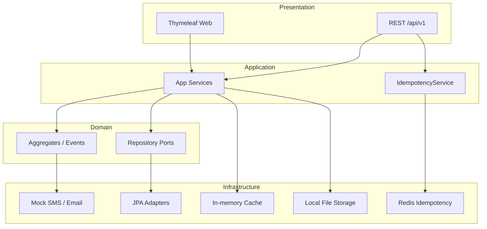

# TLBank Project Overview

Executive overview of the TLBank Digital Lending Platform repository. This document orients readers quickly; deeper detail lives in the handbooks and SDD set linked at the end.

> **Fictional portfolio project.** Not production software. Not affiliated with any real financial institution.

| Meta | Value |
| --- | --- |
| Module | `sp2-springboot/` |
| Artifact | `tlbank-lending` |
| Base package | `com.tlbank.lending` |
| Status | Portfolio / learning — local staging on a self-hosted Mac |

---

## 1. Project Summary

TLBank is a **modular monolith** Spring Boot backend that simulates a digital credit card application and credit review workflow. It is built as a long-term engineering portfolio: architecture, security, testing, CI/CD, containers, Redis idempotency, and local Infrastructure as Code are integrated in one system so trade-offs can be discussed together.

| Item | Description |
| --- | --- |
| Domain | Credit card application intake, OTP verification, document upload, credit review |
| Delivery | Single deployable JAR (`tlbank-lending`) |
| Surfaces | Public applicant web + REST API; internal reviewer/admin web + REST API |
| Environments | `dev` (H2), Docker staging (SQL Server on local Mac), `prod` profile configured but not deployed |

---

## 2. Business Goal

Enable a fictional bank to run an end-to-end digital lending intake:

1. Applicants browse card products and submit applications.
2. Applicants verify identity via OTP and upload supporting documents.
3. Applicants submit completed applications for credit review.
4. Reviewers evaluate cases and approve or reject them.
5. Administrators manage users, parameters, caches, audit logs, and reports.

The narrative is intentionally simple so engineering concerns—state machines, idempotency, audit, side-effect isolation—stay visible.

---

## 3. Problem Statement

A credit card application backend must solve several recurring backend problems at once:

| Problem | Why it matters here |
| --- | --- |
| Workflow integrity | Applications must move through valid states only (`INIT` → … → `APPROVED` / `REJECTED`) |
| Duplicate submissions | Client retries on create must not produce duplicate applications |
| Side-effect isolation | SMS/email failures must not roll back core workflow commits |
| Role separation | Applicants, reviewers, and admins need different access paths |
| Environment fidelity | Fast local iteration (H2) vs staging closer to SQL Server |
| Operability | Migrations, health checks, scheduled cleanup, and deployable containers |

TLBank demonstrates practical answers to these problems in one codebase, without claiming enterprise production maturity.

---

## 4. High-level Architecture

**Style:** Clean / Hexagonal Architecture + DDD-lite.  
**Rule:** Outer layers depend inward; the domain does not depend on Spring, JPA, or infrastructure implementations.

```text
presentation → application → domain ← infrastructure
```



| Layer | Responsibility |
| --- | --- |
| Presentation | Controllers, DTOs at the edge, exception handling |
| Application | Use cases, transactions, orchestration |
| Domain | Aggregates, value objects, events, ports, workflow rules |
| Infrastructure | JPA, cache, Redis idempotency, storage, reports, schedulers, mock notifications |
| Security | Session-based Spring Security, RBAC |

Integration between modules uses **in-process Spring events** (not a message broker). Delivery is a **single JAR**, not microservices.

---

## 5. Folder Structure Overview

### Monorepo (Git root)

```text
Project2/
├── .github/workflows/     # CI, Terraform validate, Markdown lint
├── infra/local/           # Local Terraform (hashicorp/local only)
├── sp2-springboot/        # ★ TLBank backend
└── SP2/                   # Legacy (outside CI scope)
```

### Module (`sp2-springboot/`)

```text
sp2-springboot/
├── src/main/java/com/tlbank/lending/
│   ├── presentation/      # REST + Thymeleaf
│   ├── application/       # Use cases, DTOs, idempotency
│   ├── domain/            # Aggregates, ports, events
│   ├── infrastructure/    # JPA, cache, Redis, storage, reports, schedulers
│   ├── security/          # Spring Security
│   └── common/            # Config, audit, exceptions
├── src/main/resources/    # YAML profiles, Flyway, templates
├── src/test/              # Unit + integration tests
├── docker/                # Image build context
├── docs/                  # This overview, handbooks, SDD
├── scripts/               # Local verify helpers
├── docker-compose.yml
├── pom.xml
└── README.md
```

---

## 6. Main Technologies

Listed for orientation only — see [technology-handbook.md](04-technology-handbook.md) for depth.

| Area | Choice |
| --- | --- |
| Language / runtime | Java 17 |
| Framework | Spring Boot 3.4.x |
| Build | Maven (`mvnw`) |
| Persistence | Spring Data JPA / Hibernate, Flyway |
| Databases | H2 (`dev` / tests), SQL Server 2022 (staging) |
| Security | Spring Security 6 — session form login, BCrypt |
| UI | Thymeleaf + Bootstrap |
| API docs | springdoc-openapi |
| Idempotency | Redis (`dev`) or in-memory store |
| Cache | In-process `CacheStore` |
| Reports | Apache POI (Excel), iText (PDF) |
| Containers | Docker multi-stage build, Docker Compose |
| CI/CD | GitHub Actions, GHCR, self-hosted macOS runner |
| IaC practice | Terraform `infra/local` (local provider, no cloud) |

---

## 7. Major Business Features

| Feature | Actors | One-line purpose |
| --- | --- | --- |
| Login / session | Admin, Reviewer | Authenticate staff; single concurrent session |
| Card product catalog | Applicant | Browse enabled products |
| Application create / query | Applicant | Start and inspect applications |
| OTP send / verify | Applicant | Identity check before document upload |
| Document upload | Applicant | Attach ID / income / residence proofs |
| Application submit / cancel | Applicant | Enter review queue or abandon early |
| Credit review | Reviewer | Search cases; approve or reject |
| Notifications | System | Mock SMS/email on lifecycle milestones |
| Audit log | Admin / system | Cross-cutting action trail |
| User management | Admin | Create and enable/disable internal users |
| System parameters | Admin | Tunable runtime settings with cache |
| Cache management | Admin | Evict / refresh product and parameter caches |
| Schedulers | System / Admin | OTP cleanup, cache refresh, daily stats |
| Report export | Admin | Daily statistics as Excel or PDF |
| Idempotency | API client | Safe retries on application create |

**Applicant state path (simplified):**

```text
INIT → OTP_VERIFIED → DOCUMENT_UPLOADED → SUBMITTED → UNDER_REVIEW → APPROVED | REJECTED
```

---

## 8. Development Workflow

Typical local loop:

```bash
cd sp2-springboot
mvn spring-boot:run -Dspring-boot.run.profiles=dev   # H2; Redis for idempotency if configured
mvn clean verify                                       # 36 test classes / 133 methods + JaCoCo
```

| Step | Practice |
| --- | --- |
| Run | `dev` profile, H2 in-memory, optional Redis at `localhost:6379` for idempotency |
| Test | Domain unit tests, service tests, Spring Boot integration tests |
| Coverage | `target/site/jacoco/index.html` after `mvn verify` |
| Docs / API | Swagger UI when enabled on `dev` / `staging` |
| Quality gate | Push/PR to `main` or `develop` runs Maven verify when `sp2-springboot/**` changes |

---

## 9. Deployment Workflow

| Stage | What happens |
| --- | --- |
| CI (automatic) | `mvn clean verify` → Trivy scan (report-only) → on `main`, build and push `ghcr.io/.../tlbank-backend` |
| CD (manual) | `workflow_dispatch` on a self-hosted macOS runner pulls the image and restarts SQL Server + app via Docker Compose |
| Staging | Local Mac only — not a cloud environment |
| Terraform | `infra/local` validates IaC workflow; does **not** provision cloud resources |

```text
Push / PR → CI verify (+ image on main) → manual workflow_dispatch → local Docker staging
```

There is **no automatic promote-to-staging** and **no cloud production** in this repository.

---

## 10. Repository Navigation Guide

| If you need… | Start here |
| --- | --- |
| Recruiter / quick start | [../README.md](../../README.md) |
| Engineering wiki / onboarding | [repository-handbook.md](01-repository-handbook.md) |
| Feature → files → flows | [architecture-handbook.md](02-architecture-handbook.md) |
| Business capability chapters | [business-feature-handbook.md](03-business-feature-handbook.md) |
| Stack chapter per technology | [technology-handbook.md](04-technology-handbook.md) |
| Formal design (SDD index) | [00-sdd-overview.md](../design/00-sdd-overview.md) |
| State machine | [08-workflow-design.md](../design/08-workflow-design.md) |
| Security matrix | [07-security-design.md](../design/07-security-design.md) |
| Testing strategy | [16-testing-strategy.md](../design/16-testing-strategy.md) |
| Deployment design | [17-deployment-design.md](../design/17-deployment-design.md) |
| CI workflow source | [../../.github/workflows/ci.yml](../../../.github/workflows/ci.yml) |

### Suggested reading order

1. This overview (orientation)
2. [README.md](../../README.md) (run and highlights)
3. [repository-handbook.md](01-repository-handbook.md) (wiki entry)
4. One deep handbook matching your question (architecture / business / technology)
5. Relevant SDD chapter when you need design rationale

---

*Executive overview only. Prefer the handbooks and SDD documents for implementation detail.*
