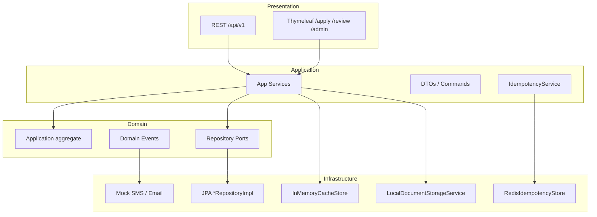
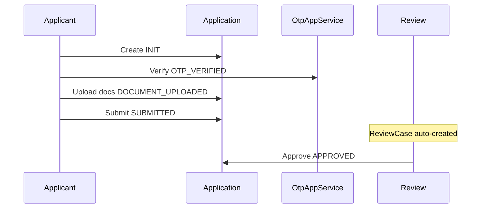
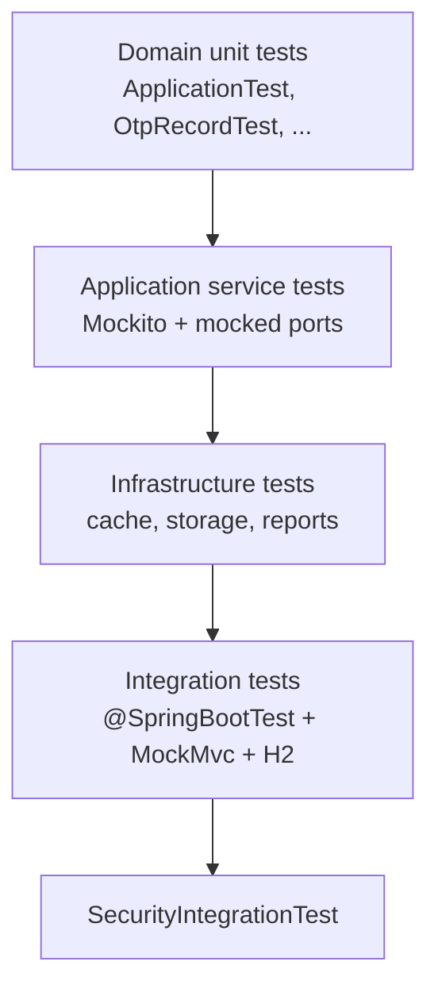
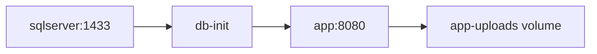
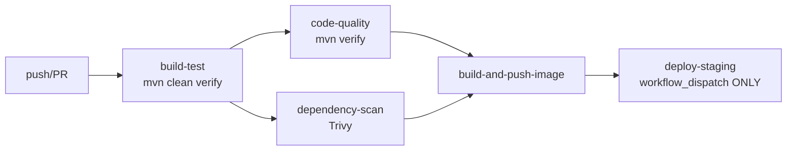

# TLBank Repository Handbook

Internal engineering wiki for the `sp2-springboot` monorepo module. This document is the **entry point** for navigation, onboarding, and interview preparation.

> **Fictional portfolio project.** Not production software. Not affiliated with any real financial institution.

| Meta | Value |
| --- | --- |
| Repository | [DAXMZB/Project](https://github.com/DAXMZB/Project) (monorepo root) |
| Module | `sp2-springboot/` |
| Artifact | `tlbank-lending` |
| Base package | `com.tlbank.lending` |
| Entry class | `TlbankLendingApplication.java` |
| Status | Portfolio / learning — local staging on self-hosted Mac |

---

## Table of Contents

1. [How to Use This Wiki](#1-how-to-use-this-wiki)
2. [Repository Map](#2-repository-map)
3. [Architecture](#3-architecture)
4. [Domain-Driven Design (DDD)](#4-domain-driven-design-ddd)
5. [Business Features](#5-business-features)
6. [Technology Stack](#6-technology-stack)
7. [Security](#7-security)
8. [Redis](#8-redis)
9. [Testing](#9-testing)
10. [Deployment](#10-deployment)
11. [Docker](#11-docker)
12. [CI/CD](#12-cicd)
13. [Terraform](#13-terraform)
14. [Configuration & Profiles](#14-configuration--profiles)
15. [Database & Migrations](#15-database--migrations)
16. [Observability & Operations](#16-observability--operations)
17. [Documentation Index](#17-documentation-index)
18. [Known Gaps & Roadmap](#18-known-gaps--roadmap)
19. [Interview Navigation Guide](#19-interview-navigation-guide)

**Deep-dive handbooks (generated from source scan):**

| Handbook | Path | Scope |
| --- | --- | --- |
| Architecture | [architecture-handbook.md](02-architecture-handbook.md) | Layers, modules, flows, files per feature |
| Technology | [technology-handbook.md](04-technology-handbook.md) | One chapter per technology (35) |
| Business | [business-feature-handbook.md](03-business-feature-handbook.md) | One chapter per business capability (15) |
| Public README | [../README.md](../../README.md) | Recruiters, badges, quick start |

**System Design Documents (SDD):**

| Doc | Topic |
| --- | --- |
| [00-sdd-overview.md](../design/00-sdd-overview.md) | SDD index |
| [01-system-context.md](../design/01-system-context.md) | Context diagram |
| [02-architecture-design.md](../design/02-architecture-design.md) | Layer rules |
| [04-domain-model.md](../design/04-domain-model.md) | Aggregates, VOs |
| [07-security-design.md](../design/07-security-design.md) | Auth matrix |
| [08-workflow-design.md](../design/08-workflow-design.md) | State machine |
| [16-testing-strategy.md](../design/16-testing-strategy.md) | Test pyramid |
| [17-deployment-design.md](../design/17-deployment-design.md) | Environments |

---

## 1. How to Use This Wiki

### By role

| Role | Start here | Then |
| --- | --- | --- |
| New engineer | [Repository Map](#2-repository-map) → [Architecture](#3-architecture) | [business-feature-handbook.md](03-business-feature-handbook.md) |
| Interviewer | [Interview Navigation Guide](#19-interview-navigation-guide) | [architecture-handbook.md](02-architecture-handbook.md) |
| DevOps / platform | [CI/CD](#12-cicd) → [Docker](#11-docker) → [Deployment](#10-deployment) | [17-deployment-design.md](../design/17-deployment-design.md) |
| Domain / backend | [DDD](#4-domain-driven-design-ddd) → [Business Features](#5-business-features) | [04-domain-model.md](../design/04-domain-model.md) |

### By question type

| Question | Section |
| --- | --- |
| "What happens when user submits?" | [Business Features](#5-business-features) → [business-feature-handbook.md § Card Application](03-business-feature-handbook.md) |
| "Where is OTP validated?" | [architecture-handbook.md § OTP](02-architecture-handbook.md) |
| "Why Redis?" | [Redis](#8-redis) |
| "How do I run tests?" | [Testing](#9-testing) |
| "How does deploy work?" | [CI/CD](#12-cicd) |

### Commands cheat sheet

```bash
# Local dev (H2)
cd sp2-springboot
mvn spring-boot:run -Dspring-boot.run.profiles=dev

# Full test suite + JaCoCo
mvn clean verify

# Docker staging stack
cp .env.example .env && docker-compose up -d
./scripts/verify.sh

# Terraform (repo root)
cd infra/local && terraform init && terraform plan
```

---

## 2. Repository Map

### Monorepo layout

```text
Project2/                          # Git root
├── .github/workflows/
│   ├── ci.yml                       # Build, test, Trivy, GHCR, manual deploy
│   ├── terraform.yml                # infra/local validation
│   └── markdown.yml                 # Markdown lint
├── infra/local/                     # Terraform (local provider only)
├── sp2-springboot/                  # ★ TLBank backend (this handbook)
│   ├── src/main/java/com/tlbank/lending/
│   ├── src/main/resources/
│   ├── src/test/
│   ├── docker/
│   ├── docs/                        # Wiki + SDD
│   ├── scripts/
│   ├── pom.xml
│   ├── docker-compose.yml
│   └── README.md
└── SP2/                             # Legacy (not CI scope)
```

### Layer packages (`com.tlbank.lending`)

```text
presentation/     REST + Thymeleaf controllers, GlobalExceptionHandler
application/      Use cases, DTOs, IdempotencyService
domain/           Aggregates, events, repository ports
infrastructure/   JPA, cache, Redis idempotency, storage, schedulers, reports
security/         Spring Security config + handlers
common/           Audit, config, exceptions, ApiResponse
```

### Dependency rule

```text
presentation → application → domain ← infrastructure
```

Domain must not depend on Spring, JPA, or infrastructure implementations. Infrastructure implements domain ports.

---

## 3. Architecture

### 3.1 Style

| Aspect | Choice |
| --- | --- |
| Pattern | Clean / Hexagonal Architecture + DDD-lite |
| Delivery | Modular monolith (single JAR) |
| UI | Server-rendered Thymeleaf + REST API |
| Integration | In-process Spring events (not message broker) |

### 3.2 Layer diagram



### 3.3 Request path (typical)

```text
HTTP → SecurityFilterChain → DispatcherServlet
     → Controller (@Valid DTO)
     → Application Service (@Transactional)
     → Domain aggregate / port
     → Infrastructure adapter (JPA, file, cache, Redis)
     → Database / disk / memory
```

Cross-cutting: `@Auditable` → `AuditAspect` → async `audit_logs`.

### 3.4 Repository ports

| Port | Implementation | Notes |
| --- | --- | --- |
| `ApplicationRepository` | `ApplicationRepositoryImpl` | Manual domain ↔ entity mapping |
| `ReviewCaseRepository` | `ReviewCaseRepositoryImpl` | |
| `UserRepository` | `UserRepositoryImpl` | |
| `OtpRepository` | `OtpRepositoryImpl` | |
| `CardProductRepository` | `CardProductRepositoryImpl` | `@Primary` `CachedCardProductRepository` |
| `SystemParameterRepository` | `SystemParameterRepositoryImpl` | |
| `IdempotencyStore` | `RedisIdempotencyStore` / `InMemoryIdempotencyStore` | Property-gated |
| `AuditLogRepository` | Spring Data JPA | No domain port |

### 3.5 Further reading

- [architecture-handbook.md](02-architecture-handbook.md) — 18 modules, sequence diagrams, file lists
- [02-architecture-design.md](../design/02-architecture-design.md) — design rationale
- [03-package-structure.md](../design/03-package-structure.md) — package tree

---

## 4. Domain-Driven Design (DDD)

### 4.1 Bounded context

Single context: **Digital Lending (credit card application & review)**.

### 4.2 Aggregates

| Aggregate | Root | Identity | Key behavior |
| --- | --- | --- | --- |
| Application | `Application` | `ApplicationId` | State machine, workflow history |
| ReviewCase | `ReviewCase` | `ReviewCaseId` | Review decisions |
| User | `User` | `UserId` | Enable/disable |
| CardProduct | `CardProduct` | `CardProductId` | Catalog (read-heavy) |
| OtpRecord | `OtpRecord` | `otpId` / mobile | Verify, expiry, retry |
| SystemParameter | `SystemParameter` | `paramId` | Runtime config |

### 4.3 Application state machine

```text
INIT → OTP_VERIFIED → DOCUMENT_UPLOADED → SUBMITTED → UNDER_REVIEW → APPROVED | REJECTED
         ↓                    ↓
      CANCELLED            CANCELLED
```

- Rules: `ApplicationStatus.ALLOWED_TRANSITIONS` in `ApplicationStatus.java`
- Enforcement: `Application.transitionTo()` → `WorkflowException` on invalid move
- History: every transition appends `WorkflowHistory` inside aggregate

### 4.4 Value objects

| VO | File | Validation |
| --- | --- | --- |
| `MobileNumber` | `domain/application/MobileNumber.java` | `^09\d{8}$` |
| `Email` | `domain/application/Email.java` | Format rules |
| `ApplicationId` | `domain/application/ApplicationId.java` | Generated `APP-...` |
| `Address` | `domain/application/Address.java` | Immutable record |
| `DocumentInfo` | `domain/application/DocumentInfo.java` | Metadata only |

### 4.5 Domain events

| Event | Published when | Handlers |
| --- | --- | --- |
| `ApplicationSubmittedEvent` | `ApplicationAppService.submit()` | `ReviewEventHandler`, `NotificationEventHandler` |
| `ApplicationApprovedEvent` | `ReviewAppService.approveCase()` | `NotificationEventHandler` |
| `ApplicationRejectedEvent` | `ReviewAppService.rejectCase()` | `NotificationEventHandler` |
| `ApplicationCancelledEvent` | — | **Defined, never published** |
| `OtpGeneratedEvent` | — | **Defined; OTP uses direct notification** |

### 4.6 DDD trade-offs in this repo

| Practice | Implemented | Gap |
| --- | --- | --- |
| Aggregate boundaries | Yes — ID references between aggregates | |
| Domain-free of framework | Mostly — `WorkflowDomainService` has `@Service` | |
| Ubiquitous language | `Application`, `ReviewCase`, `OTP` | |
| Anti-corruption layer | `*RepositoryImpl` maps entity ↔ domain | Manual, no MapStruct mappers used |
| Domain events | Spring `ApplicationEventPublisher` | Sync, in-process only |

### 4.7 Further reading

- [04-domain-model.md](../design/04-domain-model.md)
- [08-workflow-design.md](../design/08-workflow-design.md)
- [business-feature-handbook.md](03-business-feature-handbook.md)

---

## 5. Business Features

### 5.1 Feature catalog

| Feature | Actors | Entry | Service |
| --- | --- | --- | --- |
| Login | Admin, Reviewer | `/login`, `/api/v1/auth/login` | Spring Security |
| OTP | Applicant | `/api/v1/otp/**` | `OtpAppService` |
| Card catalog | Applicant | `/api/v1/products` | `ApplicationAppService` |
| Card application | Applicant | `/api/v1/applications` | `ApplicationAppService` |
| Document upload | Applicant | `POST .../documents` | `ApplicationAppService` |
| Review workflow | Reviewer | `/review/**`, `/api/v1/review/**` | `ReviewAppService` |
| Approval / reject | Reviewer | `POST .../approve`, `.../reject` | `ReviewAppService` |
| Notifications | System | Events + OTP | `NotificationServiceImpl` |
| Audit log | Admin | `/api/v1/admin/audit-logs` | `AuditLogService` |
| Schedulers | System / Admin | Cron + `/api/v1/admin/schedulers/**` | Scheduler beans |
| Reports | Admin | `/api/v1/reports/daily-statistics` | `ReportAppService` |
| User management | Admin | `/api/v1/admin/users` | `UserAppService` |
| System parameters | Admin | `/api/v1/admin/system-parameters` | `SystemParameterService` |
| Cache management | Admin | `/api/v1/admin/cache/**` | `CacheManagementService` |
| Idempotency | Applicant API client | `Idempotency-Key` header | `IdempotencyService` |

### 5.2 End-to-end applicant journey



### 5.3 Further reading

- [business-feature-handbook.md](03-business-feature-handbook.md) — full chapters per feature
- [09-module-design.md](../design/09-module-design.md)
- [06-api-specification.md](../design/06-api-specification.md)

---

## 6. Technology Stack

### 6.1 Runtime & framework

| Layer | Technology | Version / file |
| --- | --- | --- |
| Language | Java | 17 — `pom.xml` |
| Framework | Spring Boot | 3.4.2 |
| Web | Spring MVC | `spring-boot-starter-web` |
| Security | Spring Security | Session + BCrypt(12) |
| Persistence | Spring Data JPA / Hibernate | `ddl-auto: validate` |
| Migrations | Flyway | H2 + SQL Server scripts |
| Validation | Jakarta Bean Validation | `@Valid` on DTOs |
| AOP | Spring AOP | Audit |
| Async | `@EnableAsync` | Audit writes |
| Scheduling | `@Scheduled` | 3 cron jobs |
| API docs | SpringDoc OpenAPI | 2.7.0 |
| Reports | Apache POI, iText 7 | Excel + PDF |
| Build | Maven | `mvnw` |
| Coverage | JaCoCo | 0.8.12 |

### 6.2 Data stores

| Store | Profile | Purpose |
| --- | --- | --- |
| H2 in-memory | `dev`, tests | Fast local + CI tests |
| SQL Server 2022 | `staging`, `prod` config | Docker staging |
| In-memory cache | All | Products + parameters |
| Redis | `dev` idempotency only | `RedisIdempotencyStore` |
| Local disk | All | Document uploads |

### 6.3 Further reading

- [technology-handbook.md](04-technology-handbook.md) — 35 technology chapters
- [00-sdd-overview.md § Technology Stack](../design/00-sdd-overview.md)

---

## 7. Security

### 7.1 Model summary

| Aspect | Implementation |
| --- | --- |
| Authentication | Form login `/api/v1/auth/login`, session cookie `JSESSIONID` |
| Password storage | BCrypt strength 12 |
| Session timeout | 30 minutes (`application.yml`) |
| Concurrent sessions | Max 1 (`SecurityConfig`) |
| Authorization | URL rules + `@PreAuthorize` |
| CSRF | On for web; disabled for `/api/**` |
| Applicant APIs | `permitAll` on apply + applications + OTP |

### 7.2 Role matrix

| DB role | Spring authority | Access |
| --- | --- | --- |
| `ADMIN` | `ROLE_ADMIN` | `/admin/**`, `/api/v1/admin/**`, reports |
| `REVIEWER` | `ROLE_REVIEWER` | `/review/**`, `/api/v1/review/**` |
| `APPLICANT` | `ROLE_USER` | Login only (not applicant flow) |

### 7.3 Security files

```text
security/config/SecurityConfig.java
security/service/UserDetailsServiceImpl.java
security/handler/LoginSuccessHandler.java
security/handler/LoginFailureHandler.java
security/handler/LogoutSuccessHandlerImpl.java
security/handler/CustomAuthenticationEntryPoint.java
security/handler/CustomAccessDeniedHandler.java
security/filter/MdcLoggingFilter.java
src/test/.../SecurityIntegrationTest.java
```

### 7.4 Portfolio security caveats

- Applicant endpoints are anonymous — identity via OTP only, not login.
- Demo passwords in Flyway seed files — local use only.
- Swagger enabled in staging — disable or protect in real deployments.
- H2 console permitted in dev — must not reach production.

### 7.5 Further reading

- [07-security-design.md](../design/07-security-design.md)
- [business-feature-handbook.md § Login](03-business-feature-handbook.md)
- [technology-handbook.md § Spring Security](04-technology-handbook.md)

---

## 8. Redis

### 8.1 Scope in this repository

| Uses Redis? | Feature |
| --- | --- |
| **Yes** | Idempotency store (`dev` profile) |
| **No** | Application cache (in-memory) |
| **No** | HTTP sessions |
| **No** | OTP storage (database) |
| **No** | Docker Compose service |

### 8.2 Configuration

```yaml
# application-dev.yml
spring.data.redis.host: localhost
spring.data.redis.port: 6379
tlbank.idempotency.store: redis
tlbank.idempotency.ttl-hours: 24
tlbank.idempotency.key-prefix: "idempotency:applications:"
```

```yaml
# src/test/resources/application-dev.yml
tlbank.idempotency.store: memory   # no Redis in CI tests
```

### 8.3 Implementation

| Class | Role |
| --- | --- |
| `RedisIdempotencyStore` | `GET`/`SET` JSON + `SETNX` lock |
| `InMemoryIdempotencyStore` | Test / `memory` profile |
| `IdempotencyService` | Hash body, cache response, 409 on conflict |

### 8.4 Key patterns

| Key | TTL | Purpose |
| --- | --- | --- |
| `idempotency:applications:{key}` | 24h | Cached response |
| `idempotency:applications:{key}:lock` | 30s | In-flight guard |

### 8.5 Gaps

- `application-staging.yml` does not set `tlbank.idempotency.store`.
- `docker-compose.yml` has no Redis service.
- Local dev requires Redis on `localhost:6379` for idempotent create.

### 8.6 Further reading

- [12-cache-design.md](../design/12-cache-design.md)
- [business-feature-handbook.md § Idempotency](03-business-feature-handbook.md)
- [technology-handbook.md § Redis](04-technology-handbook.md)

---

## 9. Testing

### 9.1 Summary

| Metric | Value |
| --- | --- |
| Test classes | 36 |
| Test methods | 133 |
| Command | `mvn clean verify` |
| Profile | `@ActiveProfiles("dev")` |
| Database | H2 in-memory |
| Redis | Not required (`idempotency.store=memory` in test yml) |

### 9.2 Test pyramid



### 9.3 Categories

| Category | Examples | Proves |
| --- | --- | --- |
| Domain | `ApplicationTest`, `WorkflowDomainServiceTest` | State machine, VOs |
| Application | `ApplicationAppServiceTest`, `OtpAppServiceTest` | Orchestration |
| Integration | `ApplicationFlowIntegrationTest`, `ReviewFlowIntegrationTest` | Full HTTP → DB path |
| Security | `SecurityIntegrationTest` | Login, RBAC, CSRF |
| Idempotency | `ApplicationIdempotencyIntegrationTest` | Replay semantics |
| Infrastructure | `ExcelReportGeneratorTest`, `InMemoryCacheStoreTest` | Adapters |

### 9.4 JaCoCo

- Report: `target/site/jacoco/index.html` after `mvn verify`
- Excludes: `config`, `dto`, `entity`, `*Application.class`, `*Embeddable.class`

### 9.5 Conventions

- MockMvc (not TestRestTemplate) for HTTP tests
- Precomputed BCrypt hash constant in security tests
- Domain aggregates never mocked
- Repository ports mocked in application unit tests
- `Clock` bean for deterministic time

### 9.6 Further reading

- [16-testing-strategy.md](../design/16-testing-strategy.md)
- [technology-handbook.md § JUnit / JaCoCo](04-technology-handbook.md)

---

## 10. Deployment

### 10.1 Environments

| Environment | Profile | Database | How deployed | Production? |
| --- | --- | --- | --- | --- |
| Local dev | `dev` | H2 | `mvn spring-boot:run` | No |
| Docker local | `staging` | SQL Server container | `docker-compose up` | No |
| CI staging | `staging` | SQL Server on Mac | Manual `workflow_dispatch` | No |
| Prod config | `prod` | SQL Server (env vars) | **Not deployed** | Config only |

### 10.2 Staging deploy flow

```text
1. Push to main → CI builds + pushes ghcr.io/<owner>/tlbank-backend:latest
2. Developer triggers workflow_dispatch in GitHub Actions
3. Self-hosted macOS runner writes ~/tlbank/docker-compose.yml
4. docker compose pull app && docker compose up -d
5. Verify: curl http://localhost:8080/actuator/health
```

### 10.3 Secrets (GitHub)

| Secret | Used for |
| --- | --- |
| `MSSQL_SA_PASSWORD` | SQL Server in deploy compose |
| `GHCR_USERNAME` / `GHCR_TOKEN` | Pull image on self-hosted runner |

### 10.4 Profiles

| Profile | Swagger | Flyway location | Notes |
| --- | --- | --- | --- |
| `dev` | On | `migration/` + `dev-seed/` | H2 console |
| `staging` | On | `migration-sqlserver/` | Env var datasource |
| `prod` | Off | `migration-sqlserver/` | WARN logging |

### 10.5 Further reading

- [17-deployment-design.md](../design/17-deployment-design.md)
- [../README.md § Quick Start](../../README.md)
- [technology-handbook.md § Deployment-related](04-technology-handbook.md)

---

## 11. Docker

### 11.1 Artifacts

| File | Purpose |
| --- | --- |
| `docker/app/Dockerfile` | Multi-stage build → `tlbank` non-root user |
| `docker-compose.yml` | SQL Server + db-init + app |
| `docker/sqlserver/init/*.sql` | DB + app user creation |
| `.env.example` | Datasource + SA password template |
| `.dockerignore` | Build context trim |

### 11.2 Dockerfile stages

```text
Stage 1 (builder): eclipse-temurin:17-jdk → ./mvnw clean package -DskipTests -Pstaging
Stage 2 (runtime):  eclipse-temurin:17-jre → java -jar app.jar
                    USER tlbank (non-root)
                    VOLUME /app/uploads, /app/logs
                    -XX:MaxRAMPercentage=75.0
```

### 11.3 Compose services



| Service | Image | Health |
| --- | --- | --- |
| `sqlserver` | `mcr.microsoft.com/mssql/server:2022-latest` | sqlcmd SELECT 1 |
| `db-init` | same | runs init SQL once |
| `app` | build or GHCR pull | Actuator `/actuator/health` |

### 11.4 Scripts

| Script | Purpose |
| --- | --- |
| `scripts/verify.sh` | Health + products API smoke test |
| `scripts/start-dev.sh` | Dev profile startup |
| `scripts/prepare-dev.sh` | Compile + port 8080 cleanup |

### 11.5 Further reading

- [technology-handbook.md § Docker / Compose](04-technology-handbook.md)
- [17-deployment-design.md](../design/17-deployment-design.md)

---

## 12. CI/CD

### 12.1 Workflows

| Workflow | Path | Trigger |
| --- | --- | --- |
| TLBank CI/CD | `.github/workflows/ci.yml` | Push/PR `sp2-springboot/**` on `main`/`develop` |
| Terraform Check | `.github/workflows/terraform.yml` | Push/PR `infra/**` |
| Markdown Check | `.github/workflows/markdown.yml` | `**/*.md` changes |

### 12.2 CI pipeline (`ci.yml`)



| Job | Runner | Blocking? | Notes |
| --- | --- | --- | --- |
| `build-test` | `ubuntu-latest` | Yes | JDK 17 Temurin |
| `code-quality` | `ubuntu-latest` | Yes | Redundant `mvn verify` |
| `dependency-scan` | `ubuntu-latest` | **No** | Trivy `exit-code: 0` |
| `build-and-push-image` | `ubuntu-latest` | Yes | Only `main` push or `workflow_dispatch` |
| `deploy-staging` | `self-hosted, macos` | Manual only | Writes `~/tlbank/docker-compose.yml` |

### 12.3 Image tags

```text
ghcr.io/<lowercase-owner>/tlbank-backend:latest
ghcr.io/<lowercase-owner>/tlbank-backend:<git-sha>
```

### 12.4 CI vs CD

| | CI | CD |
| --- | --- | --- |
| Trigger | Automatic on push/PR | Manual `workflow_dispatch` only |
| Runner | GitHub-hosted Ubuntu | Self-hosted Mac |
| Outcome | Verified JAR + image in GHCR | Local containers restarted |

### 12.5 Further reading

- [../README.md § CI/CD](../../README.md)
- [technology-handbook.md § GitHub Actions / GHCR / Trivy](04-technology-handbook.md)

---

## 13. Terraform

### 13.1 What it is (and is not)

| Is | Is not |
| --- | --- |
| Local IaC practice under `infra/local/` | AWS / Azure / GCP deployment |
| `hashicorp/local` provider | Billable cloud resources |
| CI: fmt, validate, plan | Production infrastructure |

### 13.2 Files

```text
infra/local/main.tf          # local_file resource
infra/local/variables.tf   # app_name, environment, backend_port
infra/local/outputs.tf     # backend_url, generated_doc_path
infra/local/README.md
.github/workflows/terraform.yml
```

### 13.3 What `terraform apply` does

Generates `infra/local/generated-staging-env.md` — a markdown document listing app name, port, and component list. **No servers are created.**

### 13.4 CI job

```bash
terraform init
terraform fmt -check -recursive
terraform validate
terraform plan
```

Working directory: `infra/local`.

### 13.5 Further reading

- [technology-handbook.md § Terraform](04-technology-handbook.md)
- [../../infra/local/main.tf](../../../infra/local/main.tf)

---

## 14. Configuration & Profiles

### 14.1 Key files

```text
src/main/resources/application.yml           # defaults, schedulers, idempotency TTL
src/main/resources/application-dev.yml       # H2, Redis, dev seed
src/main/resources/application-staging.yml   # SQL Server env vars
src/main/resources/application-prod.yml      # SQL Server, Swagger off
src/test/resources/application-dev.yml       # memory idempotency
logback-spring.xml
.env.example                                 # Docker Compose
```

### 14.2 Custom properties (`tlbank.*`)

| Property | Purpose |
| --- | --- |
| `tlbank.notification.mode` | `mock` (default) |
| `tlbank.upload.base-path` | Document storage root |
| `tlbank.scheduler.*.cron` | OTP, cache, stats jobs |
| `tlbank.idempotency.*` | Store, TTL, key prefix |

### 14.3 System parameters (runtime DB config)

| Group | Keys | Consumers |
| --- | --- | --- |
| `OTP` | `expire_minutes`, `max_retry` | `OtpAppService` |
| `UPLOAD` | `max.size.mb` | `LocalDocumentStorageService` |
| `CACHE` | `ttl_seconds` | `CacheTtlProvider` |

---

## 15. Database & Migrations

### 15.1 Tables

| Table | Aggregate / feature |
| --- | --- |
| `users`, `user_roles` | Login, user management |
| `card_products`, `product_features` | Catalog |
| `applications`, `workflow_histories`, `application_documents` | Application |
| `otp_records` | OTP |
| `review_cases`, `review_remarks` | Review |
| `audit_logs` | Audit |
| `system_parameters` | Config |

### 15.2 Migration sets

| Location | Engine | Used by |
| --- | --- | --- |
| `db/migration/V1..V14` | H2 | `dev`, tests |
| `db/dev-seed/V100,V101` | H2 seed | `dev` only |
| `db/migration-sqlserver/V1..V14` | SQL Server | `staging`, `prod` |
| `db/migration-sqlserver/V100` | SQL Server seed | Docker staging |

### 15.3 Rules

- Hibernate `ddl-auto: validate` — Flyway owns schema
- H2 uses `MODE=MSSQLServer` for dialect compatibility
- Two migration trees must be kept aligned manually

### 15.4 Further reading

- [05-database-design.md](../design/05-database-design.md)

---

## 16. Observability & Operations

### 16.1 Health

- `GET /actuator/health` — exposed; used by Docker healthcheck and `scripts/verify.sh`
- `management.endpoint.health.show-details: when_authorized`

### 16.2 Logging

- SLF4J + Logback (`logback-spring.xml`)
- `MdcLoggingFilter` — request context
- Scheduler prefix `[SCHEDULER]`
- Mock notifications: `[MOCK SMS]`, `[MOCK EMAIL]`

### 16.3 Audit trail

- `audit_logs` table — security + business actions
- Admin UI: `/admin/audit-logs`
- Notification log = filtered audit view

### 16.4 Not implemented

- Distributed tracing (OpenTelemetry)
- Centralized log aggregation
- Metrics beyond Actuator defaults
- Alerting

---

## 17. Documentation Index

### 17.1 Wiki handbooks (this generation)

| Document | Lines | Use when |
| --- | --- | --- |
| [repository-handbook.md](01-repository-handbook.md) | This file | Start here |
| [architecture-handbook.md](02-architecture-handbook.md) | Layer/file index | "Where is X implemented?" |
| [technology-handbook.md](04-technology-handbook.md) | Per-tech depth | "How does Redis work here?" |
| [business-feature-handbook.md](03-business-feature-handbook.md) | Per-feature depth | "What is the submit flow?" |

### 17.2 SDD series

| # | File | Topic |
| --- | --- | --- |
| 00 | [00-sdd-overview.md](../design/00-sdd-overview.md) | Overview |
| 01 | [01-system-context.md](../design/01-system-context.md) | Context |
| 02 | [02-architecture-design.md](../design/02-architecture-design.md) | Architecture |
| 03 | [03-package-structure.md](../design/03-package-structure.md) | Packages |
| 04 | [04-domain-model.md](../design/04-domain-model.md) | Domain |
| 05 | [05-database-design.md](../design/05-database-design.md) | Database |
| 06 | [06-api-specification.md](../design/06-api-specification.md) | API |
| 07 | [07-security-design.md](../design/07-security-design.md) | Security |
| 08 | [08-workflow-design.md](../design/08-workflow-design.md) | Workflow |
| 09 | [09-module-design.md](../design/09-module-design.md) | Modules |
| 10 | [10-error-handling.md](../design/10-error-handling.md) | Errors |
| 11 | [11-audit-logging.md](../design/11-audit-logging.md) | Audit |
| 12 | [12-cache-design.md](../design/12-cache-design.md) | Cache |
| 13 | [13-scheduler-design.md](../design/13-scheduler-design.md) | Schedulers |
| 14 | [14-report-design.md](../design/14-report-design.md) | Reports |
| 15 | [15-file-upload-design.md](../design/15-file-upload-design.md) | Uploads |
| 16 | [16-testing-strategy.md](../design/16-testing-strategy.md) | Testing |
| 17 | [17-deployment-design.md](../design/17-deployment-design.md) | Deployment |
| 18 | [18-coding-standards.md](../design/18-coding-standards.md) | Standards |
| 19 | [19-cursor-implementation-roadmap.md](../design/19-cursor-implementation-roadmap.md) | Roadmap |
| 20 | [20-maintenance-and-future-enhancement.md](20-maintenance-and-future-enhancement.md) | Maintenance |

### 17.3 External

| Resource | URL |
| --- | --- |
| CI workflow | [`.github/workflows/ci.yml`](../../../.github/workflows/ci.yml) |
| Terraform workflow | [`.github/workflows/terraform.yml`](../../../.github/workflows/terraform.yml) |
| Public README | [../README.md](../../README.md) |

---

## 18. Known Gaps & Roadmap

### 18.1 Implemented (verified)

- Application state machine with domain validation
- Session security + RBAC
- Redis/in-memory idempotency (create only)
- Dual Flyway (H2 + SQL Server)
- Docker + GHCR + manual self-hosted deploy
- Local Terraform CI
- Mock notifications via domain events
- 133 automated tests

### 18.2 Known gaps

| Gap | Impact |
| --- | --- |
| Staging lacks `tlbank.idempotency.store` | Idempotency bean may be missing in compose deploy |
| No Redis in docker-compose | Dev idempotency needs external Redis |
| `ApplicationCancelledEvent` unused | Cancel has no event side effects |
| Review `start` web-only | No REST API for start review |
| Applicant APIs `permitAll` | Not production-safe |
| Trivy report-only | Vulnerabilities don't block CI |
| MapStruct in pom, unused | Manual mapping in `*RepositoryImpl` |
| `prod` profile not deployed | Config exists only |

### 18.3 Planned (README roadmap — not implemented)

- `RedisCacheStore` for horizontal scaling
- Spring Session + Redis
- Real SMS/email providers
- Kafka / outbox pattern
- Cloud deployment
- Observability stack
- Kubernetes / load testing

See [20-maintenance-and-future-enhancement.md](20-maintenance-and-future-enhancement.md).

---

## 19. Interview Navigation Guide

### 19.1 "Walk me through the project"

1. [Business narrative](#5-business-features) — credit card apply → review → approve
2. [Architecture layers](#3-architecture) — clean/hexagonal monolith
3. [DDD state machine](#4-domain-driven-design-ddd) — `ApplicationStatus`
4. [One differentiator](#8-redis) — Redis idempotency scope
5. [Honest scope](#18-known-gaps--roadmap) — portfolio, local staging, mock notifications

### 19.2 Topic → file map

| Interview topic | Read first |
| --- | --- |
| Why sessions not JWT? | `SecurityConfig.java`, [07-security-design.md](../design/07-security-design.md) |
| How idempotency works | `IdempotencyService.java`, [business-feature-handbook §15](03-business-feature-handbook.md) |
| Invalid workflow transition | `Application.java`, `ApplicationStatus.java` |
| Why manual deploy? | [ci.yml `deploy-staging`](../../../.github/workflows/ci.yml) |
| Domain vs infrastructure | `ApplicationRepositoryImpl.java` |
| Event-driven notifications | `NotificationEventHandler.java` |
| Why two migration folders? | [Database §15](#15-database--migrations) |
| What Terraform does | [Terraform §13](#13-terraform), `infra/local/main.tf` |
| Test strategy | [Testing §9](#9-testing), `ApplicationFlowIntegrationTest.java` |

### 19.3 Payment-domain analogy

| TLBank | Payment equivalent |
| --- | --- |
| Application lifecycle | Transaction state machine |
| OTP | Step-up / 3DS authentication |
| ReviewCase | Fraud / manual review queue |
| Audit log | Transaction ledger |
| Idempotency key | Payment idempotency |

See [08-workflow-design.md](../design/08-workflow-design.md) and [../README.md § Domain Mapping](../../README.md).

---

*Last structured from repository scan. For line-level detail, follow links to specialized handbooks and SDD documents.*
