<!-- markdownlint-disable MD024 -->

# TLBank Business Feature Handbook

One chapter per business capability in `sp2-springboot`. Each section maps purpose → flow → code → data → security.

**Companions:** [architecture-handbook.md](02-architecture-handbook.md) · [technology-handbook.md](04-technology-handbook.md)

---

## Feature Index

| Feature | Primary entry | Service | Domain aggregate |
| --- | --- | --- | --- |
| Login | `AuthController`, Spring Security | — | — |
| OTP Verification | `OtpApiController` | `OtpAppService` | `OtpRecord`, `Application` |
| Card Product Catalog | `CardProductApiController` | `ApplicationAppService` | `CardProduct` |
| Card Application | `ApplicationApiController` | `ApplicationAppService` | `Application` |
| Document Upload | `ApplicationApiController` | `ApplicationAppService` | `Application`, `DocumentInfo` |
| Review Workflow | `ReviewApiController`, `ReviewController` | `ReviewAppService` | `ReviewCase` |
| Approval Workflow | `ReviewApiController`, `ReviewController` | `ReviewAppService` | `ReviewCase`, `Application` |
| Notification | Event handlers / `OtpAppService` | `NotificationServiceImpl` | Domain events |
| Audit Logging | `@Auditable`, login handlers | `AuditLogService` | — |
| Scheduler | `SchedulerApiController` | Scheduler beans | — |
| Report | `ReportApiController` | `ReportAppService` | — |
| User Management | `UserManagementApiController` | `UserAppService` | `User` |
| System Parameters | `SystemParameterApiController` | `SystemParameterService` | `SystemParameter` |
| Cache Management | `CacheManagementApiController` | `CacheManagementService` | — |
| Idempotency | `ApplicationApiController` | `IdempotencyService` | — |

---

# 1. Login

## Business Purpose

Authenticate internal bank staff (ADMIN, REVIEWER) for the admin and review portals. Establish a server-side session so protected routes (`/admin/**`, `/review/**`) can be accessed. Applicant apply flow does not require login.

## Execution Flow

1. User opens `GET /login` → `AuthController` renders `auth/login.html`.
2. User submits credentials to `POST /api/v1/auth/login` (form fields `username`, `password`).
3. Spring Security `DaoAuthenticationProvider` delegates to `UserDetailsServiceImpl.loadUserByUsername()`.
4. `UserJpaRepository.findByUsername()` loads `UserEntity`; roles mapped to `ROLE_ADMIN`, `ROLE_REVIEWER`, or `ROLE_USER` (from DB `APPLICANT`).
5. BCrypt password comparison via `PasswordEncoder` bean (strength 12).
6. **Success:** `LoginSuccessHandler` updates `users.last_login_at`, writes `USER_LOGIN` to `audit_logs`, returns JSON `LoginResponse` or role-based redirect (`/admin/**`, `/review/cases`).
7. **Failure:** `LoginFailureHandler` writes `USER_LOGIN_FAILED`, returns 401 or redirect `?error`.
8. `POST /api/v1/auth/logout` → `LogoutSuccessHandlerImpl` writes `USER_LOGOUT`, invalidates `JSESSIONID`.
9. `maximumSessions(1)` — second login invalidates prior session via `SessionRegistry`.

## Sequence Diagram

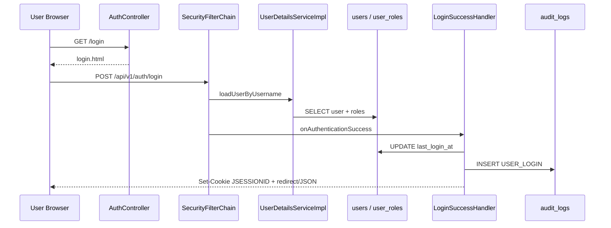

## Related Classes

| Layer | Class |
| --- | --- |
| Web | `presentation.web.AuthController` |
| Security | `security.config.SecurityConfig` |
| Security | `security.service.UserDetailsServiceImpl` |
| Security | `security.handler.LoginSuccessHandler` |
| Security | `security.handler.LoginFailureHandler` |
| Security | `security.handler.LogoutSuccessHandlerImpl` |
| Security | `security.handler.SessionExpiredStrategy` |
| Security | `security.filter.MdcLoggingFilter` |
| Persistence | `infrastructure.persistence.user.UserJpaRepository` |
| Persistence | `infrastructure.persistence.user.UserEntity` |
| Response | `application.dto.response.LoginResponse` |

## Related Packages

```text
com.tlbank.lending.presentation.web
com.tlbank.lending.security.config
com.tlbank.lending.security.service
com.tlbank.lending.security.handler
com.tlbank.lending.security.filter
com.tlbank.lending.infrastructure.persistence.user
```

## Database Tables

| Table | Usage |
| --- | --- |
| `users` | Credentials, profile, `last_login_at` |
| `user_roles` | `ADMIN`, `REVIEWER`, `APPLICANT` (mapped to `ROLE_USER`) |
| `audit_logs` | `USER_LOGIN`, `USER_LOGIN_FAILED`, `USER_LOGOUT` |

Seed: `db/dev-seed/V100__seed_test_data.sql` (dev), `db/migration-sqlserver/V100__seed_staging_data.sql` (staging).

## Redis Usage

None. Sessions are server-side in-memory (default servlet container session store). Not externalized to Redis.

## Security

| Control | Implementation |
| --- | --- |
| Password hashing | BCrypt strength 12 — `SecurityConfig.passwordEncoder()` |
| Session | `SessionCreationPolicy.IF_REQUIRED`, 30m timeout — `application.yml` |
| Concurrent sessions | `maximumSessions(1)` — `SecurityConfig` |
| CSRF | Enabled for web forms; disabled for `/api/**` |
| Role mapping | `UserDetailsServiceImpl` — `APPLICANT` → `ROLE_USER` |

## Validation

- No Bean Validation DTO on login — Spring Security validates non-empty credentials.
- Disabled users: `UserEntity` enabled flag checked in `UserDetailsServiceImpl`.

## Possible Interview Questions

- **Why sessions instead of JWT for this project?** Browser portal, logout, and single-session control — see `SecurityConfig` and README design decisions.
- **Where is login audited?** `LoginSuccessHandler` / `LoginFailureHandler` write directly to `AuditLogRepository` (not `@Auditable`).
- **What happens on second login?** `maximumSessions(1)` expires prior session via `SessionExpiredStrategy`.

## Design Decisions

- Form login at `/api/v1/auth/login` supports both JSON API clients and Thymeleaf form posts.
- `MdcLoggingFilter` adds request context before security for log correlation.
- Dev H2 console permitted — `SecurityConfig` `permitAll` on `/h2-console/**` when dev profile disables frame options.

## Trade-offs

| Decision | Benefit | Cost |
| --- | --- | --- |
| Session-based auth | Simple logout, session invalidation | Not horizontally scalable without Spring Session + Redis |
| Single concurrent session | Prevents shared credential abuse in demo | Legitimate multi-device use blocked |
| Login audit outside AOP | Explicit control over failure path | Two audit patterns in codebase |

---

# 2. OTP Verification

## Business Purpose

Verify applicant mobile ownership before document upload. OTP acts as step-up authentication in the application workflow: `INIT` → `OTP_VERIFIED`.

## Execution Flow

### Send OTP

1. `POST /api/v1/otp/actions/send` with `SendOtpRequest` (`applicationId`, `mobile`, `purpose`).
2. Or `GET /apply/otp` on web — `ApplicationWebController` auto-invokes send.
3. `OtpAppService.sendOtp()` cancels any existing PENDING OTP for the mobile.
4. Reads `OTP.expire_minutes` (default 5) and `OTP.max_retry` (default 3) from `SystemParameterService`.
5. Generates 6-digit code via `SecureRandom`.
6. Saves `OtpRecord` with status `PENDING`, `expiredAt = now + expireMinutes`.
7. `AuditContext.put("otpCode", otpCode)` for audit detail.
8. `NotificationService.sendOtpNotification()` — synchronous mock SMS + email.
9. Returns masked mobile and expiry in `OtpResponse`.

### Verify OTP

1. `POST /api/v1/otp/actions/verify` with `VerifyOtpRequest`.
2. Load latest PENDING `OtpRecord` by mobile.
3. `OtpRecord.verify(code, maxRetry, clock)` — checks expiry, retry limit, code match.
4. On mismatch: increment retry, throw `OTP_MISMATCH`; audit may record failure path.
5. Load `Application` by `applicationId`.
6. If status `INIT` → `application.verifyOtp("APPLICANT")` → `OTP_VERIFIED`.
7. If already `OTP_VERIFIED`, idempotent success.
8. Other statuses → `WorkflowException`.
9. `@Auditable(OTP_VERIFY_SUCCESS)` on success path.

### Background cleanup

`OtpCleanupScheduler` marks expired PENDING records as `EXPIRED` on cron (`tlbank.scheduler.otp-cleanup.cron`).

## Sequence Diagram

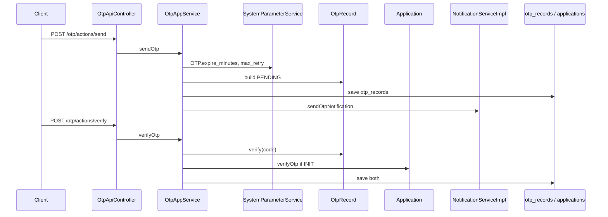

## Related Classes

| Layer | Class |
| --- | --- |
| API | `presentation.api.v1.OtpApiController` |
| Web | `presentation.web.ApplicationWebController` (auto-send on `/apply/otp`) |
| Service | `application.otp.service.OtpAppService` |
| Service | `application.otp.service.SendOtpCommand`, `VerifyOtpCommand` |
| Domain | `domain.otp.OtpRecord` |
| Domain | `domain.otp.OtpStatus`, `OtpPurpose`, `VerifyResult` |
| Domain | `domain.application.Application` |
| Domain | `domain.application.MobileNumber` |
| Notification | `application.notification.service.NotificationServiceImpl` |
| Config | `application.parameter.service.SystemParameterService` |
| Scheduler | `infrastructure.scheduler.OtpCleanupScheduler` |
| DTO | `application.dto.request.SendOtpRequest`, `VerifyOtpRequest` |

## Related Packages

```text
com.tlbank.lending.presentation.api.v1
com.tlbank.lending.application.otp.service
com.tlbank.lending.domain.otp
com.tlbank.lending.domain.application
com.tlbank.lending.infrastructure.persistence.otp
com.tlbank.lending.infrastructure.scheduler
```

## Database Tables

| Table | Columns / usage |
| --- | --- |
| `otp_records` | `mobile`, `otp_code`, `status`, `retry_count`, `expired_at`, `verified_at` |
| `applications` | Status updated `INIT` → `OTP_VERIFIED` |
| `workflow_histories` | Transition row on OTP verify |
| `system_parameters` | `OTP.expire_minutes`, `OTP.max_retry` |

Migrations: `V4__create_otp_records.sql`, `V12__extend_otp_records_for_sprint6.sql`.

## Redis Usage

None. OTP records are fully persisted in `otp_records`. System parameters may be read from in-memory cache (`sys_param:OTP:*`), not Redis.

## Security

- `permitAll` on `/api/v1/otp/**` and `/apply/otp` — applicants are anonymous.
- OTP code stored in DB; also captured in audit `detail` via `AuditContext` on send.
- Rate limiting not implemented — retry capped by domain `max_retry` only.

## Validation

| Layer | Rule |
| --- | --- |
| DTO | `SendOtpRequest`: `@Pattern(^09\d{8}$)` on mobile |
| DTO | `VerifyOtpRequest`: `@Size(6)` on `otpCode` |
| Domain | `OtpRecord.verify()` — expiry, retry, code match |
| Domain | `MobileNumber` record — Taiwan mobile format |
| Workflow | Cannot verify OTP when application not in `INIT` or `OTP_VERIFIED` |

## Possible Interview Questions

- **Why is OTP not sent via domain events?** `OtpAppService` calls `NotificationService` directly; `OtpGeneratedEvent` exists but is never published.
- **How are expired OTPs cleaned?** `OtpCleanupScheduler` + `OtpRepository.markExpiredBefore()`.
- **What links OTP to application?** `VerifyOtpRequest.applicationId` — verified after OTP passes, not at send time.

## Design Decisions

- Cancel prior PENDING OTP on new send — prevents multiple active codes per mobile.
- Configurable expiry/retry via `system_parameters` — ops can tune without redeploy.
- Mock notification only — `tlbank.notification.mode=mock`.

## Trade-offs

| Decision | Benefit | Cost |
| --- | --- | --- |
| OTP in DB not Redis | Durable audit trail, simpler ops | Extra DB writes per send |
| Public OTP endpoints | Frictionless applicant flow | Abuse risk without rate limits |
| OTP in audit detail | Demo/debug convenience | Sensitive data in audit table |

---

# 3. Card Product Catalog

## Business Purpose

Let applicants browse enabled credit card products before starting an application. Provides product metadata (name, fees, limits, features) for selection on the apply form.

## Execution Flow

1. `GET /api/v1/products` or `GET /products` (Thymeleaf).
2. `ApplicationAppService.findAllEnabledProducts()`.
3. `CachedCardProductRepository.findAllEnabled()` — cache key `card_products:all`.
4. On cache miss: `CardProductRepositoryImpl` → `findAllByEnabledTrue()`.
5. Map to `CardProductResponse` with nested `ProductFeatureResponse` list.
6. Create application validates product: `cardProductRepository.findById()` + `isEnabled()` in `createApplication()`.

## Sequence Diagram

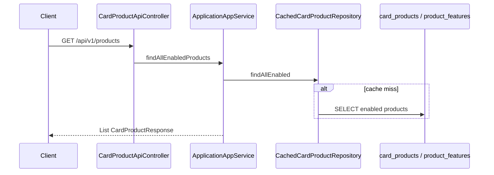

## Related Classes

- `presentation.api.v1.CardProductApiController`
- `presentation.web.ApplicationWebController` (`GET /products`)
- `application.application.service.ApplicationAppService`
- `application.application.service.CardProductResponse`, `ProductFeatureResponse`
- `domain.product.CardProduct`, `ProductFeature`, `CardType`
- `domain.product.repository.CardProductRepository`
- `infrastructure.cache.CachedCardProductRepository`
- `infrastructure.persistence.product.CardProductRepositoryImpl`

## Related Packages

```text
com.tlbank.lending.presentation.api.v1
com.tlbank.lending.application.application.service
com.tlbank.lending.domain.product
com.tlbank.lending.infrastructure.persistence.product
com.tlbank.lending.infrastructure.cache
```

## Database Tables

| Table | Purpose |
| --- | --- |
| `card_products` | Product catalog, `enabled` flag |
| `product_features` | Feature bullets per product |

Migration: `V2__create_card_products.sql`. Seed products in `V100` seed files (`TL-CLASSIC`, `TL-PREMIUM`).

## Redis Usage

None. Products cached in `InMemoryCacheStore` only.

## Security

`permitAll` — public catalog for applicants.

## Validation

- No request body on list endpoint.
- On create application: product must exist and `enabled == true` or `PRODUCT_NOT_FOUND`.

## Possible Interview Questions

- **Where is caching applied?** `CachedCardProductRepository` decorator, not in service layer.
- **How is cache invalidated?** `CacheRefreshScheduler` evicts product keys; admin `POST /api/v1/admin/cache/refresh/products`.

## Design Decisions

- Read-only public API — product administration not implemented (seed data only).
- `@Primary` on `CachedCardProductRepository` — all injections of `CardProductRepository` get cache transparently.

## Trade-offs

| Decision | Benefit | Cost |
| --- | --- | --- |
| In-memory product cache | Fast catalog reads | Stale data until refresh/evict |
| Enabled flag vs delete | Soft-disable products | Orphan applications if product disabled later |

---

# 4. Card Application

## Business Purpose

Core lending workflow: create a credit card application, progress through verified states, and submit for bank review. Encodes business invariants in the `Application` aggregate.

## State Machine

```text
INIT → OTP_VERIFIED → DOCUMENT_UPLOADED → SUBMITTED → UNDER_REVIEW → APPROVED | REJECTED
  ↓         ↓                ↓
CANCELLED CANCELLED      CANCELLED
```

Enforced by `ApplicationStatus.canTransitionTo()` and `Application.transitionTo()`.

## Execution Flow

### Create (INIT)

1. `POST /api/v1/applications` or `POST /apply` (web).
2. Optional `Idempotency-Key` header → `IdempotencyService` (see Chapter 15).
3. `@Valid CreateApplicationRequest` — applicant + `cardProductId`.
4. Validate product enabled.
5. `Application.builder()` — `ApplicationId.generate()`, status `INIT`.
6. `ApplicationRepository.save()`.

### Query

1. `GET /api/v1/applications/{applicationId}`.
2. `ApplicationDetailResponse` with masked PII via `MaskingUtil`.

### Submit (DOCUMENT_UPLOADED → SUBMITTED)

1. `POST .../actions/submit` or `POST /apply/submit`.
2. `Application.submit()` — requires all `DocumentType` values uploaded.
3. Publish `ApplicationSubmittedEvent`.
4. `@Auditable(APPLICATION_SUBMIT)`.

### Cancel

1. `POST .../actions/cancel` with `CancelApplicationRequest.reason`.
2. `Application.cancel()` only from `INIT`, `OTP_VERIFIED`, `DOCUMENT_UPLOADED`.
3. `@Auditable(APPLICATION_CANCEL)`.

## Sequence Diagram — Create

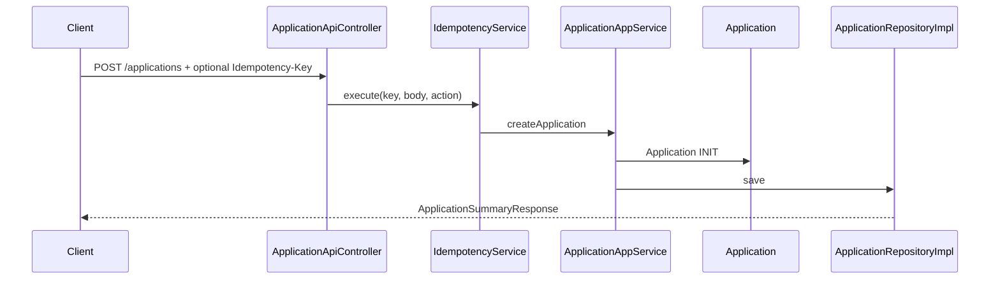

## Related Classes

| Layer | Class |
| --- | --- |
| API | `presentation.api.v1.ApplicationApiController` |
| Web | `presentation.web.ApplicationWebController` |
| Service | `application.application.service.ApplicationAppService` |
| Domain | `domain.application.Application` |
| Domain | `domain.application.ApplicationStatus`, `ApplicationId` |
| Domain | `domain.application.Applicant`, `Address`, `Email`, `MobileNumber` |
| Domain | `domain.application.WorkflowHistory` |
| Domain | `domain.event.ApplicationSubmittedEvent` |
| Repository | `domain.application.repository.ApplicationRepository` |
| Repository | `infrastructure.persistence.application.ApplicationRepositoryImpl` |
| DTO | `application.dto.request.CreateApplicationRequest`, `CancelApplicationRequest` |
| Response | `ApplicationSummaryResponse`, `ApplicationDetailResponse`, `MaskedApplicantResponse` |

## Related Packages

```text
com.tlbank.lending.presentation.api.v1
com.tlbank.lending.presentation.web
com.tlbank.lending.application.application.service
com.tlbank.lending.application.dto.request
com.tlbank.lending.domain.application
com.tlbank.lending.domain.event
com.tlbank.lending.infrastructure.persistence.application
```

## Database Tables

| Table | Purpose |
| --- | --- |
| `applications` | Aggregate root, embedded applicant/address (V11) |
| `workflow_histories` | Every status transition with operator, remark |
| `application_documents` | Document metadata (see Document Upload chapter) |

Migrations: `V3__create_applications.sql`, `V11__extend_applications_for_sprint5.sql`.

## Redis Usage

Only on **create** when `Idempotency-Key` header present and `tlbank.idempotency.store=redis` (dev profile). Submit/cancel/query do not use Redis.

## Security

- `permitAll` on `/api/v1/applications/**`, `/apply/**`, `/application/**` — anonymous applicant flow.
- PII masked in responses via `MaskingUtil` — not a security boundary, display policy.

## Validation

| Layer | Rule |
| --- | --- |
| DTO | `CreateApplicationRequest`: `@Valid ApplicantRequest`, `@NotBlank cardProductId` |
| DTO | `ApplicantRequest`: `@NotBlank` fields, `@NotNull dateOfBirth`, `@Valid AddressRequest` |
| DTO | `CancelApplicationRequest`: `@NotBlank reason` |
| Domain | `MobileNumber`, `Email` value objects on mapping |
| Domain | `submit()` — all `DocumentType` enum values required |
| Domain | `transitionTo()` — invalid transitions → `WorkflowException` |

## Possible Interview Questions

- **Where are transition rules defined?** `ApplicationStatus.ALLOWED_TRANSITIONS` map + `Application.transitionTo()`.
- **Is `WorkflowDomainService` used on every transition?** No — aggregate enforces inline; `WorkflowDomainService` exists but is underused.
- **What happens on submit?** Event → `ReviewEventHandler` creates `ReviewCase`; notification sent.

## Design Decisions

- Aggregate records `WorkflowHistory` on every transition — audit trail in domain, separate from `audit_logs`.
- Applicant operator string `"APPLICANT"` for workflow history — distinguishes from reviewer actions.
- Dual API + Thymeleaf entry points share one `ApplicationAppService`.

## Trade-offs

| Decision | Benefit | Cost |
| --- | --- | --- |
| Anonymous apply API | Low friction demo | No applicant authentication |
| Domain state machine | Testable without Spring | Duplicate validation possible in app service |
| Event on submit only | Decouples review creation | Cancel does not publish `ApplicationCancelledEvent` |

---

# 5. Document Upload

## Business Purpose

Collect required KYC documents (national ID, income proof, residence proof) before submission. Advances application from `OTP_VERIFIED` to `DOCUMENT_UPLOADED`.

## Execution Flow

1. `POST /api/v1/applications/{applicationId}/documents?documentType=&file=` (multipart).
2. `ApplicationAppService.uploadDocuments()`.
3. `LocalDocumentStorageService.validate(file)` — extension `jpg|jpeg|png|pdf`, max size from `UPLOAD.max.size.mb`.
4. `store()` writes to `{tlbank.upload.base-path}/{applicationId}/{TYPE}_{timestamp}.ext`.
5. Build `DocumentInfo` → `application.uploadDocuments(List.of(doc), "APPLICANT")`.
6. If status `OTP_VERIFIED` → transitions to `DOCUMENT_UPLOADED`; if already `DOCUMENT_UPLOADED`, adds more files.
7. `ApplicationRepository.save()`.
8. `@Auditable(DOCUMENT_UPLOAD)`.

Web UI: `GET /apply/upload` displays form; upload typically via API from template.

## Sequence Diagram

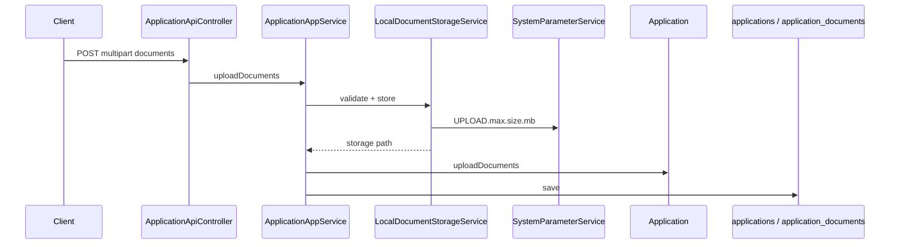

## Related Classes

- `ApplicationApiController`
- `ApplicationAppService.uploadDocuments`
- `LocalDocumentStorageService`, `DocumentStorageService`
- `domain.application.DocumentInfo`, `DocumentType`
- `application.dto.response.DocumentUploadResponse`
- `SystemParameterService`

## Related Packages

```text
com.tlbank.lending.infrastructure.storage
com.tlbank.lending.domain.application
com.tlbank.lending.application.application.service
```

## Database Tables

| Table | Purpose |
| --- | --- |
| `application_documents` | `document_type`, `file_name`, `storage_path`, `file_size` |
| `applications` | Status transition |

## Redis Usage

None.

## Security

`permitAll` on upload endpoint. No virus scan. Files written to local disk — path from `tlbank.upload.base-path`.

## Validation

| Layer | Rule |
| --- | --- |
| Infrastructure | Empty file rejected |
| Infrastructure | Extension whitelist |
| Infrastructure | Max size from system parameter (default 10 MB) |
| Domain | `uploadDocuments()` throws if status not `OTP_VERIFIED` or `DOCUMENT_UPLOADED` |
| Spring | `spring.servlet.multipart.max-file-size: 10MB` |

## Possible Interview Questions

- **Where are files stored?** Local disk — `LocalDocumentStorageService`, Docker volume `app-uploads`.
- **What documents are required for submit?** All values of `DocumentType` enum: `NATIONAL_ID`, `INCOME_PROOF`, `RESIDENCE_PROOF`.

## Design Decisions

- Filesystem port (`DocumentStorageService`) — swappable for S3 in future.
- Relative path stored on aggregate — not full URL.

## Trade-offs

| Decision | Benefit | Cost |
| --- | --- | --- |
| Local disk | Simple Docker volume mount | Not scalable across instances |
| Required doc types = all enum values | Strict submit gate | Cannot submit with subset |

---

# 6. Review Workflow

## Business Purpose

Allow reviewers to discover submitted applications, open case details, start manual review, and add remarks. Synchronizes `ReviewCase` status with `Application` status.

## Execution Flow

### Auto-create case (on submit)

1. `ApplicationSubmittedEvent` published.
2. `ReviewEventHandler.onApplicationSubmitted()` → `ReviewCase.createFor(applicationId)` with `ReviewStatus.PENDING`.
3. `ReviewCaseRepository.save()`.

### Search / list

1. `GET /api/v1/review/cases` or `GET /review/cases` with filters.
2. `ReviewAppService.searchCases(criteria, pageable)`.
3. Returns `PageResponse<ReviewCaseSummaryResponse>` with masked applicant name.

### Case detail

1. `GET /api/v1/review/cases/{reviewCaseId}` or web detail page.
2. Joins `ReviewCase` + `Application` + `CardProduct` + documents + workflow history.

### Start review (web only)

1. `POST /review/cases/{reviewCaseId}/start`.
2. `ReviewAppService.startCaseReview(reviewCaseId, operator)`.
3. `ReviewCase.startReview()` — `PENDING` → `UNDER_REVIEW`.
4. `Application.startReview()` if status `SUBMITTED` → `UNDER_REVIEW`.
5. **No REST API equivalent** for start — gap in API surface.

### Add remark

1. `POST .../remarks` with `AddRemarkRequest.content`.
2. `ReviewCase.addRemark()` — does not change status.

## Sequence Diagram — Case creation

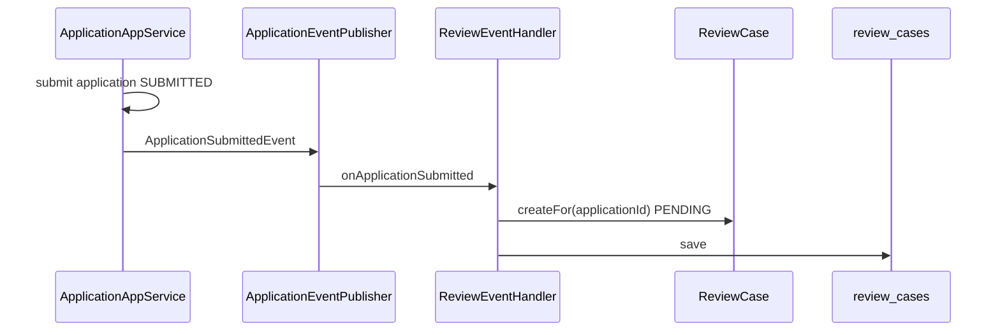

## Related Classes

- `presentation.api.v1.ReviewApiController`
- `presentation.web.ReviewController`
- `application.review.service.ReviewAppService`
- `domain.review.ReviewCase`, `ReviewCaseId`, `ReviewRemark`, `ReviewStatus`
- `domain.review.ReviewCaseSearchCriteria`
- `infrastructure.event.ReviewEventHandler`
- `infrastructure.persistence.review.ReviewCaseRepositoryImpl`
- `ReviewCaseSummaryResponse`, `ReviewCaseDetailResponse`

## Related Packages

```text
com.tlbank.lending.presentation.api.v1
com.tlbank.lending.presentation.web
com.tlbank.lending.application.review.service
com.tlbank.lending.domain.review
com.tlbank.lending.infrastructure.event
com.tlbank.lending.infrastructure.persistence.review
```

## Database Tables

| Table | Purpose |
| --- | --- |
| `review_cases` | Case per application, status, assignee, reviewed_at |
| `review_remarks` | Remark history |
| `applications` | Linked via `application_id` / application number |

Migrations: `V5__create_review_cases.sql`, `V13__extend_review_cases_for_sprint8.sql`.

## Redis Usage

None.

## Security

- `@PreAuthorize("hasAnyRole('REVIEWER','ADMIN')")` on API and web controllers.
- `SecurityConfig`: `/api/v1/review/**`, `/review/**` require REVIEWER or ADMIN.

## Validation

- Search uses optional query filters — no body validation.
- `AddRemarkRequest`: `@NotBlank content`.
- Domain: `ReviewCase.startReview()` transition rules in `transitionTo()`.

## Possible Interview Questions

- **When is ReviewCase created?** Automatically on `ApplicationSubmittedEvent`, not on manual action.
- **Why start review only on web?** `ReviewController` has `POST .../start`; `ReviewApiController` does not expose it.
- **How are applicant details protected?** `MaskingUtil` on names, national ID, email in responses.

## Design Decisions

- Parallel state machines: `ReviewCase` (`ReviewStatus`) and `Application` (`ApplicationStatus`) updated together in `ReviewAppService`.
- Event-driven case creation keeps `ApplicationAppService` free of review repository dependency.

## Trade-offs

| Decision | Benefit | Cost |
| --- | --- | --- |
| Auto-create review case | No orphan submitted applications | Cannot submit without review queue |
| Web-only start | Demo UI flow | API clients cannot start via REST |
| Dual aggregates | Clear review bounded context | Must keep two states in sync |

---

# 7. Approval Workflow

## Business Purpose

Reviewer makes credit decision: approve or reject an application under review. Terminal states: `APPROVED` or `REJECTED`. Triggers customer notifications.

## Execution Flow

### Approve

1. `POST /api/v1/review/cases/{id}/actions/approve` or `POST /review/cases/{id}/approve`.
2. `ReviewAppService.approveCase(ApproveCaseCommand)` with operator from `SecurityContext` and remark.
3. `ReviewCase.approve()` — requires `UNDER_REVIEW`.
4. `ensureApplicationUnderReview()` — if application still `SUBMITTED`, calls `startReview()` first.
5. `Application.approve(operator, remark)` → `APPROVED`.
6. Save both aggregates.
7. Publish `ApplicationApprovedEvent`.
8. `NotificationEventHandler` → mock SMS/email.
9. `@Auditable(APPLICATION_APPROVE)`.

### Reject

1. `POST .../actions/reject` with `RejectReviewRequest.remark`.
2. Same pattern → `ApplicationRejectedEvent` → notification.
3. `@Auditable(APPLICATION_REJECT)`.

## Sequence Diagram

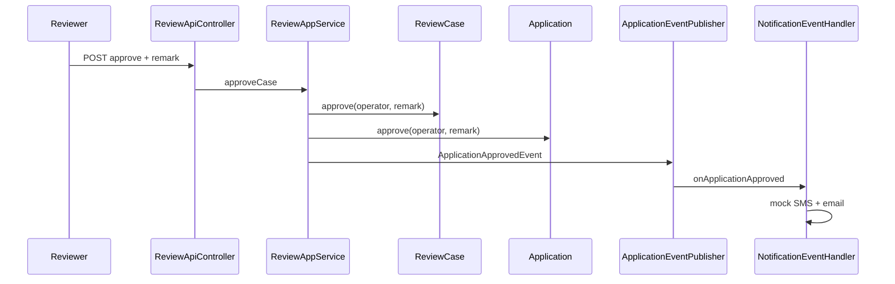

## Related Classes

- `ReviewAppService.approveCase`, `rejectCase`
- `ApproveCaseCommand`, `RejectCaseCommand`
- `presentation.api.v1.review.ApproveReviewRequest`, `RejectReviewRequest`
- `domain.event.ApplicationApprovedEvent`, `ApplicationRejectedEvent`
- `infrastructure.event.NotificationEventHandler`
- `domain.review.ReviewCase.approve`, `reject`
- `domain.application.Application.approve`, `reject`

## Related Packages

```text
com.tlbank.lending.application.review.service
com.tlbank.lending.domain.review
com.tlbank.lending.domain.application
com.tlbank.lending.domain.event
com.tlbank.lending.infrastructure.event
```

## Database Tables

| Table | Updated on decision |
| --- | --- |
| `review_cases` | Status `APPROVED`/`REJECTED`, `reviewed_at` |
| `review_remarks` | Decision remark appended |
| `applications` | Status terminal state |
| `workflow_histories` | Transition rows |
| `audit_logs` | `APPLICATION_APPROVE` / `APPLICATION_REJECT` |

## Redis Usage

None.

## Security

- REVIEWER or ADMIN role required.
- Operator username taken from authenticated session in controller → passed to commands.

## Validation

- `ApproveReviewRequest` / `RejectReviewRequest`: `@NotBlank remark`.
- Domain: `ReviewCase.approve/reject` only from `UNDER_REVIEW`.
- Domain: `Application.approve/reject` only from `UNDER_REVIEW` (via `canTransitionTo`).

## Possible Interview Questions

- **Do notification failures roll back approval?** No — `NotificationEventHandler` catches exceptions.
- **Can API approve from PENDING without start?** `ensureApplicationUnderReview` may call `startReview` if application still `SUBMITTED`.
- **What's the difference vs Review Workflow chapter?** This chapter is the decision (approve/reject); prior chapter is discovery and start.

## Design Decisions

- Remark required on approve/reject — supports audit narrative.
- Domain events for notifications only on terminal decisions, not on start review.

## Trade-offs

| Decision | Benefit | Cost |
| --- | --- | --- |
| Sync in-process events | Simple transaction boundaries | No guaranteed notification delivery |
| Mandatory remark | Better audit story | Extra UI friction |
| Auto startReview in approve | Forgiving if start skipped | Hides workflow discipline |

---

# 8. Notification

## Business Purpose

Inform applicants via SMS and email at OTP send and application lifecycle milestones (submitted, approved, rejected). Portfolio uses mock senders only.

## Execution Flow

| Trigger | Path | Template |
| --- | --- | --- |
| OTP send | Direct `OtpAppService` → `NotificationService` | `NotificationTemplate.formatOtpSms/Email` |
| Application submitted | `ApplicationSubmittedEvent` → `NotificationEventHandler` | `formatSubmitSms/Email` |
| Approved | `ApplicationApprovedEvent` → handler | `formatApprovedSms/Email` |
| Rejected | `ApplicationRejectedEvent` → handler | `formatRejectedSms/Email` |

Each send: `NotificationServiceImpl` → `SmsSender` + `EmailSender` (mock) with try/catch — failures logged, not propagated.

Admin views notification-related audit entries: `GET /api/v1/admin/notifications` filters `OTP_SEND`, `APPLICATION_SUBMIT`, `APPLICATION_APPROVE`, `APPLICATION_REJECT`.

## Sequence Diagram

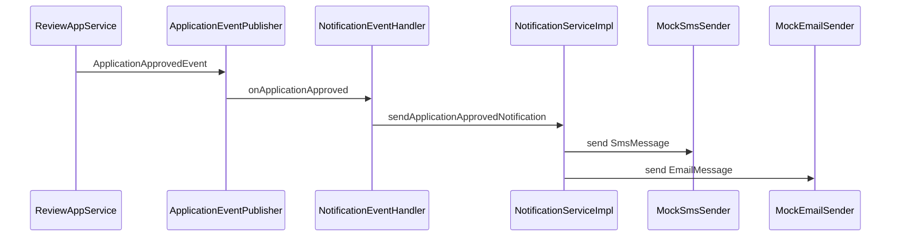

## Related Classes

- `application.notification.service.NotificationService`, `NotificationServiceImpl`
- `infrastructure.notification.MockSmsSender`, `MockEmailSender`
- `infrastructure.notification.NotificationTemplate`
- `infrastructure.notification.SmsMessage`, `EmailMessage`
- `infrastructure.event.NotificationEventHandler`
- `presentation.api.v1.NotificationLogApiController`
- `application.audit.service.AuditLogService.searchNotificationAttempts`

## Related Packages

```text
com.tlbank.lending.application.notification.service
com.tlbank.lending.infrastructure.notification
com.tlbank.lending.infrastructure.event
```

## Database Tables

No dedicated `notifications` table. Delivery inferred from `audit_logs` actions. OTP plaintext optionally in audit `detail` for `OTP_SEND`.

## Redis Usage

None.

## Security

- Sending is internal — no public notification API.
- Admin log query requires `ADMIN` role.
- Mock mode: `tlbank.notification.mode=mock` (`matchIfMissing=true`).

## Validation

- Skips email if recipient blank.
- Mobile required for SMS path — passed from application aggregate.

## Possible Interview Questions

- **Why not Kafka for notifications?** In-process Spring events; README lists Kafka as planned.
- **Where is Twilio/SendGrid?** Not implemented — only `MockSmsSender`/`MockEmailSender`.
- **How to see if notification ran?** Admin notification log = filtered audit entries.

## Design Decisions

- Templates centralized in `NotificationTemplate` — single place for copy changes.
- Event handler isolation — core transaction commits before notification attempt.
- OTP bypasses events — direct call for simpler synchronous demo.

## Trade-offs

| Decision | Benefit | Cost |
| --- | --- | --- |
| Mock adapters | No external accounts needed | Not production-ready |
| Swallow errors | Business TX always commits | Silent notification failure |
| Audit as notification log | No duplicate storage | Conflates audit with delivery status |

---

# 9. Audit Logging

## Business Purpose

Record who did what, when, from which IP, with success/failure — for security (login) and compliance-style tracing of lending operations.

## Execution Flow

### Write paths

1. **AOP:** `@Auditable` on service methods → `AuditAspect` → `AuditLogWriter.saveAsync()`.
2. **Login handlers:** `LoginSuccessHandler`, `LoginFailureHandler`, `LogoutSuccessHandlerImpl` write directly.
3. **Async + REQUIRES_NEW:** Audit persists even if business transaction rolls back (for success path after proceed).

### Read path

1. `GET /api/v1/admin/audit-logs?username=&action=&dateFrom=&dateTo=`.
2. `AuditLogService.search()` → `AuditLogRepository.search()`.

### Audited actions (`AuditAction` enum)

`USER_LOGIN`, `USER_LOGIN_FAILED`, `USER_LOGOUT`, `OTP_SEND`, `OTP_VERIFY_SUCCESS`, `OTP_VERIFY_FAILED`, `APPLICATION_SUBMIT`, `APPLICATION_CANCEL`, `APPLICATION_APPROVE`, `APPLICATION_REJECT`, `DOCUMENT_UPLOAD`, `REPORT_EXPORT`.

## Sequence Diagram

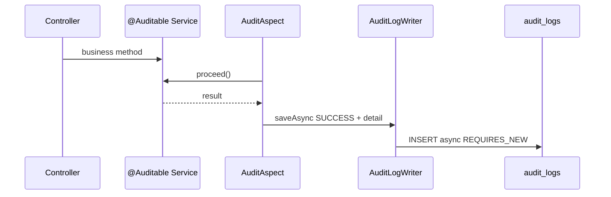

## Related Classes

- `common.audit.AuditAspect`, `Auditable`, `AuditAction`
- `common.audit.AuditLog`, `AuditLogWriter`, `AuditLogRepository`
- `common.audit.AuditContext`, `AuditDetailBuilder`, `AuditIpResolver`
- `application.audit.service.AuditLogService`
- `presentation.api.v1.AuditLogApiController`
- `common.config.AsyncConfig`

## Related Packages

```text
com.tlbank.lending.common.audit
com.tlbank.lending.application.audit.service
com.tlbank.lending.security.handler (login audit)
```

## Database Tables

`audit_logs` — reshaped in `V14__reshape_audit_logs_for_sprint9.sql`:

| Column | Purpose |
| --- | --- |
| `username` | Actor or `ANONYMOUS` |
| `action` | `AuditAction` enum name |
| `ip_address` | Client IP via `AuditIpResolver` |
| `result` | `SUCCESS` / `FAILURE` |
| `detail` | JSON-ish string from args or exception |
| `created_at` | Timestamp |

## Redis Usage

None.

## Security

- Query: ADMIN only.
- Writes: occur on both public (OTP, apply) and authenticated flows — username from `SecurityContext` or `ANONYMOUS`.

## Validation

No input validation on audit writes — internal system records.

## Possible Interview Questions

- **Why async audit?** Avoid adding DB latency to request path — `AuditLogWriter.saveAsync`.
- **Why is OTP code in audit detail?** `AuditContext.put` in `OtpAppService` — demo convenience, not production practice.
- **Does failed OTP verify get `@Auditable`?** Success path annotated `OTP_VERIFY_SUCCESS`; failures may not have symmetric audit action (verify failure uses exception path).

## Design Decisions

- AOP keeps services clean — `@Auditable(action=...)` declarative.
- Login outside AOP — security handlers are not service beans in the same pattern.

## Trade-offs

| Decision | Benefit | Cost |
| --- | --- | --- |
| Async writes | Faster API response | Audit slightly delayed |
| REQUIRES_NEW | Audit survives some failures | Extra transactions |
| Single audit table | Simple queries | No immutable/event-sourced ledger |

---

# 10. Scheduler

## Business Purpose

Run housekeeping without user action: expire stale OTPs, refresh configuration cache, log daily application statistics.

## Execution Flow

| Job | Class | Cron | Action |
| --- | --- | --- | --- |
| OTP cleanup | `OtpCleanupScheduler` | `tlbank.scheduler.otp-cleanup.cron` (5 min prod, 1 min dev) | `otpRepository.markExpiredBefore(now)` |
| Cache refresh | `CacheRefreshScheduler` | `tlbank.scheduler.cache-refresh.cron` (every 6h) | `systemParameterService.refreshCache()` + evict product cache keys |
| Daily statistics | `DailyStatisticsScheduler` | `tlbank.scheduler.daily-stats.cron` (01:00 daily) | `reportDataService.buildDailyStatistics(yesterday)` → log counts only |
| Cache TTL sweep | `InMemoryCacheStore` | `fixedDelay=60s` | Remove expired cache entries |

Admin manual trigger: `SchedulerApiController` — `POST /api/v1/admin/schedulers/{job}/run`.

## Sequence Diagram

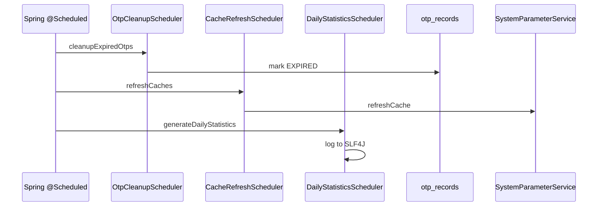

## Related Classes

- `infrastructure.scheduler.OtpCleanupScheduler`
- `infrastructure.scheduler.CacheRefreshScheduler`
- `infrastructure.scheduler.DailyStatisticsScheduler`
- `infrastructure.cache.InMemoryCacheStore` (scheduled cleanup)
- `presentation.api.v1.SchedulerApiController`
- `common.config.SchedulingConfig`, `SchedulerConfig`
- `application.report.service.ReportDataService`

## Related Packages

```text
com.tlbank.lending.infrastructure.scheduler
com.tlbank.lending.presentation.api.v1
com.tlbank.lending.common.config
```

## Database Tables

| Table | Job |
| --- | --- |
| `otp_records` | OTP cleanup updates status |
| `system_parameters` | Cache refresh reads |
| `applications`, `card_products` | Daily stats reads (no write) |

## Redis Usage

None.

## Security

- Scheduled jobs run system-internal — no HTTP.
- Manual trigger endpoints: `@PreAuthorize("hasRole('ADMIN')")`.

## Validation

- `DailyStatisticsScheduler.generateDailyStatistics(LocalDate)` accepts optional date on admin trigger.

## Possible Interview Questions

- **Does daily scheduler produce files?** No — only logs. Files come from `ReportAppService` on admin request.
- **Why faster OTP cron in dev?** `application-dev.yml` sets 1-minute interval for local testing.

## Design Decisions

- `[SCHEDULER]` log prefix — easy grep in logs.
- try/catch per job — one failure does not crash scheduler thread pool.
- Pool size 3 — `spring.task.scheduling.pool.size` in `application.yml`.

## Trade-offs

| Decision | Benefit | Cost |
| --- | --- | --- |
| In-process cron | Zero infrastructure | Duplicated runs if multiple instances |
| Log-only daily stats | Lightweight | No automated report delivery |
| Admin manual run | Debug/support | Bypasses schedule discipline |

---

# 11. Report

## Business Purpose

Let admins export daily application statistics (counts by status and product) as downloadable Excel or PDF.

## Execution Flow

1. Admin `POST /api/v1/reports/daily-statistics` with `GenerateReportRequest` (`reportDate`, `format`).
2. `ReportAppService.generateDailyStatisticsReport()`.
3. `ReportDataService.buildDailyStatistics(date)` — queries `ApplicationJpaRepository` / aggregates by status and product (bypasses domain layer).
4. Branch on `ReportFormat.EXCEL` → `ExcelReportGenerator` (Apache POI `XSSFWorkbook`).
5. Branch on `PDF` → `PdfReportGenerator` (iText 7).
6. `@Auditable(REPORT_EXPORT)`.
7. `ReportApiController` returns `byte[]` with `Content-Disposition: daily-statistics-{date}.xlsx|pdf`.

Web shell: `GET /admin/reports` — Thymeleaf page; export via API.

## Sequence Diagram

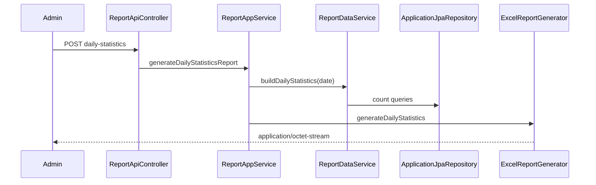

## Related Classes

- `presentation.api.v1.ReportApiController`
- `presentation.web.AdminController` (`GET /admin/reports`)
- `application.report.service.ReportAppService`, `ReportDataService`
- `application.report.service.DailyStatisticsData`, `ReportFormat`
- `application.dto.request.GenerateReportRequest`
- `infrastructure.report.ExcelReportGenerator`, `PdfReportGenerator`

## Related Packages

```text
com.tlbank.lending.presentation.api.v1
com.tlbank.lending.application.report.service
com.tlbank.lending.infrastructure.report
```

## Database Tables

Read-only:

| Table | Usage |
| --- | --- |
| `applications` | Count by `ApplicationStatus` for date |
| `card_products` | Product name for per-product breakdown |

## Redis Usage

None.

## Security

- `@PreAuthorize("hasRole('ADMIN')")` on `ReportApiController`.
- `SecurityConfig`: `/api/v1/reports/**` requires ADMIN.

## Validation

- `GenerateReportRequest`: `@NotNull reportDate`, `@NotNull format`.

## Possible Interview Questions

- **Why does ReportDataService use JPA directly?** Read-model aggregation — no domain behavior needed.
- **Relation to DailyStatisticsScheduler?** Same `ReportDataService.buildDailyStatistics()` — scheduler logs, report downloads file.

## Design Decisions

- Binary response in controller — not `ApiResponse` wrapper.
- Two generator beans — strategy by `ReportFormat` enum in service.

## Trade-offs

| Decision | Benefit | Cost |
| --- | --- | --- |
| In-memory byte[] | Simple download | Memory spike on large reports |
| JPA for analytics | Fast to implement | Bypasses domain/repository ports |
| iText + POI | Rich formats | License/dependency weight |

---

# 12. User Management

## Business Purpose

Admin creates platform users (reviewers, admins) and enables/disables accounts.

## Execution Flow

### Create user

1. `POST /api/v1/admin/users` with `CreateUserRequest`.
2. `UserAppService.createUser()` — duplicate username check.
3. `PasswordEncoder.encode()` → build `User` with `UserId.generate()`.
4. Default role `ROLE_USER` if none specified in command.
5. `UserRepository.save()`.

### Update status

1. `PUT /api/v1/admin/users/{userId}/status?enabled=true|false`.
2. `user.enable()` or `user.disable()`.

### List / get

1. `GET /api/v1/admin/users`, `GET /api/v1/admin/users/{userId}`.

Web: `GET /admin/users` — Thymeleaf admin page.

## Sequence Diagram

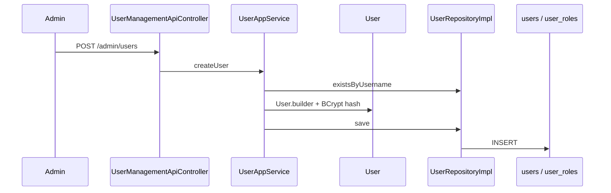

## Related Classes

- `presentation.api.v1.UserManagementApiController`
- `presentation.web.AdminController`
- `application.user.service.UserAppService`
- `application.user.service.CreateUserCommand`, `UpdateUserStatusCommand`, `UserResponse`
- `application.dto.request.CreateUserRequest`
- `domain.user.User`, `UserId`, `Role`
- `domain.user.repository.UserRepository`
- `infrastructure.persistence.user.UserRepositoryImpl`

## Related Packages

```text
com.tlbank.lending.presentation.api.v1
com.tlbank.lending.application.user.service
com.tlbank.lending.domain.user
com.tlbank.lending.infrastructure.persistence.user
```

## Database Tables

| Table | Purpose |
| --- | --- |
| `users` | Account record, `user_id` business key (V9) |
| `user_roles` | Many-to-many roles per user |

## Redis Usage

None.

## Security

- `@PreAuthorize("hasRole('ADMIN')")` on API and `AdminController`.
- Password never returned in `UserResponse`.

## Validation

- `CreateUserRequest`: `@NotBlank username`, `@Size(min=8) password`, `@Email email`, `@NotBlank fullName`.

## Possible Interview Questions

- **How are roles stored vs Spring authorities?** DB `user_roles.role` → `UserDetailsServiceImpl` maps to `ROLE_*`.
- **Can admin create applicant users?** Service defaults to `ROLE_USER` — applicants normally from seed, not admin UI focus.

## Design Decisions

- BCrypt in application service, not domain — infrastructure concern.
- Business key `UserId` separate from JPA surrogate id.

## Trade-offs

| Decision | Benefit | Cost |
| --- | --- | --- |
| Admin-only user CRUD | Centralized identity control | No self-registration |
| Enum roles in domain | Clear role set | New roles need code + DB migration |

---

# 13. System Parameters

## Business Purpose

Runtime configuration for OTP timing, upload limits, and cache TTL — adjustable by admin without code deploy.

## Execution Flow

### Read (internal)

1. Services call `SystemParameterService.getValue()` / `getIntValue()`.
2. Cache-aside: key `sys_param:{group}:{key}` in `InMemoryCacheStore`.
3. On miss: `SystemParameterRepository.findByGroupAndKey()`.

### Admin list / update

1. `GET /api/v1/admin/system-parameters?group=`.
2. `PUT /api/v1/admin/system-parameters/{paramId}` with `UpdateParameterCommand`.
3. Update entity → evict single cache key.

Seed parameters (V100):

| Group | Key | Default |
| --- | --- | --- |
| OTP | expire_minutes | 5 |
| OTP | max_retry | 3 |
| UPLOAD | max.size.mb | 10 |
| CACHE | ttl_seconds | 21600 |

## Sequence Diagram

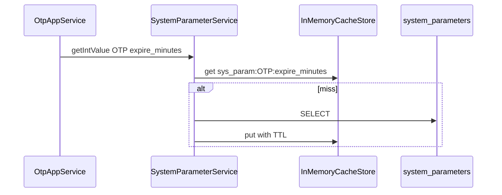

## Related Classes

- `SystemParameterApiController`, `AdminController`
- `SystemParameterService`, `UpdateParameterCommand`, `SystemParameterResponse`
- `domain.parameter.SystemParameter`, `SystemParameterRepository`
- `infrastructure.persistence.parameter.SystemParameterRepositoryImpl`
- `CacheKeys`, `CacheTtlProvider`

## Related Packages

```text
com.tlbank.lending.application.parameter.service
com.tlbank.lending.domain.parameter
com.tlbank.lending.infrastructure.persistence.parameter
```

## Database Tables

`system_parameters` — `param_group`, `param_key`, `param_value`, `enabled`.

Migrations: `V7__create_system_parameters.sql`, `V10__extend_system_parameters.sql`.

## Redis Usage

None. Parameters cached in-memory only.

## Security

ADMIN for HTTP endpoints. Internal read has no auth — any service bean can call `getValue`.

## Validation

- `UpdateParameterCommand`: `@NotBlank paramValue`.

## Possible Interview Questions

- **Chicken-and-egg: cache TTL from DB?** `CacheTtlProvider` reads `CACHE.ttl_seconds` — may bootstrap with default if missing.
- **Who consumes OTP params?** `OtpAppService` on every send/verify.

## Design Decisions

- Group.key namespacing — avoids flat key collisions.
- `enabled` flag on parameters — soft-disable without delete.

## Trade-offs

| Decision | Benefit | Cost |
| --- | --- | --- |
| DB-backed config | Change without redeploy | Extra query on cache miss |
| No Redis for params | Simple | Stale values across instances until refresh |

---

# 14. Cache Management

## Business Purpose

Admin visibility and control over in-memory caches backing system parameters and card products.

## Execution Flow

1. `POST /api/v1/admin/cache/refresh` — `CacheManagementService.refreshAll()`.
2. `POST .../refresh/system-parameters` — `SystemParameterService.refreshCache()`.
3. `POST .../refresh/products` — `CachedCardProductRepository.refreshCache()`.
4. `GET /api/v1/admin/cache/stats` — key count + rough memory estimate.

Automatic: `CacheRefreshScheduler` on cron evicts/refreshes parameters and product keys.

## Sequence Diagram

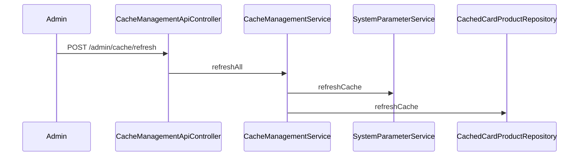

## Related Classes

- `CacheManagementApiController`
- `CacheManagementService`, `CacheStatsResponse`, `CacheRefreshResponse`
- `InMemoryCacheStore`, `CachedCardProductRepository`
- `CacheRefreshScheduler`

## Related Packages

```text
com.tlbank.lending.application.cache.service
com.tlbank.lending.infrastructure.cache
com.tlbank.lending.infrastructure.scheduler
```

## Database Tables

None directly — refresh reads `system_parameters` and `card_products` to repopulate cache.

## Redis Usage

None. This feature manages in-memory cache only.

## Security

ADMIN only.

## Validation

None on endpoints.

## Possible Interview Questions

- **Difference vs System Parameters chapter?** Parameters are the data; this chapter is ops control of the cache layer.
- **Memory estimate accuracy?** Rough string-length heuristic in `CacheManagementService.getStats()` — not JVM precise.

## Design Decisions

- Separate admin API for cache — does not require DB migration to clear stale catalog.

## Trade-offs

| Decision | Benefit | Cost |
| --- | --- | --- |
| Manual refresh API | Ops recovery from stale state | Admin must know when to refresh |
| Heuristic memory stats | Quick dashboard | Not production-grade monitoring |

---

# 15. Idempotency

## Business Purpose

Prevent duplicate credit card applications when clients retry `POST /api/v1/applications` with the same `Idempotency-Key` header (network timeout, double-click).

## Execution Flow

1. Client sends `POST /api/v1/applications` with header `Idempotency-Key: {uuid}`.
2. If header absent → `IdempotencyService` executes create directly.
3. Hash request body (SHA-256 of canonical JSON).
4. `IdempotencyStore.find("idempotency:applications:{key}")`.
5. **Hit, same hash:** return cached `ApiResponse` + HTTP status from entry.
6. **Hit, different hash:** `IDEMPOTENCY_KEY_CONFLICT` (409).
7. **Miss:** `tryAcquireLock("{key}:lock", 30s)`.
8. **Lock failed:** `IDEMPOTENCY_KEY_IN_PROGRESS` (409).
9. Execute `ApplicationAppService.createApplication()`.
10. Store `{requestHash, httpStatus, responseBody}` with TTL 24h (`tlbank.idempotency.ttl-hours`).
11. `releaseLock`.

Store implementations:

| Profile | Store | File |
| --- | --- | --- |
| dev | Redis | `RedisIdempotencyStore` |
| test | memory | `InMemoryIdempotencyStore` |
| staging | unset | neither bean configured — deployment gap |

## Sequence Diagram

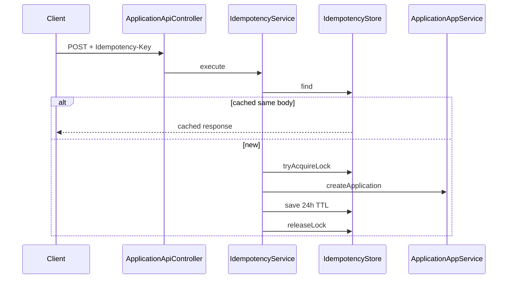

## Related Classes

- `application.idempotency.IdempotencyService`
- `infrastructure.idempotency.IdempotencyStore`, `IdempotencyEntry`
- `infrastructure.idempotency.RedisIdempotencyStore`
- `infrastructure.idempotency.InMemoryIdempotencyStore`
- `presentation.api.v1.ApplicationApiController`
- `application.ApplicationIdempotencyIntegrationTest`

## Related Packages

```text
com.tlbank.lending.application.idempotency
com.tlbank.lending.infrastructure.idempotency
```

## Database Tables

None. Idempotency state in Redis or in-memory map — not in SQL tables.

## Redis Usage

**Yes — dev profile only.**

| Key pattern | Purpose | TTL |
| --- | --- | --- |
| `idempotency:applications:{key}` | Cached response JSON | 24 hours |
| `idempotency:applications:{key}:lock` | Concurrent request lock | 30 seconds |

Config: `application-dev.yml` → `spring.data.redis.host: localhost`, `tlbank.idempotency.store: redis`.

## Security

- Wraps public `permitAll` create endpoint — no auth on idempotency itself.
- Key is client-supplied — any anonymous client can claim a key namespace.

## Validation

- No format validation on idempotency key — blank/missing skips feature.
- Request body validated by `@Valid CreateApplicationRequest` inside delegated action.

## Possible Interview Questions

- **Why Redis only for idempotency, not cache?** Documented trade-off — horizontal idempotency needs shared store; catalog cache stayed in-memory.
- **What HTTP status is replayed?** Stored from first response — typically 201 Created.
- **How tested without Redis?** `src/test/resources/application-dev.yml` sets `store: memory`.

## Design Decisions

- Opt-in via header — clients without idempotency unaffected.
- Body hash prevents key reuse with different payload.
- Lock prevents thundering herd on same key.

## Trade-offs

| Decision | Benefit | Cost |
| --- | --- | --- |
| Redis store in dev | Realistic distributed behavior | Requires local Redis not in docker-compose |
| 24h TTL | Long retry window | Redis memory growth |
| Only on create | Focused scope | Submit/approve not idempotent |
| Staging gap | — | Must set `tlbank.idempotency.store` for staging |

---

# End-to-End Business Journey

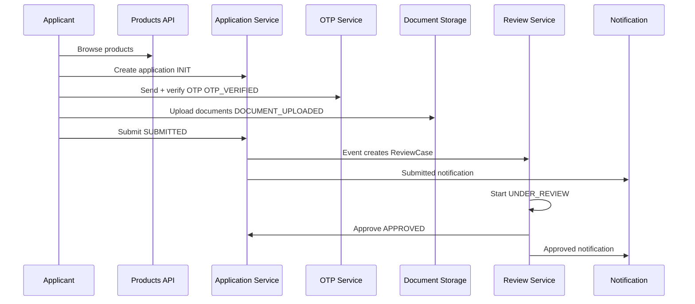

---

*Generated from `sp2-springboot` source. Cross-reference [architecture-handbook.md](02-architecture-handbook.md) for layer index and [technology-handbook.md](04-technology-handbook.md) for stack depth.*
