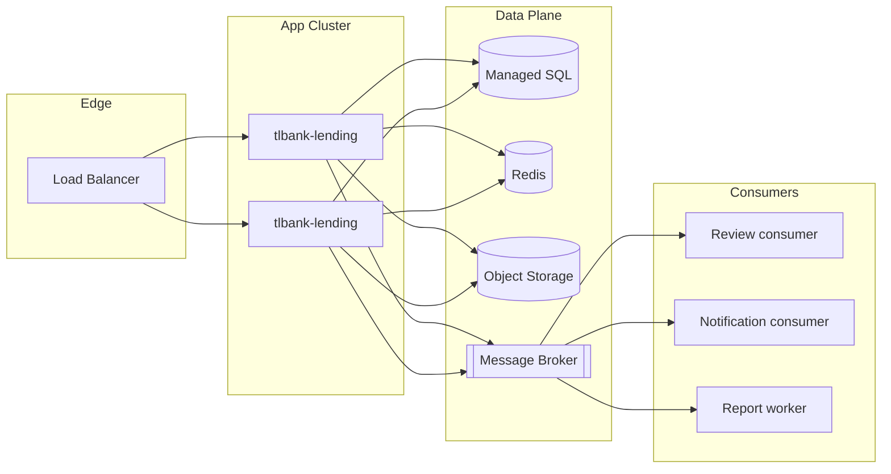

# TLBank System Design Handbook

How this portfolio backend would evolve toward a production-scale system. **Current state is documented elsewhere** — this file is the growth path only.

| Layer of truth | Document |
| --- | --- |
| What exists today | [00-project-overview.md](00-project-overview.md) |
| Ops / CI / Redis scope | [01-repository-handbook.md](01-repository-handbook.md) |
| Module seams | [02-architecture-handbook.md](02-architecture-handbook.md) |
| Feature behavior | [03-business-feature-handbook.md](03-business-feature-handbook.md) |
| Stack capabilities | [04-technology-handbook.md](04-technology-handbook.md) |
| Known debt & roadmap | [20-maintenance-and-future-enhancement.md](20-maintenance-and-future-enhancement.md) |

---

## 1. Starting point (as-is)

```text
Single JAR  →  one process  →  local Docker staging (SQL Server)
Sessions + in-memory cache  →  not horizontally scalable yet
Spring events (in-process)  →  mock SMS/email
Redis (dev)                 →  idempotency only
```

Design goal of this handbook: keep the **same domain model and ports**, replace adapters and topology.

---

## 2. Scalability

### Scalability — Current constraint

One app instance. In-process `CacheStore` and in-memory `SessionRegistry` (`maximumSessions(1)`) do not share state across nodes. Detail: [20-maintenance-and-future-enhancement.md](20-maintenance-and-future-enhancement.md) §3.2 · [01-repository-handbook.md](01-repository-handbook.md) §8.

### Scalability — Evolution

| Step | Change | Why |
| --- | --- | --- |
| 1 | `RedisCacheStore` behind `CacheStore` | Shared product/parameter cache |
| 2 | Spring Session + Redis | Shared HTTP sessions / concurrent session control |
| 3 | Stateless app pods behind LB | Scale read/write of apply + review APIs |
| 4 | Split read models for reports | Heavy Excel/PDF off the request path |

### Scalability — Interview framing

> Scale the monolith first (shared session + cache). Extract services only when team or SLO boundaries demand it — review queue and notifications are the first candidates because they already sit behind event handlers.

---

## 3. Availability

### Availability — Current constraint

Single Mac staging; manual deploy; no multi-AZ story. CI publishes images; CD is `workflow_dispatch` ([01-repository-handbook.md](01-repository-handbook.md) §12).

### Availability — Evolution

| Concern | Target design |
| --- | --- |
| App | N replicas, rolling update, readiness/liveness (Actuator already present — [04-technology-handbook.md](04-technology-handbook.md) Ch.17) |
| DB | SQL Server HA / managed cloud DB, automated backups |
| Redis | Managed cluster for sessions, cache, idempotency |
| Deploy | Automated promote with health gates; replace single self-hosted runner |

### Availability — Failure modes to design for

- Redis down → decide fail-open vs fail-closed for idempotency (create without key vs reject).
- Notification provider down → already isolated via events; add retry/DLQ when broker exists.
- Review handler failure on submit → move to `AFTER_COMMIT` + retry ([20-maintenance…](20-maintenance-and-future-enhancement.md) issue #8).

---

## 4. Performance

### Performance — Current profile

- Hot reads: card products, system parameters (cached in-process).
- Hot writes: application create (idempotent), OTP, document upload (local disk).
- Heavy: report generation on request thread ([03-business-feature-handbook.md](03-business-feature-handbook.md) § Report).

### Performance — Evolution

| Area | Production move |
| --- | --- |
| Reports | Async job + object storage download link |
| Document upload | Object storage (S3/Blob) instead of local disk ([04-technology-handbook.md](04-technology-handbook.md) Ch.21) |
| DB | Indexes on review search fields; connection pool tuning |
| OTP | Rate limits; avoid synchronous external SMS on request path |

Do not invent numbers — measure with load tests after cloud deploy (listed as future in [01-repository-handbook.md](01-repository-handbook.md) §18.3).

---

## 5. Caching

### Caching — As-is vs target

| Concern | Today | Production target |
| --- | --- | --- |
| Products / parameters | `InMemoryCacheStore` | Redis (or Caffeine + Redis) |
| Idempotency | Redis (`dev`) / memory (tests) | Redis in all envs |
| Sessions | JVM memory | Spring Session Redis |
| HTTP edge | None | CDN for public product pages if needed |

Source of truth for current design: [../design/12-cache-design.md](../design/12-cache-design.md) · [04-technology-handbook.md](04-technology-handbook.md) Ch.19–20.

### Caching — Consistency rules to keep

- Admin parameter update must evict keys (already fixed — [20-maintenance…](20-maintenance-and-future-enhancement.md) issue #2).
- `CacheRefreshScheduler` remains the periodic safety net.
- Idempotency keys stay separate from cache keys (different prefix/TTL).

---

## 6. Cloud

### Cloud — What this repo does not do

Terraform `infra/local` uses `hashicorp/local` only — no AWS/Azure/GCP resources ([04-technology-handbook.md](04-technology-handbook.md) Ch.33 · [01-repository-handbook.md](01-repository-handbook.md) §13).

### Cloud — Minimal production topology

```text
Internet → WAF / LB → App (containers)
                    → Managed SQL
                    → Managed Redis
                    → Object storage (documents, reports)
                    → Secrets Manager
CI → build/test/scan → push image → deploy (OIDC) → cloud staging/prod
```

### Cloud — Migration order

1. Managed SQL + Redis matching current profiles.
2. App on container service / K8s.
3. Move uploads off local disk.
4. Real SMS/email providers.
5. Observability stack (next sections).

---

## 7. Kubernetes

### Kubernetes — Why later, not now

Compose on one Mac is enough for the portfolio ([04-technology-handbook.md](04-technology-handbook.md) Ch.28–29). K8s pays off when you need rolling updates, HPA, and multi-service topology.

### Kubernetes — Mapping from current artifacts

| Today | K8s analogue |
| --- | --- |
| `docker/app/Dockerfile` | Image for Deployment |
| `docker-compose.yml` services | Deployments + Services |
| Actuator `/actuator/health` | readiness/liveness probes |
| `application-staging.yml` env | ConfigMap / Secret |
| Manual runner deploy | CD pipeline → cluster |

### Kubernetes — Prerequisites before HPA

Shared Redis for sessions + cache; sticky sessions otherwise. Otherwise `maximumSessions(1)` and cache diverge across pods.

---

## 8. Message Queue

### Message Queue — Current seam

In-process `ApplicationEventPublisher` → `ReviewEventHandler` / `NotificationEventHandler` ([04-technology-handbook.md](04-technology-handbook.md) Ch.14 · [02-architecture-handbook.md](02-architecture-handbook.md) Global Dependency Graph).

### Message Queue — Target pattern

```text
Use case commits DB
  → writes outbox row (same TX)
  → publisher relays to Kafka/RabbitMQ
  → consumers: create ReviewCase, send notification, analytics
```

| Event | Consumer responsibility |
| --- | --- |
| Application submitted | Create `ReviewCase` (today sync) |
| Approved / Rejected | Notify applicant (today mock) |
| Cancelled / OTP generated | Wire or delete unused events ([20-maintenance…](20-maintenance-and-future-enhancement.md) #7) |

### Message Queue — Why not extract services first

Keep one DB and one deployable until consumers prove independent scale/failure domains. Queue first, service split second.

---

## 9. Monitoring

### Monitoring — As-is

SLF4J/Logback + MDC correlation id; Actuator health ([04-technology-handbook.md](04-technology-handbook.md) Ch.17, Ch.35). No Prometheus/Grafana/tracing in-repo.

### Monitoring — Production stack

| Signal | Tooling direction |
| --- | --- |
| Metrics | Micrometer → Prometheus (OTP success, cache hit, scheduler duration, idempotency conflicts) |
| Traces | OpenTelemetry across app + DB + Redis + queue |
| Logs | Structured JSON → central store; keep correlation id |
| Alerts | Error rate, deploy health, Redis/DB saturation |

Roadmap note: [20-maintenance-and-future-enhancement.md](20-maintenance-and-future-enhancement.md) §3.4.

---

## 10. Disaster Recovery

### Disaster Recovery — As-is

Local Docker volumes; no documented RPO/RTO; portfolio scope ([00-project-overview.md](00-project-overview.md)).

### Disaster Recovery — Production checklist

| Asset | DR practice |
| --- | --- |
| SQL Server | Automated backups, point-in-time restore, cross-region replica if required |
| Redis | Persistence/replicas for sessions; accept idempotency key loss with clear client retry rules |
| Documents | Object storage versioning + backup |
| Images | GHCR (already) as immutable deploy artifacts |
| Config | Secrets outside git; infra as real Terraform/cloud |

Run restore drills; document RPO/RTO per environment.

---

## 11. Horizontal Scaling

### Horizontal Scaling — Blockers today

1. In-memory sessions + `SessionRegistry`
2. In-memory application cache
3. Local disk uploads
4. Sync in-process side effects on the request thread for some paths

Detail: [20-maintenance-and-future-enhancement.md](20-maintenance-and-future-enhancement.md) §3.2.

### Horizontal Scaling — Enablement sequence

```text
Redis sessions + Redis cache
  → object storage for documents
  → multiple app replicas behind LB
  → async reports + queued notifications
  → optional service extraction
```

### Horizontal Scaling — What stays in the monolith longest

Domain state machine, review rules, Flyway schema, security policy — see [02-architecture-handbook.md](02-architecture-handbook.md). Scale adapters first.

---

## 12. Future Architecture

### Future Architecture — Target sketch



### Future Architecture — Principles carried forward

- Keep **ports** (`IdempotencyStore`, `CacheStore`, repositories, notification senders).
- Keep **explicit workflow** in the domain ([../design/08-workflow-design.md](../design/08-workflow-design.md)).
- Replace **adapters and topology**, not the ubiquitous language.
- Prefer roadmap items already listed in [20-maintenance-and-future-enhancement.md](20-maintenance-and-future-enhancement.md) over speculative rewrites.

### Future Architecture — Suggested build order

1. Redis cache + Spring Session  
2. Outbox + broker for review/notification  
3. Object storage + async reports  
4. Cloud deploy + observability  
5. K8s HPA / multi-service split only if needed  

---

*Evolution guide only. For current behavior and files, use handbooks 00–04.*
