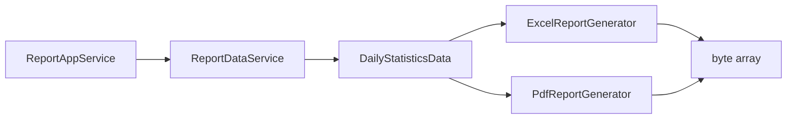

# ReportAppService

- [Back to Open Book Home](../../README.md)
- [Back to Source Map Index](../README.md)
- Previous High Class: [OtpCleanupScheduler](../infrastructure/OtpCleanupScheduler.md)
- Next High Class: —
- Related Topics: [11-testing](../../topics/11-testing.md), [01-architecture](../../topics/01-architecture.md)
- Related Questions: [09-interview-source-map-300.md](../../../handbook/09-interview-source-map-300.md)

---

## One-Sentence Summary

Application service that builds daily-statistics data and renders Excel or PDF bytes via generators.

## 中文一句話

日統計報表編排：組資料後交 Excel／PDF 產生器回傳位元組；帶 `@Auditable(REPORT_EXPORT)`。

## Why This Class Exists

Separate report orchestration from HTTP and from POI/iText details. Generators stay related-only adapters.

Architecture: [topics/01-architecture.md](../../topics/01-architecture.md). Testing angle: [topics/11-testing.md](../../topics/11-testing.md).

## Responsibilities

- Load daily statistics via `ReportDataService`
- Choose Excel vs PDF generator by `ReportFormat`
- Provide download filename helper
- Audit export action

## Runtime Execution Flow

1. `generateDailyStatisticsReport(request)` annotated `@Auditable(REPORT_EXPORT)`.
2. `reportDataService.buildDailyStatistics(...)`.
3. If format EXCEL → `ExcelReportGenerator`; else → `PdfReportGenerator`.
4. Return `byte[]` (in-memory; not written to upload FS here).

## Dependencies

### Depends On

- `ReportDataService`
- `ExcelReportGenerator`
- `PdfReportGenerator`

### Called By

- Report API/web controllers (presentation)

### Calls

- Data build + generator `generate` methods

## Important Public Methods

### `byte[] generateDailyStatisticsReport(GenerateReportRequest request)`

- **Purpose:** Build and render report
- **Input:** date/format request
- **Output:** xlsx or pdf bytes
- **Security behavior:** @Auditable(REPORT_EXPORT)
- **Side effects:** audit async via aspect/writer

### `String getFileName(LocalDate date, ReportFormat format)`

- **Purpose:** Build daily-statistics-yyyyMMdd.xlsx|pdf

## Design Decisions

- Orchestration in application layer; binary libraries in infrastructure generators
- In-memory byte arrays for download
- Audit on export

## Trade-offs and Alternatives

- Embedding POI/iText in the app service — avoided
- Streaming to object storage — **Not implemented** (local upload FS is a different feature)

## Related Classes

- Grouped here (no dedicated pages): `ExcelReportGenerator`, `PdfReportGenerator`, `ReportDataService`, `ReportFormat`, `GenerateReportRequest`, `DailyStatisticsData`
- Audit path: [AuditAspect](../common/AuditAspect.md), [AuditLogWriter](../common/AuditLogWriter.md)

## Related Configuration

- None in this class (generators use libraries only)

## Related Tests

- [ReportAppServiceTest.java](../../../../src/test/java/com/tlbank/lending/application/report/ReportAppServiceTest.java)
- [ExcelReportGeneratorTest.java](../../../../src/test/java/com/tlbank/lending/infrastructure/report/ExcelReportGeneratorTest.java)
- No dedicated `PdfReportGenerator` test found

## Related ADRs and Design Documents

- [14-report-design.md](../../../design/14-report-design.md)
- [11-audit-logging.md](../../../design/11-audit-logging.md)

## Related Interview Questions

[`Q133`](../../../handbook/09-interview-source-map-300.md#Q133), [`Q171`](../../../handbook/09-interview-source-map-300.md#Q171), [`Q173`](../../../handbook/09-interview-source-map-300.md#Q173), [`Q176`](../../../handbook/09-interview-source-map-300.md#Q176), [`Q209`](../../../handbook/09-interview-source-map-300.md#Q209), [`Q231`](../../../handbook/09-interview-source-map-300.md#Q231)

## 30-Second Explanation

`ReportAppService` builds daily statistics and asks Excel or PDF generators for bytes. Export is auditable. Generators are infrastructure details, not separate Open Book pages.

## 2-Minute Explanation

Name collaborators and filename pattern. Contrast with `LocalDocumentStorageService` (applicant uploads to disk). Note PDF generator test gap.

## 5-Minute Deep Explanation

Walk audit annotation to writer. Discuss why binary libs stay in infra. Link testing topic for what is covered.

## 中文口語重點

- 編排在 application，產生器在 infrastructure
- 回傳 byte[]，不是上傳目錄
- REPORT_EXPORT 會進 audit

## Whiteboard Sketch

- **What to draw:** service → data → excel/pdf → bytes
- **Drawing order:** data first, then branch on format
- **Narration order:** audit → build → render

## Common Follow-Up Questions

- Which library for Excel vs PDF?
- Is the file stored on disk?
- What is audited?

## Common Mistakes

- Claiming S3 report storage as current
- Putting POI calls inside the controller as the design story
- Creating separate Open Book pages for generators

## Current Limitations

- PDF generator lacks a dedicated test
- No object-storage export path in this service

## Source File

[ReportAppService.java](../../../../src/main/java/com/tlbank/lending/application/report/service/ReportAppService.java)
