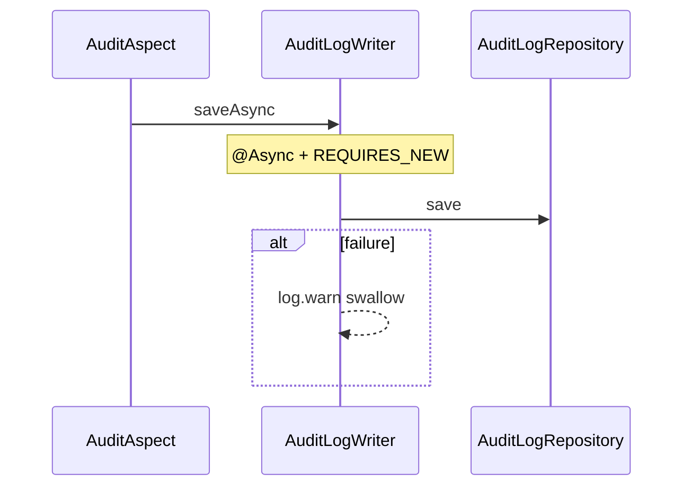

# AuditLogWriter

- [Back to Open Book Home](../../README.md)
- [Back to Source Map Index](../README.md)
- Previous High Class: [OtpRecord](../domain/OtpRecord.md)
- Next High Class: [GlobalExceptionHandler](../presentation/GlobalExceptionHandler.md)
- Related Topics: [10-audit-logging](../../topics/10-audit-logging.md), [06-transactions](../../topics/06-transactions.md)
- Related Questions: [09-interview-source-map-300.md](../../../handbook/09-interview-source-map-300.md)

---

## One-Sentence Summary

Async audit persistence with `REQUIRES_NEW` so audit writes do not join or break the business transaction.

## 中文一句話

非同步寫入 audit；`REQUIRES_NEW` 隔離交易；失敗只記 warn，不影響業務。

## Why This Class Exists

`AuditAspect` must record SUCCESS/FAILURE without rolling back the use case or blocking the request on audit DB issues.

Transaction story: [topics/06-transactions.md](../../topics/06-transactions.md). Audit theme: [topics/10-audit-logging.md](../../topics/10-audit-logging.md).

## Responsibilities

- Save `AuditLog` asynchronously
- Open a new transaction via `TransactionTemplate` (`PROPAGATION_REQUIRES_NEW`)
- Swallow persistence errors (warn log only)

## Runtime Execution Flow

1. `AuditAspect` builds an `AuditLog` (details via `AuditDetailBuilder`).
2. Calls `saveAsync(auditLog)`.
3. Async method runs `requiresNewTransaction.execute` → `auditLogRepository.save`.
4. Any exception → `log.warn`; never rethrown.

## Dependencies

### Depends On

- `AuditLogRepository`
- `PlatformTransactionManager` → `TransactionTemplate`

### Called By

- [AuditAspect](AuditAspect.md)

### Calls

- `auditLogRepository.save`

## Important Public Methods

### `void saveAsync(AuditLog auditLog)`

- **Purpose:** Persist audit row off the caller path
- **Input:** AuditLog entity
- **Output:** void
- **Transaction behavior:** @Async method; inner REQUIRES_NEW
- **Side effects:** DB insert/update; errors swallowed

## Design Decisions

- Async + REQUIRES_NEW isolation from business TX
- Fail-open for callers (audit must not break OTP/application flows)
- Enabled by `AsyncConfig` (`@EnableAsync`)

## Trade-offs and Alternatives

- May lose audit rows if async fails after warn — accepted for demo resilience
- Alternative: same TX as business — would couple audit failures to rollbacks

## Related Classes

- Grouped here: `AuditLog` entity, `AuditLogRepository`
- Detail sanitization: `AuditDetailBuilder` (used by aspect; Q201)
- Parent interceptor: [AuditAspect](AuditAspect.md)
- Enabler: `AsyncConfig`

## Related Configuration

- Flyway `audit_logs` table migrations
- Async executor from `AsyncConfig` (no TTL keys in this class)

## Related Tests

- No dedicated `AuditLogWriter` test
- [AuditAspectTest.java](../../../../src/test/java/com/tlbank/lending/common/audit/AuditAspectTest.java)
- [AuditLogServiceTest.java](../../../../src/test/java/com/tlbank/lending/application/audit/AuditLogServiceTest.java)

## Related ADRs and Design Documents

- [11-audit-logging.md](../../../design/11-audit-logging.md)

## Related Interview Questions

[`Q024`](../../../handbook/09-interview-source-map-300.md#Q024), [`Q074`](../../../handbook/09-interview-source-map-300.md#Q074), [`Q079`](../../../handbook/09-interview-source-map-300.md#Q079), [`Q128`](../../../handbook/09-interview-source-map-300.md#Q128), [`Q149`](../../../handbook/09-interview-source-map-300.md#Q149), [`Q281`](../../../handbook/09-interview-source-map-300.md#Q281), [`Q291`](../../../handbook/09-interview-source-map-300.md#Q291)

## 30-Second Explanation

`AuditLogWriter.saveAsync` writes audit rows in a new transaction on an async thread. Failures are logged and swallowed so business methods keep their own TX outcome.

## 2-Minute Explanation

Contrast REQUIRES_NEW with joining the service TX. Mention `AuditAspect` builds the payload and `AuditDetailBuilder` sanitizes. Admit no dedicated writer unit test.

## 5-Minute Deep Explanation

Discuss race: business commits, audit fails → missing row. Cover `@EnableAsync`. Link topic pages for MDC vs audit DB. Do not claim SIEM export.

## 中文口語重點

- 業務 TX 與 audit TX 分開
- 失敗不往上拋
- Aspect 組資料，Writer 負責落庫

## Whiteboard Sketch

- **What to draw:** business TX box vs dashed audit TX box
- **Drawing order:** aspect → async → DB
- **Narration order:** isolation → fail-open

## Common Follow-Up Questions

- Does audit roll back with the business TX?
- What happens if `save` throws?
- Who enables `@Async`?

## Common Mistakes

- Saying audit shares the same transaction always
- Claiming writer sanitizes details (that is `AuditDetailBuilder`)
- Inventing a message queue for audit in this repo

## Current Limitations

- No dedicated writer test
- No retry/dead-letter for failed async saves
- Relies on app-level async config

## Source File

[AuditLogWriter.java](../../../../src/main/java/com/tlbank/lending/common/audit/AuditLogWriter.java)
