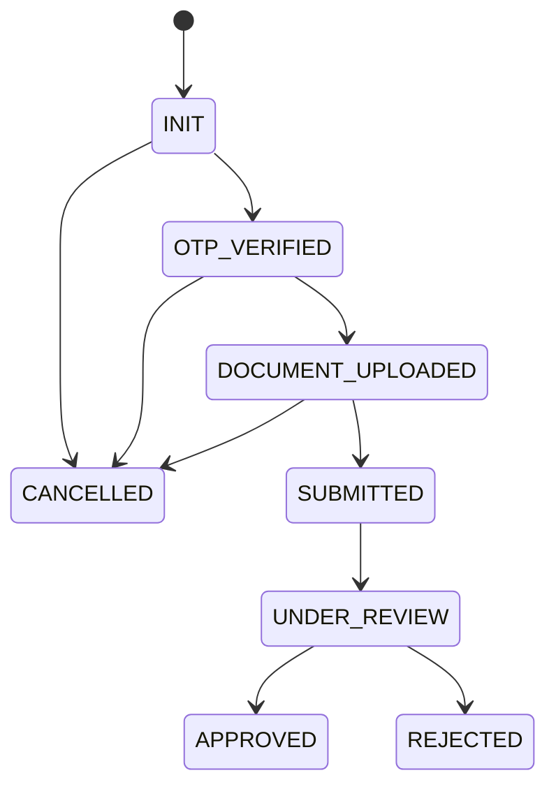

# Application

- [Back to Open Book Home](../../README.md)
- [Back to Source Map Index](../README.md)
- Previous Critical Class: —
- Next Critical Class: [ApplicationAppService](../application/ApplicationAppService.md)
- Related Topics: [topics/](../../topics/README.md)
- Related Questions: [09-interview-source-map-300.md](../../../handbook/09-interview-source-map-300.md)

---

## One-Sentence Summary

Domain aggregate root for a credit-card application: status transitions and workflow history live here.

## 中文一句話

申請聚合根：狀態轉移與 workflow history 寫在領域層，不含 Spring 註解。

## Why This Class Exists

Centralize lifecycle rules so application services orchestrate use cases without owning the transition table.

Do not restate Clean Architecture here — see [0001-use-clean-architecture.md](../../../decisions/0001-use-clean-architecture.md) and future `topics/01-architecture.md` (**Pending**).

## Responsibilities

- Hold identity, applicant, product id, status, documents, histories, timestamps
- Enforce transitions through `ApplicationStatus.canTransitionTo`
- Validate all `DocumentType` values before submit
- Append `WorkflowHistory` on each successful transition

## Runtime Execution Flow

1. An application service loads or builds `Application`.
2. A domain verb runs (`verifyOtp`, `uploadDocuments`, `submit`, …).
3. Private `transitionTo` checks `canTransitionTo` or throws `WorkflowException`.
4. History is appended; `status` updates.
5. The repository adapter persists the aggregate.

## Dependencies

### Depends On

- `ApplicationStatus`, value objects, `WorkflowHistory`, `DocumentInfo`
- `BusinessException`, `WorkflowException`, `ErrorCode`

### Called By

- `ApplicationAppService`, `OtpAppService`, `ReviewAppService`
- `ApplicationTest` and flow tests

### Calls

- `ApplicationStatus.canTransitionTo`
- private `validateRequiredDocuments`, `transitionTo`

## Important Public Methods

### `void verifyOtp(String operator)`

- **Purpose:** INIT → OTP_VERIFIED
- **Input:** operator label
- **Output:** void
- **Business meaning:** OTP accepted
- **Side effects:** Workflow history

### `void uploadDocuments(List<DocumentInfo> docs, String operator)`

- **Purpose:** Add documents; may OTP_VERIFIED → DOCUMENT_UPLOADED
- **Input:** docs, operator
- **Output:** void
- **Business meaning:** Collect required docs
- **Side effects:** Status transition only from OTP_VERIFIED; further uploads stay in DOCUMENT_UPLOADED

### `void submit(String operator)`

- **Purpose:** DOCUMENT_UPLOADED → SUBMITTED after required-doc check
- **Input:** operator
- **Output:** void
- **Business meaning:** Ready for review
- **Side effects:** Sets submittedAt; event publish happens in app service after save

### `void startReview(String operator)`

- **Purpose:** SUBMITTED → UNDER_REVIEW
- **Input:** operator
- **Output:** void
- **Business meaning:** Review started

### `void approve(String operator, String remark)`

- **Purpose:** UNDER_REVIEW → APPROVED
- **Input:** operator, remark
- **Output:** void
- **Business meaning:** Approved

### `void reject(String operator, String remark)`

- **Purpose:** UNDER_REVIEW → REJECTED
- **Input:** operator, remark
- **Output:** void
- **Business meaning:** Rejected

### `void cancel(String operator, String reason)`

- **Purpose:** Cancel only from INIT / OTP_VERIFIED / DOCUMENT_UPLOADED
- **Input:** operator, reason
- **Output:** void
- **Business meaning:** Early abandon

## Design Decisions

- Transition map on `ApplicationStatus`, verbs on the aggregate
- Required documents = entire `DocumentType` enum
- Operator is a plain string

## Trade-offs and Alternatives

- Rich domain vs anemic JPA entity — clearer rules, more mapping code
- Alternative: external state-machine library — not used

## Related Classes

- [ApplicationStatus](ApplicationStatus.md), [ApplicationAppService](../application/ApplicationAppService.md), [ApplicationRepositoryImpl](../infrastructure/ApplicationRepositoryImpl.md), [ReviewAppService](../application/ReviewAppService.md), [OtpAppService](../application/OtpAppService.md)

## Related Configuration

- None (pure domain)

## Related Tests

- [ApplicationTest.java](../../../../src/test/java/com/tlbank/lending/domain/application/ApplicationTest.java)
- [ApplicationStatusTest.java](../../../../src/test/java/com/tlbank/lending/domain/application/ApplicationStatusTest.java)
- Indirect: [ApplicationFlowIntegrationTest.java](../../../../src/test/java/com/tlbank/lending/application/ApplicationFlowIntegrationTest.java), [ApplicationAppServiceTest.java](../../../../src/test/java/com/tlbank/lending/application/application/ApplicationAppServiceTest.java)

## Related ADRs and Design Documents

- [0002-use-ddd.md](../../../decisions/0002-use-ddd.md)
- [04-domain-model.md](../../../design/04-domain-model.md)
- [08-workflow-design.md](../../../design/08-workflow-design.md)

## Related Interview Questions

[`Q014`](../../../handbook/09-interview-source-map-300.md#Q014), [`Q015`](../../../handbook/09-interview-source-map-300.md#Q015), [`Q027`](../../../handbook/09-interview-source-map-300.md#Q027), [`Q029`](../../../handbook/09-interview-source-map-300.md#Q029), [`Q034`](../../../handbook/09-interview-source-map-300.md#Q034), [`Q037`](../../../handbook/09-interview-source-map-300.md#Q037), [`Q041`](../../../handbook/09-interview-source-map-300.md#Q041), [`Q042`](../../../handbook/09-interview-source-map-300.md#Q042), [`Q045`](../../../handbook/09-interview-source-map-300.md#Q045), [`Q049`](../../../handbook/09-interview-source-map-300.md#Q049), [`Q051`](../../../handbook/09-interview-source-map-300.md#Q051), [`Q053`](../../../handbook/09-interview-source-map-300.md#Q053), [`Q054`](../../../handbook/09-interview-source-map-300.md#Q054), [`Q055`](../../../handbook/09-interview-source-map-300.md#Q055), [`Q056`](../../../handbook/09-interview-source-map-300.md#Q056)

## 30-Second Explanation

`Application` owns the credit application lifecycle. Methods like `verifyOtp` and `submit` call a private `transitionTo` that checks `ApplicationStatus.canTransitionTo` and writes workflow history. Illegal moves throw `WorkflowException`.

## 2-Minute Explanation

Services load the aggregate, call a verb, then save. Submit validates every `DocumentType`. Cancel works only in early statuses. Approve/reject require `UNDER_REVIEW`. Persistence and Spring events stay outside this class.

## 5-Minute Deep Explanation

Walk the forward path and CANCELLED exits. Note `uploadDocuments` transitions only from `OTP_VERIFIED`, then accepts more files. Contrast with `ReviewCase` status. Point to `ApplicationRepositoryImpl` for mapping. Defer hexagonal lecture to ADRs/topics.

## 中文口語重點

- 狀態機在領域物件，不在 Controller
- `transitionTo` 失敗丟 `WorkflowException`
- submit 前檢查全部文件類型
- 可取消：INIT／OTP_VERIFIED／DOCUMENT_UPLOADED

## Whiteboard Sketch

- **What to draw:** status boxes + allowed arrows
- **Drawing order:** forward path, then CANCELLED, then terminal approve/reject
- **Narration order:** caller → check → history → save

## Common Follow-Up Questions

- Where is the transition table?
- What if a document type is missing on submit?
- Why is `transitionTo` private?

## Common Mistakes

- Claiming Spring annotations on this class
- Allowing cancel after SUBMITTED
- Putting transition rules only in services

## Current Limitations

- Operator is not a typed identity
- No saga beyond the surrounding service transaction

## Source File

[Application.java](../../../../src/main/java/com/tlbank/lending/domain/application/Application.java)
