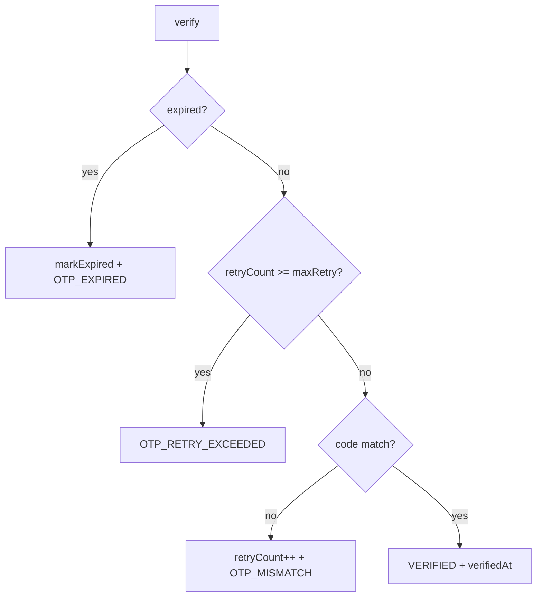

# OtpRecord

- [Back to Open Book Home](../../README.md)
- [Back to Source Map Index](../README.md)
- Previous High Class: —
- Next High Class: [AuditLogWriter](../common/AuditLogWriter.md)
- Related Topics: [04-domain-and-workflow](../../topics/04-domain-and-workflow.md), [07-redis-idempotency](../../topics/07-redis-idempotency.md) (OTP ≠ Redis)
- Related Questions: [09-interview-source-map-300.md](../../../handbook/09-interview-source-map-300.md)

---

## One-Sentence Summary

Domain aggregate for OTP lifecycle: verify, expire, and cancel rules without Spring.

## 中文一句話

OTP 聚合：驗證／過期／取消規則在領域層；不含 Spring 註解。

## Why This Class Exists

Keep OTP matching, retry, and expiry rules close to the record so `OtpAppService` orchestrates persistence and notifications without owning those checks.

Architecture depth: [topics/04-domain-and-workflow.md](../../topics/04-domain-and-workflow.md). OTP is not Redis — [topics/07-redis-idempotency.md](../../topics/07-redis-idempotency.md).

## Responsibilities

- Verify input code against stored code with expiry and max-retry gates
- Mark expired or cancelled statuses
- Throw `BusinessException` with OTP error codes on failure paths

## Runtime Execution Flow

1. `OtpAppService` loads a PENDING `OtpRecord`.
2. Calls `verify(inputCode, maxRetry, clock)`.
3. Expire → `markExpired` + `OTP_EXPIRED`; retry ceiling → `OTP_RETRY_EXCEEDED`; mismatch → increment retry + `OTP_MISMATCH`; match → `VERIFIED` + `verifiedAt`.
4. Service persists the aggregate (and may advance `Application`).

## Dependencies

### Depends On

- `OtpPurpose`, `OtpStatus`, `VerifyResult`
- `BusinessException`, `ErrorCode`, `Clock` (parameter)

### Called By

- [OtpAppService](../application/OtpAppService.md)
- `OtpRecordTest`

### Calls

- Status mutations; no ports

## Important Public Methods

### `VerifyResult verify(String inputCode, int maxRetry, Clock clock)`

- **Purpose:** Validate OTP and mutate status on success
- **Input:** code, maxRetry from params, Clock
- **Output:** VerifyResult.SUCCESS or throws
- **Business meaning:** Core OTP gate
- **Side effects:** May set EXPIRED/VERIFIED; may increment retryCount

### `boolean isExpired(Clock clock)`

- **Purpose:** Compare expiredAt to now
- **Input:** Clock
- **Output:** boolean

### `void markExpired()`

- **Purpose:** Force status EXPIRED
- **Side effects:** Status mutation only

### `void cancel()`

- **Purpose:** Force status CANCELLED
- **Side effects:** Status mutation only

## Design Decisions

- Pure domain (Lombok `@Getter`/`@Builder` only)
- Failures are typed `ErrorCode` values used by API advice
- Clock injected for testability

## Trade-offs and Alternatives

- Retry increment only on mismatch (not on exceeded) — intentional
- Alternative: encode all OTP rules in the app service — rejected for DDD-lite clarity

## Related Classes

- Grouped here (no dedicated pages): `OtpStatus`, `OtpPurpose`, `VerifyResult`, `OtpRepository` port
- Parent use case: [OtpAppService](../application/OtpAppService.md)
- Aggregate peer: [Application](Application.md)

## Related Configuration

- None in this class; expire/retry come from `SystemParameterService` (`OTP/expire_minutes`, `OTP/max_retry`) in the app service

## Related Tests

- [OtpRecordTest.java](../../../../src/test/java/com/tlbank/lending/domain/otp/OtpRecordTest.java)
- Indirect: [OtpAppServiceTest.java](../../../../src/test/java/com/tlbank/lending/application/otp/OtpAppServiceTest.java)

## Related ADRs and Design Documents

- [0002-use-ddd.md](../../../decisions/0002-use-ddd.md)
- [04-domain-model.md](../../../design/04-domain-model.md)

## Related Interview Questions

[`Q045`](../../../handbook/09-interview-source-map-300.md#Q045), [`Q046`](../../../handbook/09-interview-source-map-300.md#Q046), [`Q060`](../../../handbook/09-interview-source-map-300.md#Q060), [`Q136`](../../../handbook/09-interview-source-map-300.md#Q136), [`Q138`](../../../handbook/09-interview-source-map-300.md#Q138), [`Q140`](../../../handbook/09-interview-source-map-300.md#Q140), [`Q235`](../../../handbook/09-interview-source-map-300.md#Q235), [`Q266`](../../../handbook/09-interview-source-map-300.md#Q266)

## 30-Second Explanation

`OtpRecord.verify` is the OTP rule engine: expiry first, then max retry, then code match. Success sets `VERIFIED`; failures throw business codes the API maps to HTTP.

## 2-Minute Explanation

Walk the four outcomes and name the three error codes. Say the service loads PENDING records and persists after verify. Remind listeners Redis is for idempotency, not OTP storage.

## 5-Minute Deep Explanation

Contrast with `Application.verifyOtp` (status machine). Cover `cancel` on resend paths in `OtpAppService`. Point to `OtpCleanupScheduler` for batch expire. Link domain topic for aggregate boundaries.

## 中文口語重點

- 先過期、再重試上限、再比對碼
- 錯碼才加 retryCount
- 領域物件無 Spring

## Whiteboard Sketch

- **What to draw:** decision diamond for expire / retry / match
- **Drawing order:** left-to-right failure exits, success sink
- **Narration order:** service load → verify → save

## Common Follow-Up Questions

- Where is maxRetry configured?
- Does mismatch expire the OTP?
- Who marks expired OTPs in batch?

## Common Mistakes

- Saying OTP lives in Redis
- Claiming Spring annotations on this class
- Inventing extra OTP statuses not in `OtpStatus`

## Current Limitations

- No dedicated cryptographic hashing of codes in this class (plain compare as implemented)
- Scheduler cleanup is separate infrastructure

## Source File

[OtpRecord.java](../../../../src/main/java/com/tlbank/lending/domain/otp/OtpRecord.java)
