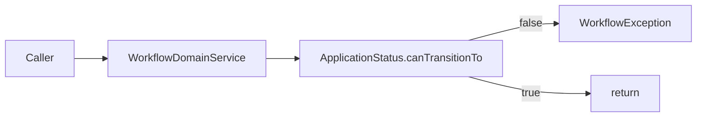

# WorkflowDomainService

- [Back to Open Book Home](../../README.md)
- [Back to Source Map Index](../README.md)
- Previous High Class: [ApplicationApiController](../presentation/ApplicationApiController.md)
- Next High Class: [CachedCardProductRepository](../infrastructure/CachedCardProductRepository.md)
- Related Topics: [01-architecture](../../topics/01-architecture.md), [04-domain-and-workflow](../../topics/04-domain-and-workflow.md)
- Related Questions: [09-interview-source-map-300.md](../../../handbook/09-interview-source-map-300.md)

---

## One-Sentence Summary

Thin domain service that validates `ApplicationStatus` transitions by delegating to `canTransitionTo`.

## 中文一句話

領域服務：用 `ApplicationStatus.canTransitionTo` 檢查轉移；非法則丟 `WorkflowException`。

## Why This Class Exists

Interview surface for “domain service vs entity.” In **current** runtime, `Application.transitionTo` already enforces the same map; this service is an alternate/explicit validator with Spring `@Service` on a domain package type.

Architecture impurity note: [topics/01-architecture.md](../../topics/01-architecture.md). Workflow: [topics/04-domain-and-workflow.md](../../topics/04-domain-and-workflow.md).

## Responsibilities

- Single method `validateTransition(from, to)`
- Throw `WorkflowException` when disallowed

## Runtime Execution Flow

1. Caller invokes `validateTransition`.
2. `from.canTransitionTo(to)` consulted.
3. False → `WorkflowException`; true → return.

## Dependencies

### Depends On

- `ApplicationStatus`, `WorkflowException`

### Called By

- **No main-source production callers found** in current code (verified by search); covered by unit test
- Aggregate enforcement path: [Application](Application.md) private `transitionTo`

### Calls

- `ApplicationStatus.canTransitionTo`

## Important Public Methods

### `void validateTransition(ApplicationStatus from, ApplicationStatus to)`

- **Purpose:** Assert allowed transition
- **Input:** from/to statuses
- **Output:** void or WorkflowException
- **Business meaning:** Same map as ApplicationStatus enum

## Design Decisions

- Domain service wrapper over enum map
- Spring `@Service` in `domain.service` — documented dependency-rule tension
- Does not replace aggregate verbs

## Trade-offs and Alternatives

- Duplicate enforcement surface vs aggregate — risk of drift if maps diverge (today both use `canTransitionTo`)
- Alternative: only aggregate methods (actual write path today)

## Related Classes

- [ApplicationStatus](ApplicationStatus.md), [Application](Application.md)
- Grouped: `WorkflowException` (mapped by [GlobalExceptionHandler](../presentation/GlobalExceptionHandler.md))

## Related Configuration

- None

## Related Tests

- [WorkflowDomainServiceTest.java](../../../../src/test/java/com/tlbank/lending/domain/service/WorkflowDomainServiceTest.java)
- Parallel rules: [ApplicationStatusTest.java](../../../../src/test/java/com/tlbank/lending/domain/application/ApplicationStatusTest.java), [ApplicationTest.java](../../../../src/test/java/com/tlbank/lending/domain/application/ApplicationTest.java)

## Related ADRs and Design Documents

- [0002-use-ddd.md](../../../decisions/0002-use-ddd.md)
- [0001-use-clean-architecture.md](../../../decisions/0001-use-clean-architecture.md)
- [08-workflow-design.md](../../../design/08-workflow-design.md)

## Related Interview Questions

[`Q030`](../../../handbook/09-interview-source-map-300.md#Q030), [`Q032`](../../../handbook/09-interview-source-map-300.md#Q032), [`Q225`](../../../handbook/09-interview-source-map-300.md#Q225)

## 30-Second Explanation

`WorkflowDomainService` validates status transitions via `canTransitionTo`. The live write path still goes through `Application` verbs. The interesting interview point is domain service placement and the `@Service` annotation on domain code.

## 2-Minute Explanation

Show the method, the exception type, and that GlobalExceptionHandler maps it to 409. Admit no production caller in main sources today — do not invent wiring.

## 5-Minute Deep Explanation

Discuss when a domain service is justified vs entity methods. Cover the hexagonal leak of Spring in domain. Point to ApplicationStatus map as SoT.

## 中文口語重點

- 真正寫入路徑在 Application 動詞
- 此類是明確校驗器／面試題素材
- domain 套件上的 @Service 是已知雜質

## Whiteboard Sketch

- **What to draw:** enum map vs domain service vs aggregate verb
- **Drawing order:** map first, then two callers
- **Narration order:** SoT → who calls what today

## Common Follow-Up Questions

- Who calls this in production code?
- Where is the transition table?
- Why is `@Service` on domain?

## Common Mistakes

- Claiming this is the only enforcement point
- Inventing a workflow engine library
- Ignoring the Spring-in-domain impurity

## Current Limitations

- Unused by main application services today
- Spring stereotype on domain package

## Source File

[WorkflowDomainService.java](../../../../src/main/java/com/tlbank/lending/domain/service/WorkflowDomainService.java)
