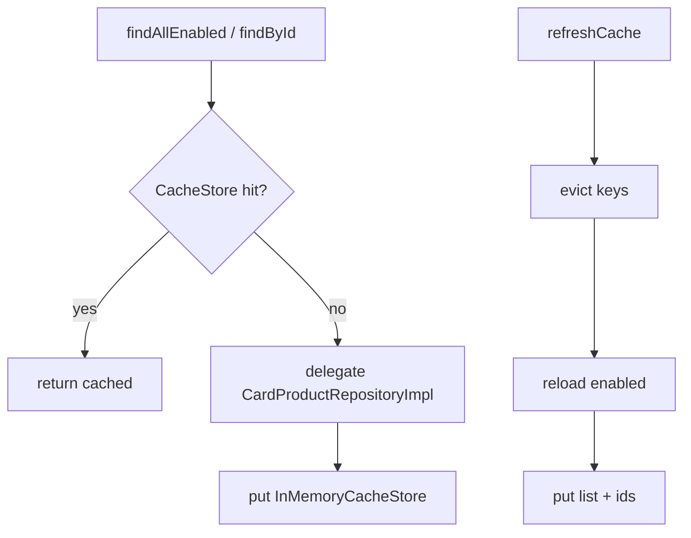

# CachedCardProductRepository

- [Back to Open Book Home](../../README.md)
- [Back to Source Map Index](../README.md)
- Previous High Class: [WorkflowDomainService](../domain/WorkflowDomainService.md)
- Next High Class: [OtpCleanupScheduler](OtpCleanupScheduler.md)
- Related Topics: [08-cache](../../topics/08-cache.md), [01-architecture](../../topics/01-architecture.md)
- Related Questions: [09-interview-source-map-300.md](../../../handbook/09-interview-source-map-300.md)

---

## One-Sentence Summary

`@Primary` caching decorator over `CardProductRepository` using in-memory `CacheStore` — not Redis.

## 中文一句話

卡片產品儲存庫快取裝飾器；命中走記憶體 `CacheStore`；Redis 不負責產品快取。

## Why This Class Exists

Speed product reads and demonstrate decorator/cache impurity (infrastructure calling repository + cache). Interviewers probe Redis confusion here.

Cache topic: [topics/08-cache.md](../../topics/08-cache.md). Architecture leaks: [topics/01-architecture.md](../../topics/01-architecture.md).

## Responsibilities

- Cache `findAllEnabled` and `findById` behind `CacheKeys`
- `refreshCache` evicts product keys and reloads enabled products
- TTL from `CacheTtlProvider` (system parameter `CACHE`/`ttl_seconds`, default 21600s)

## Runtime Execution Flow

Read hit/miss:

1. Build cache key.
2. `CacheStore.get` → return if present.
3. Miss → delegate `cardProductRepositoryImpl` → `put` with TTL (skip empty Optional on by-id).

Refresh:

1. Evict card-product keys.
2. Load all enabled; put list + per-id entries.
3. Return `evicted + products.size()`.

## Dependencies

### Depends On

- `@Qualifier("cardProductRepositoryImpl") CardProductRepository`
- `CacheStore` (runtime: `InMemoryCacheStore`)
- `CacheTtlProvider`

### Called By

- Application/product use cases resolving `CardProductRepository` (`@Primary`)
- Cache refresh scheduler path

### Calls

- Delegate repository; cache get/put/evict

## Important Public Methods

### `List<CardProduct> findAllEnabled()`

- **Purpose:** Cached list of enabled products
- **Side effects:** may populate cache on miss

### `Optional<CardProduct> findById(CardProductId id)`

- **Purpose:** Cached by-id lookup
- **Side effects:** caches only when present

### `int refreshCache()`

- **Purpose:** Evict and reload product cache entries
- **Output:** evicted + reloaded count

## Design Decisions

- Decorator + `@Primary` so callers keep the port type
- In-memory store only in this repository
- Empty by-id results not cached

## Trade-offs and Alternatives

- Single-node memory — not multi-instance coherent
- Architectural impurity: infra decorator knows persistence bean name
- Alternative: Redis cache — **Not implemented** (Redis = idempotency)

## Related Classes

- Grouped here: `InMemoryCacheStore`, `CacheStore`, `CacheKeys`, `CacheTtlProvider`, `CardProductRepositoryImpl`
- Sibling scheduler (related only): `CacheRefreshScheduler` — see [topics/08-cache.md](../../topics/08-cache.md) / [topics/12-delivery-and-limitations.md](../../topics/12-delivery-and-limitations.md)
- Contrast: [RedisIdempotencyStore](RedisIdempotencyStore.md)

## Related Configuration

- TTL via DB system parameter group/key `CACHE` / `ttl_seconds` (default 21600)
- Not `spring.cache` Redis

## Related Tests

- No dedicated `CachedCardProductRepository` test
- [InMemoryCacheStoreTest.java](../../../../src/test/java/com/tlbank/lending/infrastructure/cache/InMemoryCacheStoreTest.java)
- [CacheRefreshSchedulerTest.java](../../../../src/test/java/com/tlbank/lending/infrastructure/scheduler/CacheRefreshSchedulerTest.java)

## Related ADRs and Design Documents

- [12-cache-design.md](../../../design/12-cache-design.md)
- [0003-use-redis-idempotency.md](../../../decisions/0003-use-redis-idempotency.md) (contrast)

## Related Interview Questions

[`Q039`](../../../handbook/09-interview-source-map-300.md#Q039), [`Q086`](../../../handbook/09-interview-source-map-300.md#Q086), [`Q108`](../../../handbook/09-interview-source-map-300.md#Q108), [`Q212`](../../../handbook/09-interview-source-map-300.md#Q212), [`Q284`](../../../handbook/09-interview-source-map-300.md#Q284)

## 30-Second Explanation

`CachedCardProductRepository` is a primary decorator that caches card products in memory. Redis is not involved. Refresh rebuilds keys from the JPA delegate.

## 2-Minute Explanation

Explain `@Primary` + qualifier to the real impl. Name `InMemoryCacheStore`. Call out the impurity and the Redis≠cache rule.

## 5-Minute Deep Explanation

Walk hit/miss and refresh. Discuss multi-instance staleness. Link architecture topic for dependency-rule talk. Do not claim distributed cache.

## 中文口語重點

- 記憶體快取，不是 Redis
- @Primary 裝飾器
- 空 Optional 不快取

## Whiteboard Sketch

- **What to draw:** port → cached decorator → impl; side box InMemoryCacheStore; crossed-out Redis
- **Drawing order:** read path, then refresh
- **Narration order:** hit → miss → put

## Common Follow-Up Questions

- Is this Redis?
- How is TTL chosen?
- What does refresh return?

## Common Mistakes

- Equating Redis idempotency with product cache
- Claiming Spring Session uses this store
- Inventing Redis `CacheStore` implementation as current

## Current Limitations

- In-memory only; no dedicated repository unit test
- Known hexagonal impurity around direct repository bean wiring

## Source File

[CachedCardProductRepository.java](../../../../src/main/java/com/tlbank/lending/infrastructure/cache/CachedCardProductRepository.java)
