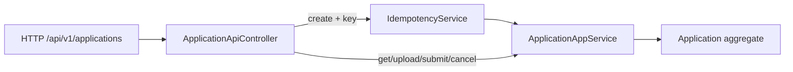

# ApplicationApiController

- [Back to Open Book Home](../../README.md)
- [Back to Source Map Index](../README.md)
- Previous High Class: [GlobalExceptionHandler](GlobalExceptionHandler.md)
- Next High Class: [WorkflowDomainService](../domain/WorkflowDomainService.md)
- Related Topics: [02-request-lifecycle](../../topics/02-request-lifecycle.md), [07-redis-idempotency](../../topics/07-redis-idempotency.md)
- Related Questions: [09-interview-source-map-300.md](../../../handbook/09-interview-source-map-300.md)

---

## One-Sentence Summary

REST edge for `/api/v1/applications`: create is wrapped by idempotency; other verbs delegate to `ApplicationAppService`.

## 中文一句話

申請 REST 入口；建立走 `IdempotencyService`；其餘委派 `ApplicationAppService`。

## Why This Class Exists

Keep HTTP mapping, OpenAPI annotations, and the idempotency header at the edge while use cases stay in the application layer.

Lifecycle: [topics/02-request-lifecycle.md](../../topics/02-request-lifecycle.md). Idempotency: [topics/07-redis-idempotency.md](../../topics/07-redis-idempotency.md).

## Responsibilities

- Map create/get/upload/submit/cancel endpoints
- Pass optional `Idempotency-Key` into `IdempotencyService.execute` on create
- Return `ApiResponse` envelopes with proper HTTP status (201 on create)

## Runtime Execution Flow

Create:

1. Read optional `Idempotency-Key` header.
2. `idempotencyService.execute(key, bodyHash/action)` → `applicationAppService.createApplication`.
3. Return 201 + summary.

Other verbs: controller → app service → domain/ports (no idempotency wrap).

## Dependencies

### Depends On

- [ApplicationAppService](../application/ApplicationAppService.md)
- [IdempotencyService](../application/IdempotencyService.md)

### Called By

- HTTP clients / Swagger / integration tests

### Calls

- App service methods; idempotency execute on create

## Important Public Methods

### `ResponseEntity<?> createApplication(Idempotency-Key?, CreateApplicationRequest)`

- **Purpose:** Idempotent create
- **Input:** optional key + request body
- **Output:** 201 ApiResponse summary
- **Security behavior:** permit rules in SecurityConfig
- **Side effects:** may hit Redis idempotency store

### `... getApplication(applicationId)`

- **Purpose:** Fetch detail/summary via app service

### `... uploadDocument(applicationId, DocumentType, MultipartFile)`

- **Purpose:** Upload path to local storage via app service

### `... submitApplication(applicationId)`

- **Purpose:** Submit for review

### `... cancelApplication(applicationId, CancelApplicationRequest)`

- **Purpose:** Cancel with reason; operator hard-coded APPLICANT

## Design Decisions

- Idempotency only on create (not every mutating verb)
- Operator on cancel is `"APPLICANT"` at the edge
- OpenAPI `@Operation` / `@StandardApiResponses` for docs

## Trade-offs and Alternatives

- Optional key: blank/null skips store (see IdempotencyService) — clients must send key for safety
- Alternative: filter-based idempotency for all POSTs — not implemented

## Related Classes

- Grouped here: `CreateApplicationRequest`, `CancelApplicationRequest`, `ApplicationSummaryResponse`, `ApplicationDetailResponse`, `DocumentUploadResponse`, `ApiResponse`, `DocumentType`
- Sibling controllers (no dedicated pages): `OtpApiController`, `ReviewApiController` — covered under their app services
- Errors: [GlobalExceptionHandler](GlobalExceptionHandler.md)
- Storage: [LocalDocumentStorageService](../infrastructure/LocalDocumentStorageService.md)

## Related Configuration

- Idempotency: `tlbank.idempotency.ttl-hours`, `tlbank.idempotency.key-prefix`, profile store selection
- Upload base path used deeper: `tlbank.upload.base-path`
- Security permit/auth rules: [SecurityConfig](../security/SecurityConfig.md)

## Related Tests

- [ApplicationFlowIntegrationTest.java](../../../../src/test/java/com/tlbank/lending/application/ApplicationFlowIntegrationTest.java)
- [ApplicationIdempotencyIntegrationTest.java](../../../../src/test/java/com/tlbank/lending/application/ApplicationIdempotencyIntegrationTest.java)
- Indirect: [ApplicationWebControllerTest.java](../../../../src/test/java/com/tlbank/lending/presentation/web/ApplicationWebControllerTest.java)

## Related ADRs and Design Documents

- [0003-use-redis-idempotency.md](../../../decisions/0003-use-redis-idempotency.md)
- [06-api-specification.md](../../../design/06-api-specification.md)
- [15-file-upload-design.md](../../../design/15-file-upload-design.md)

## Related Interview Questions

[`Q031`](../../../handbook/09-interview-source-map-300.md#Q031), [`Q037`](../../../handbook/09-interview-source-map-300.md#Q037), [`Q062`](../../../handbook/09-interview-source-map-300.md#Q062), [`Q063`](../../../handbook/09-interview-source-map-300.md#Q063), [`Q064`](../../../handbook/09-interview-source-map-300.md#Q064), [`Q065`](../../../handbook/09-interview-source-map-300.md#Q065), [`Q066`](../../../handbook/09-interview-source-map-300.md#Q066), [`Q067`](../../../handbook/09-interview-source-map-300.md#Q067), [`Q177`](../../../handbook/09-interview-source-map-300.md#Q177), [`Q278`](../../../handbook/09-interview-source-map-300.md#Q278), [`Q286`](../../../handbook/09-interview-source-map-300.md#Q286)

## 30-Second Explanation

`ApplicationApiController` is the HTTP adapter for applications. Create goes through `IdempotencyService`; upload/submit/cancel call `ApplicationAppService` directly. It does not own domain rules.

## 2-Minute Explanation

Name the five endpoints and the idempotency header. Stress Redis is the idempotency store, not session/cache. Point to GlobalExceptionHandler for error shape.

## 5-Minute Deep Explanation

Trace create with duplicate key. Mention cancel operator constant. Link local filesystem uploads. Defer hexagonal lecture to [topics/01-architecture.md](../../topics/01-architecture.md).

## 中文口語重點

- Controller 很薄
- 只有 create 包冪等
- 檔案上傳最終是本機磁碟

## Whiteboard Sketch

- **What to draw:** HTTP → controller → (idempotency?) → app service
- **Drawing order:** create path first, then other verbs
- **Narration order:** header → execute → 201

## Common Follow-Up Questions

- Is Idempotency-Key required?
- Why only create?
- Where do uploads land?

## Common Mistakes

- Putting business transitions in the controller
- Calling Redis a general cache here
- Claiming JWT auth on these APIs

## Current Limitations

- No dedicated controller unit test class
- Broad permitAll on some applicant APIs (see SecurityConfig / security topic)

## Source File

[ApplicationApiController.java](../../../../src/main/java/com/tlbank/lending/presentation/api/v1/ApplicationApiController.java)
