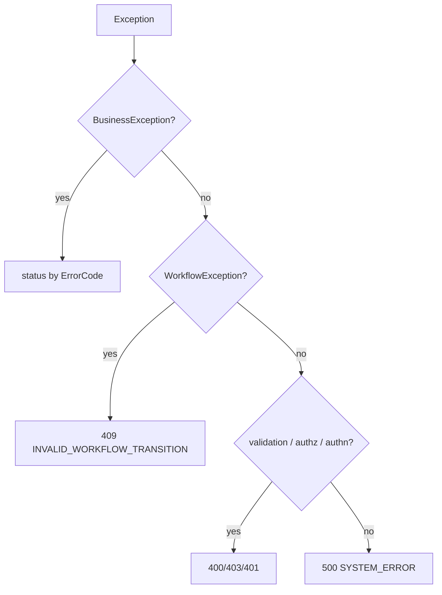

# GlobalExceptionHandler

- [Back to Open Book Home](../../README.md)
- [Back to Source Map Index](../README.md)
- Previous High Class: [AuditLogWriter](../common/AuditLogWriter.md)
- Next High Class: [ApplicationApiController](ApplicationApiController.md)
- Related Topics: [02-request-lifecycle](../../topics/02-request-lifecycle.md), [03-security](../../topics/03-security.md)
- Related Questions: [09-interview-source-map-300.md](../../../handbook/09-interview-source-map-300.md)

---

## One-Sentence Summary

`@RestControllerAdvice` maps domain/API exceptions to HTTP status + `ApiResponse` error bodies.

## 中文一句話

全域例外轉 HTTP 與 `ApiResponse`；業務碼決定 400／404／409，其餘認證／驗證／系統錯誤分級。

## Why This Class Exists

Keep controllers thin: throw typed exceptions in services/domain; one place owns REST error shape.

Request path: [topics/02-request-lifecycle.md](../../topics/02-request-lifecycle.md). Auth mapping: [topics/03-security.md](../../topics/03-security.md).

## Responsibilities

- Map `BusinessException` by `ErrorCode` to 400 / 404 / 409
- Map `WorkflowException` → 409 `INVALID_WORKFLOW_TRANSITION`
- Map validation / access / authentication / catch-all

## Runtime Execution Flow

1. Exception leaves controller/service.
2. Matching `@ExceptionHandler` runs.
3. Returns `ResponseEntity` with `ApiResponse.error(...)`.
4. Catch-all logs and returns `SYSTEM_ERROR` (500) without stack in body.

## Dependencies

### Depends On

- `ApiResponse`, `BusinessException`, `ErrorCode`, `WorkflowException`, `FieldErrorDetail`

### Called By

- Spring MVC advice mechanism (all `@RestController` APIs)

### Calls

- `ApiResponse.error`, `ErrorCode` HTTP helpers in-handler

## Important Public Methods

### `ResponseEntity<ApiResponse<?>> handleBusinessException(BusinessException ex)`

- **Purpose:** Map business codes to HTTP
- **Output:** ApiResponse.error(code, message, null)
- **Business meaning:** 409 conflict codes; 404 not-found family; else 400

### `ResponseEntity<ApiResponse<?>> handleWorkflowException(WorkflowException ex)`

- **Purpose:** Illegal status transition
- **Output:** 409 + INVALID_WORKFLOW_TRANSITION

### `ResponseEntity<ApiResponse<?>> handleValidationException(MethodArgumentNotValidException ex)`

- **Purpose:** Bean validation failures
- **Output:** 400 + VALIDATION_FAILED + field details

### `ResponseEntity<ApiResponse<?>> handleAccessDeniedException(...)`

- **Purpose:** Authorization failure
- **Output:** 403 FORBIDDEN

### `ResponseEntity<ApiResponse<?>> handleAuthenticationException(...)`

- **Purpose:** Authentication failure
- **Output:** 401 UNAUTHORIZED

### `ResponseEntity<ApiResponse<?>> handleException(Exception ex)`

- **Purpose:** Catch-all
- **Output:** 500 SYSTEM_ERROR
- **Side effects:** logs error

## Design Decisions

- Single envelope `ApiResponse` for success and error
- ErrorCode-driven HTTP for business cases
- No stack traces in client payloads

## Trade-offs and Alternatives

- Central advice vs per-controller handlers — less duplication
- Catch-all hides unexpected types behind `SYSTEM_ERROR` — safer for clients, less detail

## Related Classes

- Grouped here (no dedicated pages): `ApiResponse`, `BusinessException`, `ErrorCode`, `FieldErrorDetail`, `WorkflowException`
- Controllers: [ApplicationApiController](ApplicationApiController.md)

## Related Configuration

- None in this class

## Related Tests

- No dedicated `GlobalExceptionHandler` test
- Indirect: [ApplicationFlowIntegrationTest.java](../../../../src/test/java/com/tlbank/lending/application/ApplicationFlowIntegrationTest.java), [SecurityIntegrationTest.java](../../../../src/test/java/com/tlbank/lending/security/SecurityIntegrationTest.java)

## Related ADRs and Design Documents

- [06-api-specification.md](../../../design/06-api-specification.md)
- [07-security-design.md](../../../design/07-security-design.md)

## Related Interview Questions

[`Q009`](../../../handbook/09-interview-source-map-300.md#Q009), [`Q013`](../../../handbook/09-interview-source-map-300.md#Q013), [`Q031`](../../../handbook/09-interview-source-map-300.md#Q031), [`Q070`](../../../handbook/09-interview-source-map-300.md#Q070), [`Q071`](../../../handbook/09-interview-source-map-300.md#Q071), [`Q072`](../../../handbook/09-interview-source-map-300.md#Q072), [`Q075`](../../../handbook/09-interview-source-map-300.md#Q075), [`Q265`](../../../handbook/09-interview-source-map-300.md#Q265), [`Q300`](../../../handbook/09-interview-source-map-300.md#Q300)

## 30-Second Explanation

`GlobalExceptionHandler` turns exceptions into consistent `ApiResponse` errors. Business codes pick 400/404/409; workflow conflicts are 409; authz/authn are 403/401; everything else is 500 `SYSTEM_ERROR`.

## 2-Minute Explanation

List the six handlers and the BusinessException status buckets (conflict vs not-found vs bad request). Say controllers stay free of try/catch mapping.

## 5-Minute Deep Explanation

Walk an OTP mismatch and an illegal transition through to HTTP. Note missing dedicated unit test. Link security topic for AccessDenied vs Authentication.

## 中文口語重點

- 業務例外看 ErrorCode
- WorkflowException 固定 409
- 客戶端看不到 stack

## Whiteboard Sketch

- **What to draw:** exception types → status codes funnel
- **Drawing order:** Business → Workflow → Validation → Security → Catch-all
- **Narration order:** throw site → advice → JSON body

## Common Follow-Up Questions

- Which codes are 409?
- How are field validation errors shaped?
- Does the handler swallow exceptions?

## Common Mistakes

- Claiming every BusinessException is 400
- Putting stack traces in the API body
- Inventing a second exception advice class as the primary mapper

## Current Limitations

- No dedicated unit test for mapping table
- Catch-all loses exception type detail for clients

## Source File

[GlobalExceptionHandler.java](../../../../src/main/java/com/tlbank/lending/presentation/api/advice/GlobalExceptionHandler.java)
