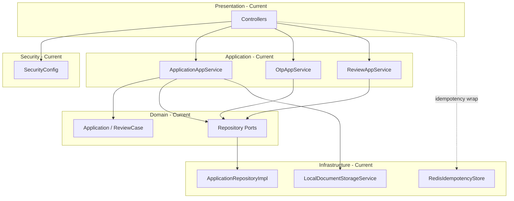

# Overall Architecture

- [Back to Open Book Home](../README.md)
- [Back to Topics Index](README.md)
- Previous Topic: —
- Next Topic: [Request Lifecycle](02-request-lifecycle.md)

---

## One-Sentence Summary

Hexagonal / Clean Architecture modular monolith: domain at the center, application use cases, infrastructure adapters, presentation/security at the edges.

## 中文摘要

六邊形／Clean Architecture 模組化單體：domain 不依賴框架；application 編排用例；infrastructure 適配 DB／Redis／檔案；presentation／security 在外層。

## Why This Topic Matters

Interviewers ask how packages depend on each other, where business rules live, and which “leaks” the repo already admits.

## Current Implementation

- Packages under `com.tlbank.lending`: `domain`, `application`, `infrastructure`, `presentation`, `security`, `common`
- Domain ports (e.g. `ApplicationRepository`) implemented in infrastructure (e.g. [`ApplicationRepositoryImpl`](../source-map/infrastructure/ApplicationRepositoryImpl.md))
- Use cases in application services (e.g. [`ApplicationAppService`](../source-map/application/ApplicationAppService.md))
- HTTP in `presentation`; session security in [`SecurityConfig`](../source-map/security/SecurityConfig.md)
- Known impurities exist (e.g. cache decorator accessing repositories directly — see Q032 / cache topic)

## Runtime Flow

1. Request enters presentation (controller) and security filters.
2. Application service opens a transaction and calls domain + ports.
3. Infrastructure adapters talk to SQL Server/H2, Redis (idempotency), or local disk.
4. Domain events may fan out to handlers after publish.

## Mermaid Diagram

## Important Classes

- [`ApplicationAppService`](../source-map/application/ApplicationAppService.md)
- [`ApplicationRepositoryImpl`](../source-map/infrastructure/ApplicationRepositoryImpl.md)
- [`SecurityConfig`](../source-map/security/SecurityConfig.md)
- [`Application`](../source-map/domain/Application.md)
- High **Pending**: `ApplicationApiController`, `WorkflowDomainService`

## Important Configuration

- [pom.xml](../../../pom.xml) — Spring Boot 3.x / Java 17
- [application.yml](../../../src/main/resources/application.yml)

## Important Tests

- [ApplicationAppServiceTest.java](../../../src/test/java/com/tlbank/lending/application/application/ApplicationAppServiceTest.java)
- [ApplicationFlowIntegrationTest.java](../../../src/test/java/com/tlbank/lending/application/ApplicationFlowIntegrationTest.java)

## Design Decisions

- ADR: [0001-use-clean-architecture.md](../../decisions/0001-use-clean-architecture.md)
- DDD-lite aggregates: [0002-use-ddd.md](../../decisions/0002-use-ddd.md)
- Depth: [02-architecture-design.md](../../design/02-architecture-design.md), [02-architecture-handbook.md](../../handbook/02-architecture-handbook.md)

## Trade-offs

- Strict layers improve interview clarity; some adapters still couple for convenience (cache impurity).
- Modular monolith is simpler than microservices for this portfolio size.

## Alternatives

- Classic Spring layered MVC without ports — rejected by ADR 0001
- Microservices split — **Planned** only in evolution talk, not implemented

## Production Considerations

- **Current:** single deployable Spring Boot app with clear packages
- **Partial:** some dependency-rule leaks documented in questions
- **Planned:** multi-service split, stricter boundaries — not in this repo

## Related ADRs

- [0001-use-clean-architecture.md](../../decisions/0001-use-clean-architecture.md)
- [0002-use-ddd.md](../../decisions/0002-use-ddd.md)

## Related Interview Questions

[`Q027`](../../handbook/09-interview-source-map-300.md#Q027), [`Q028`](../../handbook/09-interview-source-map-300.md#Q028), [`Q029`](../../handbook/09-interview-source-map-300.md#Q029), [`Q030`](../../handbook/09-interview-source-map-300.md#Q030), [`Q031`](../../handbook/09-interview-source-map-300.md#Q031), [`Q032`](../../handbook/09-interview-source-map-300.md#Q032), [`Q033`](../../handbook/09-interview-source-map-300.md#Q033), [`Q034`](../../handbook/09-interview-source-map-300.md#Q034), [`Q035`](../../handbook/09-interview-source-map-300.md#Q035)

## 30-Second Explanation

This app is a modular monolith with Clean Architecture: domain holds rules, application orchestrates, infrastructure adapts databases and Redis idempotency, presentation and security sit outside.

## 2-Minute Explanation

Walk package dependency direction, show one port/adapter pair, mention session security and known impurities without claiming perfect purity. Point to Critical source-map pages for class detail.

## Whiteboard Sketch

- **Draw:** concentric or left-to-right layers with arrows inward to domain
- **Order:** domain → application → adapters → controllers
- **Say:** “controllers never contain transition tables”

## Common Follow-Up Questions

- Where are the known architecture leaks?
- Why not put `@Entity` on domain types?

## Common Mistakes

- Claiming zero impurities
- Describing microservices as current architecture

## Current Limitations

- Not a distributed system
- Some infrastructure reach-throughs remain

## Review Checklist

- [ ] Name layers and one example class each
- [ ] Point to a port + impl pair
- [ ] Cite ADR 0001 without reading it aloud in full
- [ ] Mention one known leak honestly
