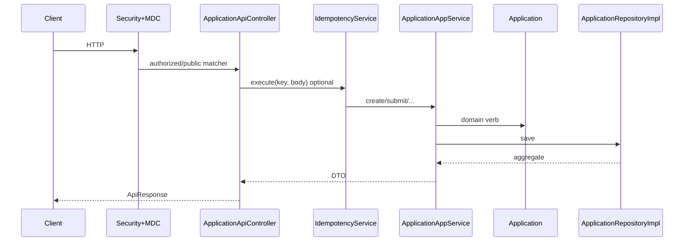

# Request Lifecycle

- [Back to Open Book Home](../README.md)
- [Back to Topics Index](README.md)
- Previous Topic: [Overall Architecture](01-architecture.md)
- Next Topic: [Security and Sessions](03-security.md)

---

## One-Sentence Summary

HTTP request path: security filters → controller → optional idempotency → application service → domain → persistence/storage/events → `ApiResponse`.

## 中文摘要

請求鏈：Security 濾器 → Controller →（可選冪等）→ AppService → Domain → DB／檔案／事件 → 統一 `ApiResponse`／例外處理。

## Why This Topic Matters

Shows end-to-end storytelling for “what happens when I POST an application?”

## Current Implementation

- Controllers under `presentation/api/v1` (e.g. applications, OTP, review)
- [`SecurityConfig`](../source-map/security/SecurityConfig.md) + `MdcLoggingFilter`
- Create may wrap [`IdempotencyService`](../source-map/application/IdempotencyService.md)
- [`ApplicationAppService`](../source-map/application/ApplicationAppService.md) mutates [`Application`](../source-map/domain/Application.md)
- Errors via `GlobalExceptionHandler` (High page **Pending**)

## Runtime Flow

1. Request enters filter chain (MDC, authn/authz as configured).
2. Controller binds DTO / headers (`Idempotency-Key` optional on create).
3. App service `@Transactional` method runs domain verbs and ports.
4. Adapter saves JPA entity / files; events may publish.
5. Response envelope or mapped error returns.

## Mermaid Diagram

## Important Classes

- [`ApplicationAppService`](../source-map/application/ApplicationAppService.md)
- [`SecurityConfig`](../source-map/security/SecurityConfig.md)
- [`IdempotencyService`](../source-map/application/IdempotencyService.md)
- [ApplicationApiController](../source-map/presentation/ApplicationApiController.md), [GlobalExceptionHandler](../source-map/presentation/GlobalExceptionHandler.md)

## Important Configuration

- [application.yml](../../../src/main/resources/application.yml)
- Matcher rules in SecurityConfig (many applicant routes `permitAll`)

## Important Tests

- [ApplicationFlowIntegrationTest.java](../../../src/test/java/com/tlbank/lending/application/ApplicationFlowIntegrationTest.java)
- [ApplicationIdempotencyIntegrationTest.java](../../../src/test/java/com/tlbank/lending/application/ApplicationIdempotencyIntegrationTest.java)

## Design Decisions

- Thin controllers; fat-ish application services
- Unified API envelope and exception advice
- Depth: [06-api-specification.md](../../design/06-api-specification.md)

## Trade-offs

- Broad `permitAll` simplifies demos; weakens real-world auth story
- Optional idempotency key preserves compatibility

## Alternatives

- API gateway + JWT BFF — **Planned** discussion only
- Mandatory idempotency keys — not enforced

## Production Considerations

- **Current:** synchronous monolith request path
- **Partial:** public application APIs
- **Planned:** stricter authz, gateway — not implemented

## Related ADRs

- [0001-use-clean-architecture.md](../../decisions/0001-use-clean-architecture.md)
- [0003-use-redis-idempotency.md](../../decisions/0003-use-redis-idempotency.md)

## Related Interview Questions

[`Q031`](../../handbook/09-interview-source-map-300.md#Q031), [`Q062`](../../handbook/09-interview-source-map-300.md#Q062), [`Q063`](../../handbook/09-interview-source-map-300.md#Q063), [`Q064`](../../handbook/09-interview-source-map-300.md#Q064), [`Q065`](../../handbook/09-interview-source-map-300.md#Q065), [`Q066`](../../handbook/09-interview-source-map-300.md#Q066), [`Q067`](../../handbook/09-interview-source-map-300.md#Q067)

## 30-Second Explanation

A request hits security and MDC, then a controller. Application services run domain logic inside transactions and adapters persist. Create can be wrapped by idempotency; responses use a common envelope.

## 2-Minute Explanation

Narrate create → OTP → upload → submit using class links. Call out optional `Idempotency-Key` and where exceptions become API errors.

## Whiteboard Sketch

- **Draw:** sequence Client → Filter → Controller → Service → Domain → DB
- **Order:** happy path first, then idempotency branch
- **Say:** “domain has no Spring annotations”

## Common Follow-Up Questions

- Where is validation?
- What if idempotency key conflicts?

## Common Mistakes

- Putting workflow rules in the controller
- Claiming every endpoint requires login

## Current Limitations

- No API gateway
- Limited authz on applicant flows

## Review Checklist

- [ ] Trace one POST end-to-end
- [ ] Name idempotency insertion point
- [ ] Name exception handler role
