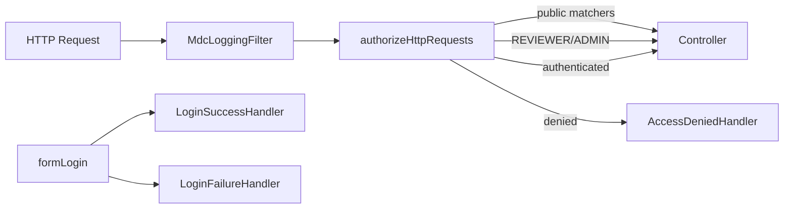

# Security and Sessions

- [Back to Open Book Home](../README.md)
- [Back to Topics Index](README.md)
- Previous Topic: [Request Lifecycle](02-request-lifecycle.md)
- Next Topic: [Domain Model and Workflow](04-domain-and-workflow.md)

---

## One-Sentence Summary

Session-based Spring Security with form login, role matchers, CSRF ignore on `/api/**`, BCrypt(12), and max one session — not JWT.

## 中文摘要

Session 認證：表單登入、角色授權、API CSRF 忽略、BCrypt(12)、同時一 session；目前不是 JWT，也不是 Redis Session。

## Why This Topic Matters

Interviewers probe authn/authz choices and whether Redis is mis-described as session store.

## Current Implementation

- [`SecurityConfig`](../source-map/security/SecurityConfig.md) builds `SecurityFilterChain`
- Form login `/api/v1/auth/login`; logout clears `JSESSIONID`
- Roles: REVIEWER/ADMIN for review/admin routes; many apply/OTP/application routes `permitAll`
- `MdcLoggingFilter` before username/password filter
- Handlers: login success/failure, access denied, entry point, session expired

## Runtime Flow

1. `MdcLoggingFilter` enriches MDC.
2. AuthorizeHttpRequests selects permit/role/authenticated.
3. Login uses DaoAuthenticationProvider + `UserDetailsServiceImpl`.
4. Session IF_REQUIRED; `maximumSessions(1)`.

## Mermaid Diagram

## Important Classes

- [`SecurityConfig`](../source-map/security/SecurityConfig.md)
- `MdcLoggingFilter`, `LoginSuccessHandler`, `UserDetailsServiceImpl` (related-only)
- High **Pending**: none required beyond SecurityConfig for Critical

## Important Configuration

- Security DSL in SecurityConfig (code)
- Profile `dev` disables frame options for H2 console

## Important Tests

- [SecurityIntegrationTest.java](../../../src/test/java/com/tlbank/lending/security/SecurityIntegrationTest.java)

## Design Decisions

- [0006-session-over-jwt.md](../../decisions/0006-session-over-jwt.md)
- [07-security-design.md](../../design/07-security-design.md)

## Trade-offs

- Sessions fit server-rendered + simple API demos; harder to scale horizontally without sticky sessions/shared session store (**not implemented**)
- CSRF ignored on APIs for client simplicity

## Alternatives

- JWT / OAuth2 Resource Server — **Planned** in design talk, not current
- Redis Spring Session — **Not implemented**

## Production Considerations

- **Current:** in-memory `SessionRegistry`; cookie sessions
- **Partial:** broad permitAll on applicant APIs
- **Planned:** tighter authz, external IdP — not in code

## Related ADRs

- [0006-session-over-jwt.md](../../decisions/0006-session-over-jwt.md)

## Related Interview Questions

[`Q017`](../../handbook/09-interview-source-map-300.md#Q017), [`Q020`](../../handbook/09-interview-source-map-300.md#Q020), [`Q023`](../../handbook/09-interview-source-map-300.md#Q023), [`Q025`](../../handbook/09-interview-source-map-300.md#Q025), [`Q077`](../../handbook/09-interview-source-map-300.md#Q077), [`Q080`](../../handbook/09-interview-source-map-300.md#Q080), [`Q081`](../../handbook/09-interview-source-map-300.md#Q081), [`Q083`](../../handbook/09-interview-source-map-300.md#Q083), [`Q084`](../../handbook/09-interview-source-map-300.md#Q084), [`Q085`](../../handbook/09-interview-source-map-300.md#Q085), [`Q087`](../../handbook/09-interview-source-map-300.md#Q087), [`Q234`](../../handbook/09-interview-source-map-300.md#Q234), [`Q250`](../../handbook/09-interview-source-map-300.md#Q250)

## 30-Second Explanation

Security is session-based Spring Security with BCrypt strength 12, role rules for review/admin, CSRF ignored under `/api/**`, and a single concurrent session. Redis is not used for sessions.

## 2-Minute Explanation

Walk public vs role matchers, login URL, MDC filter, and why JWT was not chosen (ADR 0006). Admit permitAll as a portfolio limitation.

## Whiteboard Sketch

- **Draw:** filter chain boxes
- **Order:** MDC → authz → form login → session
- **Say:** “no JWT filter here”

## Common Follow-Up Questions

- Why ignore CSRF on APIs?
- How would you add JWT later?

## Common Mistakes

- Redis for sessions
- Claiming all APIs need authentication

## Current Limitations

- In-memory session registry
- Loose applicant API authz

## Review Checklist

- [ ] Session not JWT
- [ ] BCrypt(12)
- [ ] Name REVIEWER/ADMIN routes
- [ ] Redis ≠ session
