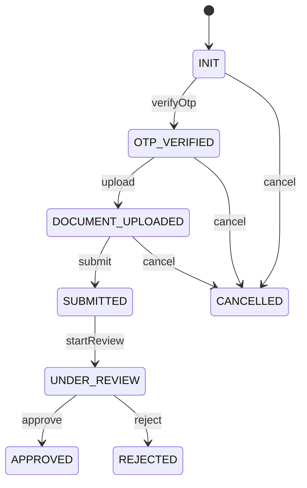

# Domain Model and Workflow

- [Back to Open Book Home](../README.md)
- [Back to Topics Index](README.md)
- Previous Topic: [Security and Sessions](03-security.md)
- Next Topic: [JPA and Database](05-jpa-and-sql.md)

---

## One-Sentence Summary

DDD-lite aggregates (`Application`, `ReviewCase`, OTP records) own workflow rules; services orchestrate and publish events.

## 中文摘要

DDD-lite：申請／徵審聚合持有狀態機；OTP 與送審／核准流程由 usecase 編排並發事件。

## Why This Topic Matters

Explains business workflow without collapsing everything into controllers or entities.

## Current Implementation

- [`Application`](../source-map/domain/Application.md) + [`ApplicationStatus`](../source-map/domain/ApplicationStatus.md) state machine
- OTP via [`OtpAppService`](../source-map/application/OtpAppService.md) then documents → submit
- Submit publishes event → `ReviewEventHandler` creates [`ReviewCase`](../source-map/domain/ReviewCase.md)
- [`ReviewAppService`](../source-map/application/ReviewAppService.md) approve/reject both aggregates
- High **Pending**: `OtpRecord`

## Runtime Flow

1. Create INIT application.
2. Send/verify OTP → OTP_VERIFIED.
3. Upload required documents → DOCUMENT_UPLOADED → submit → SUBMITTED.
4. Review case created; start → UNDER_REVIEW; approve/reject terminals.

## Mermaid Diagram

## Important Classes

- [`Application`](../source-map/domain/Application.md), [`ApplicationStatus`](../source-map/domain/ApplicationStatus.md), [`ReviewCase`](../source-map/domain/ReviewCase.md)
- [`OtpAppService`](../source-map/application/OtpAppService.md), [`ReviewAppService`](../source-map/application/ReviewAppService.md)

## Important Configuration

- System parameters for OTP expire/retry (via `SystemParameterService`)
- Security matchers for OTP/review routes

## Important Tests

- [ApplicationTest.java](../../../src/test/java/com/tlbank/lending/domain/application/ApplicationTest.java)
- [ReviewCaseTest.java](../../../src/test/java/com/tlbank/lending/domain/review/ReviewCaseTest.java)
- [ApplicationFlowIntegrationTest.java](../../../src/test/java/com/tlbank/lending/application/ApplicationFlowIntegrationTest.java)
- [ReviewFlowIntegrationTest.java](../../../src/test/java/com/tlbank/lending/application/ReviewFlowIntegrationTest.java)

## Design Decisions

- [0002-use-ddd.md](../../decisions/0002-use-ddd.md)
- [04-domain-model.md](../../design/04-domain-model.md), [08-workflow-design.md](../../design/08-workflow-design.md)

## Trade-offs

- Explicit enum maps are interview-friendly; less flexible than a BPM engine
- Dual aggregates for review vs application add coordination cost

## Alternatives

- Single aggregate for application+review — rejected for separation
- External workflow engine — **Not implemented**

## Production Considerations

- **Current:** in-process state machines + DB persistence
- **Partial:** operator strings instead of rich identity
- **Planned:** richer SLA/assignment — not implemented

## Related ADRs

- [0002-use-ddd.md](../../decisions/0002-use-ddd.md)

## Related Interview Questions

[`Q041`](../../handbook/09-interview-source-map-300.md#Q041), [`Q042`](../../handbook/09-interview-source-map-300.md#Q042), [`Q045`](../../handbook/09-interview-source-map-300.md#Q045), [`Q046`](../../handbook/09-interview-source-map-300.md#Q046), [`Q047`](../../handbook/09-interview-source-map-300.md#Q047), [`Q051`](../../handbook/09-interview-source-map-300.md#Q051), [`Q052`](../../handbook/09-interview-source-map-300.md#Q052), [`Q053`](../../handbook/09-interview-source-map-300.md#Q053), [`Q054`](../../handbook/09-interview-source-map-300.md#Q054), [`Q055`](../../handbook/09-interview-source-map-300.md#Q055), [`Q056`](../../handbook/09-interview-source-map-300.md#Q056), [`Q057`](../../handbook/09-interview-source-map-300.md#Q057), [`Q058`](../../handbook/09-interview-source-map-300.md#Q058), [`Q059`](../../handbook/09-interview-source-map-300.md#Q059), [`Q060`](../../handbook/09-interview-source-map-300.md#Q060), [`Q145`](../../handbook/09-interview-source-map-300.md#Q145), [`Q146`](../../handbook/09-interview-source-map-300.md#Q146), [`Q147`](../../handbook/09-interview-source-map-300.md#Q147), [`Q148`](../../handbook/09-interview-source-map-300.md#Q148)

## 30-Second Explanation

Business flow is owned by domain aggregates: application status transitions and review-case transitions. Services call verbs, save, and publish events so review cases and notifications appear.

## 2-Minute Explanation

Walk OTP → documents → submit → review. Point to source-map pages for verbs. Mention ReviewCase creation on submit event.

## Whiteboard Sketch

- **Draw:** application state diagram + review state beside it
- **Order:** application first, then review link by applicationId
- **Say:** “two aggregates, one business journey”

## Common Follow-Up Questions

- Can SUBMITTED cancel?
- Who creates ReviewCase?

## Common Mistakes

- Putting transition tables in controllers
- Merging ReviewStatus into ApplicationStatus

## Current Limitations

- No BPM/compensation beyond DB transactions
- Limited assignment workflow

## Review Checklist

- [ ] Recite forward path statuses
- [ ] Name cancel eligible statuses
- [ ] Link Application and ReviewCase pages
