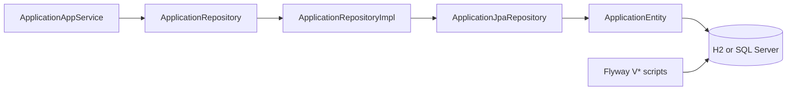

# JPA and Database

- [Back to Open Book Home](../README.md)
- [Back to Topics Index](README.md)
- Previous Topic: [Domain Model and Workflow](04-domain-and-workflow.md)
- Next Topic: [Transactions](06-transactions.md)

---

## One-Sentence Summary

JPA entities + repository adapters + Flyway migrations; H2 for local/dev convenience and SQL Server for richer environments per ADR 0007.

## 中文摘要

JPA 實體與 repository 適配器；Flyway 管 schema；H2／SQL Server 依 profile（ADR 0007）。

## Why This Topic Matters

Separates domain aggregates from `@Entity` mappings and proves schema changes are versioned.

## Current Implementation

- [`ApplicationEntity`](../source-map/infrastructure/ApplicationEntity.md) maps `applications` with STRING enums and embeds
- [`ApplicationRepositoryImpl`](../source-map/infrastructure/ApplicationRepositoryImpl.md) implements domain port
- `ApplicationJpaRepository` for JPQL/native queries where used
- Flyway scripts under `src/main/resources/db/migration/` (+ sqlserver variants)

## Runtime Flow

1. App service calls domain port.
2. Adapter loads/saves `ApplicationEntity` via Spring Data.
3. Mapper converts embeddables/collections to domain types.
4. Flyway applied at startup for the active datasource.

## Mermaid Diagram

## Important Classes

- [`ApplicationEntity`](../source-map/infrastructure/ApplicationEntity.md)
- [`ApplicationRepositoryImpl`](../source-map/infrastructure/ApplicationRepositoryImpl.md)
- `ApplicationJpaRepository` (related-only)

## Important Configuration

- [application.yml](../../../src/main/resources/application.yml) / [application-dev.yml](../../../src/main/resources/application-dev.yml)
- Migrations: `src/main/resources/db/migration/`, `db/migration-sqlserver/`

## Important Tests

- Indirect via app/flow tests — **no dedicated ApplicationRepositoryImplTest / ApplicationEntityTest**
- Schema exercised when IT context starts

## Design Decisions

- [0007-h2-vs-sqlserver.md](../../decisions/0007-h2-vs-sqlserver.md)
- [05-database-design.md](../../design/05-database-design.md)
- EnumType.STRING for statuses

## Trade-offs

- Dual dialect migrations add maintenance
- Manual mapping is verbose but explicit

## Alternatives

- jOOQ / MyBatis — not chosen
- Liquibase — not used; Flyway is current

## Production Considerations

- **Current:** Flyway + JPA working locally/staging-oriented profiles
- **Partial:** H2 vs SQL Server differences must be respected in SQL
- **Planned:** managed cloud DB HA — **Not implemented** as cloud infra

## Related ADRs

- [0007-h2-vs-sqlserver.md](../../decisions/0007-h2-vs-sqlserver.md)

## Related Interview Questions

[`Q068`](../../handbook/09-interview-source-map-300.md#Q068), [`Q089`](../../handbook/09-interview-source-map-300.md#Q089), [`Q090`](../../handbook/09-interview-source-map-300.md#Q090), [`Q091`](../../handbook/09-interview-source-map-300.md#Q091), [`Q092`](../../handbook/09-interview-source-map-300.md#Q092), [`Q093`](../../handbook/09-interview-source-map-300.md#Q093), [`Q094`](../../handbook/09-interview-source-map-300.md#Q094), [`Q095`](../../handbook/09-interview-source-map-300.md#Q095), [`Q111`](../../handbook/09-interview-source-map-300.md#Q111), [`Q112`](../../handbook/09-interview-source-map-300.md#Q112), [`Q113`](../../handbook/09-interview-source-map-300.md#Q113), [`Q114`](../../handbook/09-interview-source-map-300.md#Q114), [`Q118`](../../handbook/09-interview-source-map-300.md#Q118), [`Q119`](../../handbook/09-interview-source-map-300.md#Q119), [`Q120`](../../handbook/09-interview-source-map-300.md#Q120), [`Q121`](../../handbook/09-interview-source-map-300.md#Q121), [`Q122`](../../handbook/09-interview-source-map-300.md#Q122), [`Q123`](../../handbook/09-interview-source-map-300.md#Q123), [`Q124`](../../handbook/09-interview-source-map-300.md#Q124), [`Q125`](../../handbook/09-interview-source-map-300.md#Q125), [`Q126`](../../handbook/09-interview-source-map-300.md#Q126), [`Q257`](../../handbook/09-interview-source-map-300.md#Q257), [`Q258`](../../handbook/09-interview-source-map-300.md#Q258), [`Q259`](../../handbook/09-interview-source-map-300.md#Q259), [`Q260`](../../handbook/09-interview-source-map-300.md#Q260)

## 30-Second Explanation

Persistence uses JPA entities and repository adapters behind domain ports, with Flyway evolving the schema. H2 and SQL Server are both in play depending on profile.

## 2-Minute Explanation

Show Application vs ApplicationEntity, STRING enums, and why Flyway versions matter. Admit missing dedicated adapter unit tests.

## Whiteboard Sketch

- **Draw:** Domain ↔ Adapter ↔ Entity ↔ DB, Flyway arrow into DB
- **Order:** port first
- **Say:** “no @Entity on aggregate”

## Common Follow-Up Questions

- ORDINAL vs STRING?
- How do you keep H2 and SQL Server compatible?

## Common Mistakes

- Treating entity as aggregate root
- Ignoring Flyway order

## Current Limitations

- No dedicated repository unit tests
- Cloud managed DB not provisioned by this repo’s Terraform (local only)

## Review Checklist

- [ ] Port vs entity vs aggregate
- [ ] Flyway location
- [ ] ADR 0007 one-liner
