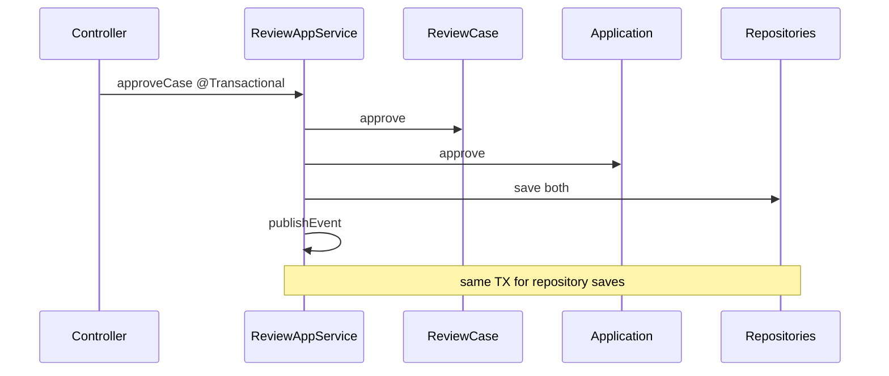

# Transactions

- [Back to Open Book Home](../README.md)
- [Back to Topics Index](README.md)
- Previous Topic: [JPA and Database](05-jpa-and-sql.md)
- Next Topic: [Redis and Idempotency](07-redis-idempotency.md)

---

## One-Sentence Summary

`@Transactional` sits primarily on application services (and some schedulers), not on domain objects or controllers.

## 中文摘要

交易邊界多在 application service（與部分 scheduler）；domain 無 Spring TX；多聚合寫入靠同一 TX（如徵審核准）。

## Why This Topic Matters

Interviewers ask where transactions begin and what rolls back together.

## Current Implementation

- [`ApplicationAppService`](../source-map/application/ApplicationAppService.md): write methods `@Transactional`; reads often `readOnly`
- [`OtpAppService`](../source-map/application/OtpAppService.md), [`ReviewAppService`](../source-map/application/ReviewAppService.md): transactional use cases
- Review approve/reject updates two aggregates in one service TX
- Schedulers such as `OtpCleanupScheduler` also use `@Transactional` (High page **Pending**)
- [`AuditAspect`](../source-map/common/AuditAspect.md) delegates persistence to [AuditLogWriter](../source-map/common/AuditLogWriter.md) (separate concerns)

## Runtime Flow

1. Service method starts TX (Spring proxy).
2. Domain mutations happen in memory.
3. Repository saves participate in same TX.
4. Events publish after successful work in method body (listeners run afterward; notification failures are caught in handler).
5. Runtime exception → rollback of TX resources enrolled.

## Mermaid Diagram

## Important Classes

- [`ApplicationAppService`](../source-map/application/ApplicationAppService.md)
- [`ReviewAppService`](../source-map/application/ReviewAppService.md)
- [`OtpAppService`](../source-map/application/OtpAppService.md)
- [OtpCleanupScheduler](../source-map/infrastructure/OtpCleanupScheduler.md), [AuditLogWriter](../source-map/common/AuditLogWriter.md)

## Important Configuration

- Spring Boot transaction auto-config / datasource
- No custom TransactionManager class required for the basic story

## Important Tests

- Service tests + flow ITs imply TX via Spring context
- No dedicated TransactionManager unit test

## Design Decisions

- Application layer as TX boundary (common Spring style)
- Dual-aggregate review updates share one TX for simplicity

## Trade-offs

- Large service TX vs finer-grained units of work
- Event listeners swallowing notify errors means notify is not part of business rollback after commit semantics depend on timing

## Alternatives

- Domain events + outbox — **Not implemented**
- TX on repositories only — not the dominant pattern here

## Production Considerations

- **Current:** local DB TX sufficient for demo flows
- **Partial:** cross-aggregate consistency relies on single DB
- **Planned:** outbox/saga for multi-resource — not implemented

## Related ADRs

- Architecture choice implies service TX: [0001-use-clean-architecture.md](../../decisions/0001-use-clean-architecture.md)

## Related Interview Questions

[`Q127`](../../handbook/09-interview-source-map-300.md#Q127), [`Q129`](../../handbook/09-interview-source-map-300.md#Q129), [`Q130`](../../handbook/09-interview-source-map-300.md#Q130), [`Q131`](../../handbook/09-interview-source-map-300.md#Q131), [`Q272`](../../handbook/09-interview-source-map-300.md#Q272)

## 30-Second Explanation

Transactions start on application service methods. Domain classes stay persistence-ignorant. Review approve writes two aggregates in one transactional method.

## 2-Minute Explanation

Contrast readOnly vs write, mention scheduler TX, and explain why controllers are not transactional boundaries.

## Whiteboard Sketch

- **Draw:** Controller → Service[@TX] → Domain → Repo
- **Order:** bracket the service method as TX scope
- **Say:** “domain has no @Transactional”

## Common Follow-Up Questions

- What rolls back if event listener fails?
- Why not annotate domain methods?

## Common Mistakes

- Claiming domain methods are transactional
- Ignoring dual-aggregate approve TX

## Current Limitations

- No outbox pattern
- Notification side effects not reliably in the same TX story

## Review Checklist

- [ ] Point to a @Transactional method
- [ ] Explain review dual save
- [ ] Domain has no Spring TX
