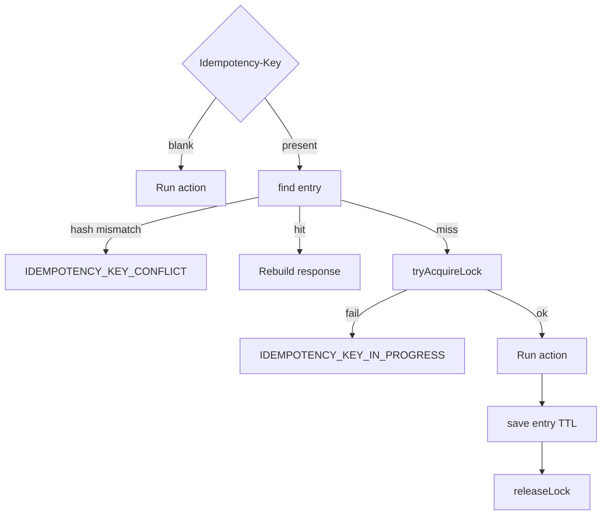

# Redis and Idempotency

- [Back to Open Book Home](../README.md)
- [Back to Topics Index](README.md)
- Previous Topic: [Transactions](06-transactions.md)
- Next Topic: [In-Memory Cache](08-cache.md)

---

## One-Sentence Summary

Redis (or in-memory) stores idempotency entries and locks for API dedupe — not sessions, not product cache.

## 中文摘要

Redis／記憶體實作 `IdempotencyStore`：只做冪等鍵與鎖；商品快取是另一套 in-memory。

## Why This Topic Matters

Stops the common false claim “we use Redis for everything.”

## Current Implementation

- [`IdempotencyService`](../source-map/application/IdempotencyService.md) hashes body, locks, caches responses
- [`RedisIdempotencyStore`](../source-map/infrastructure/RedisIdempotencyStore.md) when `tlbank.idempotency.store=redis`
- `InMemoryIdempotencyStore` when `store=memory`
- Dev profile sets Redis store in [application-dev.yml](../../../src/main/resources/application-dev.yml)

## Runtime Flow

1. Optional `Idempotency-Key` header.
2. Blank → run action.
3. Else find entry; conflict on hash mismatch; else lock → action → save → unlock.

## Mermaid Diagram

## Important Classes

- [`IdempotencyService`](../source-map/application/IdempotencyService.md)
- [`RedisIdempotencyStore`](../source-map/infrastructure/RedisIdempotencyStore.md)
- `InMemoryIdempotencyStore` (related)

## Important Configuration

- `tlbank.idempotency.ttl-hours`, `key-prefix` — [application.yml](../../../src/main/resources/application.yml)
- `tlbank.idempotency.store` — [application-dev.yml](../../../src/main/resources/application-dev.yml)
- Redis service: [docker-compose.yml](../../../docker-compose.yml)

## Important Tests

- [IdempotencyServiceTest.java](../../../src/test/java/com/tlbank/lending/application/idempotency/IdempotencyServiceTest.java)
- [ApplicationIdempotencyIntegrationTest.java](../../../src/test/java/com/tlbank/lending/application/ApplicationIdempotencyIntegrationTest.java)
- **No dedicated RedisIdempotencyStoreTest**

## Design Decisions

- [0003-use-redis-idempotency.md](../../decisions/0003-use-redis-idempotency.md)

## Trade-offs

- Optional keys vs strict clients
- Redis dependency for dev realism vs memory for simple tests

## Alternatives

- DB unique constraints only — partial alternative, not the chosen primary mechanism
- HTTP caching — unrelated and not used for this

## Production Considerations

- **Current:** Redis idempotency in dev-oriented compose/profile
- **Partial:** no multi-region story
- **Planned:** managed Redis HA — **Not implemented** as cloud product

## Related ADRs

- [0003-use-redis-idempotency.md](../../decisions/0003-use-redis-idempotency.md)

## Related Interview Questions

[`Q011`](../../handbook/09-interview-source-map-300.md#Q011), [`Q016`](../../handbook/09-interview-source-map-300.md#Q016), [`Q035`](../../handbook/09-interview-source-map-300.md#Q035), [`Q063`](../../handbook/09-interview-source-map-300.md#Q063), [`Q067`](../../handbook/09-interview-source-map-300.md#Q067), [`Q132`](../../handbook/09-interview-source-map-300.md#Q132), [`Q134`](../../handbook/09-interview-source-map-300.md#Q134), [`Q268`](../../handbook/09-interview-source-map-300.md#Q268), [`Q269`](../../handbook/09-interview-source-map-300.md#Q269)

## 30-Second Explanation

Idempotency uses a store abstraction. Redis holds request hashes and short locks when configured. It does not back Spring sessions or the product cache.

## 2-Minute Explanation

Walk execute() branches and property switch memory/redis. Contrast with in-memory cache topic.

## Whiteboard Sketch

- **Draw:** key → find/lock/action/save
- **Order:** happy path then conflict
- **Say:** “Redis ≠ cache store”

## Common Follow-Up Questions

- What is lock TTL?
- What if Redis is down?

## Common Mistakes

- Redis for sessions/cache
- Mandatory key assumption

## Current Limitations

- Fixed 30s lock TTL in code
- No dedicated Redis store unit test

## Review Checklist

- [ ] Name store property
- [ ] Explain hash conflict
- [ ] Separate cache topic
