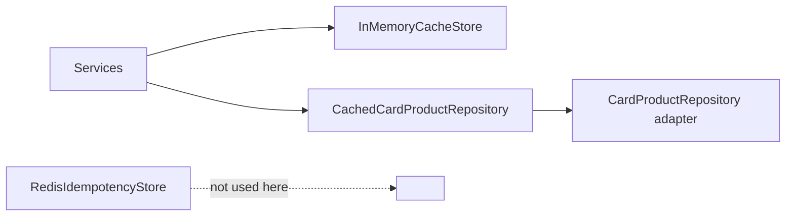

# In-Memory Cache

- [Back to Open Book Home](../README.md)
- [Back to Topics Index](README.md)
- Previous Topic: [Redis and Idempotency](07-redis-idempotency.md)
- Next Topic: [Events and Notifications](09-events-and-notifications.md)

---

## One-Sentence Summary

Product/parameter caching uses in-memory `InMemoryCacheStore` and decorators — not Redis.

## 中文摘要

商品／參數快取是進程內 `InMemoryCacheStore` 與 decorator；與 Redis 冪等儲存分離。

## Why This Topic Matters

Prevents conflating idempotency Redis with application cache.

## Current Implementation

- `InMemoryCacheStore` implements `CacheStore`
- `CachedCardProductRepository` decorator (High source-map **Pending**)
- `CacheManagementService` / refresh scheduler for eviction/refresh patterns
- Documented impurity: cache layer may touch repositories directly (Q284)

## Runtime Flow

1. Read path checks in-memory cache.
2. Miss loads from repository and stores entry.
3. Management/scheduler can evict or refresh.

## Mermaid Diagram

## Important Classes

- `InMemoryCacheStore`, `CachedCardProductRepository`, `CacheManagementService` (High/related)
- Contrast: [`RedisIdempotencyStore`](../source-map/infrastructure/RedisIdempotencyStore.md)

## Important Configuration

- Scheduler crons for cache-refresh in [application.yml](../../../src/main/resources/application.yml)
- [12-cache-design.md](../../design/12-cache-design.md)

## Important Tests

- [InMemoryCacheStoreTest.java](../../../src/test/java/com/tlbank/lending/infrastructure/cache/InMemoryCacheStoreTest.java)
- [CacheRefreshSchedulerTest.java](../../../src/test/java/com/tlbank/lending/infrastructure/scheduler/CacheRefreshSchedulerTest.java)
- [SystemParameterServiceCacheTest.java](../../../src/test/java/com/tlbank/lending/application/parameter/SystemParameterServiceCacheTest.java)

## Design Decisions

- Process memory for simplicity in portfolio
- Separate from idempotency Redis by design

## Trade-offs

- Fast local cache; not shared across instances
- Decorator purity vs pragmatic repository access

## Alternatives

- Redis cache / Spring Cache abstraction — **Not** the current product cache
- Caffeine explicitly — not required to claim beyond InMemoryCacheStore

## Production Considerations

- **Current:** single-node memory cache
- **Partial:** architectural impurity around repository access
- **Planned:** distributed cache — **Not implemented**

## Related ADRs

- Related contrast: [0003-use-redis-idempotency.md](../../decisions/0003-use-redis-idempotency.md) (what Redis *is* used for)

## Related Interview Questions

[`Q039`](../../handbook/09-interview-source-map-300.md#Q039), [`Q086`](../../handbook/09-interview-source-map-300.md#Q086), [`Q097`](../../handbook/09-interview-source-map-300.md#Q097), [`Q108`](../../handbook/09-interview-source-map-300.md#Q108), [`Q141`](../../handbook/09-interview-source-map-300.md#Q141), [`Q142`](../../handbook/09-interview-source-map-300.md#Q142), [`Q143`](../../handbook/09-interview-source-map-300.md#Q143), [`Q144`](../../handbook/09-interview-source-map-300.md#Q144), [`Q212`](../../handbook/09-interview-source-map-300.md#Q212), [`Q215`](../../handbook/09-interview-source-map-300.md#Q215), [`Q228`](../../handbook/09-interview-source-map-300.md#Q228), [`Q284`](../../handbook/09-interview-source-map-300.md#Q284)

## 30-Second Explanation

Caching for products/parameters is in-memory. Redis in this project is for idempotency keys, not that cache.

## 2-Minute Explanation

Describe decorator + store, scheduler refresh, and the impurity question. Keep Redis discussion in the other topic.

## Whiteboard Sketch

- **Draw:** Service → InMemoryCache → Repository
- **Order:** hit/miss paths
- **Say:** “Redis box is elsewhere”

## Common Follow-Up Questions

- Multi-instance cache coherence?
- Why not Redis cache?

## Common Mistakes

- “Redis caches products”
- Ignoring impurity discussion

## Current Limitations

- Not clustered
- Manual/scheduler invalidation only

## Review Checklist

- [ ] In-memory not Redis
- [ ] Name a test
- [ ] Mention impurity Q284
