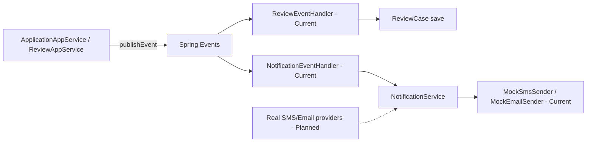

# Events and Notifications

- [Back to Open Book Home](../README.md)
- [Back to Topics Index](README.md)
- Previous Topic: [In-Memory Cache](08-cache.md)
- Next Topic: [Audit and Logging](10-audit-logging.md)

---

## One-Sentence Summary

Spring `ApplicationEventPublisher` + `@EventListener` handlers; notifications go through mock SMS/email adapters.

## 中文摘要

Spring 領域事件：usecase publish 後由 listener 處理；通知通道為 mock，不是真實簡訊／郵件商。

## Why This Topic Matters

Separates side effects from core writes and blocks “we integrated Twilio” claims.

## Current Implementation

- [`ApplicationAppService`](../source-map/application/ApplicationAppService.md) publishes `ApplicationSubmittedEvent`
- [`ReviewAppService`](../source-map/application/ReviewAppService.md) publishes approved/rejected events
- [`NotificationEventHandler`](../source-map/infrastructure/NotificationEventHandler.md) sends notifications via `NotificationService`
- `ReviewEventHandler` creates `ReviewCase` on submit
- `MockSmsSender` / `MockEmailSender` behind the notification port

## Runtime Flow

1. Service saves aggregates.
2. `publishEvent(...)`.
3. Listeners run (`NotificationEventHandler`, `ReviewEventHandler`).
4. Notification failures are logged and swallowed in the notification handler.

## Mermaid Diagram

## Important Classes

- [`NotificationEventHandler`](../source-map/infrastructure/NotificationEventHandler.md)
- [`ApplicationAppService`](../source-map/application/ApplicationAppService.md), [`ReviewAppService`](../source-map/application/ReviewAppService.md)
- `ReviewEventHandler`, mocks (related)

## Important Configuration

- No real provider API keys in repo for SMS/email
- Templates/parameters via notification/parameter modules

## Important Tests

- [NotificationEventHandlerTest.java](../../../src/test/java/com/tlbank/lending/infrastructure/event/NotificationEventHandlerTest.java)
- [NotificationServiceImplTest.java](../../../src/test/java/com/tlbank/lending/application/notification/NotificationServiceImplTest.java)

## Design Decisions

- Spring events instead of custom bus class (no `DomainEventPublisher` type)
- [08-workflow-design.md](../../design/08-workflow-design.md), [09-module-design.md](../../design/09-module-design.md)

## Trade-offs

- Simple decoupling; limited delivery guarantees
- Mock adapters speed demos; not production messaging

## Alternatives

- Outbox + message broker — **Planned** / not implemented
- Sync notify inside service methods — avoided for submit/approve paths

## Production Considerations

- **Current:** in-process events + mocks
- **Partial:** errors do not retry
- **Planned:** real providers, async retries — **Not implemented**

## Related ADRs

- Architecture context: [0001-use-clean-architecture.md](../../decisions/0001-use-clean-architecture.md)

## Related Interview Questions

[`Q002`](../../handbook/09-interview-source-map-300.md#Q002), [`Q038`](../../handbook/09-interview-source-map-300.md#Q038), [`Q044`](../../handbook/09-interview-source-map-300.md#Q044), [`Q047`](../../handbook/09-interview-source-map-300.md#Q047), [`Q099`](../../handbook/09-interview-source-map-300.md#Q099), [`Q100`](../../handbook/09-interview-source-map-300.md#Q100), [`Q109`](../../handbook/09-interview-source-map-300.md#Q109), [`Q130`](../../handbook/09-interview-source-map-300.md#Q130), [`Q161`](../../handbook/09-interview-source-map-300.md#Q161), [`Q162`](../../handbook/09-interview-source-map-300.md#Q162), [`Q163`](../../handbook/09-interview-source-map-300.md#Q163), [`Q164`](../../handbook/09-interview-source-map-300.md#Q164), [`Q165`](../../handbook/09-interview-source-map-300.md#Q165), [`Q166`](../../handbook/09-interview-source-map-300.md#Q166), [`Q233`](../../handbook/09-interview-source-map-300.md#Q233)

## 30-Second Explanation

After saves, services publish Spring events. Handlers create review cases and send notifications. Notification channels in this repository are mocks.

## 2-Minute Explanation

Name event types, both handlers, and mock senders. Stress no custom DomainEventPublisher class and no real SMS vendor.

## Whiteboard Sketch

- **Draw:** publish → two listeners → mock sinks
- **Order:** submit path first
- **Say:** “Planned real providers stay dashed”

## Common Follow-Up Questions

- Are listeners transactional?
- Why mocks?

## Common Mistakes

- Claiming Twilio/SendGrid integration
- Inventing DomainEventPublisher class

## Current Limitations

- Mock-only channels
- No dead-letter/retry bus

## Review Checklist

- [ ] Name three events
- [ ] Name two handlers
- [ ] Say mock explicitly
