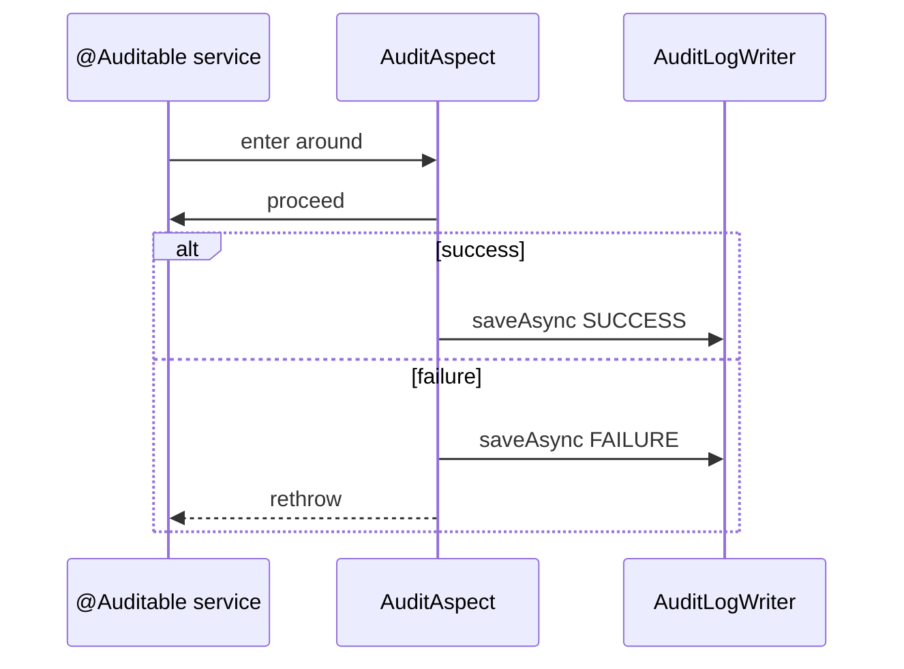

# Audit and Logging

- [Back to Open Book Home](../README.md)
- [Back to Topics Index](README.md)
- Previous Topic: [Events and Notifications](09-events-and-notifications.md)
- Next Topic: [Testing](11-testing.md)

---

## One-Sentence Summary

AOP `@Auditable` + `AuditAspect` writes SUCCESS/FAILURE audit rows with sanitized details; MDC supports request correlation logs.

## 中文摘要

`@Auditable` 由 `AuditAspect` 記錄成功／失敗；細節經脫敏；MDC 濾器補請求關聯日誌。

## Why This Topic Matters

Shows cross-cutting concerns and PII hygiene in logs/audit.

## Current Implementation

- [`AuditAspect`](../source-map/common/AuditAspect.md) around `@Auditable`
- `AuditLogWriter`, `AuditDetailBuilder` (High/related — detail sanitization Q201)
- `MdcLoggingFilter` in security chain (see security topic)
- OTP verify failure action remapped to `OTP_VERIFY_FAILED`

## Runtime Flow

1. Annotated service method invoked.
2. Aspect proceeds.
3. Success → async/writer save SUCCESS with detail.
4. Failure → FAILURE audit (possible action remap) then rethrow.
5. `AuditContext.clear()` in finally.

## Mermaid Diagram

## Important Classes

- [`AuditAspect`](../source-map/common/AuditAspect.md)
- High **Pending**: `AuditLogWriter`
- Related: `AuditDetailBuilder`, `MdcLoggingFilter`

## Important Configuration

- Audit schema via Flyway (`audit_logs` migrations)
- [11-audit-logging.md](../../design/11-audit-logging.md)

## Important Tests

- [AuditAspectTest.java](../../../src/test/java/com/tlbank/lending/common/audit/AuditAspectTest.java)

## Design Decisions

- Annotation-driven AOP over manual logging in every method
- Detail builder defense-in-depth sanitization

## Trade-offs

- AOP indirection vs explicit audit calls
- Async writer semantics must be understood for TX questions

## Alternatives

- Micrometer tracing-only — complementary, not a replacement here
- Manual audit in services — more boilerplate

## Production Considerations

- **Current:** DB-backed audit logs + MDC
- **Partial:** web-thread request assumption for IP
- **Planned:** centralized log platform — **Not implemented**

## Related ADRs

- Supporting design: [11-audit-logging.md](../../design/11-audit-logging.md)

## Related Interview Questions

[`Q024`](../../handbook/09-interview-source-map-300.md#Q024), [`Q072`](../../handbook/09-interview-source-map-300.md#Q072), [`Q073`](../../handbook/09-interview-source-map-300.md#Q073), [`Q074`](../../handbook/09-interview-source-map-300.md#Q074), [`Q076`](../../handbook/09-interview-source-map-300.md#Q076), [`Q149`](../../handbook/09-interview-source-map-300.md#Q149), [`Q201`](../../handbook/09-interview-source-map-300.md#Q201), [`Q277`](../../handbook/09-interview-source-map-300.md#Q277), [`Q281`](../../handbook/09-interview-source-map-300.md#Q281), [`Q282`](../../handbook/09-interview-source-map-300.md#Q282), [`Q291`](../../handbook/09-interview-source-map-300.md#Q291)

## 30-Second Explanation

Auditing is an aspect on `@Auditable` methods. It records success or failure with sanitized details and clears AuditContext afterward. MDC helps correlate request logs.

## 2-Minute Explanation

Cover OTP failure remap, anonymous users, and link AuditAspect source-map. Mention detail builder without pasting regex.

## Whiteboard Sketch

- **Draw:** advice ring around service → writer → DB
- **Order:** success vs failure paths
- **Say:** “exceptions still propagate”

## Common Follow-Up Questions

- Does audit roll back with business TX?
- How is OTP kept out of details?

## Common Mistakes

- Thinking audit swallows exceptions
- Ignoring sanitization

## Current Limitations

- Relies on HTTP request bean for IP
- No SIEM export in repo

## Review Checklist

- [ ] Name AuditAspect
- [ ] OTP failure remap
- [ ] Point to AuditAspectTest
