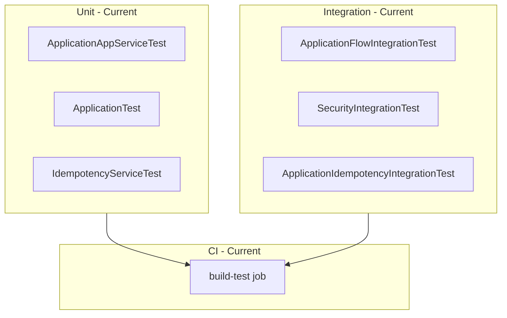

# Testing

- [Back to Open Book Home](../README.md)
- [Back to Topics Index](README.md)
- Previous Topic: [Audit and Logging](10-audit-logging.md)
- Next Topic: [Docker, CI/CD, Terraform, and Limitations](12-delivery-and-limitations.md)

---

## One-Sentence Summary

JUnit 5 + Mockito service tests, Spring integration/flow tests, security IT, and JaCoCo via Maven — documented in design/16.

## 中文摘要

單元（Mockito）／整合與流程 IT／Security IT；覆蓋率走 Maven JaCoCo（design/16）。

## Why This Topic Matters

Proves claims with tests and shows what is *not* covered (honest gaps).

## Current Implementation

- Unit: `ApplicationAppServiceTest`, `OtpAppServiceTest`, `ReviewAppServiceTest`, `IdempotencyServiceTest`, domain tests
- IT: `ApplicationFlowIntegrationTest`, `ReviewFlowIntegrationTest`, `ApplicationIdempotencyIntegrationTest`, `SecurityIntegrationTest`
- Report/storage/cache/scheduler tests where present
- Gaps: no dedicated tests for some adapters (`ApplicationRepositoryImpl`, `RedisIdempotencyStore`, `ApplicationEntity`)

## Runtime Flow

Not a runtime feature — test pyramid executes in `mvn test` / CI `build-test` job.

## Mermaid Diagram

## Important Classes

- Tests listed above (link sources under `src/test/java`)
- Production classes under test: Critical source-map set

## Important Configuration

- Surefire/Failsafe + JaCoCo in [pom.xml](../../../pom.xml)
- Test `application-dev.yml` under `src/test/resources`
- [16-testing-strategy.md](../../design/16-testing-strategy.md)

## Important Tests

- [ApplicationFlowIntegrationTest.java](../../../src/test/java/com/tlbank/lending/application/ApplicationFlowIntegrationTest.java)
- [SecurityIntegrationTest.java](../../../src/test/java/com/tlbank/lending/security/SecurityIntegrationTest.java)
- [ApplicationIdempotencyIntegrationTest.java](../../../src/test/java/com/tlbank/lending/application/ApplicationIdempotencyIntegrationTest.java)
- [AuditAspectTest.java](../../../src/test/java/com/tlbank/lending/common/audit/AuditAspectTest.java)

## Design Decisions

- Prefer testing domain and app services heavily
- Integration tests for security and multi-step flows

## Trade-offs

- Speed of unit tests vs fidelity of IT
- Some infrastructure left without dedicated tests

## Alternatives

- Testcontainers everywhere — not mandated in current suite description
- Mutation testing — **Not implemented**

## Production Considerations

- **Current:** CI runs `mvn clean verify` style build-test
- **Partial:** coverage gates depend on JaCoCo config in pom
- **Planned:** broader contract tests — optional/future

## Related ADRs

- CI context: [0004-use-github-actions.md](../../decisions/0004-use-github-actions.md)

## Related Interview Questions

[`Q011`](../../handbook/09-interview-source-map-300.md#Q011), [`Q026`](../../handbook/09-interview-source-map-300.md#Q026), [`Q149`](../../handbook/09-interview-source-map-300.md#Q149), [`Q150`](../../handbook/09-interview-source-map-300.md#Q150), [`Q151`](../../handbook/09-interview-source-map-300.md#Q151), [`Q152`](../../handbook/09-interview-source-map-300.md#Q152), [`Q153`](../../handbook/09-interview-source-map-300.md#Q153), [`Q154`](../../handbook/09-interview-source-map-300.md#Q154), [`Q155`](../../handbook/09-interview-source-map-300.md#Q155), [`Q156`](../../handbook/09-interview-source-map-300.md#Q156), [`Q157`](../../handbook/09-interview-source-map-300.md#Q157), [`Q158`](../../handbook/09-interview-source-map-300.md#Q158), [`Q159`](../../handbook/09-interview-source-map-300.md#Q159), [`Q160`](../../handbook/09-interview-source-map-300.md#Q160), [`Q250`](../../handbook/09-interview-source-map-300.md#Q250)

## 30-Second Explanation

The suite mixes Mockito unit tests, Spring flow/security integration tests, and JaCoCo reporting in Maven. Some adapters still lack dedicated unit tests.

## 2-Minute Explanation

Give one example per layer (domain, service, IT). Admit repository/Redis store gaps. Point to CI job.

## Whiteboard Sketch

- **Draw:** pyramid unit → IT → CI
- **Order:** bottom unit first
- **Say:** “name one missing test honestly”

## Common Follow-Up Questions

- How is coverage enforced?
- What does SecurityIntegrationTest prove?

## Common Mistakes

- Claiming 100% infrastructure coverage
- Confusing MockMvc unit vs full IT

## Current Limitations

- Missing dedicated tests for several adapters
- No Testcontainers requirement documented as universal

## Review Checklist

- [ ] Name 3 test classes
- [ ] Name 1 coverage gap
- [ ] Link design/16
