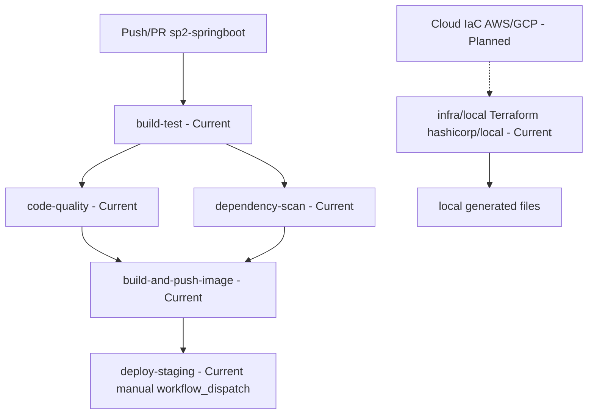

# Docker, CI/CD, Terraform, and Limitations

- [Back to Open Book Home](../README.md)
- [Back to Topics Index](README.md)
- Previous Topic: [Testing](11-testing.md)
- Next Topic: —

---

## One-Sentence Summary

Docker Compose + multi-stage Dockerfile, GitHub Actions CI with manual `deploy-staging`, local-only Terraform (`hashicorp/local`), plus known non-prod limitations.

## 中文摘要

Compose／多階段映像；Actions 含手動 staging 部署；Terraform 僅 local provider；雙 `@EnableScheduling` 等限制需誠實說明。

## Why This Topic Matters

Stops overclaiming cloud CD, cloud Terraform, or automatic production deploys.

## Current Implementation

- [docker-compose.yml](../../../docker-compose.yml), [docker/app/Dockerfile](../../../docker/app/Dockerfile)
- CI: [ci.yml](../../../../.github/workflows/ci.yml) jobs `build-test`, `code-quality`, `dependency-scan`, `build-and-push-image`, `deploy-staging`
- `deploy-staging` guarded for `workflow_dispatch` (manual)
- Terraform: [infra/local/main.tf](../../../../infra/local/main.tf), [variables.tf](../../../../infra/local/variables.tf), [outputs.tf](../../../../infra/local/outputs.tf)
- Schedulers: `SchedulingConfig` + `SchedulerConfig` both enable scheduling (debt)
- Also: [markdown.yml](../../../../.github/workflows/markdown.yml), [terraform.yml](../../../../.github/workflows/terraform.yml)

## Runtime Flow

CI happy path:

1. Push/PR to paths under `sp2-springboot/**` triggers workflow.
2. `build-test` → quality → scan → image (as wired by `needs`).
3. Staging deploy runs only on manual dispatch when conditions match.

## Mermaid Diagram

## Important Classes

- `SchedulingConfig`, `SchedulerConfig` under `common/config` (both `@EnableScheduling`)
- [OtpCleanupScheduler](../source-map/infrastructure/OtpCleanupScheduler.md)
- Ops files above (not Java)

## Important Configuration

- Compose + Dockerfile
- CI workflow YAML
- `tlbank.scheduler.*` crons in application.yml
- Terraform local variables/outputs

## Important Tests

- Image/compose not unit-tested in Java
- Scheduler tests: [OtpCleanupSchedulerTest.java](../../../src/test/java/com/tlbank/lending/infrastructure/scheduler/OtpCleanupSchedulerTest.java), [CacheRefreshSchedulerTest.java](../../../src/test/java/com/tlbank/lending/infrastructure/scheduler/CacheRefreshSchedulerTest.java)

## Design Decisions

- [0004-use-github-actions.md](../../decisions/0004-use-github-actions.md)
- [0005-use-terraform-local.md](../../decisions/0005-use-terraform-local.md)
- [17-deployment-design.md](../../design/17-deployment-design.md), [13-scheduler-design.md](../../design/13-scheduler-design.md)

## Trade-offs

- Manual deploy reduces accidental local staging damage; not full CD
- Local Terraform teaches workflow without cloud bills

## Alternatives

- Fully automatic deploy to cloud — **Planned**, not current
- Cloud Terraform providers — **Not** what `infra/local` does

## Production Considerations

- **Current:** containerized local/staging-oriented flow; manual dispatch deploy
- **Partial:** dual `@EnableScheduling`; mock integrations elsewhere
- **Planned:** cloud IaC, auto CD, shared sessions, real notifications — **Not implemented**

## Related ADRs

- [0004-use-github-actions.md](../../decisions/0004-use-github-actions.md)
- [0005-use-terraform-local.md](../../decisions/0005-use-terraform-local.md)

## Related Interview Questions

[`Q005`](../../handbook/09-interview-source-map-300.md#Q005), [`Q018`](../../handbook/09-interview-source-map-300.md#Q018), [`Q033`](../../handbook/09-interview-source-map-300.md#Q033), [`Q167`](../../handbook/09-interview-source-map-300.md#Q167), [`Q168`](../../handbook/09-interview-source-map-300.md#Q168), [`Q169`](../../handbook/09-interview-source-map-300.md#Q169), [`Q170`](../../handbook/09-interview-source-map-300.md#Q170), [`Q183`](../../handbook/09-interview-source-map-300.md#Q183), [`Q184`](../../handbook/09-interview-source-map-300.md#Q184), [`Q185`](../../handbook/09-interview-source-map-300.md#Q185), [`Q186`](../../handbook/09-interview-source-map-300.md#Q186), [`Q187`](../../handbook/09-interview-source-map-300.md#Q187), [`Q188`](../../handbook/09-interview-source-map-300.md#Q188), [`Q189`](../../handbook/09-interview-source-map-300.md#Q189), [`Q190`](../../handbook/09-interview-source-map-300.md#Q190), [`Q191`](../../handbook/09-interview-source-map-300.md#Q191), [`Q192`](../../handbook/09-interview-source-map-300.md#Q192), [`Q193`](../../handbook/09-interview-source-map-300.md#Q193), [`Q194`](../../handbook/09-interview-source-map-300.md#Q194), [`Q195`](../../handbook/09-interview-source-map-300.md#Q195), [`Q196`](../../handbook/09-interview-source-map-300.md#Q196), [`Q197`](../../handbook/09-interview-source-map-300.md#Q197), [`Q198`](../../handbook/09-interview-source-map-300.md#Q198), [`Q199`](../../handbook/09-interview-source-map-300.md#Q199), [`Q223`](../../handbook/09-interview-source-map-300.md#Q223), [`Q224`](../../handbook/09-interview-source-map-300.md#Q224), [`Q225`](../../handbook/09-interview-source-map-300.md#Q225), [`Q226`](../../handbook/09-interview-source-map-300.md#Q226), [`Q227`](../../handbook/09-interview-source-map-300.md#Q227), [`Q228`](../../handbook/09-interview-source-map-300.md#Q228), [`Q229`](../../handbook/09-interview-source-map-300.md#Q229), [`Q230`](../../handbook/09-interview-source-map-300.md#Q230), [`Q290`](../../handbook/09-interview-source-map-300.md#Q290), [`Q295`](../../handbook/09-interview-source-map-300.md#Q295)

## 30-Second Explanation

Delivery uses Docker and GitHub Actions. Staging deploy is manual via `workflow_dispatch`. Terraform under `infra/local` uses the local provider only. Several production-hardening items remain limitations, not features.

## 2-Minute Explanation

Draw CI job graph, emphasize manual deploy, local Terraform, dual scheduling debt, and point to system-design handbook for evolution talk without claiming it is built.

## Whiteboard Sketch

- **Draw:** CI jobs with needs arrows; separate Terraform local box
- **Order:** build-test first; deploy last with “manual” label
- **Say:** “no cloud resources from this Terraform”

## Common Follow-Up Questions

- Which job is manual?
- What does local Terraform create?

## Common Mistakes

- Automatic cloud CD claim
- Cloud Terraform claim
- Redis/session/cache conflation (other topics)

## Current Limitations

- Manual staging deploy
- Local Terraform only
- Dual `@EnableScheduling`
- Mock notifications / local uploads / in-memory cache / session registry — see other topics

## Review Checklist

- [ ] Name five CI jobs
- [ ] Say deploy is manual
- [ ] Terraform = hashicorp/local
- [ ] List two non-prod limitations
