<!-- markdownlint-disable MD024 -->

# TLBank Technology Handbook

One chapter per technology verified in `sp2-springboot`. Every section references real project files — not generic tutorials.

**Companion:** [architecture-handbook.md](architecture-handbook.md)

---

## Technology Index

| # | Technology | Primary Files |
| --- | --- | --- |
| 1 | Java 17 | `pom.xml`, all `src/main/java` |
| 2 | Spring Boot 3.4 | `TlbankLendingApplication.java`, `pom.xml` |
| 3 | Spring Web MVC | `presentation/api/v1/*`, `presentation/web/*` |
| 4 | Spring Security | `security/config/SecurityConfig.java` |
| 5 | BCrypt | `SecurityConfig.passwordEncoder()`, seed SQL |
| 6 | Spring Data JPA | `infrastructure/persistence/**` |
| 7 | Hibernate | `application.yml` (`ddl-auto: validate`) |
| 8 | Flyway | `db/migration/`, `db/migration-sqlserver/` |
| 9 | H2 Database | `application-dev.yml` |
| 10 | Microsoft SQL Server | `application-staging.yml`, `docker-compose.yml` |
| 11 | Thymeleaf | `src/main/resources/templates/` |
| 12 | Jakarta Bean Validation | `application/dto/request/*` |
| 13 | Spring AOP | `common/audit/AuditAspect.java` |
| 14 | Spring Application Events | `domain/event/*`, `infrastructure/event/*` |
| 15 | Spring Scheduling | `infrastructure/scheduler/*` |
| 16 | Spring Async | `common/config/AsyncConfig.java`, `AuditLogWriter` |
| 17 | Spring Actuator | `application.yml`, `docker-compose.yml` healthcheck |
| 18 | SpringDoc OpenAPI | `common/config/SwaggerConfig.java` |
| 19 | Redis | `RedisIdempotencyStore.java`, `application-dev.yml` |
| 20 | In-Memory Cache | `InMemoryCacheStore.java`, `CachedCardProductRepository` |
| 21 | Local Filesystem Storage | `LocalDocumentStorageService.java` |
| 22 | Apache POI | `ExcelReportGenerator.java` |
| 23 | iText 7 | `PdfReportGenerator.java` |
| 24 | Lombok | domain aggregates, entities |
| 25 | Maven | `pom.xml`, `mvnw` |
| 26 | JaCoCo | `pom.xml` jacoco plugin |
| 27 | JUnit 5 / MockMvc | `src/test/java/**` |
| 28 | Docker | `docker/app/Dockerfile` |
| 29 | Docker Compose | `docker-compose.yml` |
| 30 | GitHub Actions | `.github/workflows/ci.yml` |
| 31 | GitHub Container Registry | `ci.yml` build-and-push-image job |
| 32 | Trivy | `ci.yml` dependency-scan job |
| 33 | Terraform (Local) | `infra/local/main.tf` |
| 34 | Self-Hosted Runner | `ci.yml` deploy-staging job |
| 35 | SLF4J / Logback | `logback-spring.xml`, `@Slf4j` |

---

# Chapter 1 — Java 17

## 1. Purpose

Runtime language for the entire TLBank backend: domain logic, Spring services, JPA entities, tests.

## 2. Why It Exists

`pom.xml` pins `<java.version>17</java.version>` and compiler `source`/`target` 17. GitHub Actions uses Temurin 17. Docker builder image is `eclipse-temurin:17-jdk`.

## 3. Business Features Using It

All 18 features in [architecture-handbook.md](architecture-handbook.md).

## 4. Files Implementing It

```text
pom.xml (java.version=17)
docker/app/Dockerfile (eclipse-temurin:17-jdk / 17-jre)
.github/workflows/ci.yml (java-version: 17)
src/main/java/com/tlbank/lending/**/*.java
```

Language features used in this repo:

- `record` — `MobileNumber`, `Email`, `IdempotencyEntry`, request DTOs
- `switch` expressions — `GlobalExceptionHandler.handleBusinessException()`
- `EnumSet`, `Map.of` — `ApplicationStatus.ALLOWED_TRANSITIONS`
- `Optional`, streams — repository and service layers

## 5. Execution Flow

1. `mvn clean verify` compiles all sources with `--release 17`.
2. `spring-boot-maven-plugin` packages `tlbank-lending-0.0.1-SNAPSHOT.jar`.
3. Docker stage 1 runs `./mvnw clean package -DskipTests -Pstaging`.
4. Runtime: `java -jar app.jar` on JRE 17.

## 6. Mermaid Diagram

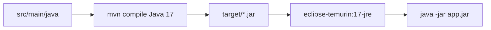

## 7. Request Lifecycle

Java bytecode executes inside Spring Boot's embedded Tomcat thread per HTTP request. Domain objects like `Application` and `OtpRecord` are plain Java classes instantiated by services — no framework in `domain/application/Application.java` except Lombok.

## 8. Trade-offs

| Choice | In TLBank |
| --- | --- |
| Java 17 vs 21 | 17 matches CI, Docker, and employer LTS expectations |
| Records for VOs | `MobileNumber` validates in compact record constructor |
| Lombok on domain | `@Builder` on `Application` reduces boilerplate but adds compile dependency |

## 9. Common Interview Questions

- **Where is workflow logic kept framework-free?** `domain/application/Application.java` — plain Java, no Spring imports.
- **What Java 17 feature appears in error handling?** `switch` on `ErrorCode` in `GlobalExceptionHandler`.
- **Why not Java 21?** Entire toolchain (CI, Dockerfile, `pom.xml`) standardized on 17.

## 10. Production Considerations

Portfolio project only. Production would align JDK vendor (Temurin/Corretto), container base image CVE patching, and `-XX:MaxRAMPercentage=75.0` already set in `Dockerfile`.

## 11. Alternative Approaches

- Kotlin + Spring — not used; Java chosen for interview familiarity.
- Virtual threads (Java 21) — not enabled; servlet stack uses platform threads.

---

# Chapter 2 — Spring Boot 3.4

## 1. Purpose

Application framework: auto-configuration, embedded server, dependency injection, profile-based config.

## 2. Why It Exists

Parent POM `spring-boot-starter-parent:3.4.2` in `pom.xml`. Entry point `TlbankLendingApplication.java` uses `@SpringBootApplication`.

## 3. Business Features Using It

All features — Boot wires controllers, services, repositories, security, Flyway, schedulers.

## 4. Files Implementing It

```text
src/main/java/com/tlbank/lending/TlbankLendingApplication.java
pom.xml (starters: web, security, data-jpa, thymeleaf, validation, actuator, aop, data-redis)
src/main/resources/application.yml
src/main/resources/application-{dev,staging,prod}.yml
```

## 5. Execution Flow

1. `main()` → `SpringApplication.run()`.
2. Auto-config loads starters based on classpath.
3. Active profile (`dev` default) loads `application-dev.yml`.
4. Component scan: `com.tlbank.lending` and sub-packages.
5. Flyway migrates DB, Tomcat listens on 8080.

## 6. Mermaid Diagram

```mermaid
flowchart TB
    MAIN[TlbankLendingApplication] --> CTX[Spring ApplicationContext]
    CTX --> WEB[Web MVC]
    CTX --> SEC[Security Filter Chain]
    CTX --> JPA[Data JPA]
    CTX --> FLY[Flyway]
    CTX --> SCHED[@Scheduled beans]
    CTX --> PROF[Profile: dev/staging/prod]
```

## 7. Request Lifecycle

```text
HTTP → Tomcat → SecurityFilterChain → DispatcherServlet
     → Controller → Service (@Transactional) → Repository → Response
```

`spring.jpa.open-in-view: false` in `application.yml` — no OSIV; lazy loading must happen inside `@Transactional` service methods like `ApplicationAppService.createApplication()`.

## 8. Trade-offs

| Choice | In TLBank |
| --- | --- |
| Monolith | Single `tlbank-lending` JAR — appropriate for portfolio |
| `open-in-view: false` | Prevents N+1 in views but requires eager fetch in services |
| Profile split | `dev`/`staging`/`prod` yml files for DB and Swagger |

## 9. Common Interview Questions

- **Where is the main class?** `TlbankLendingApplication.java`.
- **How are environments separated?** `spring.profiles.active` + `application-{profile}.yml`.
- **What does `ddl-auto: validate` mean here?** Hibernate checks schema matches entities; Flyway owns DDL.

## 10. Production Considerations

Not production-deployed. Would need externalized config, health probes (Actuator already exposed), graceful shutdown, and secrets outside yml.

## 11. Alternative Approaches

- Quarkus/Micronaut — not used.
- Multi-module Maven — single module `sp2-springboot`.

---

# Chapter 3 — Spring Web MVC

## 1. Purpose

HTTP layer: REST JSON APIs under `/api/v1/**` and Thymeleaf-backed web routes.

## 2. Why It Exists

`spring-boot-starter-web` in `pom.xml`. 11 REST controllers in `presentation/api/v1/` and 5 web controllers in `presentation/web/`.

## 3. Business Features Using It

| Feature | Controller |
| --- | --- |
| Application lifecycle | `ApplicationApiController`, `ApplicationWebController` |
| OTP | `OtpApiController` |
| Review | `ReviewApiController`, `ReviewController` |
| Admin | `UserManagementApiController`, `AdminController` |
| Products | `CardProductApiController` |

## 4. Files Implementing It

```text
presentation/api/v1/ApplicationApiController.java
presentation/api/v1/OtpApiController.java
presentation/api/v1/ReviewApiController.java
presentation/web/ApplicationWebController.java
presentation/api/advice/GlobalExceptionHandler.java
common/response/ApiResponse.java
application.yml (multipart 10MB/15MB)
```

## 5. Execution Flow — REST Create Application

1. `POST /api/v1/applications` → `ApplicationApiController.createApplication()`.
2. Optional `Idempotency-Key` header → `IdempotencyService`.
3. `@Valid CreateApplicationRequest` → Bean Validation.
4. `ApplicationAppService.createApplication()` → `ResponseEntity` with `ApiResponse.success()`.

## 5. Execution Flow — Multipart Upload

1. `POST /api/v1/applications/{id}/documents?documentType=&file=`.
2. `MultipartFile` passed to `ApplicationAppService.uploadDocuments()`.

## 6. Mermaid Diagram

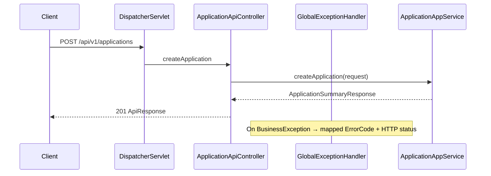

## 7. Request Lifecycle

```text
1. SecurityFilterChain (permitAll for /api/v1/applications POST)
2. DispatcherServlet routing
3. @Valid triggers MethodArgumentNotValidException → GlobalExceptionHandler
4. Controller returns ApiResponse<T> envelope
5. JSON serialization (Jackson, Boot default)
```

Web flow: `ApplicationWebController` returns view names like `"application/form"` resolved to `templates/application/form.html`.

## 8. Trade-offs

| Choice | In TLBank |
| --- | --- |
| Dual API + Web | Same `ApplicationAppService` serves JSON and Thymeleaf |
| `ApiResponse` wrapper | Consistent envelope; extra nesting vs raw DTO |
| CSRF off for `/api/**` | `SecurityConfig` — APIs public without CSRF token |

## 9. Common Interview Questions

- **Where is validation error handling?** `GlobalExceptionHandler.handleValidationException()` → `ErrorCode.VALIDATION_FAILED`.
- **How does document upload reach the service?** `ApplicationApiController` → `MultipartFile` → `ApplicationAppService.uploadDocuments()`.
- **What wraps all API responses?** `ApiResponse<T>` in `common/response/ApiResponse.java`.

## 10. Production Considerations

Rate limiting, request size limits (10MB set), API versioning (`/api/v1`), CORS not configured (same-origin portal).

## 11. Alternative Approaches

- WebFlux — not used; blocking MVC matches JPA.
- gRPC — not used.

---

# Chapter 4 — Spring Security

## 1. Purpose

Authentication and authorization for admin/reviewer portal; session management for browser users.

## 2. Why It Exists

`spring-boot-starter-security`. Staff workflows (`/review/**`, `/admin/**`) require login. Applicant flow is mostly `permitAll`.

## 3. Business Features Using It

| Feature | Security Rule |
| --- | --- |
| Login/Logout | `formLogin` `/api/v1/auth/login`, `logout` `/api/v1/auth/logout` |
| Review | `hasAnyRole('REVIEWER','ADMIN')` on `/api/v1/review/**`, `/review/**` |
| Admin | `hasRole('ADMIN')` on `/api/v1/admin/**`, `/admin/**` |
| Applicant apply | `permitAll` on `/apply/**`, `/api/v1/applications/**` |

## 4. Files Implementing It

```text
security/config/SecurityConfig.java
security/service/UserDetailsServiceImpl.java
security/handler/LoginSuccessHandler.java
security/handler/LoginFailureHandler.java
security/handler/LogoutSuccessHandlerImpl.java
security/handler/CustomAuthenticationEntryPoint.java
security/handler/CustomAccessDeniedHandler.java
security/handler/SessionExpiredStrategy.java
security/filter/MdcLoggingFilter.java
presentation/web/AuthController.java
src/test/java/.../SecurityIntegrationTest.java
```

## 5. Execution Flow — Login

1. `POST /api/v1/auth/login` (form-urlencoded `username`, `password`).
2. `DaoAuthenticationProvider` + `UserDetailsServiceImpl.loadUserByUsername()`.
3. `UserJpaRepository.findByUsername()` → map roles to `ROLE_ADMIN` / `ROLE_REVIEWER` / `ROLE_USER`.
4. Success → `LoginSuccessHandler`: update `last_login_at`, audit `USER_LOGIN`, JSON `LoginResponse` or redirect.
5. Session cookie `JSESSIONID` issued; `maximumSessions(1)`.

## 6. Mermaid Diagram

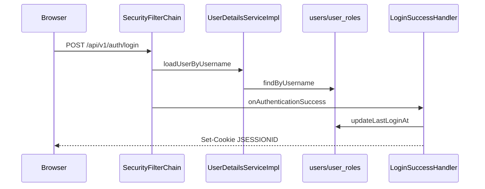

## 7. Request Lifecycle

```text
Every request → MdcLoggingFilter → SecurityContextHolder
→ authorizeHttpRequests matcher
→ authenticated() or permitAll
→ @PreAuthorize on admin controllers (second layer)
```

`@EnableMethodSecurity` on `SecurityConfig` enables `@PreAuthorize("hasRole('ADMIN')")` on `UserManagementApiController`.

## 8. Trade-offs

| Choice | In TLBank |
| --- | --- |
| Session vs JWT | Sessions — simpler logout, `maximumSessions(1)` |
| CSRF disabled for API | Applicant APIs are public; web forms use CSRF |
| Applicant endpoints permitAll | No auth on apply flow — demo simplicity; not production-safe |

## 9. Common Interview Questions

- **Why sessions over JWT?** Browser portal; `SessionCreationPolicy.IF_REQUIRED`; see `SecurityConfig`.
- **How is concurrent login limited?** `maximumSessions(1)` + `SessionRegistry`.
- **Where are roles mapped?** `UserDetailsServiceImpl` — DB `APPLICANT` → `ROLE_USER`.

## 10. Production Considerations

Applicant `permitAll` on application APIs would need API keys or OAuth in production. Session fixation protection is Spring default. No Redis session store — single instance only.

## 11. Alternative Approaches

- JWT + stateless API — not chosen; documented in README design decisions.
- OAuth2/OIDC — not implemented.

---

# Chapter 5 — BCrypt

## 1. Purpose

Password hashing for platform users stored in `users.password`.

## 2. Why It Exists

`SecurityConfig.passwordEncoder()` returns `new BCryptPasswordEncoder(12)`. `UserAppService.createUser()` encodes via `PasswordEncoder`.

## 3. Business Features Using It

- User Management (`UserAppService.createUser`)
- Authentication (login compares hash via `DaoAuthenticationProvider`)
- Seed data (`V100__seed_test_data.sql`, `V100__seed_staging_data.sql`)

## 4. Files Implementing It

```text
security/config/SecurityConfig.java (@Bean PasswordEncoder, strength 12)
application/user/service/UserAppService.java (encode on create)
db/dev-seed/V100__seed_test_data.sql ($2b$10$... for Password123!)
db/migration-sqlserver/V100__seed_staging_data.sql ($2a$12$... for Password@123)
src/test/.../SecurityIntegrationTest.java (verifies login against seed hash)
```

## 5. Execution Flow

1. Admin `POST /api/v1/admin/users` with plaintext password in `CreateUserRequest`.
2. `UserAppService` → `passwordEncoder.encode(command.rawPassword())`.
3. Hash stored in `users.password`.
4. Login: Spring Security compares plaintext to hash automatically.

## 6. Mermaid Diagram

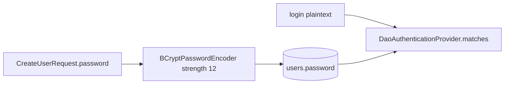

## 7. Request Lifecycle

BCrypt runs only at user creation and login — not per business request. `@Size(min=8)` on password in `CreateUserRequest` is validation only, not hashing.

## 8. Trade-offs

| Choice | In TLBank |
| --- | --- |
| Strength 12 | Stronger than default 10; more CPU per login |
| BCrypt vs Argon2 | BCrypt is Spring Security default, well understood |

## 9. Common Interview Questions

- **Where is strength configured?** `BCryptPasswordEncoder(12)` in `SecurityConfig`.
- **Are demo passwords in plaintext in DB?** No — Flyway seeds store bcrypt hashes.

## 10. Production Considerations

Password policy (complexity, rotation) not implemented beyond `@Size(min=8)`.

## 11. Alternative Approaches

- Argon2id — Spring Security 5.8+ support; not used here.
- External IdP — not implemented.

---

# Chapter 6 — Spring Data JPA

## 1. Purpose

Persistence layer: JPA repositories for entities, custom `@Repository` impls mapping to domain ports.

## 2. Why It Exists

`spring-boot-starter-data-jpa`. Every aggregate (`Application`, `User`, `ReviewCase`, `OtpRecord`, `CardProduct`, `SystemParameter`) has `*JpaRepository` + `*RepositoryImpl`.

## 3. Business Features Using It

All features that persist data. Example: `ApplicationRepositoryImpl` implements domain port `ApplicationRepository`.

## 4. Files Implementing It

```text
infrastructure/persistence/application/ApplicationJpaRepository.java
infrastructure/persistence/application/ApplicationRepositoryImpl.java
infrastructure/persistence/application/ApplicationEntity.java
infrastructure/persistence/user/UserJpaRepository.java
infrastructure/persistence/review/ReviewCaseJpaRepository.java
infrastructure/persistence/otp/OtpJpaRepository.java
infrastructure/persistence/product/CardProductJpaRepository.java
infrastructure/persistence/parameter/SystemParameterJpaRepository.java
common/audit/AuditLogRepository.java (Spring Data interface)
common/config/JpaConfig.java (@EnableJpaAuditing)
```

## 5. Execution Flow — Save Application

1. `ApplicationAppService.submitApplication()` calls `applicationRepository.save(application)`.
2. `ApplicationRepositoryImpl.save()` finds or creates `ApplicationEntity`.
3. Maps domain `Application` ↔ `ApplicationEntity` + `WorkflowHistoryEntity` + `ApplicationDocumentEntity`.
4. `applicationJpaRepository.save(entity)` → SQL INSERT/UPDATE.

## 6. Mermaid Diagram

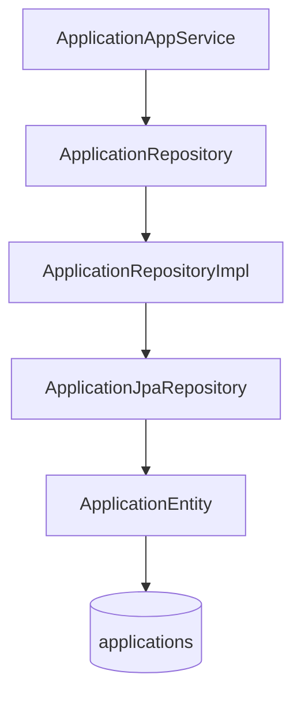

## 7. Request Lifecycle

`@Transactional` on service methods defines persistence context boundary. `open-in-view: false` means entities must be mapped to DTOs inside the transaction (e.g. `ApplicationDetailResponse` built in `getApplication()`).

## 8. Trade-offs

| Choice | In TLBank |
| --- | --- |
| Manual domain mapping in `*RepositoryImpl` | No MapStruct mappers generated — explicit `toDomain()`/`toEntity()` |
| Domain port pattern | `ApplicationRepository` in domain; impl in infrastructure |
| `AuditLogRepository` skips domain | Audit is cross-cutting, uses Spring Data directly |

## 9. Common Interview Questions

- **Where is domain separated from JPA?** `ApplicationRepositoryImpl.toDomain()` — domain `Application` has no `@Entity`.
- **Why two repository layers?** Port in `domain/`, JPA in `infrastructure/persistence/`.

## 10. Production Considerations

Connection pooling (HikariCP, Boot default), query tuning, read replicas — not configured in portfolio.

## 11. Alternative Approaches

- jOOQ / JDBC template — not used.
- Spring Data JDBC — not used.

---

# Chapter 7 — Hibernate

## 1. Purpose

JPA provider under Spring Data JPA; validates entity schema against database.

## 2. Why It Exists

Comes with `spring-boot-starter-data-jpa`. `application.yml`: `hibernate.ddl-auto: validate`.

## 3. Business Features Using It

All JPA entities: `ApplicationEntity`, `UserEntity`, `ReviewCaseEntity`, `OtpRecordEntity`, etc.

## 4. Files Implementing It

```text
application.yml (jpa.hibernate.ddl-auto: validate)
application-staging.yml (hibernate.dialect: SQLServerDialect)
infrastructure/persistence/**/**Entity.java
common/entity/BaseEntity.java (@CreatedDate, @LastModifiedDate)
common/config/JpaConfig.java (@EnableJpaAuditing)
```

## 5. Execution Flow

1. App starts → Hibernate builds metamodel from `@Entity` classes.
2. Compares schema to DB (validate mode).
3. Flyway must have already applied matching DDL.
4. Runtime: Hibernate generates SQL for JpaRepository methods.

## 6. Mermaid Diagram

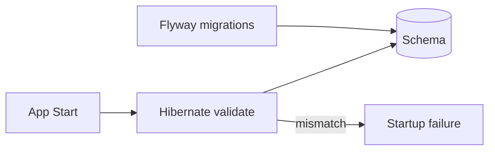

## 7. Request Lifecycle

Hibernate session bound to `@Transactional` service call. `ApplicationEntity` uses `@Embedded` `ApplicantEmbeddable`, `AddressEmbeddable` (V11 migration).

## 8. Trade-offs

| Choice | In TLBank |
| --- | --- |
| `validate` not `update` | Flyway owns schema; Hibernate only checks |
| Embeddables for applicant | Flattens columns in `applications` table |

## 9. Common Interview Questions

- **Who creates tables?** Flyway SQL in `db/migration/`, not Hibernate.
- **What happens if entity and DB diverge?** Startup fails on `validate`.

## 10. Production Considerations

Second-level cache not enabled. Batch inserts not tuned.

## 11. Alternative Approaches

- Hibernate `ddl-auto: none` — equivalent safety with explicit validate.

---

# Chapter 8 — Flyway

## 1. Purpose

Versioned database migrations for schema and seed data.

## 2. Why It Exists

`flyway-core` + `flyway-sqlserver` in `pom.xml`. `spring.flyway.enabled: true` in `application.yml`.

## 3. Business Features Using It

All features — every table created by `V1`–`V14` migrations plus `V100` seeds.

## 4. Files Implementing It

```text
src/main/resources/db/migration/V1__create_users.sql … V14__reshape_audit_logs_for_sprint9.sql
src/main/resources/db/migration-sqlserver/ (parallel set)
src/main/resources/db/dev-seed/V100__seed_test_data.sql
src/main/resources/db/dev-seed/V101__add_user_136628.sql
src/main/resources/db/migration-sqlserver/V100__seed_staging_data.sql
application-dev.yml (locations: migration + dev-seed)
application-staging.yml (locations: migration-sqlserver)
docker/sqlserver/init/01-init-database.sql
```

## 5. Execution Flow

1. Spring Boot starts Flyway before JPA.
2. `dev` profile: runs `db/migration/` then `db/dev-seed/`.
3. `staging` profile: runs `db/migration-sqlserver/` only (V100 seed inside).
4. Hibernate `validate` runs after migrations succeed.

## 6. Mermaid Diagram

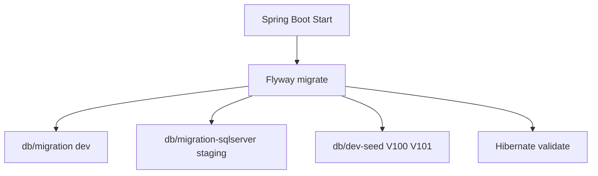

## 7. Request Lifecycle

Flyway runs once at startup — not per HTTP request.

## 8. Trade-offs

| Choice | In TLBank |
| --- | --- |
| Dual migration trees | H2 syntax vs SQL Server syntax — manual sync burden |
| Seed via Flyway | `V100` seeds demo users — not Flyway repeatable pattern |
| `baseline-on-migrate: true` | Allows existing DB baselining |

## 9. Common Interview Questions

- **Why two migration folders?** H2 for dev/tests; SQL Server for Docker staging.
- **Where are demo users seeded?** `db/dev-seed/V100__seed_test_data.sql`.

## 10. Production Considerations

Migration review in CI, rollback strategy, separate seed from schema in production.

## 11. Alternative Approaches

- Liquibase — not used.
- Single migration with Flyway placeholders — not used; separate folders instead.

---

# Chapter 9 — H2 Database

## 1. Purpose

In-memory database for local development and automated tests.

## 2. Why It Exists

`application-dev.yml`: `jdbc:h2:mem:tlbank_lending;MODE=MSSQLServer`. All tests use `@ActiveProfiles("dev")`.

## 3. Business Features Using It

Every feature during `mvn clean verify` and `mvn spring-boot:run -Dspring-boot.run.profiles=dev`.

## 4. Files Implementing It

```text
application-dev.yml (datasource url, h2 console enabled)
src/test/resources/application-dev.yml (idempotency store: memory)
src/test/java/**/*Test.java (@ActiveProfiles("dev"))
db/migration/ (H2-compatible SQL)
pom.xml (h2 runtime dependency)
```

## 5. Execution Flow

1. Test or dev start → H2 creates in-memory DB `tlbank_lending`.
2. Flyway applies `db/migration/` + `db/dev-seed/`.
3. Tests exercise full stack against H2.
4. Process exit → data discarded.

## 6. Mermaid Diagram

```mermaid
flowchart LR
    MVN[mvn verify] --> DEV[@ActiveProfiles dev]
    DEV --> H2[(H2 in-memory)]
    H2 --> FLY[db/migration]
    FLY --> TEST[133 test methods]
```

## 7. Request Lifecycle

Same as production code path — only the JDBC URL differs. `MODE=MSSQLServer` helps H2 emulate T-SQL behaviors where needed.

## 8. Trade-offs

| Choice | In TLBank |
| --- | --- |
| H2 vs Testcontainers SQL Server | H2 = faster tests, no Docker required |
| In-memory | No persistence between restarts |
| H2 console enabled | `/h2-console` dev only; `SecurityConfig` permitAll |

## 9. Common Interview Questions

- **Do tests need Docker?** No — H2 + `InMemoryIdempotencyStore` in test yml.
- **Why MODE=MSSQLServer?** Closer dialect compatibility with staging SQL Server.

## 10. Production Considerations

H2 is never used in staging/prod profiles.

## 11. Alternative Approaches

- Testcontainers SQL Server — not used; would increase CI time.

---

# Chapter 10 — Microsoft SQL Server

## 1. Purpose

Production-like database for Docker staging and `staging`/`prod` Spring profiles.

## 2. Why It Exists

`mssql-jdbc` in `pom.xml`. `docker-compose.yml` runs `mcr.microsoft.com/mssql/server:2022-latest`. CI deploy job writes compose with SQL Server for local Mac staging.

## 3. Business Features Using It

All features when `SPRING_PROFILES_ACTIVE=staging` — same code paths as H2 dev.

## 4. Files Implementing It

```text
application-staging.yml
application-prod.yml
docker-compose.yml (sqlserver service, port 1433)
docker/sqlserver/init/01-init-database.sql
docker/sqlserver/init/02-create-app-user.sql
db/migration-sqlserver/V1..V14, V100
.env.example (SPRING_DATASOURCE_URL jdbc:sqlserver://...)
.github/workflows/ci.yml (deploy-staging sqlserver container)
```

## 5. Execution Flow

1. `docker-compose up` → SQL Server container healthcheck passes.
2. `db-init` container runs init scripts → creates `TLBankLending` DB and `tlbank_app` user.
3. App container starts with `staging` profile.
4. Flyway runs `db/migration-sqlserver/`.
5. App connects via `SPRING_DATASOURCE_URL` env var.

## 6. Mermaid Diagram

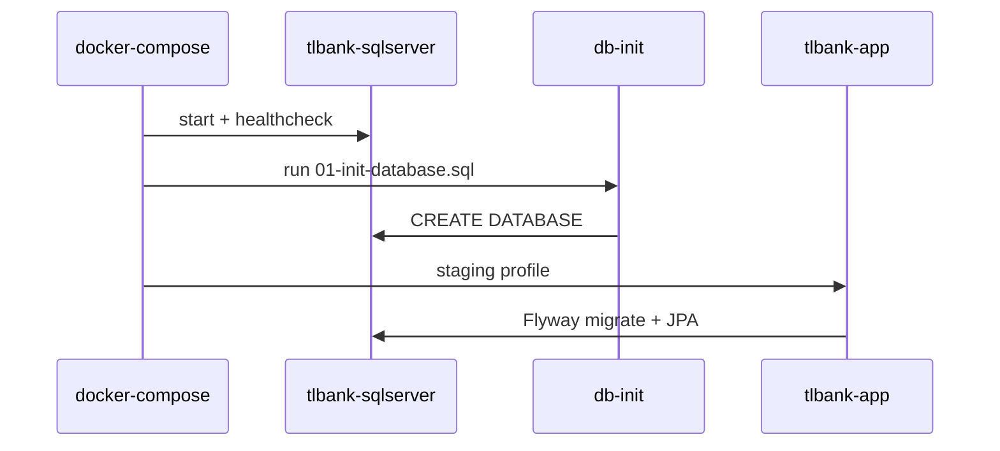

## 7. Request Lifecycle

Per-request: HikariCP borrows connection from pool → JPA/Hibernate → SQL Server. No per-request migration.

## 8. Trade-offs

| Choice | In TLBank |
| --- | --- |
| SQL Server vs PostgreSQL | Matches enterprise/.NET bank stacks; portfolio choice |
| `encrypt=true;trustServerCertificate=true` in `.env.example` | Dev convenience |
| Developer edition in Docker | `MSSQL_PID: Developer` |

## 9. Common Interview Questions

- **How does staging differ from dev DB?** SQL Server + `migration-sqlserver/` vs H2 + `migration/`.
- **Where is DB user created?** `docker/sqlserver/init/02-create-app-user.sql`.

## 10. Production Considerations

Managed SQL (RDS/Azure SQL), TLS, backup, connection string secrets — not in repo. SA password in GitHub secrets for CI deploy.

## 11. Alternative Approaches

- PostgreSQL — not used in this project.

---

# Chapter 11 — Thymeleaf

## 1. Purpose

Server-side HTML for applicant flow, login, admin, and review UI.

## 2. Why It Exists

`spring-boot-starter-thymeleaf` + `thymeleaf-extras-springsecurity6`. Web controllers return view names.

## 3. Business Features Using It

| Feature | Template |
| --- | --- |
| Login | `templates/auth/login.html` |
| Product list | `templates/products/list.html` |
| Apply flow | `templates/application/form.html`, `otp.html`, `upload.html`, `submit-confirm.html` |
| Review | `templates/review/list.html`, `detail.html` |
| Admin | `templates/admin/users.html`, `audit-logs.html`, etc. |

## 4. Files Implementing It

```text
presentation/web/ApplicationWebController.java
presentation/web/ReviewController.java
presentation/web/AdminController.java
presentation/web/AuthController.java
src/main/resources/templates/layout/base.html
src/main/resources/templates/**/*.html
application.yml (thymeleaf.check-template-location: false)
```

## 5. Execution Flow — Apply Form

1. `GET /apply?cardProductId=TL-CLASSIC` → `ApplicationWebController`.
2. Loads products via `ApplicationAppService.findAllEnabledProducts()`.
3. `model.addAttribute(...)` → returns `"application/form"`.
4. Thymeleaf renders `templates/application/form.html` extending `layout/base.html`.

## 6. Mermaid Diagram

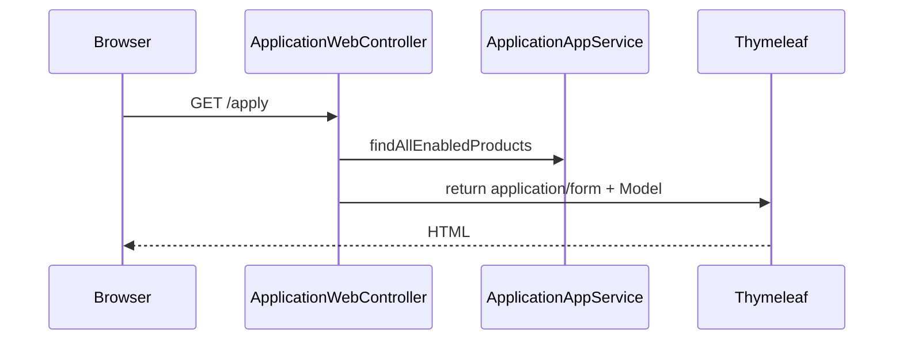

## 7. Request Lifecycle

MVC pattern: Controller → Model → View resolver → Thymeleaf engine → HTML response. Not used for `/api/v1/**` JSON endpoints.

## 8. Trade-offs

| Choice | In TLBank |
| --- | --- |
| Thymeleaf vs SPA | Simpler portfolio; server-rendered forms for apply flow |
| Same backend as API | `ApplicationWebController` and `ApplicationApiController` share `ApplicationAppService` |

## 9. Common Interview Questions

- **Where is the apply wizard?** `ApplicationWebController` + `templates/application/*.html`.
- **Is review UI REST or web?** Both — `ReviewController` (web) and `ReviewApiController` (REST).

## 10. Production Considerations

CDN for static assets, CSP headers, XSS escaping (Thymeleaf default escaping).

## 11. Alternative Approaches

- React/Vue SPA — not used.

---

# Chapter 12 — Jakarta Bean Validation

## 1. Purpose

Declarative request validation on REST DTOs before service layer.

## 2. Why It Exists

`spring-boot-starter-validation`. Controllers use `@Valid @RequestBody`.

## 3. Business Features Using It

| Feature | DTO | Constraints |
| --- | --- | --- |
| Create application | `CreateApplicationRequest` | `@Valid ApplicantRequest`, `@NotBlank cardProductId` |
| Cancel | `CancelApplicationRequest` | `@NotBlank reason` |
| OTP send | `SendOtpRequest` | `@Pattern(^09\d{8}$)` mobile |
| OTP verify | `VerifyOtpRequest` | `@Size(6)` otpCode |
| Create user | `CreateUserRequest` | `@Size(min=8)` password, `@Email` |
| Review approve/reject | `ApproveReviewRequest`, `RejectReviewRequest` | `@NotBlank remark` |
| Report | `GenerateReportRequest` | `@NotNull reportDate, format` |

## 4. Files Implementing It

```text
application/dto/request/CreateApplicationRequest.java
application/dto/request/ApplicantRequest.java
application/dto/request/SendOtpRequest.java
application/dto/request/VerifyOtpRequest.java
application/dto/request/CancelApplicationRequest.java
presentation/api/advice/GlobalExceptionHandler.java (MethodArgumentNotValidException)
common/response/FieldErrorDetail.java
```

Domain validation separate: `MobileNumber` record constructor, `Application.submit()` document check.

## 5. Execution Flow

1. `POST /api/v1/applications` with invalid body.
2. Spring validates `@Valid CreateApplicationRequest`.
3. `MethodArgumentNotValidException` → `GlobalExceptionHandler`.
4. Returns `400` + `ErrorCode.VALIDATION_FAILED` + `FieldErrorDetail` list.

## 6. Mermaid Diagram

```mermaid
flowchart LR
    JSON[Request JSON] --> VAL[@Valid controller param]
    VAL -->|fail| GEH[GlobalExceptionHandler]
    GEH --> RESP[400 VALIDATION_FAILED]
    VAL -->|pass| SVC[ApplicationAppService]
```

## 7. Request Lifecycle

Validation runs after security filters, before controller method body, as part of Spring MVC argument resolution.

## 8. Trade-offs

| Choice | In TLBank |
| --- | --- |
| Bean Validation + domain rules | DTO format checks vs `WorkflowException` in domain |
| `@Pattern` on mobile | Duplicates `MobileNumber` regex — defense in depth |

## 9. Common Interview Questions

- **Where are validation errors returned?** `GlobalExceptionHandler.handleValidationException()`.
- **Is national ID validated at DTO layer?** `@NotBlank` only; format in domain if mapped to VO.

## 10. Production Considerations

Custom validators, i18n message bundles — not implemented.

## 11. Alternative Approaches

- Manual validation in service — partially done in domain for workflow.

---

# Chapter 13 — Spring AOP

## 1. Purpose

Cross-cutting audit logging via `@Auditable` annotation without polluting business methods.

## 2. Why It Exists

`spring-boot-starter-aop`. `AuditAspect` intercepts `@Auditable` methods.

## 3. Business Features Using It

| Action | Service Method |
| --- | --- |
| `OTP_SEND` | `OtpAppService.sendOtp()` |
| `OTP_VERIFY_SUCCESS` | `OtpAppService.verifyOtp()` |
| `DOCUMENT_UPLOAD` | `ApplicationAppService.uploadDocuments()` |
| `APPLICATION_SUBMIT` | `ApplicationAppService.submitApplication()` |
| `APPLICATION_CANCEL` | `ApplicationAppService.cancelApplication()` |
| `APPLICATION_APPROVE` | `ReviewAppService.approveCase()` |
| `APPLICATION_REJECT` | `ReviewAppService.rejectCase()` |
| `REPORT_EXPORT` | `ReportAppService.generateDailyStatisticsReport()` |

## 4. Files Implementing It

```text
common/audit/AuditAspect.java
common/audit/Auditable.java
common/audit/AuditAction.java
common/audit/AuditLogWriter.java
common/audit/AuditContext.java
common/audit/AuditDetailBuilder.java
common/audit/AuditIpResolver.java
common/config/AsyncConfig.java
```

## 5. Execution Flow

1. `OtpAppService.sendOtp()` called (annotated `@Auditable(action = OTP_SEND)`).
2. `AuditAspect.audit()` proceeds join point.
3. On success: `AuditLogWriter.saveAsync()` with username, IP, action, detail.
4. `AuditContext.put("otpCode", ...)` before send — included in audit detail.
5. On failure: saves with `FAILURE` result, rethrows.

## 6. Mermaid Diagram

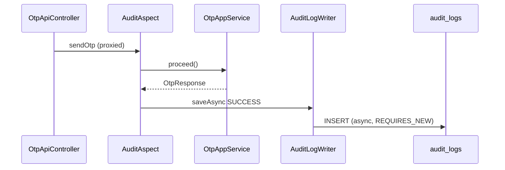

## 7. Request Lifecycle

AOP proxy wraps Spring `@Service` beans. Aspect runs in same thread as request; audit write is async.

## 8. Trade-offs

| Choice | In TLBank |
| --- | --- |
| AOP vs manual audit calls | Cleaner services; harder to trace in debugger |
| Async + REQUIRES_NEW | Audit survives business transaction rollback |
| Login audit in handlers | `LoginSuccessHandler` writes directly — not `@Auditable` |

## 9. Common Interview Questions

- **How is OTP code captured in audit?** `AuditContext.put` in `OtpAppService`, read in `AuditAspect`.
- **Does audit failure roll back business TX?** No — `REQUIRES_NEW` + async.

## 10. Production Considerations

Audit volume, PII in `detail` field, immutable log storage.

## 11. Alternative Approaches

- Manual audit in each service — rejected for duplication.
- Event sourcing — not used.

---

# Chapter 14 — Spring Application Events

## 1. Purpose

Decouple workflow commits from notification and review-case creation side effects.

## 2. Why It Exists

`ApplicationEventPublisher` injected in `ApplicationAppService` and `ReviewAppService`. `@EventListener` handlers in `infrastructure/event/`.

## 3. Business Features Using It

| Event | Publisher | Handler |
| --- | --- | --- |
| `ApplicationSubmittedEvent` | `ApplicationAppService.submitApplication()` | `ReviewEventHandler`, `NotificationEventHandler` |
| `ApplicationApprovedEvent` | `ReviewAppService.approveCase()` | `NotificationEventHandler` |
| `ApplicationRejectedEvent` | `ReviewAppService.rejectCase()` | `NotificationEventHandler` |

Unused events: `ApplicationCancelledEvent`, `OtpGeneratedEvent` (defined, never published).

## 4. Files Implementing It

```text
domain/event/ApplicationSubmittedEvent.java
domain/event/ApplicationApprovedEvent.java
domain/event/ApplicationRejectedEvent.java
domain/event/ApplicationCancelledEvent.java
domain/event/OtpGeneratedEvent.java
infrastructure/event/ReviewEventHandler.java
infrastructure/event/NotificationEventHandler.java
application/application/service/ApplicationAppService.java (publish)
application/review/service/ReviewAppService.java (publish)
```

## 5. Execution Flow — Submit

1. `application.submit()` + `applicationRepository.save()`.
2. `eventPublisher.publishEvent(new ApplicationSubmittedEvent(...))`.
3. Same transaction thread: `ReviewEventHandler.onApplicationSubmitted()` → `ReviewCase.createFor()` → save.
4. `NotificationEventHandler.onApplicationSubmitted()` → mock SMS/email (try/catch).

## 6. Mermaid Diagram

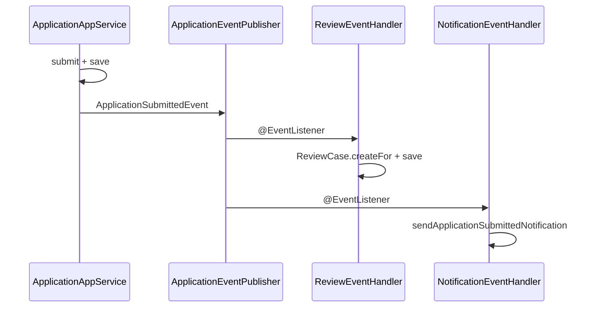

## 7. Request Lifecycle

Events are synchronous by default (same thread, after publish call). Handler exceptions in `NotificationEventHandler` are caught — do not roll back submit transaction.

## 8. Trade-offs

| Choice | In TLBank |
| --- | --- |
| Sync Spring events vs Kafka | Simpler; no guaranteed delivery |
| OTP not event-driven | `OtpAppService` calls `NotificationService` directly |
| `ApplicationCancelledEvent` unused | Gap documented in architecture handbook |

## 9. Common Interview Questions

- **When is ReviewCase created?** `ReviewEventHandler` on `ApplicationSubmittedEvent`.
- **Do notification failures fail submit?** No — `NotificationEventHandler` try/catch.

## 10. Production Considerations

Outbox pattern, async messaging, idempotent consumers — not implemented.

## 11. Alternative Approaches

- Kafka/RabbitMQ — roadmap item in README.
- Transactional outbox — not implemented.

---

# Chapter 15 — Spring Scheduling

## 1. Purpose

Background jobs: OTP expiry cleanup, cache refresh, daily statistics logging.

## 2. Why It Exists

`@EnableScheduling` in `SchedulingConfig` and `SchedulerConfig`. Cron expressions in `application.yml` under `tlbank.scheduler.*`.

## 3. Business Features Using It

| Job | Class | Cron Property |
| --- | --- | --- |
| OTP cleanup | `OtpCleanupScheduler` | `tlbank.scheduler.otp-cleanup.cron` |
| Cache refresh | `CacheRefreshScheduler` | `tlbank.scheduler.cache-refresh.cron` |
| Daily stats log | `DailyStatisticsScheduler` | `tlbank.scheduler.daily-stats.cron` |
| Cache entry expiry | `InMemoryCacheStore.cleanupExpiredEntries` | `fixedDelay=60s` |

## 4. Files Implementing It

```text
infrastructure/scheduler/OtpCleanupScheduler.java
infrastructure/scheduler/CacheRefreshScheduler.java
infrastructure/scheduler/DailyStatisticsScheduler.java
infrastructure/cache/InMemoryCacheStore.java (@Scheduled fixedDelay)
common/config/SchedulingConfig.java
common/config/SchedulerConfig.java
presentation/api/v1/SchedulerApiController.java (manual trigger)
application.yml (cron defaults, pool size 3)
application-dev.yml (otp-cleanup every 1 min)
```

## 5. Execution Flow — OTP Cleanup

1. Cron fires `OtpCleanupScheduler.cleanupExpiredOtps()`.
2. `otpRepository.markExpiredBefore(LocalDateTime.now(clock))`.
3. Logs `[SCHEDULER] OTP cleanup completed. Marked N records`.

Admin manual: `POST /api/v1/admin/schedulers/otp-cleanup/run` → same method.

## 6. Mermaid Diagram

```mermaid
flowchart TB
    CRON[@Scheduled cron] --> OTP[OtpCleanupScheduler]
    CRON --> CACHE[CacheRefreshScheduler]
    CRON --> STATS[DailyStatisticsScheduler]
    OTP --> DB[(otp_records EXPIRED)]
    CACHE --> PARAM[SystemParameterService.refreshCache]
    STATS --> RPT[ReportDataService.buildDailyStatistics]
```

## 7. Request Lifecycle

Schedulers run on `spring.task.scheduling.pool` threads (size 3) — independent of HTTP request threads.

## 8. Trade-offs

| Choice | In TLBank |
| --- | --- |
| In-process scheduling vs external cron | Simple; lost on multi-instance without leader election |
| Dev OTP cron 1 min | `application-dev.yml` — faster feedback |
| Duplicate `@EnableScheduling` | Both `SchedulingConfig` and `SchedulerConfig` |

## 9. Common Interview Questions

- **How can admin trigger a job manually?** `SchedulerApiController` POST endpoints.
- **What does daily stats scheduler produce?** Logs only — no file; `ReportAppService` produces files.

## 10. Production Considerations

Distributed locks (ShedLock), separate worker pods, monitoring job failures.

## 11. Alternative Approaches

- Quartz — not used.
- Kubernetes CronJob — not used.

---

# Chapter 16 — Spring Async

## 1. Purpose

Non-blocking audit log persistence.

## 2. Why It Exists

`@EnableAsync` on `AsyncConfig`. `AuditLogWriter.saveAsync()` annotated `@Async`.

## 3. Business Features Using It

Audit logging for all `@Auditable` operations and indirectly every audited business action.

## 4. Files Implementing It

```text
common/config/AsyncConfig.java
common/audit/AuditLogWriter.java
common/audit/AuditAspect.java (calls saveAsync)
```

## 5. Execution Flow

1. `AuditAspect` completes business method.
2. Calls `auditLogWriter.saveAsync(auditLog)`.
3. Returns immediately to client path.
4. Async thread runs `TransactionTemplate` with `PROPAGATION_REQUIRES_NEW`.
5. `auditLogRepository.save()` — separate transaction.

## 6. Mermaid Diagram

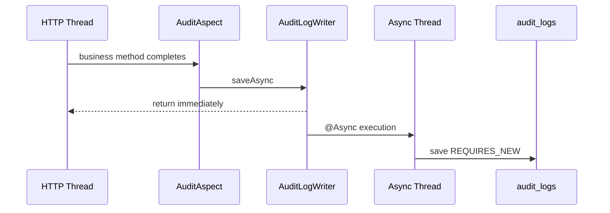

## 7. Request Lifecycle

Async detaches audit write from response latency. Failure logged in `AuditLogWriter` catch — does not affect HTTP status.

## 8. Trade-offs

| Choice | In TLBank |
| --- | --- |
| Async audit | Faster response; audit may lag slightly |
| REQUIRES_NEW | Audit persists even if business TX rolls back |

## 9. Common Interview Questions

- **Why REQUIRES_NEW for audit?** Persist audit even when business transaction fails after partial work.

## 10. Production Considerations

Async thread pool sizing, audit backpressure.

## 11. Alternative Approaches

- Sync audit write — would add latency to every `@Auditable` call.

---

# Chapter 17 — Spring Actuator

## 1. Purpose

Health endpoint for deployment verification and Docker healthchecks.

## 2. Why It Exists

`spring-boot-starter-actuator`. `management.endpoints.web.exposure.include: health,info`.

## 3. Business Features Using It

Infrastructure / deployment — not a business feature. Used by `scripts/verify.sh` and `docker-compose.yml` app healthcheck.

## 4. Files Implementing It

```text
application.yml (management.endpoints, health show-details when_authorized)
docker-compose.yml (healthcheck: wget http://localhost:8080/actuator/health)
scripts/verify.sh (curl actuator/health)
```

## 5. Execution Flow

1. `GET /actuator/health` → Actuator health indicator.
2. Checks DB connectivity (default health).
3. Docker healthcheck polls every 30s until app ready.

## 6. Mermaid Diagram

```mermaid
flowchart LR
    DC[docker-compose healthcheck] --> ACT[/actuator/health]
    VERIFY[scripts/verify.sh] --> ACT
    ACT --> DB[(datasource ping)]
```

## 7. Request Lifecycle

Standard MVC request to Actuator endpoint — no custom business logic.

## 8. Trade-offs

| Choice | In TLBank |
| --- | --- |
| Only health,info exposed | Minimal attack surface |
| `show-details: when_authorized` | Hides details from anonymous callers |

## 9. Common Interview Questions

- **How does Docker know app is ready?** `docker-compose.yml` healthcheck on port 8080.

## 10. Production Considerations

Secure actuator endpoints, Kubernetes liveness/readiness probes.

## 11. Alternative Approaches

- Custom `/health` controller — not used; Actuator standard.

---

# Chapter 18 — SpringDoc OpenAPI

## 1. Purpose

Interactive API documentation for REST endpoints.

## 2. Why It Exists

`springdoc-openapi-starter-webmvc-ui:2.7.0`. `@OpenAPIDefinition` on `SwaggerConfig`.

## 3. Business Features Using It

Documents all `/api/v1/**` controllers — Applications, OTP, Review, Admin APIs.

## 4. Files Implementing It

```text
common/config/SwaggerConfig.java
common/config/StandardApiResponses.java
application.yml (springdoc paths)
application-dev.yml (swagger enabled)
application-staging.yml (swagger enabled)
application-prod.yml (swagger disabled)
presentation/api/v1/* (@Operation, @Tag, @Schema on DTOs)
SecurityConfig (permitAll /swagger-ui/**, /v3/api-docs/**)
```

## 5. Execution Flow

1. Dev/staging start → SpringDoc scans `@RestController` beans.
2. `GET /swagger-ui.html` serves UI.
3. `GET /v3/api-docs` returns OpenAPI JSON.
4. Prod profile disables both in `application-prod.yml`.

## 6. Mermaid Diagram

```mermaid
flowchart LR
    BOOT[Spring Boot start] --> SCAN[SpringDoc scan controllers]
    SCAN --> UI[/swagger-ui.html]
    SCAN --> JSON[/v3/api-docs]
```

## 7. Request Lifecycle

Documentation endpoints are separate from business API — no interaction with domain layer.

## 8. Trade-offs

| Choice | In TLBank |
| --- | --- |
| Enabled in staging | Convenient; security risk if staging is public |
| Disabled in prod | Correct for production posture |

## 9. Common Interview Questions

- **Where is Swagger turned off?** `application-prod.yml` `springdoc.*.enabled: false`.

## 10. Production Considerations

Never expose Swagger on public prod; authenticate doc endpoints if needed on staging.

## 11. Alternative Approaches

- Springfox — deprecated; SpringDoc used instead.

---

# Chapter 19 — Redis (Spring Data Redis)

## 1. Purpose

Distributed idempotency store for `POST /api/v1/applications` when `tlbank.idempotency.store=redis`.

## 2. Why It Exists

`spring-boot-starter-data-redis`. `RedisIdempotencyStore` uses `StringRedisTemplate` with TTL and `SETNX` locks.

## 3. Business Features Using It

**Only** Application Create idempotency — not cache, not sessions.

## 4. Files Implementing It

```text
infrastructure/idempotency/RedisIdempotencyStore.java
infrastructure/idempotency/InMemoryIdempotencyStore.java (test fallback)
infrastructure/idempotency/IdempotencyStore.java
application/idempotency/IdempotencyService.java
application-dev.yml (spring.data.redis host/port, tlbank.idempotency.store=redis)
src/test/resources/application-dev.yml (store: memory)
application.yml (tlbank.idempotency.ttl-hours, key-prefix)
```

Redis keys: `idempotency:applications:{key}`, lock: `{key}:lock`.

## 5. Execution Flow

1. `POST /api/v1/applications` + `Idempotency-Key: abc-123`.
2. `IdempotencyService` hashes request body (SHA-256 JSON).
3. `RedisIdempotencyStore.find(key)` — GET from Redis.
4. If miss: `tryAcquireLock` — SETNX with 30s TTL.
5. Execute create; `save` entry JSON with 24h TTL.
6. `releaseLock`.

## 6. Mermaid Diagram

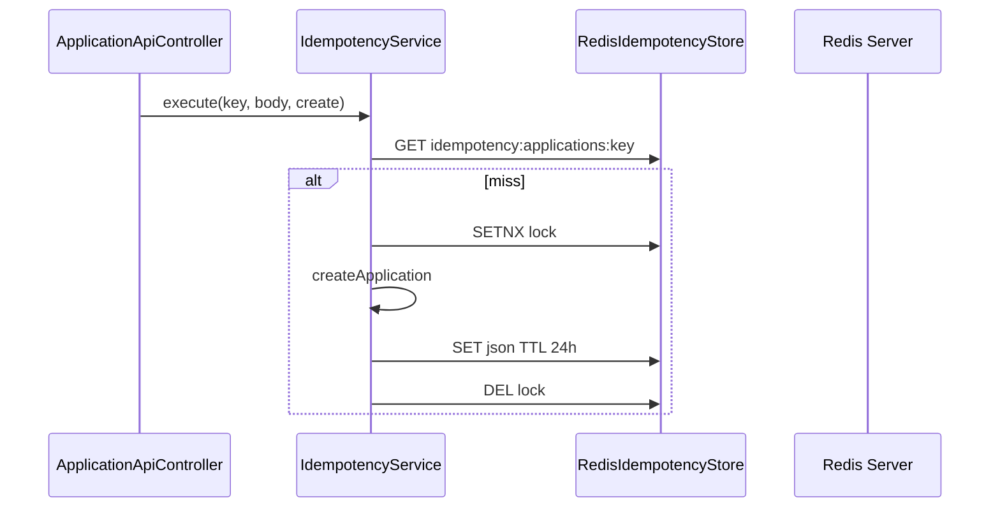

## 7. Request Lifecycle

Idempotency wraps only the create endpoint. Absent header → bypasses Redis entirely (`IdempotencyService` line 47-48).

## 8. Trade-offs

| Choice | In TLBank |
| --- | --- |
| Redis only for idempotency | Cache remains in-memory — documented gap |
| Not in docker-compose | Dev must run Redis on localhost:6379 |
| Staging unset `store` | Neither redis nor memory bean — deployment gap |

## 9. Common Interview Questions

- **Does Redis cache card products?** No — `InMemoryCacheStore` only.
- **What happens on duplicate key same body?** Cached `ApiResponse` returned from Redis entry.

## 10. Production Considerations

Redis HA, persistence policy, key TTL monitoring, staging must set `tlbank.idempotency.store`.

## 11. Alternative Approaches

- DB unique constraint on idempotency key — not used.
- In-memory only — `InMemoryIdempotencyStore` for tests.

---

# Chapter 20 — In-Memory Cache

## 1. Purpose

Process-local cache for system parameters and card products.

## 2. Why It Exists

`InMemoryCacheStore` — `ConcurrentHashMap` with TTL. Used by `SystemParameterService` and `CachedCardProductRepository`.

## 3. Business Features Using It

- Card Product Catalog (`CachedCardProductRepository`)
- System Parameters (`SystemParameterService.getValue`)
- OTP config reads (`OTP.expire_minutes` via parameter service)
- Upload size limit reads (`UPLOAD.max.size.mb`)

## 4. Files Implementing It

```text
infrastructure/cache/InMemoryCacheStore.java
infrastructure/cache/CacheStore.java
infrastructure/cache/CacheKeys.java
infrastructure/cache/CacheTtlProvider.java
infrastructure/cache/CachedCardProductRepository.java
application/parameter/service/SystemParameterService.java
application/cache/service/CacheManagementService.java
infrastructure/scheduler/CacheRefreshScheduler.java
```

Cache keys: `card_products:all`, `card_product:{id}`, `sys_param:{group}:{key}`.

## 5. Execution Flow

1. `SystemParameterService.getValue("OTP", "expire_minutes")`.
2. `cacheStore.get("sys_param:OTP:expire_minutes")`.
3. On MISS: query DB, `put` with TTL from `CACHE.ttl_seconds` parameter.
4. `CacheRefreshScheduler` periodically evicts and reloads.

## 6. Mermaid Diagram

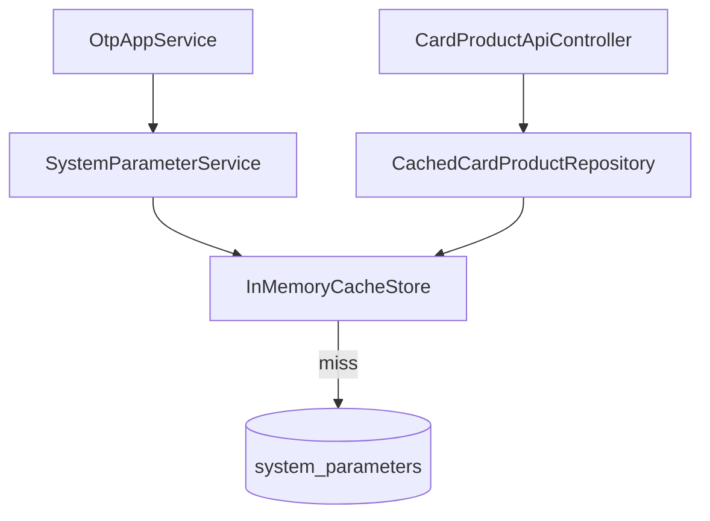

## 7. Request Lifecycle

Cache read happens inside service call during request — no separate HTTP hop.

## 8. Trade-offs

| Choice | In TLBank |
| --- | --- |
| In-memory vs Redis cache | Simpler single instance; not horizontally scalable |
| TTL from DB parameter | Meta-configuration: cache TTL stored in cached table |
| Scheduled eviction | `CacheRefreshScheduler` + 60s expired entry cleanup |

## 9. Common Interview Questions

- **Why not Redis for product cache?** Portfolio single-instance; README roadmap lists `RedisCacheStore`.
- **How does admin refresh?** `POST /api/v1/admin/cache/refresh`.

## 10. Production Considerations

Multi-instance cache inconsistency without distributed cache.

## 11. Alternative Approaches

- Caffeine — not used; custom `CacheStore` interface.
- Redis — planned, not implemented for cache.

---

# Chapter 21 — Local Filesystem Storage

## 1. Purpose

Store uploaded identity/income/residence documents on disk.

## 2. Why It Exists

`LocalDocumentStorageService` implements `DocumentStorageService` port. No S3/Azure Blob in project.

## 3. Business Features Using It

Document Upload — `ApplicationAppService.uploadDocuments()`.

## 4. Files Implementing It

```text
infrastructure/storage/LocalDocumentStorageService.java
infrastructure/storage/DocumentStorageService.java
application.yml (tlbank.upload.base-path: ./uploads)
application-dev.yml (TLBANK_UPLOAD_BASE_PATH)
docker-compose.yml (volume app-uploads:/app/uploads)
.env.example (APP_UPLOAD_PATH=/app/uploads)
```

Path pattern: `{basePath}/{applicationId}/{DOCUMENT_TYPE}_{timestamp}.ext`

## 5. Execution Flow

1. `POST .../documents` with multipart file.
2. `validate()` — extension whitelist, size from `UPLOAD.max.size.mb`.
3. `store()` — `Files.createDirectories`, `Files.copy` input stream.
4. Returns relative path stored in `DocumentInfo` on aggregate.

## 6. Mermaid Diagram

```mermaid
sequenceDiagram
    participant API as ApplicationApiController
    participant SVC as ApplicationAppService
    participant FS as LocalDocumentStorageService
    participant DISK as Local Disk

    API->>SVC: uploadDocuments
    SVC->>FS: validate + store
    FS->>DISK: Files.copy to uploads/{appId}/
    SVC->>SVC: application.uploadDocuments
```

## 7. Request Lifecycle

Multipart parsed by Spring MVC before reaching service. File bytes written synchronously in request thread.

## 8. Trade-offs

| Choice | In TLBank |
| --- | --- |
| Local disk vs object storage | Simple for Docker volume; not cloud-native |
| Docker volume `app-uploads` | Survives container restart on same host |

## 9. Common Interview Questions

- **Allowed extensions?** `jpg, jpeg, png, pdf` in `LocalDocumentStorageService.ALLOWED_EXTENSIONS`.
- **Max size source?** `SystemParameterService` `UPLOAD.max.size.mb` default 10.

## 10. Production Considerations

S3/GCS, virus scan, encryption at rest, presigned URLs — not implemented.

## 11. Alternative Approaches

- AWS S3 — not used.

---

# Chapter 22 — Apache POI

## 1. Purpose

Generate Excel (`.xlsx`) daily statistics reports.

## 2. Why It Exists

`poi-ooxml:5.2.5` in `pom.xml`. `ExcelReportGenerator` uses `XSSFWorkbook`.

## 3. Business Features Using It

Report Export — `POST /api/v1/reports/daily-statistics` with `format: EXCEL`.

## 4. Files Implementing It

```text
infrastructure/report/ExcelReportGenerator.java
application/report/service/ReportAppService.java
application/report/service/ReportDataService.java
application/report/service/DailyStatisticsData.java
application/report/service/ReportFormat.java
presentation/api/v1/ReportApiController.java
```

## 5. Execution Flow

1. Admin `POST /api/v1/reports/daily-statistics` `{ reportDate, format: EXCEL }`.
2. `ReportDataService.buildDailyStatistics(date)` — counts from JPA.
3. `ExcelReportGenerator.generateDailyStatistics(data)` — Summary + Product sheets.
4. `ReportApiController` returns `byte[]` with `Content-Disposition: attachment`.

## 6. Mermaid Diagram

```mermaid
flowchart LR
    API[ReportApiController] --> RPT[ReportAppService]
    RPT --> DATA[ReportDataService]
    RPT --> POI[ExcelReportGenerator XSSFWorkbook]
    POI --> BYTES[byte[] xlsx]
```

## 7. Request Lifecycle

Report generation runs synchronously in request thread — no async job queue.

## 8. Trade-offs

| Choice | In TLBank |
| --- | --- |
| POI vs CSV | Richer Excel formatting for admin demo |
| In-memory byte array | Whole workbook in heap — fine for daily stats volume |

## 9. Common Interview Questions

- **Where is audit for reports?** `@Auditable(REPORT_EXPORT)` on `ReportAppService`.

## 10. Production Considerations

Large report streaming, temp file cleanup, POI memory limits.

## 11. Alternative Approaches

- CSV export — not implemented.
- JasperReports — not used.

---

# Chapter 23 — iText 7

## 1. Purpose

Generate PDF daily statistics reports.

## 2. Why It Exists

`kernel:7.2.5` + `layout:7.2.5` in `pom.xml`. `PdfReportGenerator` parallel to Excel.

## 3. Business Features Using It

Report Export with `format: PDF` in `GenerateReportRequest`.

## 4. Files Implementing It

```text
infrastructure/report/PdfReportGenerator.java
application/report/service/ReportAppService.java (format switch)
```

## 5. Execution Flow

1. Same as Excel until `ReportAppService` branch.
2. `request.format() == ReportFormat.PDF` → `pdfReportGenerator.generateDailyStatistics(data)`.
3. Returns PDF `byte[]`.

## 6. Mermaid Diagram

```mermaid
flowchart LR
    RPT[ReportAppService] -->|EXCEL| POI[ExcelReportGenerator]
    RPT -->|PDF| ITEXT[PdfReportGenerator]
```

## 7. Request Lifecycle

Same synchronous admin request as Excel path.

## 8. Trade-offs

| Choice | In TLBank |
| --- | --- |
| iText 7 | AGPL/commercial license considerations for real products |
| Dual format | Admin chooses in `GenerateReportRequest` |

## 9. Common Interview Questions

- **Does scheduler generate PDF files?** No — `DailyStatisticsScheduler` only logs counts.

## 10. Production Considerations

iText licensing for commercial use.

## 11. Alternative Approaches

- OpenPDF — not used.

---

# Chapter 24 — Lombok

## 1. Purpose

Reduce boilerplate: getters, builders, constructors, logging.

## 2. Why It Exists

`lombok:1.18.36` with annotation processor in `pom.xml`. Excluded from final JAR by spring-boot-maven-plugin.

## 3. Business Features Using It

Used across domain aggregates, entities, services, controllers.

## 4. Files Implementing It

Examples:

```text
domain/application/Application.java (@Getter, @Builder)
domain/review/ReviewCase.java (@Getter, @Builder)
infrastructure/persistence/application/ApplicationEntity.java
*AppService.java (@RequiredArgsConstructor)
*Controller.java (@RequiredArgsConstructor)
@Slf4j on schedulers, handlers, services
```

## 5. Execution Flow

Compile-time annotation processing generates methods — no runtime request impact.

## 6. Mermaid Diagram

```mermaid
flowchart LR
    SRC[@Getter @Builder @RequiredArgsConstructor] --> APT[Lombok APT]
    APT --> CLASS[*.class bytecode]
```

## 7. Request Lifecycle

No per-request role — compile-time only.

## 8. Trade-offs

| Choice | In TLBank |
| --- | --- |
| Lombok vs manual | Faster development; IDE/plugin dependency |
| `@RequiredArgsConstructor` injection | Final fields — testable constructor injection |

## 9. Common Interview Questions

- **How are services injected?** `@RequiredArgsConstructor` + `private final` dependencies.

## 10. Production Considerations

Team IDE Lombok plugin standardization.

## 11. Alternative Approaches

- Java records only — used for VOs but aggregates use `@Builder` classes.

---

# Chapter 25 — Maven

## 1. Purpose

Build, dependency management, test execution, packaging.

## 2. Why It Exists

`pom.xml`, `mvnw`, `mvnw.cmd`. CI runs `mvn clean verify` in `sp2-springboot/`.

## 3. Business Features Using It

Builds entire application — all features packaged into one JAR.

## 4. Files Implementing It

```text
pom.xml
mvnw, mvnw.cmd
.mvn/wrapper/maven-wrapper.properties
docker/app/Dockerfile (./mvnw clean package)
.github/workflows/ci.yml (mvn clean verify)
scripts/prepare-dev.sh (mvn compile)
```

## 5. Execution Flow

1. `mvn clean verify` → compile → test (133 methods) → JaCoCo report → package.
2. `staging` profile activated in Docker build: `-Pstaging`.
3. `exec-maven-plugin` deletes duplicate `Foo 2.class` files (macOS artifact).

## 6. Mermaid Diagram

```mermaid
flowchart LR
    MVN[mvn clean verify] --> COMPILE[compile]
    COMPILE --> TEST[surefire tests]
    TEST --> JACOCO[JaCoCo report]
    TEST --> PACKAGE[jar]
```

## 7. Request Lifecycle

Build-time only.

## 8. Trade-offs

| Choice | In TLBank |
| --- | --- |
| Maven vs Gradle | Maven wrapper committed; CI cache on `pom.xml` |
| `exec-maven-plugin` find delete | Workaround for macOS duplicate class files |

## 9. Common Interview Questions

- **CI Maven command?** `mvn clean verify` in `sp2-springboot/`.
- **Docker build skips tests?** Yes — `-DskipTests` in Dockerfile.

## 10. Production Considerations

Reproducible builds, dependency pinning, SBOM.

## 11. Alternative Approaches

- Gradle — not used.

---

# Chapter 26 — JaCoCo

## 1. Purpose

Code coverage measurement during `mvn verify`.

## 2. Why It Exists

`jacoco-maven-plugin:0.8.12` in `pom.xml`.

## 3. Business Features Using It

Validates test coverage across all tested flows — domain, services, integration.

## 4. Files Implementing It

```text
pom.xml (prepare-agent, report executions, excludes)
target/site/jacoco/index.html (generated output)
```

Excludes: `**/config/**`, `**/dto/**`, `**/*Application.class`, `**/entity/**`, `**/*Embeddable.class`.

## 5. Execution Flow

1. `test-compile` phase → `prepare-agent` instruments bytecode.
2. Tests run with agent attached.
3. `verify` phase → `report` generates HTML.

## 6. Mermaid Diagram

```mermaid
flowchart LR
    TEST[mvn verify] --> AGENT[JaCoCo agent]
    AGENT --> RUN[133 tests]
    RUN --> HTML[target/site/jacoco/index.html]
```

## 7. Request Lifecycle

CI-only / developer workflow — not runtime.

## 8. Trade-offs

| Choice | In TLBank |
| --- | --- |
| Exclude entities/DTOs | Focus coverage on business logic |
| No coverage gate in CI | Report generated but no fail threshold |

## 9. Common Interview Questions

- **Where is the report?** `target/site/jacoco/index.html` after `mvn verify`.
- **How many tests?** 36 classes, 133 methods (counted in repo).

## 10. Production Considerations

Coverage gates in CI for team enforcement.

## 11. Alternative Approaches

- Cobertura — not used.

---

# Chapter 27 — JUnit 5 / Spring Boot Test / MockMvc

## 1. Purpose

Automated verification: unit, integration, security, API tests.

## 2. Why It Exists

`spring-boot-starter-test`, `spring-security-test` in `pom.xml`.

## 3. Business Features Using It

Tests mirror all major features:

| Test | Feature |
| --- | --- |
| `ApplicationTest` | Domain workflow |
| `ApplicationFlowIntegrationTest` | End-to-end apply |
| `SecurityIntegrationTest` | Login, RBAC |
| `ApplicationIdempotencyIntegrationTest` | Idempotency |
| `ReviewFlowIntegrationTest` | Review workflow |
| `IdempotencyServiceTest` | Idempotency unit |

## 4. Files Implementing It

```text
src/test/java/com/tlbank/lending/**/*.java (36 test classes)
src/test/resources/application-dev.yml (idempotency store: memory)
```

## 5. Execution Flow

1. `@SpringBootTest` + `@ActiveProfiles("dev")` loads full context with H2.
2. `@AutoConfigureMockMvc` for HTTP simulation.
3. `@Transactional` tests roll back DB changes where used.
4. `SecurityIntegrationTest` posts to `/api/v1/auth/login` with seed user `reviewer1`.

## 6. Mermaid Diagram

```mermaid
flowchart TB
    MVN[mvn verify] --> JUNIT[JUnit 5 Platform]
    JUNIT --> SBT[@SpringBootTest]
    SBT --> H2[(H2 dev profile)]
    SBT --> MOCK[MockMvc HTTP tests]
```

## 7. Request Lifecycle

Tests simulate HTTP lifecycle via `MockMvc` without starting external server (mock servlet environment).

## 8. Trade-offs

| Choice | In TLBank |
| --- | --- |
| Full `@SpringBootTest` vs slices | More integration confidence; slower tests |
| H2 not SQL Server in tests | Faster; dialect differences possible |
| `idempotency.store=memory` in test yml | No Redis required in CI |

## 9. Common Interview Questions

- **How is security tested?** `SecurityIntegrationTest` with `MockMvc` + form login.
- **Profile for tests?** `dev` — H2 + memory idempotency.

## 10. Production Considerations

Testcontainers for staging parity — not used.

## 11. Alternative Approaches

- Testcontainers SQL Server + Redis — roadmap for stronger integration tests.

---

# Chapter 28 — Docker

## 1. Purpose

Package application as portable container image for staging deployment.

## 2. Why It Exists

`docker/app/Dockerfile` multi-stage build. CI pushes to GHCR.

## 3. Business Features Using It

Hosts entire application — all features run inside `tlbank-app` container.

## 4. Files Implementing It

```text
docker/app/Dockerfile
.dockerignore
.github/workflows/ci.yml (docker/build-push-action)
```

## 5. Execution Flow

1. Stage `builder`: `eclipse-temurin:17-jdk`, `./mvnw clean package -DskipTests -Pstaging`.
2. Stage `runtime`: `eclipse-temurin:17-jre`, non-root user `tlbank`.
3. Copy JAR → `ENTRYPOINT java -jar app.jar`.
4. Volumes: `/app/uploads`, `/app/logs`.

## 6. Mermaid Diagram

```mermaid
flowchart TB
    SRC[source + pom.xml] --> BUILD[builder stage mvn package]
    BUILD --> JAR[app.jar]
    JAR --> RUNTIME[runtime stage temurin:17-jre]
    RUNTIME --> IMG[ghcr.io/owner/tlbank-backend]
```

## 7. Request Lifecycle

Container runs one JVM process; Tomcat handles HTTP inside container port 8080.

## 8. Trade-offs

| Choice | In TLBank |
| --- | --- |
| Multi-stage | Smaller runtime image without JDK |
| Non-root user | `useradd tlbank` in Dockerfile |
| `-DskipTests` in image build | CI already tested; faster image build |

## 9. Common Interview Questions

- **Java version in container?** 17 JRE Temurin.
- **Where is image built in CI?** `build-and-push-image` job.

## 10. Production Considerations

Image scanning (Trivy on filesystem, not image in CI), distroless bases, resource limits.

## 11. Alternative Approaches

- Jib — not used; Dockerfile explicit.

---

# Chapter 29 — Docker Compose

## 1. Purpose

Local/staging stack: SQL Server + DB init + Spring Boot app.

## 2. Why It Exists

`sp2-springboot/docker-compose.yml` for developer machines. CI `deploy-staging` writes similar compose to `~/tlbank/`.

## 3. Business Features Using It

Runs full staging environment for manual verification — all features against SQL Server.

## 4. Files Implementing It

```text
docker-compose.yml
.env.example
docker/sqlserver/init/01-init-database.sql
docker/sqlserver/init/02-create-app-user.sql
scripts/verify.sh
.github/workflows/ci.yml (deploy-staging writes ~/tlbank/docker-compose.yml)
```

Services: `sqlserver`, `db-init`, `app`. Network: `tlbank-network`.

## 5. Execution Flow

1. `cp .env.example .env` → `docker-compose up -d`.
2. SQL Server healthcheck passes.
3. `db-init` runs init SQL once.
4. `app` builds from `docker/app/Dockerfile` or pulls GHCR image in CI deploy.
5. `scripts/verify.sh` curls health + products API.

## 6. Mermaid Diagram

```mermaid
flowchart TB
    subgraph compose [docker-compose]
        SQL[sqlserver:1433]
        INIT[db-init]
        APP[app:8080]
    end
    INIT --> SQL
    APP --> SQL
    APP --> VOL[app-uploads volume]
```

## 7. Request Lifecycle

External client → host `localhost:8080` → mapped to `app` container → Spring Boot.

## 8. Trade-offs

| Choice | In TLBank |
| --- | --- |
| No Redis service | Idempotency not configured for compose staging |
| Named volumes | `sqlserver-data`, `app-uploads` persist data |
| CI compose differs slightly | CI uses GHCR image pull; local may `build:` |

## 9. Common Interview Questions

- **What DB does compose use?** SQL Server 2022, not H2.
- **Healthcheck on app?** `wget http://localhost:8080/actuator/health`.

## 10. Production Considerations

Compose is for local/staging demo — not Kubernetes production.

## 11. Alternative Approaches

- Kubernetes manifests — roadmap, not in repo.

---

# Chapter 30 — GitHub Actions

## 1. Purpose

CI pipeline: build, test, scan, publish image, manual deploy trigger.

## 2. Why It Exists

`.github/workflows/ci.yml` at monorepo root. Triggers on `sp2-springboot/**` changes.

## 3. Business Features Using It

Validates every feature indirectly via `mvn clean verify` (133 tests).

## 4. Files Implementing It

```text
.github/workflows/ci.yml
.github/workflows/terraform.yml
.github/workflows/markdown.yml
```

## 5. Execution Flow

1. Push/PR to `main`/`develop` → `build-test` job: `mvn clean verify` JDK 17.
2. `code-quality` job: `mvn verify` (redundant after green build-test).
3. `dependency-scan`: Trivy filesystem scan, `exit-code: 0`.
4. `build-and-push-image`: only `main` push or `workflow_dispatch`; push GHCR tags `latest` + `sha`.
5. `deploy-staging`: only `workflow_dispatch`; self-hosted macOS.

## 6. Mermaid Diagram

```mermaid
flowchart LR
    PUSH[push main/develop] --> BT[build-test]
    BT --> CQ[code-quality]
    BT --> DS[dependency-scan]
    CQ --> IMG[build-and-push-image]
    DS --> IMG
    IMG --> DEPLOY[deploy-staging manual only]
```

## 7. Request Lifecycle

CI does not serve HTTP — validates code that handles requests.

## 8. Trade-offs

| Choice | In TLBank |
| --- | --- |
| Path filter `sp2-springboot/**` | Monorepo — avoid unrelated triggers |
| `code-quality` duplicates tests | Extra `mvn verify` after build-test |
| Image only on `main` | `develop` push runs tests but no image |

## 9. Common Interview Questions

- **Is deploy automatic on push?** No — `deploy-staging` requires `workflow_dispatch`.
- **What Java in CI?** Temurin 17, `ubuntu-latest` for build jobs.

## 10. Production Considerations

Branch protection, required checks, secrets rotation.

## 11. Alternative Approaches

- Jenkins — not used.

---

# Chapter 31 — GitHub Container Registry (GHCR)

## 1. Purpose

Store built Docker images for staging pull.

## 2. Why It Exists

`build-and-push-image` job pushes to `ghcr.io/{owner}/tlbank-backend:latest` and `:sha`.

## 3. Business Features Using It

Deployment — `deploy-staging` pulls `app` image from GHCR.

## 4. Files Implementing It

```text
.github/workflows/ci.yml (docker/login-action, build-push-action)
deploy-staging: image: ghcr.io/.../tlbank-backend:latest
```

## 5. Execution Flow

1. `docker/login-action` with `GITHUB_TOKEN`.
2. `docker/build-push-action` context `sp2-springboot`, file `docker/app/Dockerfile`.
3. Deploy job writes auth to isolated `DOCKER_CONFIG`, `docker compose pull app`.

## 6. Mermaid Diagram

```mermaid
sequenceDiagram
    participant GHA as GitHub Actions ubuntu
    participant GHCR as ghcr.io
    participant MAC as self-hosted Mac

    GHA->>GHCR: push tlbank-backend:sha
    MAC->>GHCR: docker compose pull app
    MAC->>MAC: docker compose up -d
```

## 7. Request Lifecycle

Registry stores artifacts — no request path.

## 8. Trade-offs

| Choice | In TLBank |
| --- | --- |
| GHCR vs Docker Hub | Integrated with GitHub permissions |
| Lowercase owner transform | `tr` for GHCR path requirements in ci.yml |

## 9. Common Interview Questions

- **Image tags?** `latest` and commit `sha`.
- **Who can pull on deploy?** `GHCR_USERNAME` + `GHCR_TOKEN` secrets on self-hosted runner.

## 10. Production Considerations

Image retention policy, vulnerability scan on images (Trivy scans filesystem only today).

## 11. Alternative Approaches

- ECR/ACR — not used.

---

# Chapter 32 — Trivy

## 1. Purpose

Filesystem dependency vulnerability scan in CI.

## 2. Why It Exists

`dependency-scan` job uses `aquasecurity/trivy-action@v0.36.0`.

## 3. Business Features Using It

None directly — secures supply chain for all dependencies (Spring, POI, iText, etc.).

## 4. Files Implementing It

```text
.github/workflows/ci.yml (dependency-scan job)
```

Config: `scan-type: fs`, `scan-ref: sp2-springboot`, `severity: HIGH,CRITICAL`, `exit-code: 0`.

## 5. Execution Flow

1. After `build-test` passes.
2. `mvn dependency:resolve` prefetches JARs to `~/.m2`.
3. Trivy scans `sp2-springboot` filesystem.
4. Reports table in GitHub log — **does not fail pipeline**.

## 6. Mermaid Diagram

```mermaid
flowchart LR
    BT[build-test pass] --> RESOLVE[mvn dependency:resolve]
    RESOLVE --> TRIVY[Trivy fs scan]
    TRIVY --> LOG[report-only exit 0]
```

## 7. Request Lifecycle

CI-only.

## 8. Trade-offs

| Choice | In TLBank |
| --- | --- |
| `exit-code: 0` | Report-only — vulnerabilities don't block merge |
| Filesystem not image | Scans source/pom, not final container layers |
| `ignore-unfixed: true` | Reduces noise |

## 9. Common Interview Questions

- **Does Trivy block CI?** No — `exit-code: 0` in ci.yml.
- **Why resolve deps first?** Avoid Maven central 429 rate limits before Trivy.

## 10. Production Considerations

Fail build on CRITICAL, scan container images, SBOM upload.

## 11. Alternative Approaches

- Snyk, Dependabot — not configured beyond Trivy.

---

# Chapter 33 — Terraform (Local Provider)

## 1. Purpose

Practice Infrastructure as Code workflow without provisioning cloud resources.

## 2. Why It Exists

`infra/local/main.tf` uses `hashicorp/local` provider to generate `generated-staging-env.md`.

## 3. Business Features Using It

None at runtime — documentation generation and CI validation only.

## 4. Files Implementing It

```text
infra/local/main.tf
infra/local/variables.tf
infra/local/outputs.tf
infra/local/README.md
.github/workflows/terraform.yml
```

## 5. Execution Flow

1. Push changes to `infra/**` → `terraform-check` workflow.
2. `terraform init` → `fmt -check` → `validate` → `plan`.
3. `local_file.staging_environment_doc` writes markdown describing app name, port, components.

## 6. Mermaid Diagram

```mermaid
flowchart LR
    TF[terraform plan] --> LOCAL[local_file resource]
    LOCAL --> MD[generated-staging-env.md]
```

## 7. Request Lifecycle

No HTTP — developer/CI CLI tool.

## 8. Trade-offs

| Choice | In TLBank |
| --- | --- |
| Local provider only | Zero cloud cost; not real infra |
| Generated doc lists Redis | Aspirational — compose doesn't run Redis |

## 9. Common Interview Questions

- **Does Terraform deploy AWS?** No — only `local_file` in `main.tf`.
- **What does CI validate?** fmt, validate, plan in `infra/local`.

## 10. Production Considerations

Real modules would use `aws`/`azurerm` providers — not in this repo.

## 11. Alternative Approaches

- Pulumi/CDK — not used.

---

# Chapter 34 — Self-Hosted GitHub Actions Runner

## 1. Purpose

Deploy staging to local Mac without inbound SSH from GitHub cloud.

## 2. Why It Exists

`deploy-staging` job: `runs-on: [self-hosted, macos]`. Documented in README design decisions.

## 3. Business Features Using It

CD for staging — pulls GHCR image, restarts `~/tlbank` docker compose.

## 4. Files Implementing It

```text
.github/workflows/ci.yml (deploy-staging job)
Working directory: /Users/lidong/tlbank (hardcoded in workflow)
```

## 5. Execution Flow

1. Manual `workflow_dispatch` on CI workflow.
2. After `build-and-push-image` succeeds.
3. Writes `docker-compose.yml` to `~/tlbank`.
4. Isolated `DOCKER_CONFIG` for GHCR auth (avoids macOS keychain).
5. `docker compose down`, `pull app`, `up -d`.

## 6. Mermaid Diagram

```mermaid
sequenceDiagram
    participant DEV as Developer
    participant GH as GitHub Actions
    participant RUNNER as Mac self-hosted runner
    participant GHCR as ghcr.io

    DEV->>GH: workflow_dispatch
    GH->>RUNNER: deploy-staging job
    RUNNER->>GHCR: docker compose pull
    RUNNER->>RUNNER: docker compose up -d
```

## 7. Request Lifecycle

Deployment updates running containers — next HTTP request hits new image after restart.

## 8. Trade-offs

| Choice | In TLBank |
| --- | --- |
| Self-hosted vs SSH deploy | Outbound poll only — no inbound firewall hole |
| Manual trigger only | Intentional staging control |
| Hardcoded Mac path | `/Users/lidong/tlbank` — single machine |

## 9. Common Interview Questions

- **Why not GitHub-hosted deploy?** Home Mac behind NAT; runner polls outbound.
- **Automatic on every push?** No — `if: github.event_name == 'workflow_dispatch'`.

## 10. Production Considerations

Runner security hardening, ephemeral runners, multi-environment.

## 11. Alternative Approaches

- Cloud Run/EKS deploy — not implemented.

---

# Chapter 35 — SLF4J / Logback

## 1. Purpose

Structured application logging and scheduler log markers.

## 2. Why It Exists

Spring Boot default logging. `logback-spring.xml` in resources. `@Slf4j` on services/schedulers.

## 3. Business Features Using It

- Scheduler jobs: `[SCHEDULER]` prefix in `OtpCleanupScheduler`, etc.
- Notification mocks: `[MOCK SMS]`, `[MOCK EMAIL]` in `MockSmsSender`, `MockEmailSender`.
- Security/audit warnings in handlers.
- `MdcLoggingFilter` for request correlation.

## 4. Files Implementing It

```text
src/main/resources/logback-spring.xml
application-dev.yml (com.tlbank.lending: DEBUG)
application-staging.yml (INFO)
application-prod.yml (WARN)
security/filter/MdcLoggingFilter.java
infrastructure/notification/MockSmsSender.java
```

## 5. Execution Flow

1. HTTP request → `MdcLoggingFilter` may set MDC values.
2. Business code logs via `@Slf4j`.
3. Docker volume `app-logs:/app/logs` in compose for file output.

## 6. Mermaid Diagram

```mermaid
flowchart LR
    REQ[HTTP Request] --> MDC[MdcLoggingFilter]
    MDC --> SVC[Service @Slf4j]
    SVC --> LOG[Logback]
    LOG --> FILE[/app/logs volume]
```

## 7. Request Lifecycle

Logs emitted per request on same thread unless `@Async` audit thread.

## 8. Trade-offs

| Choice | In TLBank |
| --- | --- |
| DEBUG in dev | SQL + app debug in `application-dev.yml` |
| WARN in prod profile | Minimal logging configuration |

## 9. Common Interview Questions

- **Where are OTP codes logged?** Mock SMS logs message; real OTP also in audit detail via `AuditContext`.

## 10. Production Considerations

Centralized logging (ELK/Datadog), log redaction for PII.

## 11. Alternative Approaches

- Log4j2 — Boot default is Logback.

---

# Cross-Technology Request Lifecycle (Full Stack)

End-to-end: **Submit Application** touching most technologies:

```mermaid
sequenceDiagram
    participant B as Browser
    participant TH as Thymeleaf
    participant SEC as Spring Security
    participant MVC as Spring MVC
    participant VAL as Bean Validation
    participant SVC as ApplicationAppService
    participant DOM as Application
    participant JPA as ApplicationRepositoryImpl
    participant H2 as H2/SQL Server
    participant AOP as AuditAspect
    participant EVT as Spring Events
    participant NOT as MockSmsSender
    participant REV as ReviewEventHandler

    B->>SEC: POST /apply/submit (session optional)
    SEC->>MVC: permitAll
    MVC->>SVC: submitApplication
    SVC->>DOM: submit()
    SVC->>JPA: save
    JPA->>H2: UPDATE applications
    SVC->>EVT: ApplicationSubmittedEvent
    EVT->>REV: create ReviewCase
    EVT->>NOT: notification
    AOP->>AOP: APPLICATION_SUBMIT audit async
    SVC-->>TH: redirect complete page
```

---

*Generated from repository scan. Pair with [architecture-handbook.md](architecture-handbook.md) for feature-level navigation.*
